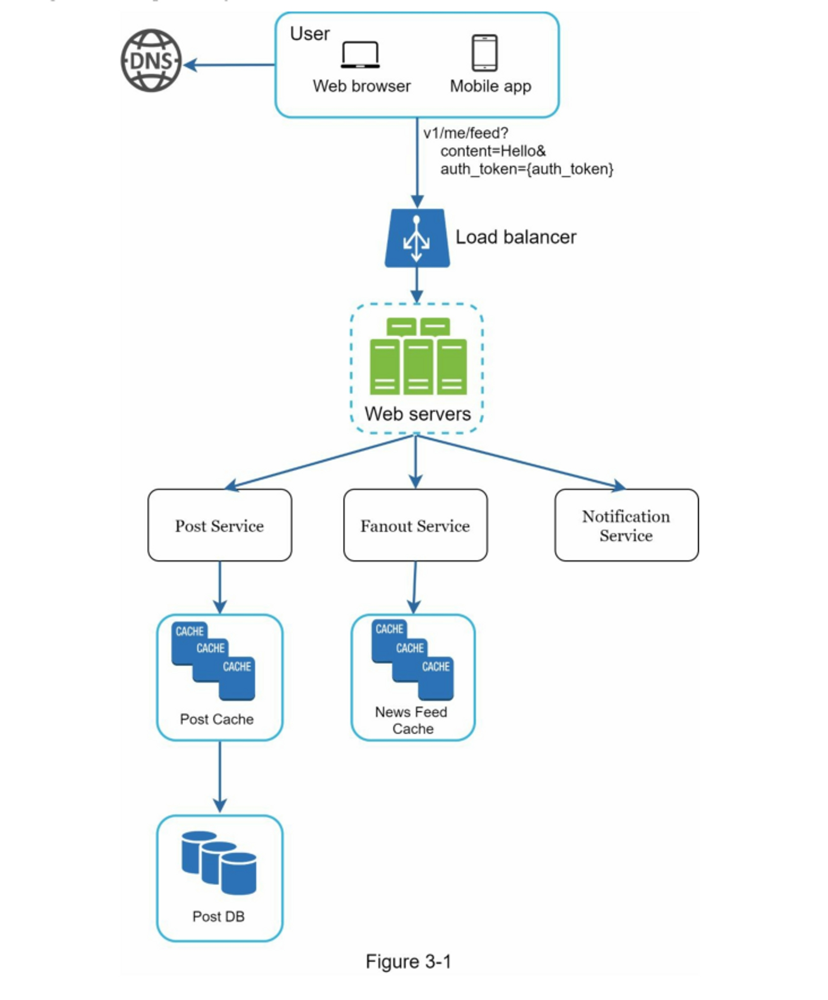
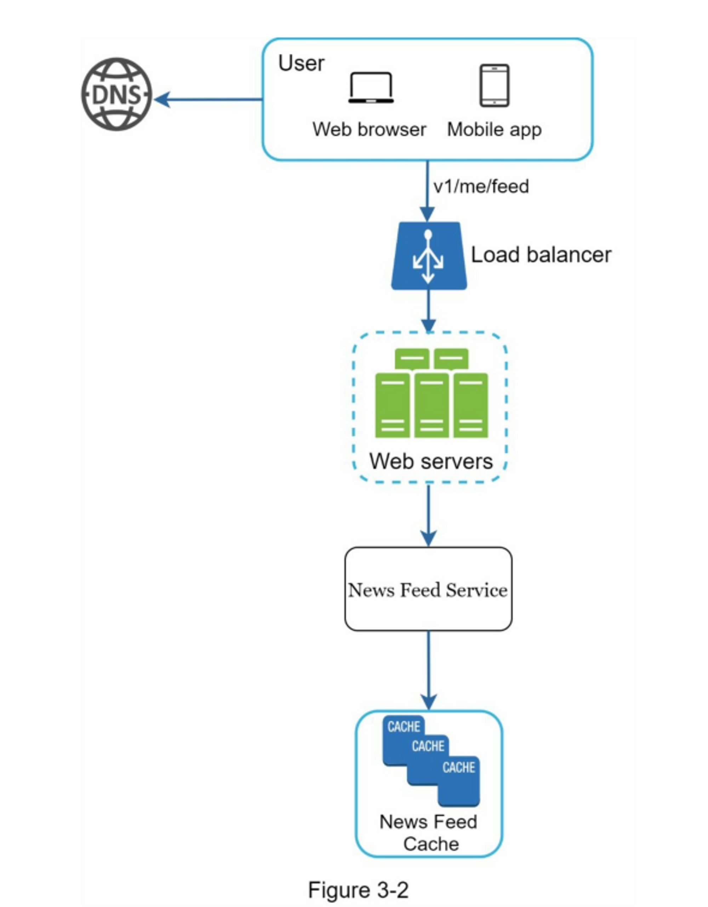
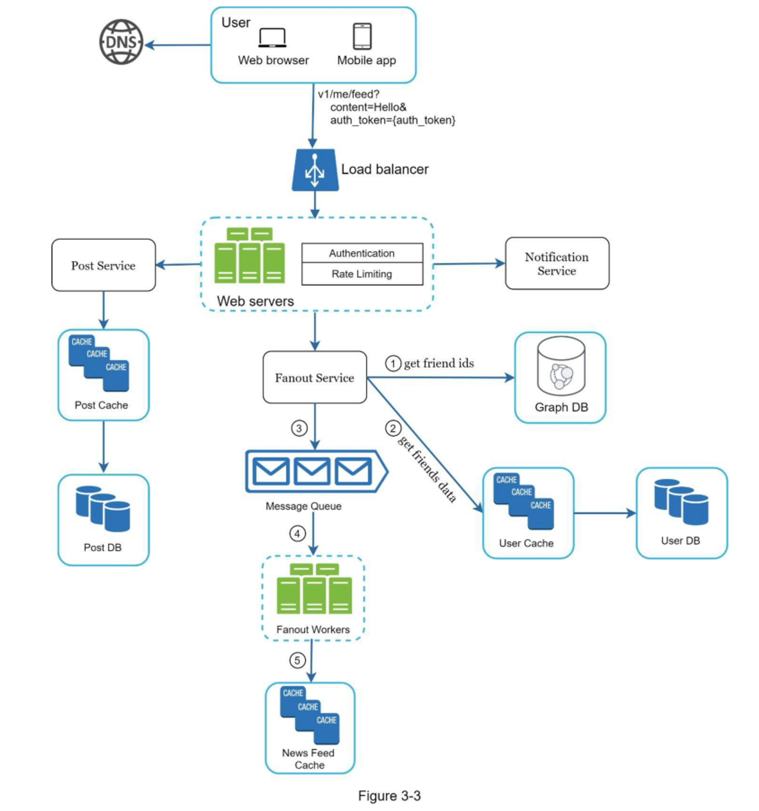

# 第03章：系统设计面试框架

你刚刚获得了梦寐以求的现场面试机会。招聘协调员给你发送了当天的日程安排。看完整个日程安排后，你觉得一切都挺好，直到你看到了这个面试环节 - 系统设计面试。

系统设计面试往往令人生畏，它可能像“设计一个知名的产品X？”那样的模糊不清。这些问题模棱两可，似乎过于宽泛。 你的担心是可以理解的。 毕竟，在一个小时内设计一个已经由数百甚至数千名工程师构建的流行产品，这似乎是不可能的？

好消息是，没有人期望你这样做。现实世界的系统设计是非常复杂的。例如，谷歌搜索看起来简单；然而，支持这种简单性背后的技术数量真的令人惊讶。 如果没有人期望你在一小时内设计出一个真实世界的系统，那么系统设计面试的好处是什么？

系统设计面试模拟了现实生活中的问题解决过程，两个同事合作解决一个模糊的问题，并提出一个符合他们目标的解决方案。这个问题是开放式的，没有完美的答案。 与你在设计过程中付出的努力相比，最终的设计并不那么重要。这使你能够展示你的设计技能，捍卫你的设计选择，并以有建设性的方式回应反馈。

让我们换个角度思考，考虑一下当面试官走进会议室与你见面时，她的脑子里在想什么。面试官的首要目标是准确评估你的能力。 她最不希望的是，因为会议进行得不顺利，没有足够的信息，而给出一个没有结果的评价。面试官想通过系统设计面试获得什么？

许多人认为，系统设计面试只涉及一个人的技术设计能力。事实并非如此。 有效的系统设计面试更多地体现了一个人的合作能力、在压力下工作的能力以及以建设性方式解决模糊问题的能力。**提出好问题的能力也是一项重要的技能，许多面试官特别看重这项技能。**

一个好的面试官也会寻找危险信号，过度设计是许多工程师的真正问题，因为他们喜欢设计的纯粹性而忽视了权衡。他们往往没有意识到过度设计系统的复合成本，许多公司为这种无知付出了高昂的代价。 你当然不希望在系统设计面试中表现出这种倾向。其他危险信号包括狭隘的思想，固执，等等。

在本章中，我们将介绍一些有用的技巧，并介绍一个简单而有效的框架来解决系统设计面试问题。

### 有效系统设计面试的 4 步流程

每个系统设计面试都是不同的。 出色的系统设计面试是开放式的，没有万能的解决方案。 然而，在每个系统设计面试中都有一些步骤和共同点需要涵盖。

#### 第1步 ：了解问题并确定设计范围

"老虎为什么咆哮？"

班级后面有一只手拍了起来。

"是的，吉米？"，老师回答。

"因为他很饿"。

"非常好，吉米"。

在整个童年时期，吉米一直是班上第一个回答问题的人。每当老师提出问题时，教室里总有一个孩子喜欢回答这个问题，不管他是否知道答案。这就是吉米。

吉米是个优等生，他以很快就知道所有答案而自豪。在考试中，他通常是第一个完成问题的人。在任何学术竞赛中，他都是教师的首选。

别像吉米那样。

在系统设计面试中，不加思索地迅速给出答案不会给你加分。**在没有彻底理解需求的情况下回答问题是一个危险的信号**，因为面试不是一个小游戏比赛。这往往没有正确的答案。

作为一名工程师，我们喜欢解决棘手的问题，并投身于最终设计；然而，这种方法很可能会导致你设计出错误的系统。 作为一名工程师，最重要的技能之一是**提出正确的问题**，**做出适当的假设**，并**收集建立一个系统所需的所有信息**。因此，**不要害怕问问题**。

当你提出问题时，面试官要么直接回答你的问题，要么要求你做出你的假设。如果是后者，请在白板或纸上写下你的假设。你以后可能会用到它们。

要问什么问题？提出问题以了解确切的要求。 以下是一个问题清单，以帮助你开始工作：

* 我们要开发哪些特定功能？
* 这个产品有多少用户？
* 公司预计扩大规模的速度如何？3个月、6个月和1年后的预期规模是多少？
* 公司的技术栈是？可以利用哪些现有的服务来简化设计？

**例子**

如果你被要求设计一个新闻订阅系统，你希望问一些问题来帮助理解需求。你和面试官之间的对话可能是这样的：

候选人：这是一个移动应用吗？还是一个网页应用？还是两者兼有？

面试官：两者都有。

候选人：对于产品来说，最重要的功能是什么？？

面试官：能够发布帖子并查看朋友的新闻动态。

候选人：新闻动态是按照时间顺序排列，还是按照特定顺序？ 所谓的特定顺序意味着每篇帖子都有不同的权重。 例如，来自亲密朋友的帖子比来自一个群组的帖子更重要。

面试官：为了简单起见，我们假设动态是按照时间顺序排列的。

候选人：一个用户最多可以有多少个朋友？

面试官：5000个。

候选人：流量有多大？

面试官：每日活跃用户数为1000万（DAU）。

候选人：动态可以包含图像、视频，还是只有文字？

面试官：它可以包含媒体文件，包括图像和视频。

以上是一些你可以问面试官的示例问题。 理解需求并澄清不明确的地方是很重要的。

#### 第2步：提出高层次的设计方案并获得认同

在这一步中，我们的目标是制定一个高层次的设计，并与面试官就设计达成一致。在这个过程中，与面试官合作是个好主意。

* 想出一个初步的设计蓝图。征求反馈意见。把你的面试官当作队友，一起工作。许多优秀的面试官喜欢交谈和参与。
* 在白板或纸上画出关键组件的框图。这可能包括客户端（移动/网络）、API、网络服务器、数据存储、缓存、CDN、消息队列，等等。
* 做一些粗略计算，以评估你的蓝图是否符合规模限制。边想边说。在深入研究之前，如果进行粗略计算是必要的，请与你的面试官进行沟通交流。

如果可能的话，通过一些具体的用例。这将帮助你确定高层设计的框架。用例也有可能帮助你发现你还没有考虑到的边缘情况。

我们应该在这里包括API端点和数据库架构吗？这取决于当前问题。对于像“设计Google搜索引擎”这样的大型设计问题，这有点过于底层。 对于像为一个多人扑克游戏设计后端这样的问题，这是合理的。

与你的面试官沟通。

**例子**

让我们以“设计一个新闻订阅系统”为例，来演示如何进行高层设计。这里不要求你了解系统的实际工作情况。所有的细节将在第11章解释。

在高层次上，设计分为两个流程：订阅发布和新闻订阅构建。

* 订阅发布：当用户发布帖子时，相应的数据会被写入缓存/数据库，并且该帖子将出现在好友的新闻订阅中。
* 新闻订阅构建：新闻订阅通过按时间倒序聚合好友的帖子来构建。

图3-1和图3-2分别展示了订阅发布和新闻订阅构建流程的高层设计。

#### 第3步：深入设计

在这一步，你和你的面试官应该已经实现了以下目标：

* 就总体目标和功能范围达成一致
* 为整体设计草拟了一个高层次的蓝图
* 从面试官那里获得了对高层设计的反馈
* 根据她的反馈，对深入设计的重点区域有了一些初步想法

你应该与面试官合作，确定并优先考虑架构中的组件。值得强调的是，每次面试都是不同的。有时，面试官可能会暗示她喜欢专注于高层设计。 有时，对于资深候选人的面试，讨论可能会涉及系统性能特性，主要关注瓶颈和资源估算。在大多数情况下，面试官可能希望你深入了解某些系统组件的细节。 对于 URL 缩短器，深入探讨将长 URL 转换为短 URL 的哈希函数设计是一个有趣的话题。对于一个聊天系统来说，如何减少延迟以及如何支持在线/离线状态是两个有趣的话题。

时间管理是至关重要的，因为你很容易被一些细枝末节所迷惑，而这些细节并不能体现你的能力。你必须准备好一些信号来展示给面试官。尽量不要陷入不必要的细节中。 例如，在系统设计面试中，详细谈论Facebook feed排名的EdgeRank算法并不理想，因为这需要很多宝贵的时间，而且并不能证明你在设计可扩展系统方面的能力。

**例子**

在这一点上，我们已经讨论了新闻订阅系统的高级设计，面试官对您的提议感到满意。接下来，我们将调查两个最重要的使用案例：

1. 新闻订阅发布
2. 新闻订阅检索

图3-3和图3-4显示了两个用例的详细设计，这将在第11章中详细说明

#### 第4步：总结

在这最后一步，面试官可能会问你一些后续问题，或者让你自由讨论其他的附加要点。 以下是一些跟进方向：

* 面试官可能希望你找出系统的瓶颈，并讨论潜在的改进。千万不要说你的设计是完美的，没有什么可以改进的。总有一些东西是可以改进的。这是一个展示你的批判性思维的好机会，并留下一个好的最终印象。
* 给面试官回顾一下你的设计可能是有用的。如果你提出了几种解决方案，这一点就特别重要。在长时间的会话后，提醒面试官可能会有所帮助。
* 错误情况（服务器故障、网络丢失等）值得讨论。
* 运营问题也值得一提。如何监控指标和错误日志？系统如何推广？
* 如何处理下一个规模曲线也是一个有趣的话题。例如，如果你目前的设计支持100万用户，你需要做什么改变来支持1000万用户？
* 如果你有更多的时间，可以提出其他改进建议。

最后，我们总结了一份 "该做" 和 "不该做" 的清单。

* **该做**
  * 要问清楚。不要认为你的假设是正确的。
  * 了解问题的要求。
  * 既没有正确的答案，也没有最好的答案。为解决年轻创业公司的问题而设计的解决方案与拥有数百万用户的老牌公司的解决方案不同。确保你理解了要求。
  * 让面试官知道你在想什么。与你的面试官沟通。
  * 如果可能的话，提出多种方法。
  * 一旦你与你的面试官就蓝图达成一致，就对每个组件进行详细说明。先设计最关键的部分。
  * 向面试官反映想法。一个好的面试官会把你当作一个团队伙伴和你一起合作。
  * 永不言弃。
* **不该做**
  * 不要对典型的面试问题没有任何准备。
  * 在没有弄清需求和假设的情况下，不要贸然提出解决方案。
  * 在开始的时候，不要对一个单一的组件进行太多细节的研究。首先给出高层次的设计，然后再深入探讨。
  * 如果你被卡住了，不要犹豫，请求提示。
  * 再次强调，要进行沟通。不要默默思考。
  * 不要认为一旦你给出设计方案，你的面试就结束了。直到你的面试官说你完成了，你才算完成。尽早并经常要求反馈。
*   **每个步骤的时间分配**

    系统设计的面试问题通常非常广泛，45分钟或一个小时不足以涵盖整个设计。时间管理至关重要。在每个步骤上应该花费多少时间？ 以下是一个非常粗略的指南，指导你在45分钟的面试会议中的时间分配。请记住，这只是一个粗略的估计，实际时间分配取决于问题的范围和面试官的要求。

    * 第1步 理解问题并确定设计范围：3-10分钟
    * 第2步 提出高层次的设计并获得认同：10-15分钟
    * 第3步 深入设计：10-25分钟
    * 第4步 总结：3-5分钟
