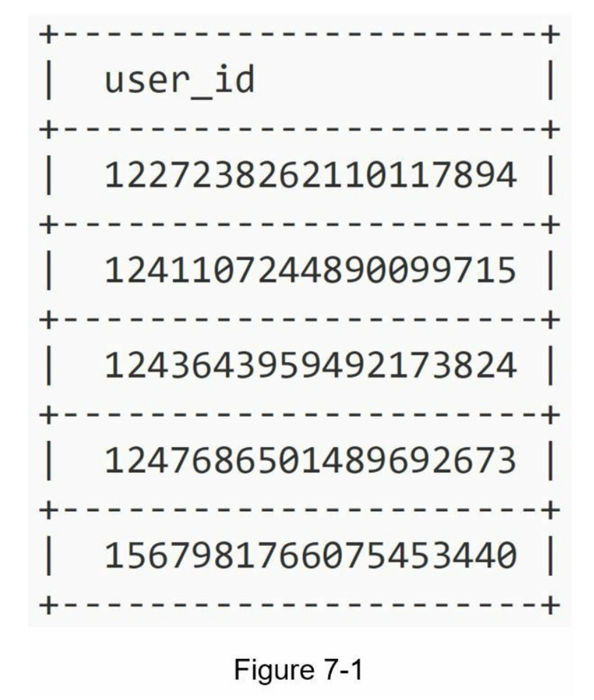
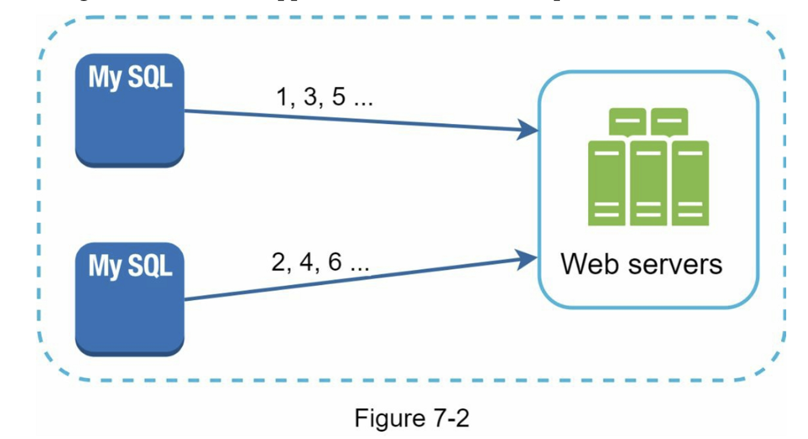
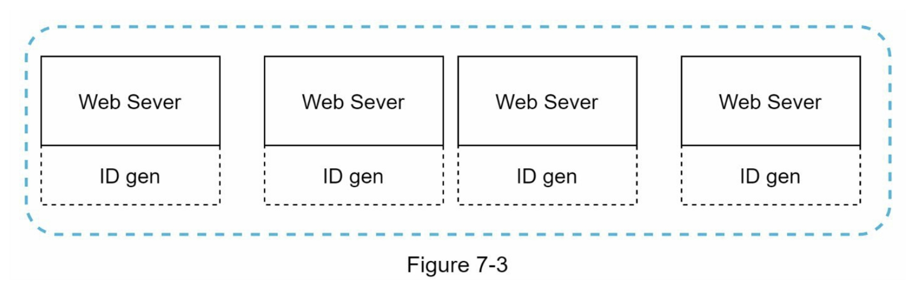
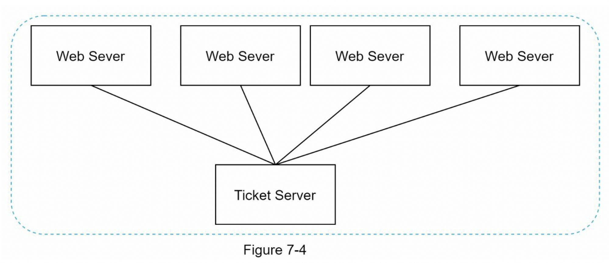
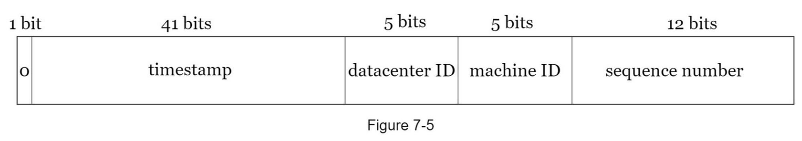
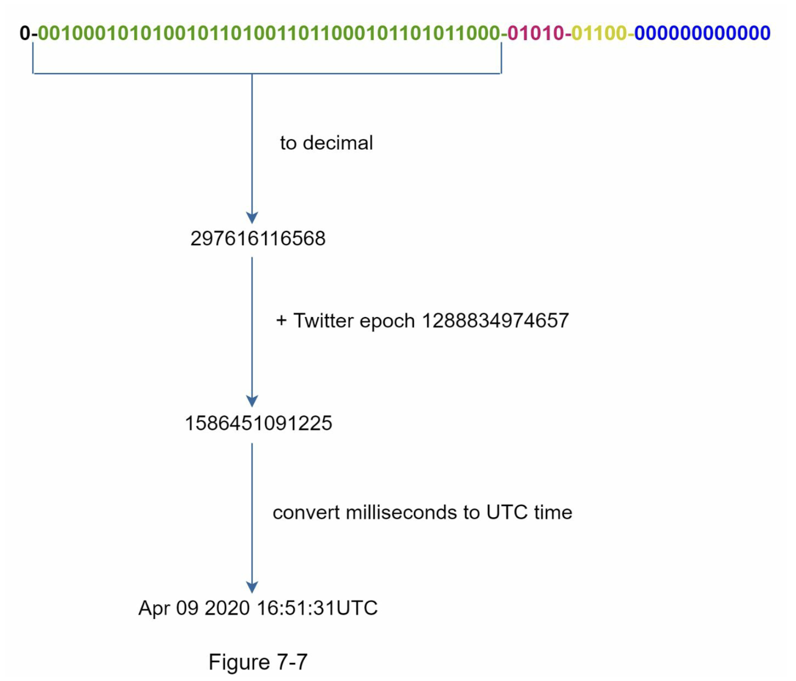

# 第07章：在分布式系统中设计唯一 ID 生成器

在本章中，要求在分布式系统中设计一个唯一 ID 生成器。 你的第一个想法可能是在传统数据库中使用具有 auto\_increment 属性的主键。 但是，auto\_increment 在分布式环境中不起作用，因为 单个数据库服务器不够大，跨多个数据库以最小延迟生成唯一 ID 具有挑战性。 以下是唯一 ID 的一些示例：

### 第1步：了解问题并确定设计范围

了解清楚问题是解决任何系统设计面试问题的第一步。下面是一个候选人与面试官互动的例子：

候选人：唯一ID有什么特点？

面试官：ID 必须是唯一的，并且是可排序的。

候选人：每增加一条记录，ID 是否加 1？

面试官：ID是按时间递增的，不一定只递增1，当天晚上创建的ID比早上创建的ID大。

候选人：ID 是否只包含数值？

面试官：是的，这很正确。

候选人：ID长度要求是多少？

面试官：ID 应该适合 64 位。

候选人：系统的规模是多少？

面试官：系统应该可以每秒生成10000个ID。

以上是可以向面试官提出的一些示例问题。了解需求并澄清歧义很重要。

本次面试题，要求如下：

* ID 必须是唯一的。
* ID 只是数值。
* ID 适合 64 位。
* ID 按日期排序。
* 能够每秒生成超过 10,000 个唯一 ID。

### 第2步：提出高层次的设计方案并获得认同

可以使用多个选项在分布式系统中生成唯一ID。

我们考虑的选项有：

* 多主复制
* 通用唯一标识符 (UUID)
* Ticket 服务器
* 推特雪花算法

让我们看看它们是如何工作的，以及每个选项的优缺点。

#### 多主复制

如图7-2所示，第一种方式是多主复制。

这种方法使用数据库的 auto\_increment 特性。我们不是将下一个 ID 增加 1，而是将其增加 k，其中 k 是正在使用的数据库服务器的数量。如图 7-2 所示，下一个要生成的 ID 等于同一服务器中的前一个 ID 加 2。这解决了一些可扩展性问题，因为 ID 可以随着数据库服务器的数量而扩展。

然而，这种策略有一些主要的缺点：

* 难以通过多个数据中心进行扩展
* ID在多个服务器上不随时间而增长
* 在增加或删除服务器时，不能很好地扩展

#### UUID

UUID 是另一种获取唯一 ID 的简单方法。 UUID 是一个 128 位数字，用于识别计算机系统中的信息。UUID获得串通的概率非常低。引自维基百科，"在每秒产生10亿个UUIDs，大约100年后，创造一个重复的概率会达到50%" \[1] 。

以下是 UUID 的示例：09c93e62-50b4-468d-bf8a-c07e1040bfb2。 UUID 可以独立生成，无需服务器之间的协调。图 7-3 展示了 UUID 的设计。

在这个设计中，每个Web服务器都包含一个ID生成器，并且Web服务器负责独立生成ID。

**优点：**

* 生成 UUID 很简单。服务器之间不需要协调，因此不会有任何同步问题。
* 该系统易于扩展，因为每个 Web 服务器负责生成它们使用的 ID。 ID 生成器可以轻松地与 Web 服务器一起扩展。

**缺点：**

* ID 是 128 位长，但我们的要求是 64 位。
* ID 不会随时间上升
* ID 可以是非数字的。

#### Ticket 服务器

票据服务器是产生唯一ID的另一种有趣的方式。`Flicker`开发了票据服务器来生成分布式主键\[2]。值得一提的是，该系统是如何工作的。

这个想法是在一个单一的数据库服务器（Ticket Server）中使用一个集中的自动增量功能。要了解更多这方面的信息，请参考flicker的工程博客文章\[2] 。

**优点：**

* 数字 ID
* 易于实施，适用于中小型应用程序

**缺点：**

* 单点故障。单个票务服务器意味着如果票务服务器发生故障，所有依赖它的系统都将面临问题。为了避免单点故障，我们可以设置多个票务服务器。然而，这将引入新的挑战，如数据同步。

#### 推特雪花算法

上面提到的方法给了我们一些关于不同的ID生成系统如何工作的想法。然而，它们都不符合我们的具体要求；因此，我们需要另一种方法。Twitter 独特的 ID 生成系统“snowflake”\[3] 很有启发性，可以满足我们的要求。

分而治之是我们的朋友。我们不是直接生成一个ID，而是将一个ID分成不同的部分。图7-5显示了一个64位ID的布局。

下面对每个部分进行解释：

* 符号位：1 位，它将始终为 0。这是为将来使用保留的。它可以潜在地用于区分有符号数和无符号数。
* 时间戳：41 位。自纪元或自定义纪元以来的毫秒数。我们使用 Twitter 雪花默认纪元 1288834974657，相当于 2010 年 11 月 4 日 01:42:54 UTC。
* 数据中心 ID：5 位，这给了我们 $$2 ^ 5 = 32$$ 个数据中心。
* 机器 ID：5 位，每个数据中心有 $$2 ^ 5 = 32$$ 台机器
* 序列号：12 位。对于在该机器/进程上生成的每个 ID，序列号都会递增 1。该数字每毫秒重置为 0。

### 第3步：深入设计

在高层设计中，我们讨论了在分布式系统中设计唯一ID生成器的各种方案。我们确定了一种基于Twitter雪花ID生成器的方法。让我们深入了解一下这个设计。为了恢复我们的记忆，设计图被重新列在下面。

数据中心ID和机器ID是在启动时选择的，一般在系统运行后就固定下来。数据中心ID和机器ID的任何变化都需要仔细审查，因为这些数值的意外变化会导致ID冲突。时间戳和序列号是在ID生成器运行时生成的。

#### 时间戳

最重要的41位组成了时间戳部分。由于时间戳随时间增长，ID可按时间排序。

图 7-7 显示了二进制表示如何转换为 UTC 的示例。您还可以使用类似的方法将 UTC 转换回二进制表示。

可以用 41 位表示的最大时间戳是： $$2 ^ {41} - 1 = 2199023255551毫秒(ms)$$，这样我们就可以得到。 $$\approx 69年=2199023255551毫秒/1000秒/365天/24小时/3600秒$$。

这意味着 ID 生成器将工作 69 年，并且自定义纪元时间接近今天的日期会延迟溢出时间。 69年后，我们将需要一个新的纪元时间或采用其他技术来迁移ID。

#### 序列号

序列号是 12 位，这给了我们 $$\mathbf{2 ^ {12} = 4096}$$ 种组合。除非在同一台服务器上在一毫秒内生成多个 ID，否则该字段为 0。理论上，一台机器每毫秒最多可以支持4096个新ID。

### 第4步：总结

在本章中，我们讨论了设计唯一 ID 生成器的不同方法：多主复制、UUID、票务服务器和类似 Twitter 雪花的唯一 ID 生成器。我们选择了雪花，因为它支持我们所有的用例，并且在分布式环境中是可扩展的。

如果面试结束时有额外时间，这里有一些额外的谈话要点：

* 时钟同步。在我们的设计中，我们假设 ID 生成服务器具有相同的时钟。当服务器在多个内核上运行时，此假设可能不成立。同样的挑战存在于多机场景中。时钟同步的解决方案超出了本书的范围；但是，了解问题的存在很重要。网络时间协议是这个问题最流行的解决方案。有兴趣的读者可以参考参考资料\[4]。
* 节段长度调整。例如，较少的序列号但较多的时间戳位对低并发性和长期应用是有效的。
* 高可用性。由于 ID 生成器是关键任务系统，因此它必须具有高可用性

恭喜你走到了这一步！现在给自己一个鼓励，干得漂亮！

### 参考资料

\[1] Universally unique identifier: [https://en.wikipedia.org/wiki/Universally\_unique\_identifier](https://en.wikipedia.org/wiki/Universally\_unique\_identifier)

\[2] Ticket Servers: Distributed Unique Primary Keys on the Cheap:[https://code.flickr.net/2010/02/08/ticket-servers-distributed-unique-primary-keys-on-the-cheap](https://code.flickr.net/2010/02/08/ticket-servers-distributed-unique-primary-keys-on-the-cheap)

\[3] Announcing Snowflake: [https://blog.twitter.com/engineering/en\_us/a/2010/announcing-snowflake.html](https://blog.twitter.com/engineering/en\_us/a/2010/announcing-snowflake.html)

\[4] Network time protocol: [https://en.wikipedia.org/wiki/Network\_Time\_Protocol](https://en.wikipedia.org/wiki/Network\_Time\_Protocol)
