# 第10章：设计一个通知系统


近年来，通知系统已经成为许多应用程序非常流行的功能。 通知提醒用户重要信息，如突发新闻、产品更新、活动、优惠等。它已成为我们日常生活中不可或缺的一部分。 在本章中，您需要设计一个通知系统。

通知不仅仅是移动推送通知，三种类型的通知格式：移动推送通知、短信和电子邮件。 图 10-1 显示了每个通知的示例。


### 第1步：了解问题并确定设计范围

构建一个每天发送数百万条通知的可扩展系统并非易事。 它需要对通知生态系统有深入的了解。 面试问题特意设计为开放式和模棱两可的，你有责任提出问题以明确要求。

候选人：系统支持哪些类型的通知？ 面试官：推送通知、短信、邮件。

候选人：它是一个实时的系统吗？

采访者。让我们说这是一个软实时系统。我们希望用户能尽快收到通知。但是，如果系统处于高负荷工作状态，稍有延迟也是可以接受的。

候选人：支持的设备有哪些？

面试官：iOS设备、安卓设备和笔记本电脑/台式机。

候选人：什么触发通知？

面试官：通知可以由客户端应用程序触发。 他们也可以由服务器端调度。

候选人：用户是否能够选择退出？

面试官：是的，选择退出的用户将不再收到通知。

候选人：每天发出多少份通知？

面试官：1000万条移动推送通知，100万条短信，500万封电子邮件。

### 第2步：提出高层次的设计方案并获得认同

本节展示了支持各种通知类型的高层设计：iOS推送通知、Android推送通知、短信和电子邮件。它的结构如下：

* 不同的通知类型
* 联系人信息收集流程
* 通知发送/接收流程

#### 不同的通知类型

我们先看一下每种通知类型在高层次上是如何工作的。

**iOS推送通知**

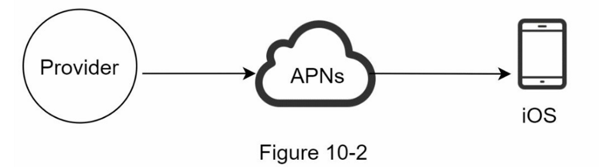

我们主要需要三个组件来发送 iOS 推送通知：

1. Provider（提供商）：提供商构建通知请求并将其发送到 Apple 推送通知服务 (APNS)。 要构建推送通知，提供者提供以下数据：
   1. 设备 token：这是用于发送推送通知的唯一标识符。
   2.  有效载荷：是一个包含通知有效载荷的 JSON 字典。 例子：

       ```json
       {
           "aps": {
               "alert": {
                   "title": "Game Request",
                   "body": "Bob wants to play chess",
                   "action-loc-key": "PLAY"
               },
               "badge": 5
           }
       }
       ```
2. 苹果推送通知服务（APNS）： 这是 Apple 提供的远程服务，用于将推送通知传播到 iOS 设备。
3. iOS 设备：它是接收推送通知的终端客户端。

**Android推送通知**

Android 采用了类似的通知流程。 Firebase Cloud Messaging (FCM) 通常用于向 Android 设备发送推送通知，而不是使用 APN。

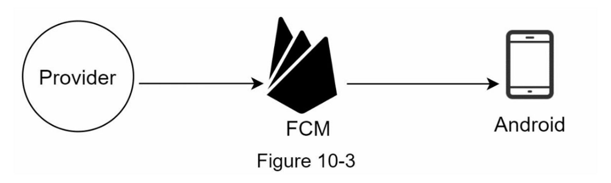

**短信**

对于SMS信息，通常使用第三方SMS服务，如Twilio\[1]、Nexmo\[2]和其他许多服务。它们中的大多数是商业服务。

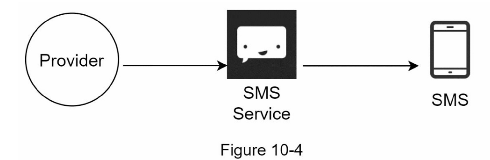

**邮件**

虽然公司可以设置自己的电子邮件服务器，但其中许多公司选择商业电子邮件服务。 Sendgrid \[3] 和 Mailchimp \[4] 是最受欢迎的电子邮件服务之一，它们提供更好的交付率和数据分析。

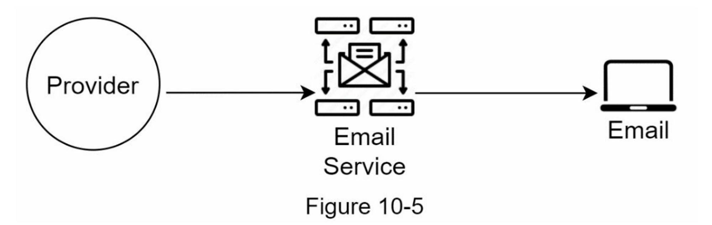

图 10-6 显示了包含所有第三方服务后的设计。

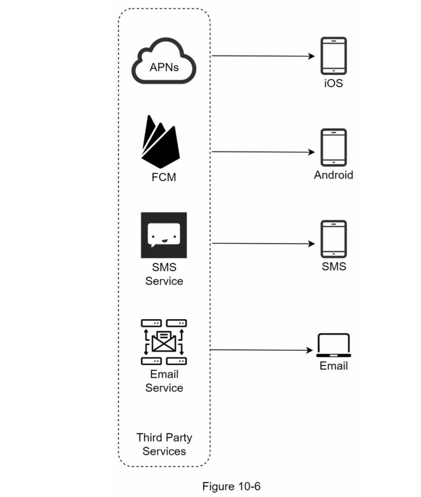

#### 联系人信息收集流程

要发送通知，我们需要收集移动设备令牌、电话号码或电子邮件地址。 如图 10-7 所示，当用户安装我们的应用程序或首次注册时，API 服务器会收集用户联系信息并将其存储在数据库中。

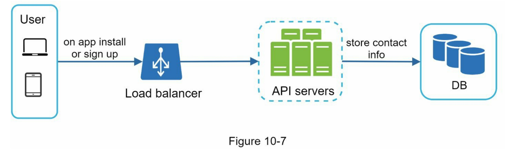

图10-8显示了存储联系人信息的简化数据库表。电子邮件地址和电话号码存储在用户表中，而设备令牌则存储在设备表中。一个用户可以有多个设备，表明推送通知可以被发送到所有的用户设备上。

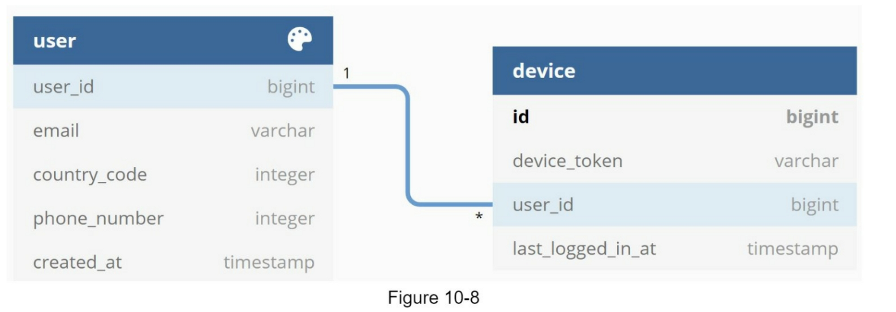

#### 通知发送/接收流程

我们将首先介绍初始设计；然后，提出了一些优化方案。

**高层设计**

图 10-9 显示了设计，下面解释了每个系统组件。

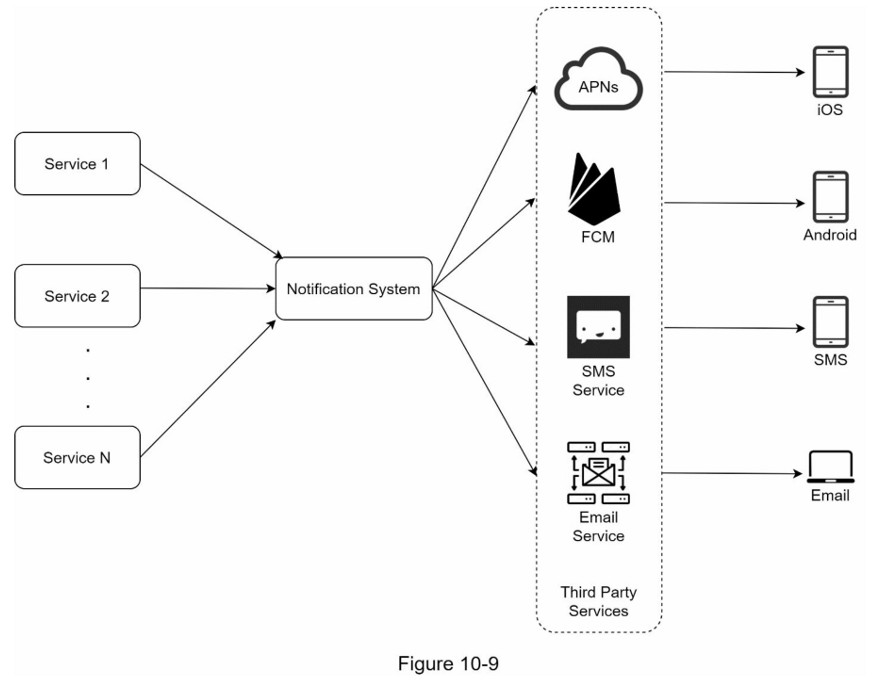

**服务1到N**：一个服务可以是一个微服务，一个cron job，或者一个触发通知发送事件的分布式系统。例如，一个计费服务发送电子邮件提醒客户到期付款，或者一个购物网站通过短信告诉客户他们的包裹明天会被送到。

**通知系统**：通知系统是发送/接收通知的中心环节。从简单的东西开始，只使用一个通知服务器。它为服务1到N提供API，并为第三方服务建立通知有效载荷。

**第三方服务**：第三方服务负责向用户发送通知。在与第三方服务集成时，我们需要特别注意可扩展性。良好的可扩展性意味着一个灵活的系统可以很容易地插入或拔出第三方服务。另一个重要的考虑因素是，第三方服务可能在新的市场或在未来无法使用。例如，FCM在中国是不可用的。因此，在那里使用替代的第三方服务，如Jpush、PushY等。

**iOS, Android, SMS, Email**：用户在其设备上收到通知。

在这个设计中，发现了三个问题：

1. 单点故障（SPOF）：单一通知服务器意味着SPOF。
2. 难以扩展：通知系统在一台服务器上处理所有与推送通知有关的事情。要独立扩展数据库、缓存和不同的通知处理组件是很有挑战性的。
3. 性能瓶颈：处理和发送通知可能是资源密集型的。例如，构建HTML页面和等待第三方服务的响应可能需要时间。在一个系统中处理所有事情可能会导致系统过载，尤其是在高峰期。

**高层设计（改进后的）**

在列举了初始设计中的挑战后，我们对设计进行了如下改进：

* 将数据库和缓存从通知服务器中移出
* 添加更多的通知服务器，并设置自动水平缩放功能
* 引入消息队列，使系统组件解耦

图10-10显示了改进后的高层设计。

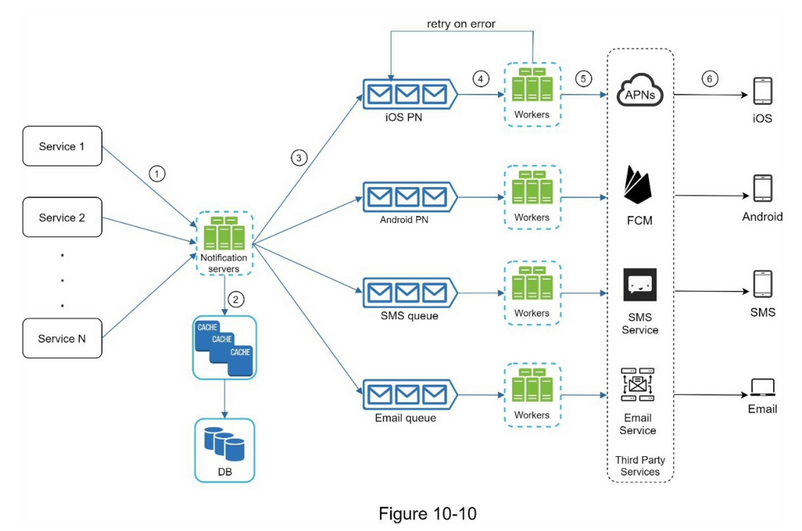

浏览上图的最佳方式是从左到右。

* **服务1到N**：它们代表不同的服务，通过通知服务器提供的API发送通知。
* **通知服务器**: 它们提供以下功能：
  * 为服务提供发送通知的API。这些API只能由内部或经过验证的客户访问，以防止垃圾邮件。
  * 进行基本验证，以核实电子邮件、电话号码等。
  * 查询数据库或缓存以获取渲染通知所需的数据。
  *   将通知数据放到消息队列中进行并行处理。

      下面是一个发送电子邮件的API的例子：

      POST https://api.example.com/v/sms/send

      Request body：

      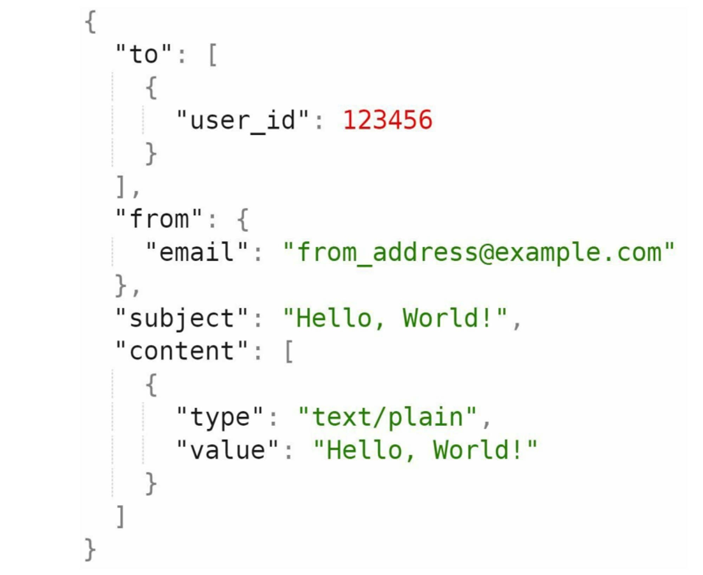
* **缓存**：用户信息、设备信息、通知模板都被缓存了。
* **数据库**：它存储了关于用户、通知、设置等方面的数据。
* **消息队列**：它们消除了组件之间的依赖性。当大量的通知被发送出去时，消息队列可以作为缓冲区。每种通知类型都被分配了一个不同的消息队列，所以一个第三方服务的中断不会影响其他通知类型。
* **Workers**：Workers 是一组服务器，它们从消息队列中拉取通知事件并将它们发送到相应的第三方服务。
* **第三方服务**：在最初的设计中已经解释过。
* **iOS, Android, SMS, Email**：在最初的设计中已经说明。

接下来，让我们来看看每个组件是如何一起工作来发送通知的。

1. 一个服务调用通知服务器提供的API来发送通知
2. 通知服务器从缓存或数据库中获取元数据，如用户信息、设备令牌和通知设置。
3. 一个通知事件被发送到相应的队列进行处理。例如，一个iOS推送通知事件被发送到iOS PN队列中。
4. 工作者从消息队列中获取通知事件。
5. 工作者向第三方服务发送通知。
6. 第三方服务向用户设备发送通知。

### 第3步：深入设计

在高层设计中，我们讨论了不同类型的通知、联系信息收集流程和通知发送/接收流程。我们将深入探讨以下内容。

* **可靠性**（**Reliability**）
* 其他组件和考虑因素：通知模板、通知设置、速率限制、重试机制、推送通知的安全性、监控排队通知和事件跟踪。
* 更新后的设计

#### 可靠性

在分布式环境中设计通知系统时，我们必须回答几个重要的可靠性问题。

**如何防止数据丢失？**

通知系统最重要的要求之一是它不能丢失数据。 通知通常可以延迟或重新排序，但绝不会丢失。 为了满足这个需求，通知系统**将通知数据持久化到数据库**中，并实现了重试机制。 包含通知日志数据库以实现数据持久化，如图 10-11 所示。

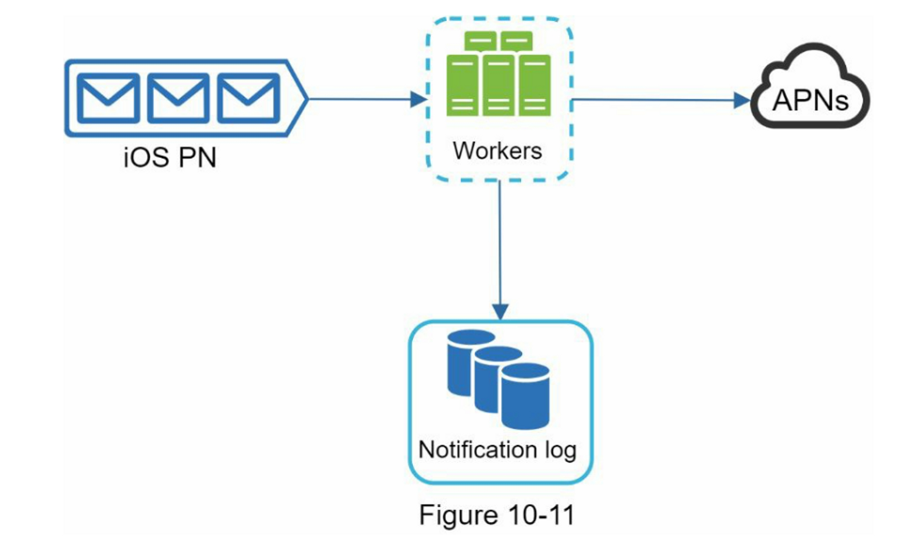

**接受者只会收到一次通知吗？**

最简洁的答案是不。 尽管大多数时候通知只发送一次，但分布式特性可能会导致重复通知。 为了减少重复的发生，我们引入了重复数据删除机制并仔细处理每个失败案例。 这是一个简单的重复数据删除逻辑：

当一个通知事件第一次到达时，我们通过检查事件的ID来检查它是否在之前出现过。如果在之前出现过，它将被丢弃。否则，我们将发送通知。有兴趣的读者可以研究一下为什么我们不能仅一次发送，请参考参考资料\[5]。

#### 其他组件和考虑因素

我们已经讨论了如何收集用户的联系信息，发送和接收通知。一个通知系统远不止这些。在这里，我们讨论了额外的组件，包括模板重复使用、通知设置、事件跟踪、系统监控、速率限制等。

*   通知模板

    一个大型的通知系统每天会发出数百万条通知，其中许多通知都遵循类似的格式。通知模板的引入是为了避免从头开始建立每一个通知。通知模板是一个预先格式化的通知，通过自定义参数、样式、跟踪链接等来创建你独特的通知。下面是一个推送通知的例子模板。

    ```
    BODY:
    You dreamed of it. We dared it. [ITEM NAME] is back — only until [DATE].
    CTA:
    Order Now. Or, Save My [ITEM NAME]
    The benefits of using notification templates include maintaining a consistent format, reducing
    the margin error, and saving time.
    ```
*   通知设置

    用户一般每天都会收到太多的通知，他们很容易感到不堪重负。因此，许多网站和应用程序让用户对通知设置进行细化控制。这些信息存储在通知设置表中，有以下字段：

    ```
    user_id   bigInt
    channel  varchar    # push notification, email or SMS
    opt_in   boolean    # opt-in to receive notification
    ```

    在向用户发送任何通知之前，我们首先检查用户是否选择接收这种类型的通知。
*   速率限制

    为了避免用户被过多的通知所淹没，我们可以限制一个用户可以收到的通知数量。这一点很重要，因为如果我们发送得太频繁，接收者可能会完全关闭通知。
*   重试机制

    当第三方服务无法发送通知时，该通知将被添加到消息队列中进行重试。如果问题持续存在，将向开发者发出警报。
*   推送通知的安全问题

    对于iOS或Android应用程序，appKey和appSecret被用来保护推送通知API\[6]。只有经过认证或验证的客户端才允许使用我们的API发送推送通知。有兴趣的用户应该参考参考资料\[6]。
*   监视排队通知

    要监控的一个关键指标是排队通知的总数。如果这个数字很大，说明 workers 处理通知事件的速度不够快。为了避免通知交付的延迟，需要更多的工作者。图10-12（归功于\[7]）显示了一个待处理的排队消息的例子。

    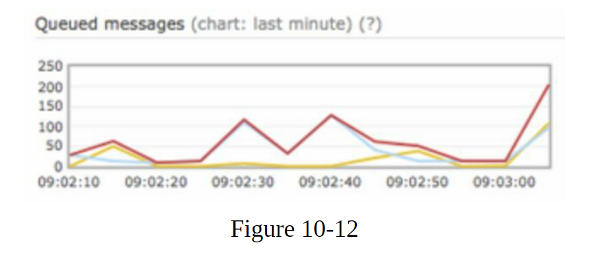
*   事件跟踪

    打开率、点击率和参与度等通知指标对于了解客户行为非常重要。 分析服务实现事件跟踪。 通常需要通知系统和分析服务之间的集成。 图 10-13 显示了可能出于分析目的而被跟踪的事件示例。

    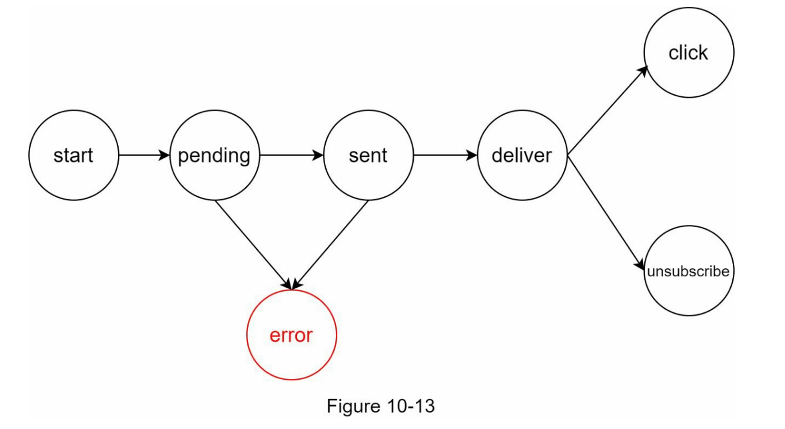

#### 更新后的设计

把所有东西放在一起，图10-14显示了更新的通知系统设计。

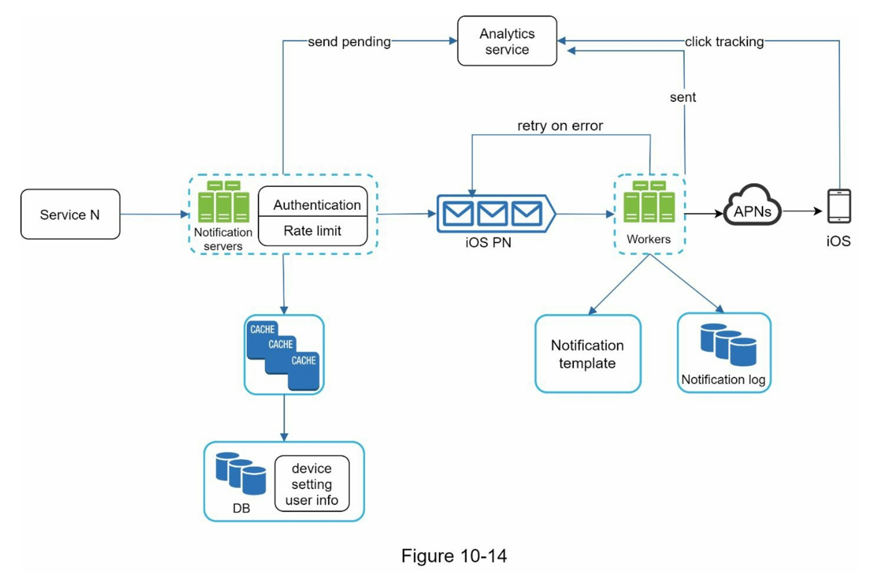

在这个设计中，与以前的设计相比，增加了许多新的组件。

* 通知服务器配备了两个更关键的功能：认证（**authentication**）和速率限制（**rate limiti**）。
* 我们还添加了一个**重试机制**来处理通知失败。如果系统发送通知失败，它们会被放回消息队列中，工作者会重试预定的次数。
* 此外，通知模板提供一致且高效的通知创建过程。
* 最后，为系统健康检查和未来改进增加了监测和跟踪系统。

### 第4步：总结

通知是不可缺少的，因为它们让我们及时了解重要信息。它可能是关于你在Netflix上最喜欢的电影的推送通知，关于新产品折扣的电子邮件，或关于你在线购物付款确认的信息。

在这一章中，我们描述了一个可扩展的通知系统的设计，它支持多种通知格式。推送通知、SMS消息和电子邮件。我们采用了消息队列来解耦系统组件。

除了高层次的设计，我们还深入挖掘了更多的组件和优化。

* 可靠性：我们提出了一个强大的重试机制，以尽量减少失败率。
* 安全性：AppKey/appSecret对用于确保只有经过验证的客户才能发送通知。
* 跟踪和监测：这些都是在通知流程的任何阶段实施的，以捕捉重要的统计资料。
* 尊重用户设置：用户可以选择不接收通知。 我们的系统在发送通知之前首先检查用户设置。
* 速率限制：用户会喜欢对他们收到的通知数量设置频率上限。

恭喜你走到了这一步！现在给自己一个鼓励，干得漂亮！

### 参考资料

* \[1] Twilio SMS: [https://www.twilio.com/sms](https://www.twilio.com/sms)
* \[2] Nexmo SMS: [https://www.nexmo.com/products/sms](https://www.nexmo.com/products/sms)
* \[3] Sendgrid: [https://sendgrid.com/](https://sendgrid.com/)
* \[4] Mailchimp: [https://mailchimp.com/](https://mailchimp.com/)
* \[5] You Cannot Have Exactly-Once Delivery: [https://bravenewgeek.com/you-cannot-have-exactly-once-delivery](https://bravenewgeek.com/you-cannot-have-exactly-once-delivery/)
* \[6] Security in Push Notifications: [https://cloud.ibm.com/docs/services/mobilepush](https://cloud.ibm.com/docs/services/mobilepush?topic=mobile-pushnotification-security-in-push-notifications)
* \[7] RadditMQ: [https://bit.ly/2sotIa6](https://bit.ly/2sotIa6)
