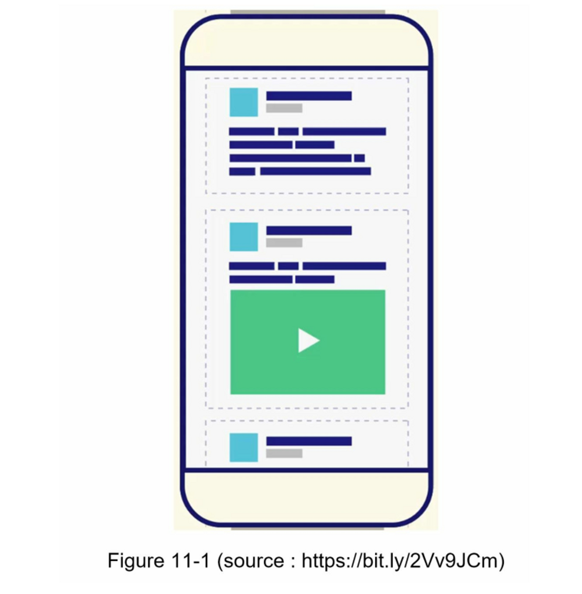
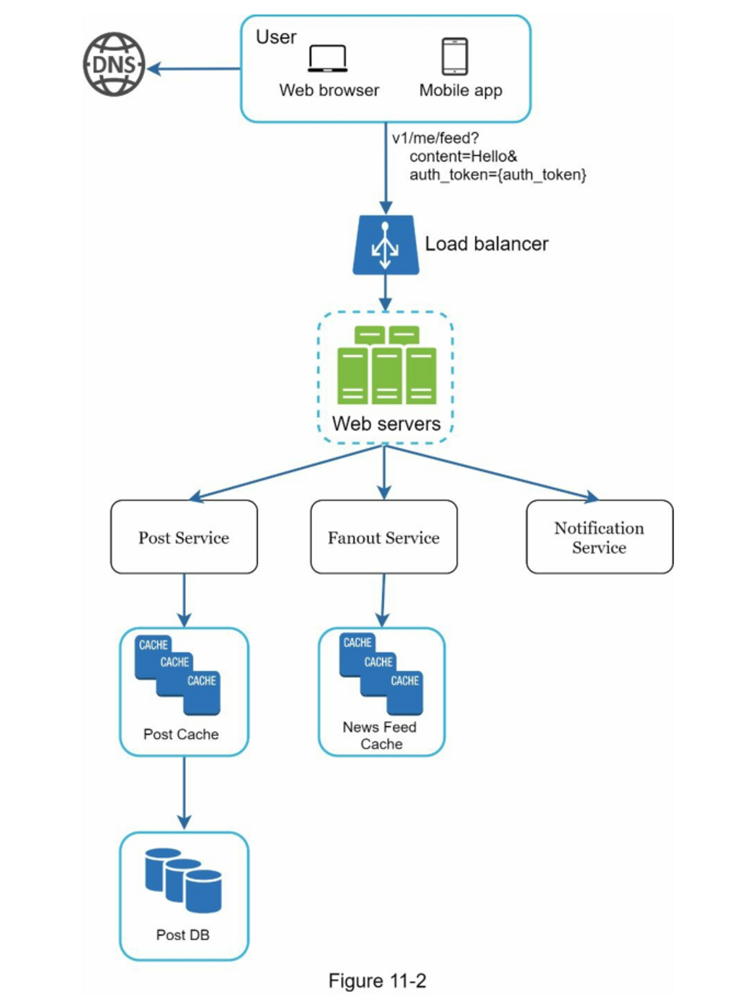
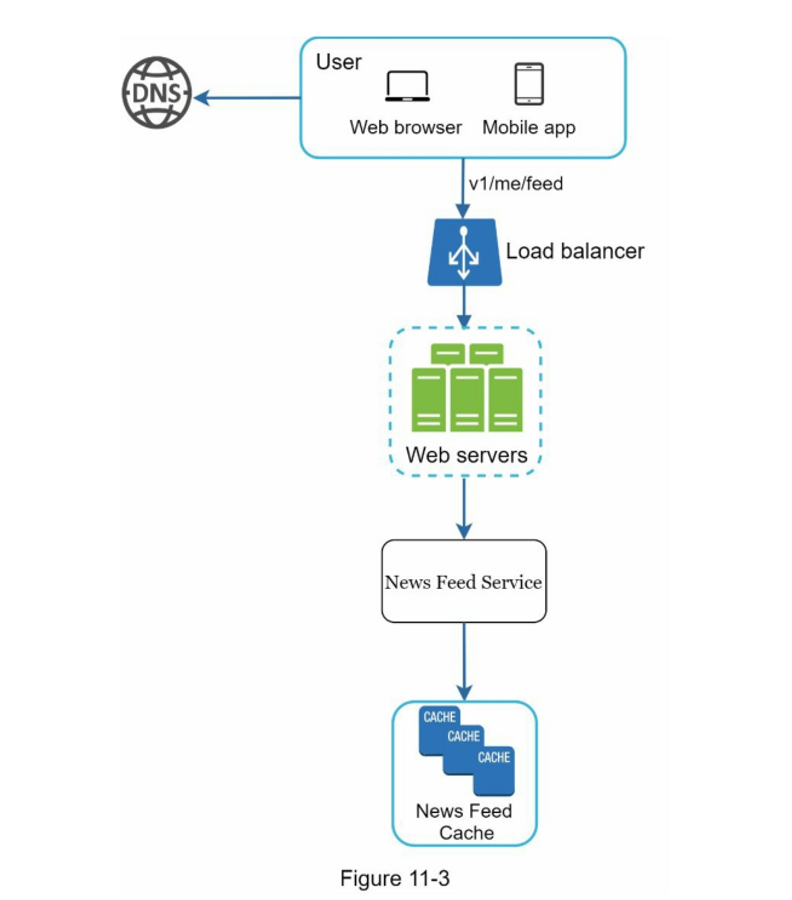
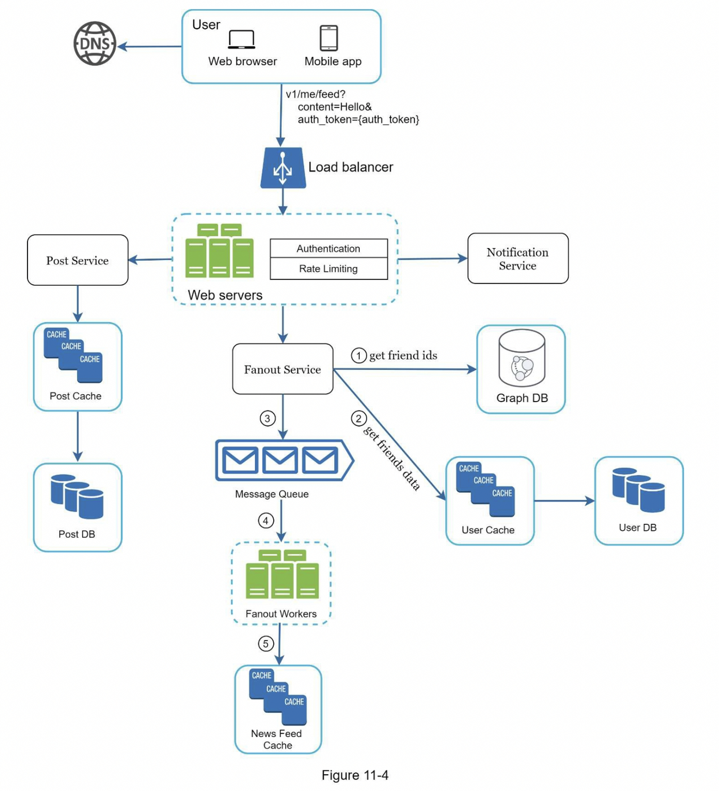
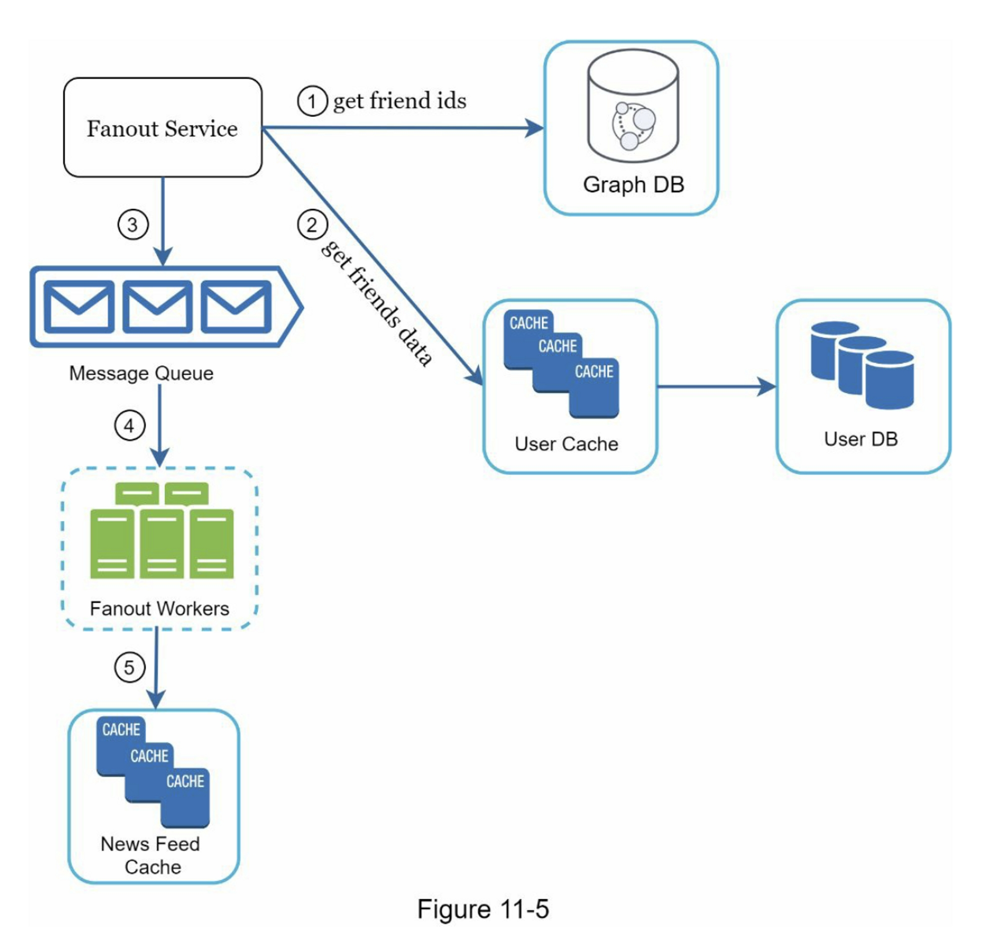
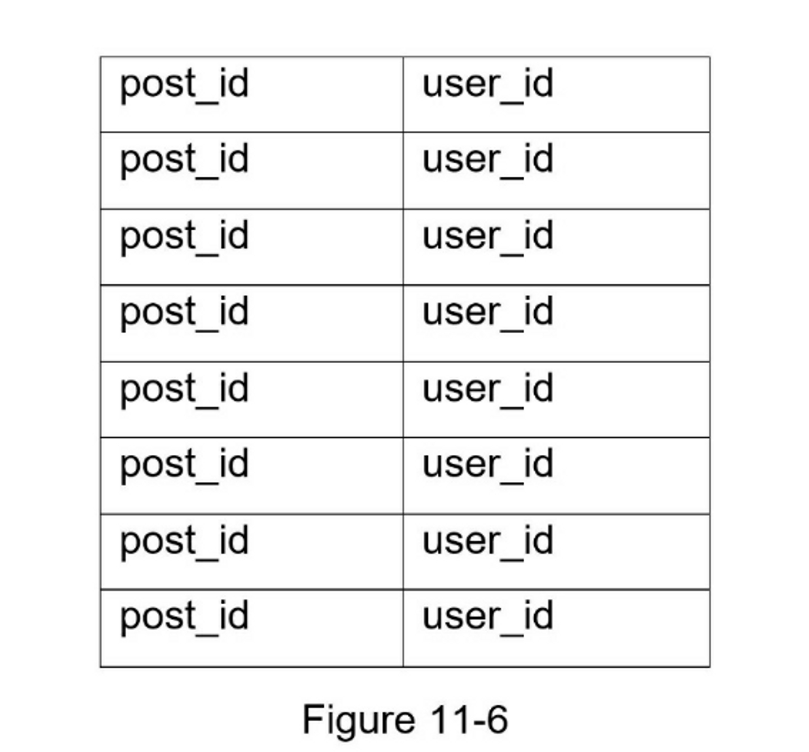
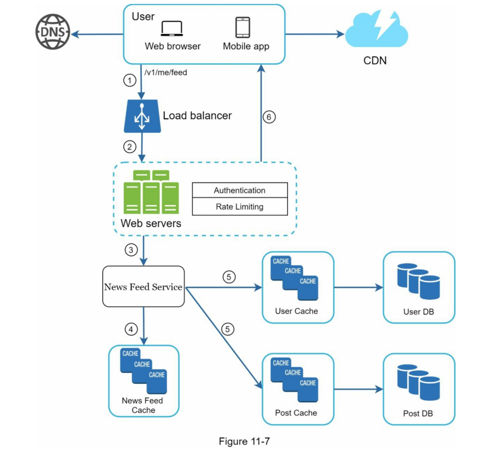
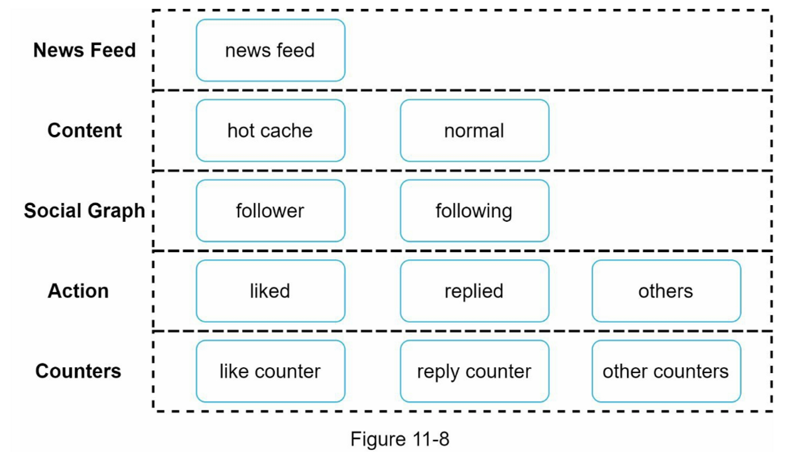

<!-- TOC -->
* [第1步：了解问题并确定设计范围](#第1步了解问题并确定设计范围)
* [第2步：提出高层次的设计方案并获得认同](#第2步提出高层次的设计方案并获得认同)
  * [新闻源API](#新闻源api)
  * [新闻发布（Feed publishing）](#新闻发布feed-publishing)
  * [新闻源构建（Newsfeed building）](#新闻源构建newsfeed-building)
* [第3步：深入设计](#第3步深入设计)
  * [新闻发布深入研究](#新闻发布深入研究)
    * [web 服务](#web-服务)
    * [扇出服务](#扇出服务)
  * [新闻源检索深入研究](#新闻源检索深入研究)
* [第4步：总结](#第4步总结)
* [参考资料](#参考资料)
<!-- TOC -->

# 设计一个新闻提要系统

在本章中，您需要设计一个新闻推送系统。 什么是新闻推送？ 根据 Facebook 帮助页面，“动态是位于首页中间不断更新的动态列表。动态包括您在 Facebook 上关注的用户、公共主页和小组发布的状态更新、照片、视频、链接、应用事件和点赞。”[1]。 这是一个流行的面试问题。 类似的常见问题有：设计 Facebook 新闻推送、Instagram 推送、Twitter 时间线等。

## 第1步：了解问题并确定设计范围

第一组解释问题是为了了解当面试官要求你设计一个新闻源系统时，她的想法是什么。最起码，你应该弄清楚要支持哪些功能。下面是一个候选人与面试官互动的例子。

候选人：这是一个移动应用程序吗？还是一个网络应用？或者两者都是？

面试官：都是

候选人：哪些是重要的特征？

面试官：用户可以发布帖子，并在新闻源页面上看到她朋友的帖子。

候选人：新闻提要是按逆时针顺序排序，还是按任何特定顺序，如主题得分？例如，你的亲密朋友的帖子有更高的分数。

面试官：为了简单起见，让我们假设推送是按逆时针顺序排序的。

候选人：一个用户可以有多少个朋友？

面试官：5000

候选人：业务流量是多少？

面试官：1000万DAU

候选人：推送可以包含图片、视频，还是只有文字？

面试官：它可以包含媒体文件，包括图片和视频。

现在你已经收集了需求，我们把重点放在设计系统上。

## 第2步：提出高层次的设计方案并获得认同

该设计分为两个流程：提要发布和新闻提要构建：

- 新闻发布（Feed publishing）：当用户发布帖子时，相应的数据被写入缓存和数据库。一个帖子被填充到她朋友的新闻提要中。
- 新闻源构建（Newsfeed building）：为简单起见，让我们假设新闻源是通过聚合构建的朋友的帖子按时间倒序排列。
### 新闻源API

新闻源API是客户与服务器通信的主要方式。这些API是基于HTTP的，允许客户执行操作，其中包括发布状态、检索新闻源、添加朋友等。

我们讨论两个最重要的API：新闻源发布API和新闻源检索API。

- 新闻源发布API

  要发布一个帖子，将向服务器发送一个HTTP POST请求。该API显示如下。

  POST /v1/me/feed

  参数：

    - content：帖子内容的文本。
    - auth_token：它用于验证API请求。
- 新闻源检索API

  检索新闻源的API如下：

  GET /v1/me/feed

  参数：

    - auth_token：它用于验证API请求。
### 新闻发布（Feed publishing）

图11-2显示了发布流程的高层设计。

- **User（用户）**：用户可以在浏览器或移动应用程序上查看新闻提要。一个用户通过API发布内容为 "你好 "的帖子：
  /v1/me/feed?content=Hello&auth_token={auth_token}
- Load balancer（负载均衡器）：将流量分配给网络服务器。
- Web servers（网络服务器）：网络服务器将流量重定向到不同的内部服务。
- Post service（帖子服务）：在数据库和缓存中持久保存帖子。
- Fanout service（扇出服务）：推送新内容到朋友的新闻源。新闻源数据存储在缓存中，以便快速检索。
- 通知服务：通知朋友有新内容，并发送推送通知。
### 新闻源构建（Newsfeed building）

在这一节中，我们将讨论新闻源是如何在幕后构建的。

图11-3显示了高层设计。

- User（用户）：一个用户发送了一个请求来检索她的新闻提要。
  该请求看起来像这样：/ v1/me/feed。
- Load balancer（负载均衡器）：将流量分配给网络服务器。
- Web servers（网络服务器）：网络服务器将请求路由到新闻发布服务。
- Newsfeed service（新闻馈送服务）：新闻馈送服务从缓存中获取新闻。
- Newsfeed cache（新闻源缓存）：存储渲染新闻源所需的新闻源ID。

## 第3步：深入设计

高层设计简要地涵盖了两个流程：新闻发布和新闻源构建。在这里，我们更深入地讨论这些主题。

### 新闻发布深入研究

图 11-4 概述了新闻发布的详细设计。我们已经讨论了高层次设计中的大部分组件，我们将重点关注两个组件：Web 服务器和扇出服务。

#### web 服务

  除了与客户端通信外，Web 服务器还执行身份验证和速率限制。只有使用有效 auth_token 登录的用户才可以发帖。该系统限制用户在一定时期内可以发布的帖子数量，这对于防止垃圾邮件和滥用内容至关重要。

#### 扇出服务

Fanout 是将帖子传递给所有朋友的过程。两种类型的扇出模型是：**写扇出（也称为推模型）**和**读扇出（也称为拉模型）**。两种模型各有利弊。我们解释他们的工作流程并探索支持我们系统的最佳方法。

**写扇出**

通过这种方法，新闻源在写的时候就被预先计算了。一个新的帖子在发布后会立即被送到朋友的缓存中。

优点：

- 动态消息是实时生成的，可以第一时间推送给朋友。
- 获取新闻源的速度很快，因为新闻源是在写的时候预先计算的。

缺点：

- 如果一个用户有很多朋友，获取朋友列表并为所有朋友生成新闻源是很慢的，而且很耗时间。这被称为热键问题。
- 对于不活跃的用户或那些很少登录的用户，预先计算的新闻源会浪费计算资源。

**读扇出**

新闻源是在阅读时间内产生的。这是一个按需分配的模式。当用户加载她的主页时，最近的帖子被拉出。

优点：

- 对于不活跃的用户或那些很少登录的用户，读取时的扇出效果更好，因为它不会在他们身上浪费计算资源。
- 数据不会被推送给朋友，所以不存在热键的问题。

缺点：

- 获取新闻源的速度很慢，因为新闻源不是预先计算的。

我们采用了一种混合方法，以获得两种方法的好处并避免其中的缺点。由于快速获取新闻源是至关重要的，我们对大多数用户使用推送模式。对于名人或有很多朋友/粉丝的用户，我们让粉丝按需提取新闻内容以避免系统过载。一致性哈希是缓解热键问题的一个有用技术，因为它有助于更均匀地分配请求/数据。

让我们仔细看看图11-5中所示的扇出服务。

扇出服务的工作原理如下：

1. 从图形数据库中获取朋友 ID。 图数据库适用于管理朋友关系和朋友推荐。 希望了解更多有关此概念的感兴趣的读者应参阅参考资料 [2]。
2. 从用户缓存中获取朋友信息。然后，系统根据用户设置过滤出朋友。例如，如果你把某人调成静音，她的帖子将不会显示在你的新闻提要中，尽管你们仍然是朋友。帖子可能不显示的另一个原因是，用户可以有选择地与特定的朋友分享信息或对其他人隐藏信息。
3. 将好友列表和新帖子 ID 发送到消息队列。
4. Fanout worker 从消息队列中获取数据并将新闻提要数据存储在新闻提要缓存中。 你可以将新闻提要缓存视为一个 <post_id, user_id>结构的映射表。 每当发布新帖子时，新帖子将被追加到新闻提要表中，如图 11-6 所示。 如果我们将整个用户和帖子对象存储在缓存中，内存消耗会变得非常大。 因此，仅存储 ID。 为了保持较小的内存大小，我们设置了一个可配置的限制。 用户滚动浏览新闻提要中数千个帖子的机会很小。 大多数用户只对最新的内容感兴趣，所以缓存未命中率低。
5. 将 <post_id, user_id > 存储在新闻提要缓存中。 图 11-6 显示了缓存中新闻源的示例。

   

### 新闻源检索深入研究

图 11-7 说明了新闻提要检索的详细设计。

如图11-7所示，媒体内容（图片、视频等）存储在CDN中，便于快速检索。 让我们看看客户端如何检索新闻提要。

1. 一个用户发送了一个请求来检索她的新闻提要。该请求看起来像这样：`/v1/me/feed`
2. 负载均衡将请求重新分配给网络服务器。
3. Web 服务器调用新闻源服务（News Feed Service）获取新闻源。
4. 新闻源服务从新闻源缓存中获得一个帖子ID列表。
5. 用户的新闻提要不仅仅是 feed ID 列表。 它包含用户名、个人资料图片、帖子内容、帖子图片等。因此，新闻提要服务从缓存（用户缓存和帖子缓存）中获取完整的用户和帖子对象，以构建完全整合的新闻提要。
6. 完全整合的新闻提要以JSON格式返回到客户端进行渲染。
- **缓存架构**

  缓存对于新闻提要系统非常重要。 我们将缓存层分为 5 层，如图 11-8 所示。

  

    - News Feed：它存储了新闻提要的ID。
    - Content：它存储每个帖子的数据。受欢迎的内容被存储在热缓存中。
    - Social Graph：它存储用户关系数据。
    - Action：它存储有关用户是否喜欢帖子、回复帖子或对帖子执行其他操作的信息。
    - Counters：它存储点赞、回复、关注者、关注等的计数器。
## 第4步：总结

在本章中，我们设计了一个新闻提要系统。 我们的设计包含两个流程：提要发布和新闻提要检索。

与任何系统设计面试问题一样，没有完美的系统设计方法。 每个公司都有其独特的限制，您必须设计一个系统来适应这些限制。 了解您的设计和技术选择的权衡很重要。 如果还剩几分钟，您可以讨论可扩展性问题。 为避免重复讨论，下面仅列出高层次的谈话要点。

数据库扩展：

- 垂直扩展 vs 水平扩展
- SQL vs NoSQL
- 主从复制
- 读写分离
- 一致性模型
- 数据库分片

其他谈话要点：

- 保持网络层的无状态
- 尽可能多地缓存数据
- 支持多个数据中心
- 使用消息队列降低耦合
- 监控关键指标。 例如，高峰时段的 QPS 和用户刷新新闻提要时的延迟值得监控。

恭喜你走到了这一步！现在给自己一个鼓励，干得漂亮！

## 参考资料

  [1] How News Feed Works:

  https://www.facebook.com/help/327131014036297/

  [2] Friend of Friend recommendations Neo4j and SQL Sever:

  http://geekswithblogs.net/brendonpage/archive/2015/10/26/friend-of-friend-recommendations-with-neo4j.aspx
