# 第13章：设计一个搜索自动完成系统

当你在谷歌上搜索或在亚马逊购物时，在搜索框中输入，会有一个或多个与搜索词相匹配的内容呈现给你。这一功能被称为自动完成、提前输入、边输入边搜索或增量搜索。图13-1是谷歌搜索的一个例子，当在搜索框中输入"dinner"时，显示了一个自动完成的结果列表。搜索自动完成是许多产品的一个重要功能。这就把我们引向了面试问题：设计一个搜索自动完成系统，也叫 "设计 top k "或 "设计 top k 搜索最多的查询"。

### 第1步：了解问题并确定设计范围

解决任何系统设计面试问题的第一步是提出足够多的问题来阐明需求。 这是候选人与面试官互动的示例：

候选人：是否只支持在搜索查询的开始阶段进行匹配，还是在中间也支持？

面试官：只有在搜索查询的开始阶段。

候选人：系统应该返回多少个自动完成的建议？

面试官：5

候选人：系统如何知道要返回哪5条建议？

面试官：这是由受欢迎程度决定的，由历史查询频率决定。

应聘者：系统是否支持拼写检查？

面试官：不，不支持拼写检查或自动更正。

候选人：搜索查询是用英语吗？

面试官：是的。如果最后时间允许，我们可以讨论多语言支持。

候选人：我们允许大写字母和特殊字符吗？

面试官：不，我们假设所有的搜索查询都是小写字母。

候选人：有多少用户使用该产品？

面试官：1000万DAU。

#### 需求

以下是对要求的总结：

* 快速的响应时间：当用户输入搜索查询时，自动完成的建议必须足够快地显示出来。一篇关于Facebook自动完成系统的文章\[1]显示，该系统需要在100毫秒内返回结果，否则会造成卡顿。
* 相关性：自动完成的建议应该与搜索词相关。
* 已排序：系统返回的结果必须按受欢迎程度或其他排名模式进行排序。
* 可扩展性：该系统可以处理高流量。
* 高度可用：当系统的一部分脱机、速度减慢或遇到意外的网络错误时，系统应保持可用和可访问。

#### 粗略估算

* 假设有1000万日活跃用户（DAU）
* 一个人平均每天进行10次搜索。
* 每个查询字符串有20字节的数据。
  * 假设我们使用ASCII字符编码。1个字符=1个字节
  * 假设一个查询包含4个词，而每个词平均包含5个字符。
  * 也就是说，每次查询有4 x 5 = 20个字节。
* 对于在搜索框中输入的每个字符，客户端都会向后端发送请求以获取自动完成建议。 平均而言，每个搜索查询会发送 20 个请求。 例如，当您输入完“dinner”时，以下 6 个请求将发送到后端。
  1. search?q=d
  2. search?q=di
  3. search?q=din
  4. search?q=dinn
  5. search?q=dinne
  6. search?q=dinner
* \~24,000次/秒（QPS）=10,000,000用户 \* \*10次/天 \*\* 20个字符/24小时/3600秒。
* 峰值QPS = QPS \* 2 = \~48,000
* 假设 20% 的日常查询是新的。 1000 万 \* 10 个查询/天 \* 每个查询 20 字节 \* 20% = 0.4 GB。 这意味着每天有 0.4GB 的新数据被添加到存储中。

### 第2步：提出高层次的设计方案并获得认同

在高层次上，该系统被分解成两个部分。

* 数据收集服务：它收集用户的输入查询，并实时汇总它们。对于大型数据集来说，实时处理是不实际的；但是，它是一个很好的起点。我们将在深入研究中探索一个更现实的解决方案。
* 查询服务：给定一个搜索查询或前缀，返回5个最经常搜索的术语。

#### 数据收集服务

让我们用一个简化的例子来看看数据收集服务是如何工作的。假设我们有一个频率表，存储查询字符串和它的频率，如图13-2所示。在开始时，频率表是空的。后来，用户依次输入查询 "twitch"、"twitter"、"twitter "和 "twillo"。图13-2显示了频率表的更新情况。

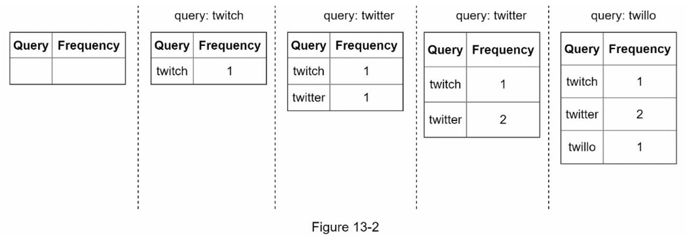

#### 查询服务

假设我们有一个频率表，如表13-1所示。它有两个字段。

Query：它存储查询字符串。

Frequency：它代表一个查询被搜索的次数。

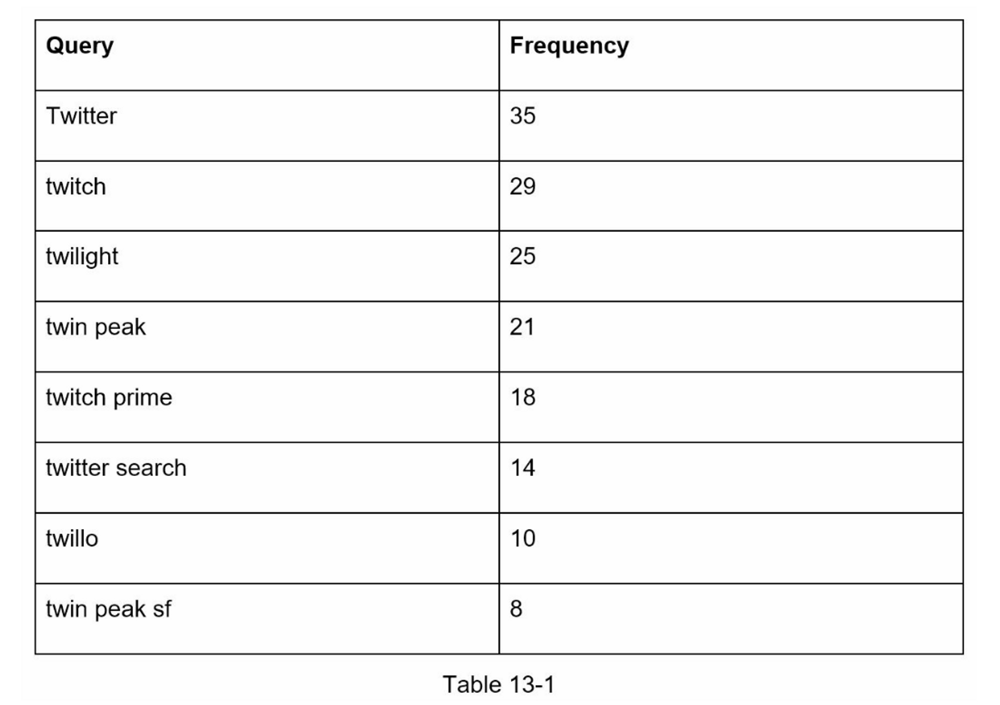

当用户在搜索框中输入 "tw "时，假设频率表以表13-1为基础，就会显示以下前5个被搜索的查询（图13-3）。

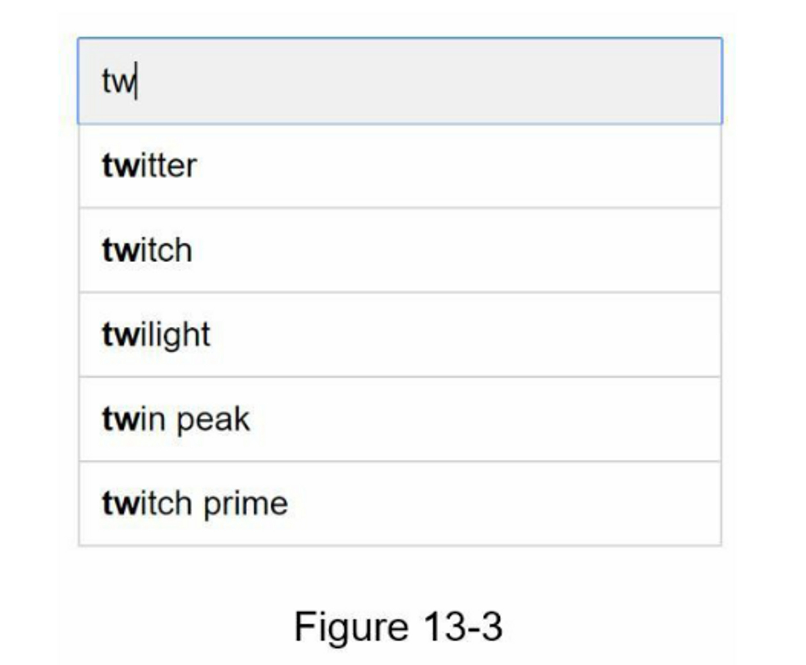

要获得前5个经常搜索的查询，执行以下SQL查询。

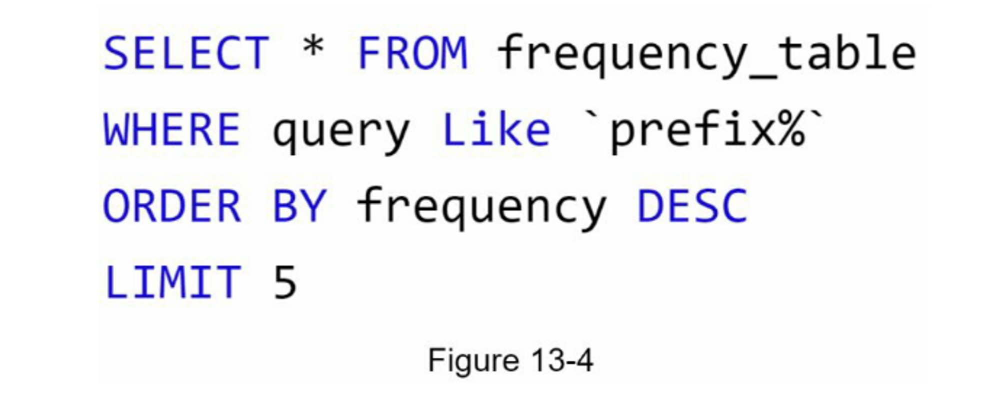

当数据集较小时，这是一个可以接受的解决方案。当它很大时，访问数据库就会成为一个瓶颈。我们将在深入探讨优化问题。

### 第3步：深入设计

在高层次设计中，我们讨论了数据收集服务和查询服务。高层设计并不是最优的，但它是一个很好的起点。在这一节中，我们将深入研究几个组件，并探讨以下的优化方法。

* Trie 数据结构
* 数据收集服务
* 数据查询
* 扩展存储
* Trie 操作

#### Trie 数据结构

在高层设计中，关系型数据库被用于存储。然而，从关系型数据库中获取前5个搜索查询是低效的。数据结构trie（前缀树）被用来克服这个问题。由于trie数据结构对系统至关重要，我们将投入大量时间来设计一个定制的trie。请注意，一些想法来自文章\[2]和\[3]。

了解基本的tree数据结构对于这个面试问题来说是至关重要的。然而，这更像是一个数据结构问题，而不是一个系统设计问题。此外，许多在线材料都解释了这个概念。

在本章中，我们将只讨论trie数据结构的概述，并重点讨论如何优化基本trie以提高响应时间。

Trie（发音为“try”）是一种树状数据结构，可以紧凑地存储字符串。 该名称来自单词检索（re**trie**val），这表明它是为字符串检索操作而设计的。

trie 的主要思想包括以下内容：

* trie是一种树状的数据结构。
* 根代表一个空字符串。
* 每个节点存储一个字符并有 26 个子节点，每个节点对应一个可能的字符。 为了节省空间，我们不绘制空链接。
* 每个树节点代表一个单词或一个前缀字符串。

图13-5显示了一个带有搜索查询 "tree"、"try"、"true"、"toy"、"wish"、"win "的 trie。搜索查询以较粗的边框突出显示。

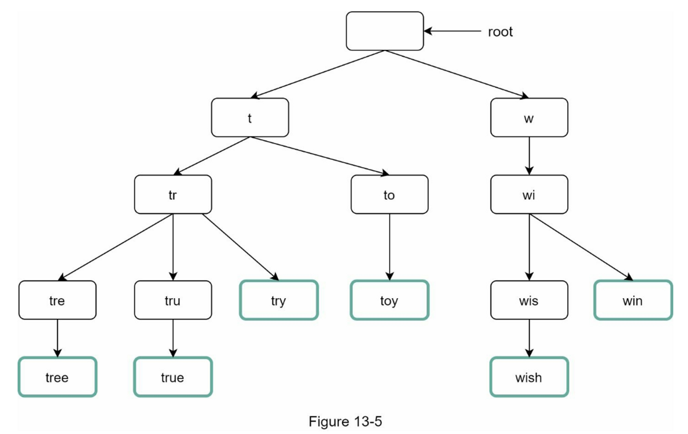

基本的trie数据结构在节点中存储字符。为了支持按频率排序，频率信息需要包含在节点中。假设我们有以下频率表。

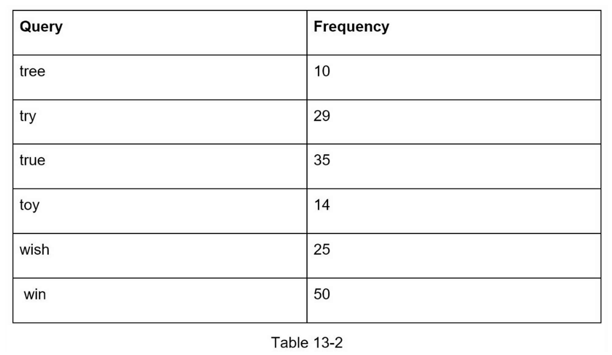

在向节点添加频率信息后，更新的 trie 数据结构如图 13-6 所示。

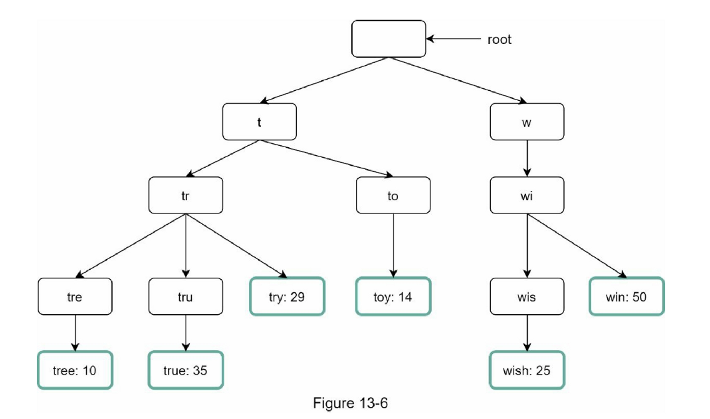

自动完成是如何在Trie中工作的？在深入研究该算法之前，让我们先定义一些术语：

* p：前缀的长度
* n：trie中的总节点数量
* c：一个给定节点的子女数

下面列出了获得前 k 个搜索最多的查询的步骤：

1. 找到前缀。时间复杂度：O(p)。
2. 从前缀节点遍历子树，得到所有有效的子节点。如果一个子节点能够形成一个有效的查询字符串，它就是有效的。时间复杂度：O(c)
3. 对孩子节点进行排序并获得前 k。 时间复杂度：O(clogc)

让我们用一个如图13-7所示的例子来解释这个算法。假设k等于2，一个用户在搜索框中输入 "tr"。该算法的工作原理如下。

* 第一步：找到前缀节点 "tr"。
* 第二步：遍历子树以获得所有有效的子节点。在这种情况下，节点\[tree：10]、\[true：35]、\[try：29]是有效的。
* 第3步：对孩子节点进行排序，得到前两名。\[true: 35]和\[try: 29]是前缀为 "tr "的前两个查询。

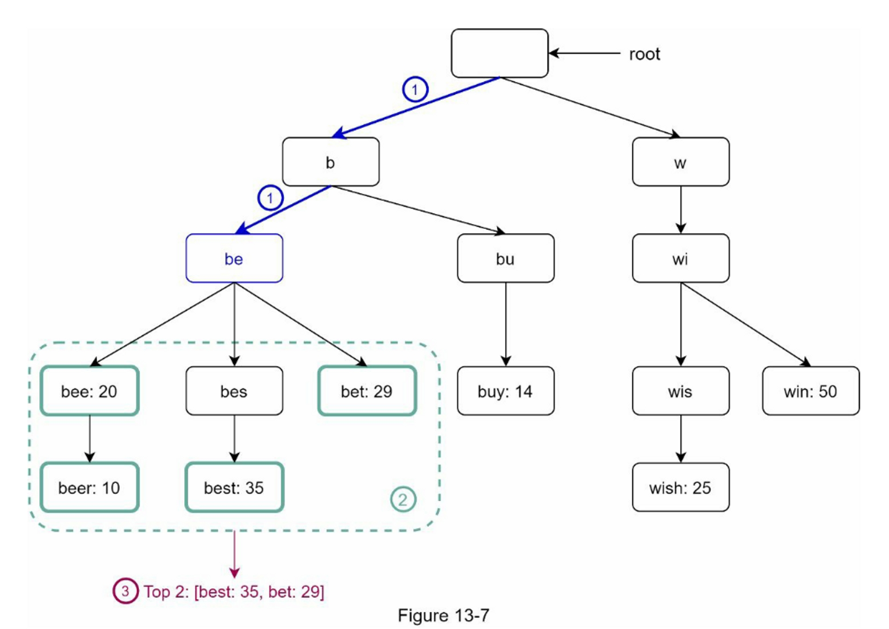

这个算法的时间复杂度是上述每个步骤所花费的时间之和。O(p) + O(c) + O(clogc)

上述算法很简单，但是，它太慢了，因为在最坏的情况下，我们需要遍历整个 trie 来获得前 k 个结果。

下面是两个优化方案。

1. 限制前缀的最大长度
2. 缓存每个节点的热门搜索查询

**限制前缀的最大长度**

用户很少在搜索框中键入长搜索查询。 因此，可以安全地说 p 是一个小整数，比如 50。如果我们限制前缀的长度，“查找前缀”的时间复杂度可以从 O(p) 降低到 O(small constant)， 又名 O(1)。

**缓存每个节点的热门搜索查询**

为了避免遍历整个 trie，我们在每个节点存储前 k 个最常用的查询。 由于 5 到 10 个自动完成建议对用户来说就足够了，因此 k 是一个相对较小的数字。 在我们的具体案例中，只有前 5 个搜索查询被缓存。

通过在每个节点缓存热门搜索查询，我们显着降低了检索前 5 个查询的时间复杂度。 但是，这种设计需要大量空间来存储每个节点的热门查询。

以空间换时间是非常值得的，因为快速响应时间非常重要。

图13-8显示了更新后的 trie 数据结构。每个节点上都存储了前5个查询。例如，前缀为 "be "的节点存储以下内容。\[best: 35, bet: 29, bee: 20, be: 15, beer: 10]。

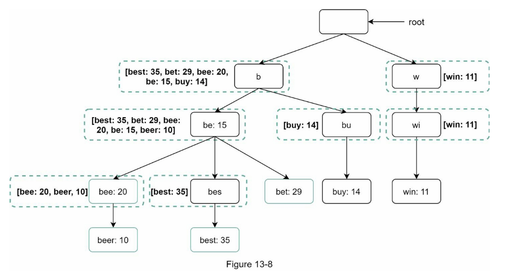

让我们重新审视一下应用这两个优化后的算法的时间复杂性。

1. 找到前缀节点。时间复杂度：O(1)
2. 返回前 k。 由于缓存了前 k 个查询，因此这一步的时间复杂度为 O(1)。 随着每个步骤的时间复杂度降低到 O(1)，我们的算法只需要 O(1) 来获取前 k 个查询。

#### 数据收集服务

在我们以前的设计中，每当用户键入一个搜索查询，数据就会实时更新。由于以下两个原因，这种方法并不实用。

* 用户每天可能会输入数十亿次的查询。在每次查询中更新 trie，会大大减慢查询服务的速度。
* 构建 trie 后，热门建议可能不会有太大变化。 因此，没有必要经常更新 trie。

为了设计可扩展的数据收集服务，我们检查数据的来源和使用方式。 像 Twitter 这样的实时应用程序需要最新的自动完成建议。 但是，许多 Google 关键字的自动完成建议每天可能不会有太大变化。

尽管用例不同，但数据收集服务的底层基础保持不变，因为用于构建 trie 的数据通常来自分析或日志服务。

图 13-9 显示了重新设计的数据收集服务。 每个组件都经过一一检查。

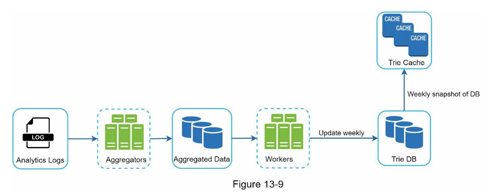

*   Analytics Logs（分析性日志）：

    它存储有关搜索查询的原始数据。 日志是附加的，没有索引。 表 13-3 显示了日志文件的示例。

    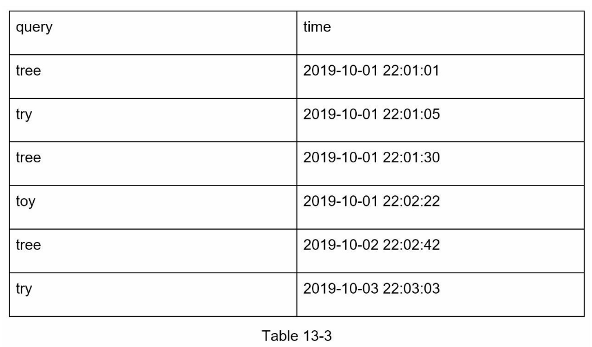
*   **Aggregators（聚合器）**

    分析日志的大小通常非常大，而且数据格式不正确。 我们需要汇总数据，以便我们的系统可以轻松处理这些数据。

    根据用例，我们可能会以不同方式聚合数据。 对于 Twitter 等实时应用程序，我们会在较短的时间间隔内聚合数据，因为实时结果很重要。 另一方面，以较低的频率聚合数据，比如每周一次，对于许多用例来说可能就足够了。 在面试过程中，验证实时结果是否重要。 我们假设 trie 每周重建一次。
*   **Aggregated Data（聚合数据）**

    表 13-4 显示了每周聚合数据的示例。 “time”字段表示一周的开始时间。 “frequency”字段是相应查询在该周内出现的总和。

    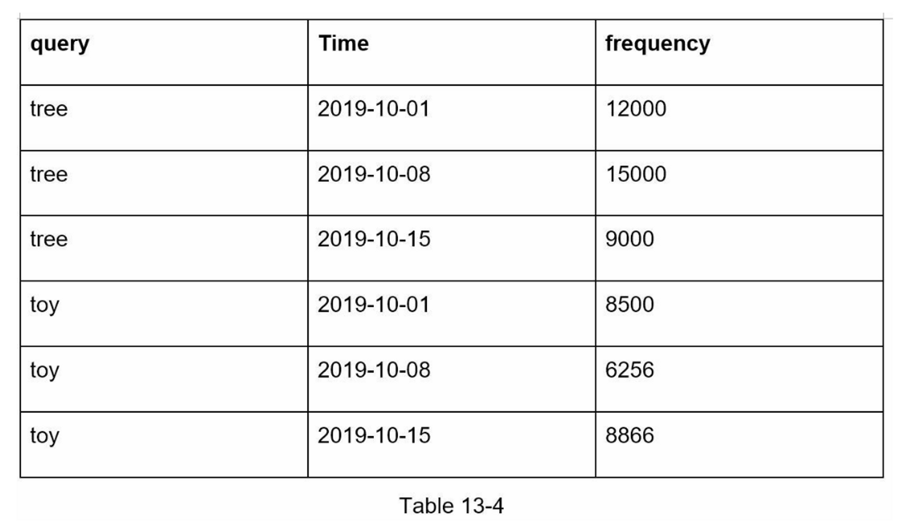
*   Workers

    工作者是一组服务器，以固定的时间间隔执行异步工作。他们建立Trie数据结构并将其存储在Trie DB中。
*   Trie Cache

    Trie Cache是一个分布式缓存系统，它将Trie保存在内存中，以便快速读取。它每周对数据库进行一次快照。
*   Trie DB

    Trie DB是持久性存储。有两个选项可用于存储数据。

    1.  文档数据库

        由于每周都会建立一个新的trie，我们可以定期对其进行快照，序列化，并将序列化后的数据存储在数据库中。 像 MongoDB \[4] 这样的文档存储非常适合序列化数据。
    2.  键值存储

        可以通过应用以下逻辑以哈希表形式 \[4] 表示一个特里树：

        * trie 中的每个前缀都映射到哈希表中的键。
        * 每个 trie 节点上的数据都映射到哈希表中的一个值。

        图 13-10 显示了 trie 和哈希表之间的映射。

        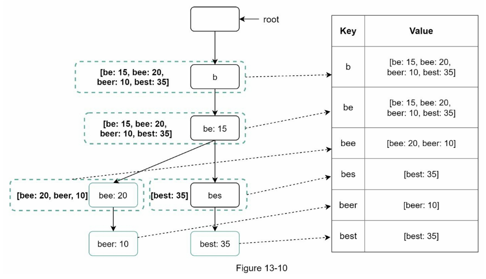

        在图13-10中，左边的每个 trie 节点被映射到右边的 \<key, value> 对。如果你不清楚键值存储如何工作，请参考第6章：设计键值存储。

#### 查询服务

在高层设计中，查询服务直接调用数据库来获取前5个结果。图13-11显示了改进后的设计，因为之前的设计效率很低。

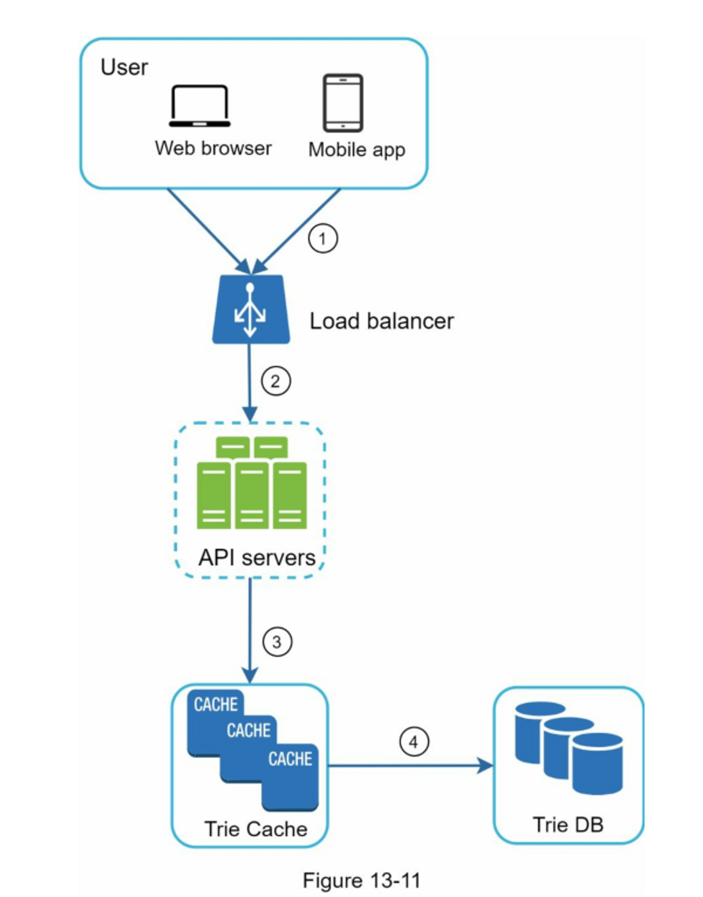

1. 一个搜索查询被发送到负载均衡器。
2. 负载均衡器将请求路由到API服务器。
3. API服务器从Trie Cache获得Trie数据，并为客户端构建自动完成建议。
4. 如果数据不在Trie Cache中，我们会将数据补充到缓存中。这样一来，所有对同一前缀的后续请求都从缓存中返回。当缓存服务器没有内存或脱机时，就会发生缓存缺失。

查询服务需要闪电般的速度。 我们提出以下优化：

* AJAX 请求：对于 Web 应用程序，浏览器通常会发送 AJAX 请求来获取自动完成结果。 AJAX 的主要好处是发送/接收请求/响应不会刷新整个网页。
*   浏览器缓存：对于许多应用程序，自动完成搜索建议可能不会在短时间内发生太大变化。 因此，自动完成建议可以保存在浏览器缓存中，以允许后续请求直接从缓存中获取结果。 Google 搜索引擎使用相同的缓存机制。 图 13-12 显示了当您在 Google 搜索引擎上键入“system design interview”时的响应标题。 如您所见，Google 将结果缓存在浏览器中 1 小时。 请注意：缓存控制中的“private”意味着结果仅供单个用户使用，不得由共享缓存缓存。 “max-age=3600”表示缓存的有效期为 3600 秒，也就是一个小时。

    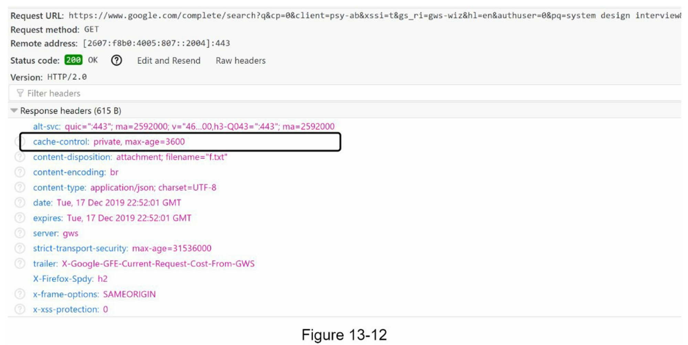
* 数据采样：对于大型系统，记录每个搜索查询需要大量的处理能力和存储空间。 数据采样很重要。 例如，系统仅记录每 N 个请求中的 1 个。

#### Trie 操作

Trie 是自动完成系统的核心组件。 让我们看看 trie 操作（创建、更新和删除）是如何工作的。

**创建**

Trie 是由工作人员使用聚合数据创建的。 数据源来自 Analytics Log/DB。

**更新**

有两种方法可以更新 trie。

方法一：每周更新 trie。一旦创建了新的 trie，新的 trie 将取代旧的 trie。

方法二：直接更新单个 trie 节点。 我们尽量避免这种操作，因为它很慢。 但是，如果 trie 的大小很小，这是一个可以接受的解决方案。 当我们更新一个 trie 节点时，它一直到根的祖先都必须更新，因为祖先存储子节点的热门查询。 图 13-13 显示了更新操作如何工作的示例。 在左侧，搜索查询“beer”的原始值为 10。在右侧，它更新为 30。如您所见，节点及其祖先的“beer”值已更新为 30。

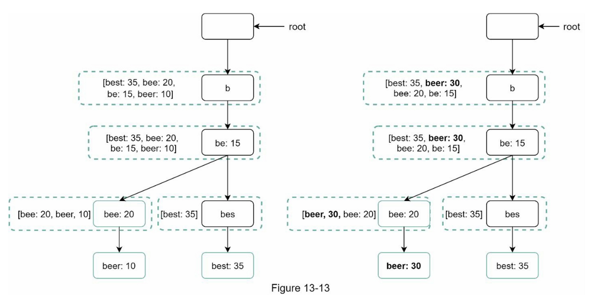

**删除**

我们必须删除仇恨、暴力、色情或危险的自动完成建议。 我们在 Trie 缓存前面添加一个过滤层（图 13-14）以过滤掉不需要的建议。

拥有过滤层使我们能够灵活地根据不同的过滤规则删除结果。

不需要的建议会以异步方式从数据库中物理删除，以便在下一个更新周期中使用正确的数据集来构建 trie。

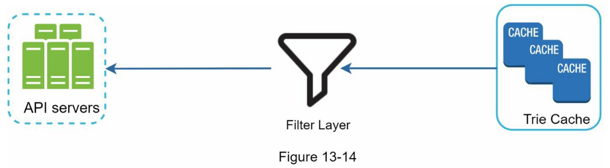

#### 扩展存储

现在我们已经开发了一个系统，将自动完成的查询带给用户，现在是时候解决当 trie 增长到无法在一台服务器中容纳时的可扩展性问题了。

由于英语是唯一被支持的语言，一种简单的分片方式是基于第一个字符。这里有一些例子。

* 如果我们需要两台服务器来存储，我们可以在第一台服务器上存储从'a'到'm'的查询，而在第二台服务器上存储'n'到'z'的查询。
* 如果我们需要三个服务器，我们可以把查询分成'a'到'i'，'j'到'r'和's'到'z'。

按照这个逻辑，我们可以将查询分成26个服务器，因为英语中有26个字母。让我们把基于第一个字符的分片定义为第一层分片。要存储超过26个服务器的数据，我们可以在第二层甚至第三层进行分片。例如，以'a'开头的数据查询可以分成4个服务器：'aa-ag'，'ah- an'，'ao-au'和'av-az'。

乍一看，这种方法似乎很合理，直到你意识到以字母'c'开头的单词比'x'多得多。这就造成了分布不均。

为了缓解数据不平衡问题，我们分析历史数据分布模式并应用更智能的分片逻辑，如图 13-15 所示。 分片映射管理器维护一个查找数据库，用于标识应将行存储在何处。 例如，如果对“s”和“u”、“v”、“w”、“x”、“y”和“z”的合并历史查询数量相似，我们可以维护两个分片：一个 用于“s”，一个用于“u”到“z”。

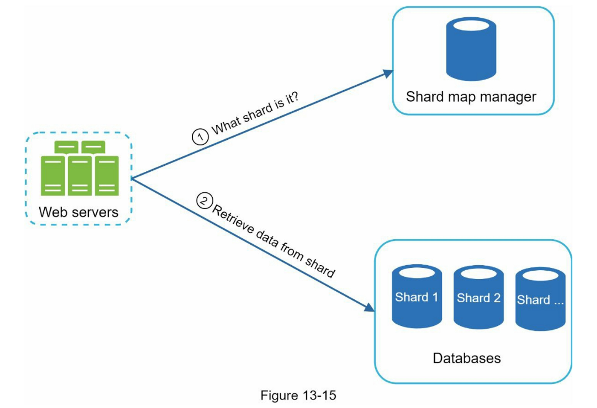

### 第4步：总结

在你完成深入探讨后，你的面试官可能会问佴一些后续问题。

**面试官：你如何扩展你的设计以支持多语言？**

为了支持其他非英语查询，我们将 Unicode 字符存储在 trie 节点中。 如果您不熟悉 Unicode，这里是定义：“一种编码标准涵盖了世界上所有现代和古代书写系统的所有字符”\[5]。

**面试官：如果一个国家/地区的热门搜索查询与其他国家/地区不同怎么办？**

在这种情况下，我们可能会为不同的国家建立不同的 trie。 为了缩短响应时间，我们可以将 trie 存储在 CDN 中。

**面试官：我们如何支持趋势（实时）搜索查询？**

假设一个新闻事件爆发了，一个搜索查询突然变得很流行。我们原来的设计将无法工作，因为：

* 离线工人还没有安排更新 trie，因为这被安排在每周的基础上运行。
* 即使安排了，也需要太长的时间来建立 trie。

构建一个实时搜索的自动完成器是很复杂的，超出了本书的范围，所以我们只给出一些想法：

* 通过分片减少工作数据集。
* 更改排名模型并为最近的搜索查询分配更多权重。
* 数据可能以流的形式出现，因此我们无法一次访问所有数据。 流数据意味着数据是连续产生的。 流处理需要一组不同的系统：Apache Hadoop MapReduce \[6]、Apache Spark Streaming \[7]、Apache Storm \[8]、Apache Kafka \[9] 等。因为所有这些主题都需要特定的领域知识，所以我们不会 在这里详细介绍。

恭喜你走到了这一步！现在给自己一个鼓励，干得漂亮！

### 参考资料

* \[1] The Life of a Typeahead Query: [https://www.facebook.com/notes/facebook-engineering/the-life-of-a-typeahead-query/389105248919/](https://www.facebook.com/notes/facebook-)
* \[2] How We Built Prefixy: A Scalable Prefix Search Service for Powering Autocomplete: [https://medium.com/@prefixyteam/how-we-built-prefixy-a-scalable-prefix-search-service-for-powering-autocomplete-c20f98e2eff1](https://medium.com/@prefixyteam/how-we-built-prefixy-a-scalable-prefix-search-service-)
* \[3] Prefix Hash Tree An Indexing Data Structure over Distributed Hash Tables: [https://people.eecs.berkeley.edu/\~sylvia/papers/pht.pdf](https://people.eecs.berkeley.edu/\~sylvia/papers/pht.pdf)
* \[4] MongoDB wikipedia: [https://en.wikipedia.org/wiki/MongoDB](https://en.wikipedia.org/wiki/MongoDB)
* \[5] Unicode frequently asked questions: [https://www.unicode.org/faq/basic\_q.html](https://www.unicode.org/faq/basic\_q.html)
* \[6] Apache hadoop: [https://hadoop.apache.org/](https://hadoop.apache.org/)
* \[7] Spark streaming: [https://spark.apache.org/streaming/](https://spark.apache.org/streaming/)
* \[8] Apache storm: [https://storm.apache.org/](https://storm.apache.org/)
* \[9] Apache kafka: [https://kafka.apache.org/documentation](https://kafka.apache.org/documentation)
