# 第14章：设计 YouTube

## CHAPTER 14：DESIGN YOUTUBE

## 第14章：设计 YouTube

在本章中，你被要求设计YouTube。这个问题的解决方案可以应用于其他面试问题，如设计一个视频共享平台，如Netflix和Hulu。图14-1显示了YouTube的主页。

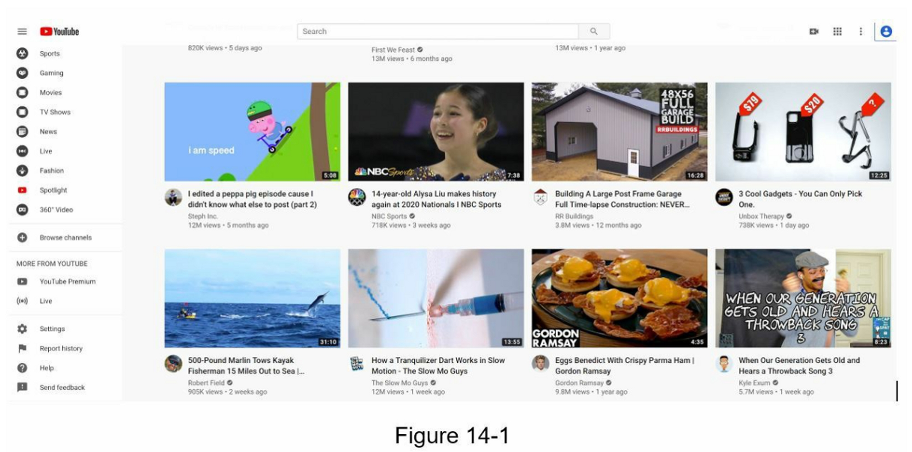

YouTube 看起来很简单：内容创作者上传视频，观众点击播放。 真的那么简单吗？ 并不真地。 简单的背后隐藏着许多复杂的技术。 让我们来看看 2020 年 YouTube 的一些令人印象深刻的统计数据、人口统计数据和有趣的事实 \[1] \[2]。

* 每月活跃用户总数：20亿。
* 每天观看的视频数量：50亿。
* 73%的美国成年人使用 YouTube。
* 在 YouTube 上有5000万创作者。
* 2019年全年，YouTube 的广告收入为151亿美元，比2018年增长36%。
* YouTube 占所有移动互联网流量的37%。
* YouTube 有80种不同的语言。

从这些统计数据中，我们知道YouTube是巨大的、全球性的，并且赚了很多钱。

### 第1步：了解问题并确定设计范围

如图14-1所示，除了观看视频，你还可以在YouTube上做很多事情。例如，评论、分享或喜欢一个视频，将一个视频保存到播放列表中，订阅一个频道，等等。在45或60分钟的面试中，不可能设计所有内容。

因此，提出问题以缩小范围是很重要的。

候选人：哪些功能是重要的？

面试官：能够上传视频和观看视频。

候选人：我们需要支持哪些客户？

面试官：移动应用、浏览器和智能电视。

候选人：我们有多少日活跃用户？

面试官：500万

候选人：平均每天花在产品上的时间是多少？

面试官：30分钟。

候选人：我们需要支持国际用户吗？

面试官：是的，很大比例的用户是国际用户。

候选人：支持的视频分辨率是多少？

面试官：本系统接受大部分的视频分辨率和格式。

候选人：是否需要加密？

面试官：是的。

候选人：对视频的文件大小有要求吗？

面试官：我们的平台专注于小型和中型的视频，允许的最大视频大小为1GB。

候选人：我们能否利用亚马逊、谷歌或微软提供的一些现有云计算基础设施？

面试官：这是个好问题。对于大多数公司来说，从头开始建立一切是不现实的，建议利用一些现有的云服务。

在这一章中，我们着重于设计一个具有以下特点的视频流媒体服务：

* 快速上传视频的能力
* 流畅的视频流
* 能够改变视频的质量
* 基础设施成本低
* 高可用性、可扩展性和可靠性的要求
* 支持的客户端：移动应用、浏览器和智能电视

#### 粗略估计

下面的估计是基于许多假设，所以与面试官沟通以确保和她在同一起跑线上是很重要的。

* 假设该产品有500万日活跃用户（DAU）。
* 用户每天观看5个视频。
* 10%的用户每天上传1个视频。
* 假设平均视频大小为300MB。
* 每天需要的总存储空间。500万\*10%\*300MB=150TB
* CDN成本
  * 当云计算CDN提供视频时，你要为从CDN传输出来的数据付费。
  * 让我们使用亚马逊的CDN CloudFront进行成本估算（图14-2）\[3]。假设100%的流量都来自美国。每GB的平均成本为0.02美元。为简单起见，我们只计算视频流的成本。
  * 500万 \* 5个视频 \* 0.3GB \* 0.02美元 = 15万美元/天

从粗略的成本估算中，我们知道从CDN提供视频的成本很高。即使云供应商愿意为大客户大幅降低CDN成本，但成本仍然很高。我们将深入讨论降低CDN成本的方法。

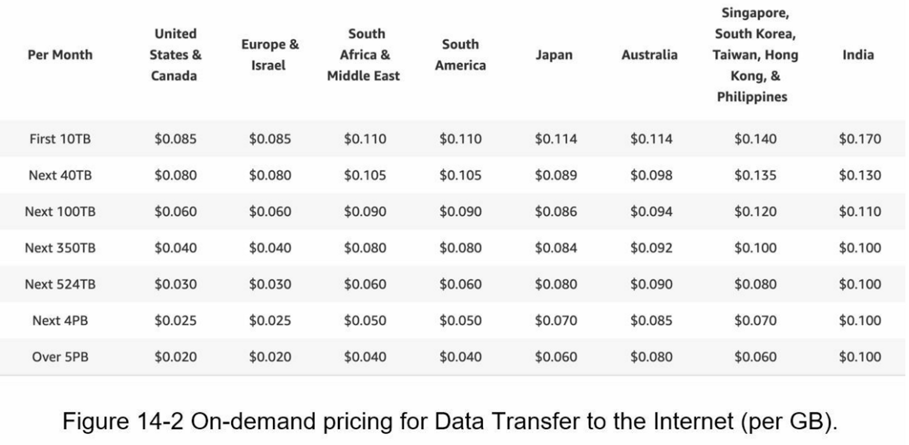

### 第2步：提出高层次的设计方案并获得认同

如前所述，面试官建议利用现有的云服务，而不是从头开始构建所有内容。 CDN 和 blob 存储是我们将利用的云服务。 有些读者可能会问为什么不自己构建所有东西？ 原因如下：

* 系统设计面试并不是要从头开始建立一切。在有限的时间内，选择正确的技术来做好一项工作比详细解释技术的工作原理更重要。例如，提到用于存储源视频的blob存储就足以应付面试了。谈论blob存储的详细设计可能是一种矫枉过正。
* 构建可扩展的blob存储或CDN是非常复杂和昂贵的。即使像Netflix或Facebook这样的大公司也不会自己建立一切。Netflix利用亚马逊的云服务\[4]，而Facebook使用Akamai的CDN\[5]。

在高层次上，该系统由三个部分组成（图14-3）。

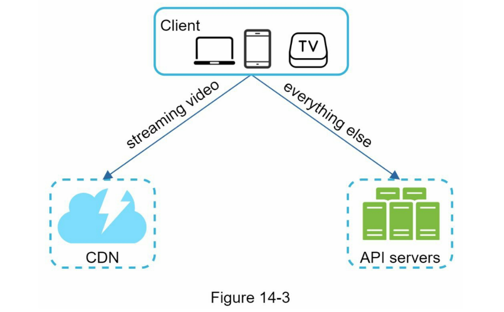

**Client**：你可以在你的电脑、手机和智能电视上观看YouTube。

**CDN**：视频被存储在CDN中。当你按下播放键时，视频就会从CDN上流传下来。

**API servers**：除了视频流之外的所有其他内容都通过 API 服务器。 这包括提要推荐、生成视频上传 URL、更新元数据数据库和缓存、用户注册等。

在问答环节，面试官表现出对两个流程的兴趣：

* 视频上传流程
* 视频流

我们将探讨其中每一个的高层设计。

#### 视频上传流程

图14-4显示了视频上传的高级设计。

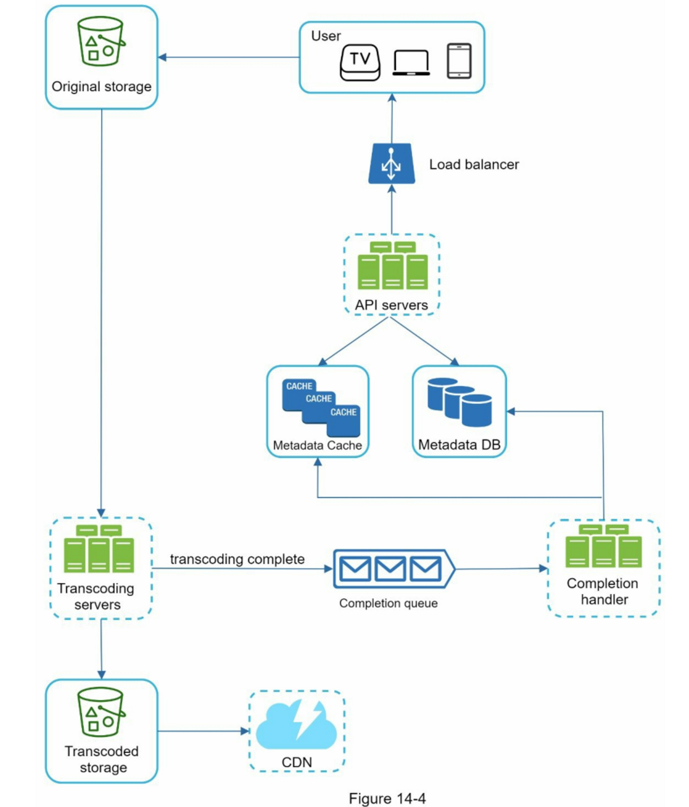

它由以下几个部分组成：

* User（用户）：用户在电脑、移动电话或智能电视等设备上观看YouTube。
* Load balancer（负载均衡器）：负载平衡器在API服务器之间均匀地分配请求。
* API servers（API服务）：除了视频流，所有用户请求都要通过API服务器。
* Metadata DB（元数据数据库）：视频元数据被存储在元数据数据库中。它是分片和复制的，以满足性能和高可用性要求。
* Metadata cache（元数据缓存）：为了提高性能，视频元数据和用户对象被缓存起来。
* Original storage（原始存储）：blob存储系统用来存储原始视频。维基百科中关于blob存储的一段引文显示。"二进制大对象（BLOB）是数据库管理系统中作为单一实体存储的二进制数据的集合" \[6]。
* Transcoding servers（转码服务器）：视频转码也被称为视频编码。它是将一种视频格式转换为其他格式（MPEG、HLS等）的过程，为不同设备和带宽能力提供可能的最佳视频流。
* Transcoded storage（转码存储）：它是一个储存转码视频文件的blob存储。
* CDN（内容分发网络）：视频被缓存在CDN中。当你点击播放按钮时，视频会从CDN上流传下来。
* Completion queue（完成队列）：它是一个消息队列，存储有关视频转码完成事件的信息。
* Completion handler（完成处理程序）：他由一个工作者列表组成，从完成队列中提取事件数据并更新元数据缓存和数据库。

现在我们已经单独了解了每个组件，让我们来看看视频上传流程是如何工作的。该流程被分解为两个平行运行的过程。

* 上传真正的视频。
* 更新视频元数据。元数据包含有关视频URL、大小、分辨率、格式、用户信息等信息。
*   流程 1：上传真正的视频

    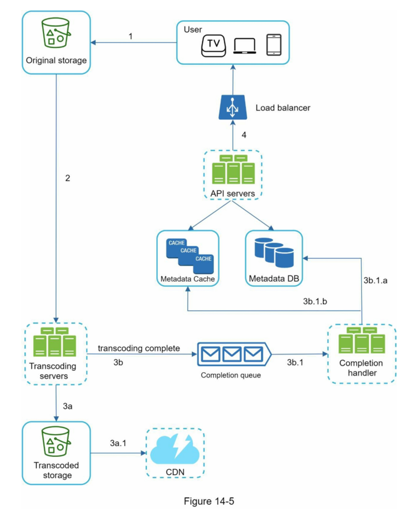

    图 14-5 显示了如何上传真正的视频。 解释如下图：

    1. 视频被上传到原始的存储空间。
    2. 转码服务器从原始存储中获取视频并开始转码。
    3. 一旦转码完成，以下两个步骤将被平行执行。
       1. 转码后的视频被发送到转码后的存储空间。
       2. 转码完成事件被排在完成队列中。
    4. (3a.1)转码后的视频被分发到CDN。
    5. (3b.1)完成处理程序包含一堆工作者，他们不断地从队列中提取事件数据。
    6. (3a.1和3b.1)完成处理程序在视频转码完成后更新元数据数据库和缓存。
    7. API服务器通知客户，视频已经成功上传，可以进行流媒体播放。
*   流程2：更新视频元数据

    当文件被上传到原始存储区时，并行的客户端会发送一个更新视频元数据的请求，如图14-6所示。该请求包含视频元数据，包括文件名、大小、格式等。API服务器更新元数据缓存和数据库。

    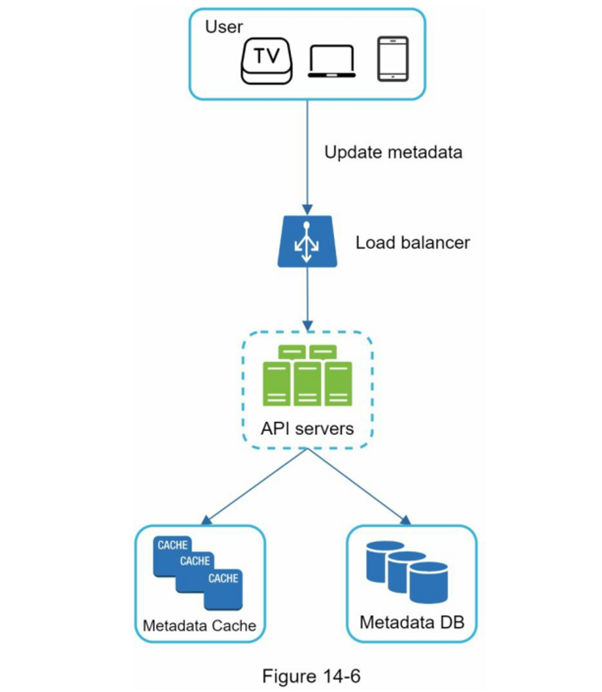

#### 视频流

当你在YouTube上观看一个视频时，它通常立即开始流媒体，你不会等到整个视频被下载。下载意味着整个视频被复制到你的设备上，而流媒体意味着你的设备不断接收来自远程源视频的视频流。当你观看流媒体视频时，你的客户端每次加载一点数据，所以你可以立即和连续地观看视频。

在我们讨论视频流媒体流程之前，让我们看看一个重要的概念：流媒体协议。这是一种控制视频流数据传输的标准化方式。

流行的流媒体协议有：

* MPEG–DASH：MPEG代表 "移动图像专家组"，DASH代表 "HTTP动态自适应流"。
* 苹果 HLS：HLS是 "HTTP实时流媒体 "的缩写。
* 微软 Smooth Streaming。
* Adobe HTTP动态流（HDS）。

你不需要完全理解甚至记住这些流媒体协议的名称，因为它们是需要特定领域知识的低层次细节。这里重要的是要明白，不同的流媒体协议支持不同的视频编码和播放机。当我们设计一个视频流媒体服务时，我们必须选择正确的流媒体协议来支持我们的用例。要了解更多关于流媒体协议的信息，这里有一篇优秀的文章\[7]。

视频是直接从CDN流式传输的。离你最近的边缘服务器将提供视频。因此，延迟非常小。图14-7显示了视频流的高层次设计。

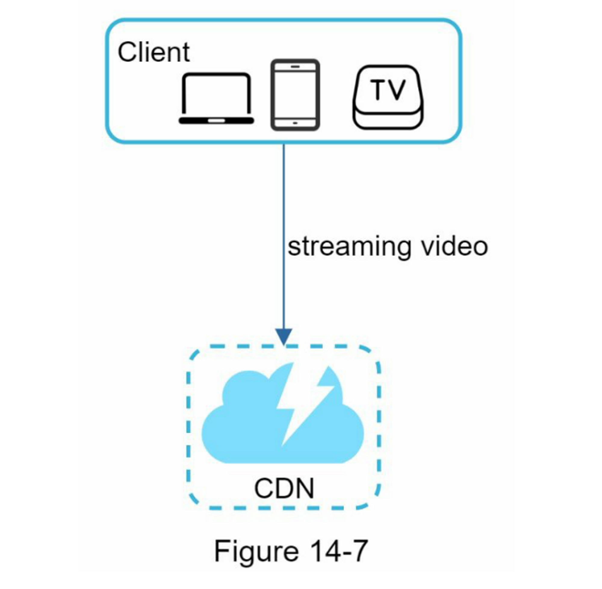

### 第3步：深入设计

在高层次的设计中，整个系统被分解成两个部分：视频上传流程和视频流。在本节中，我们将通过重要的优化来完善这两个流程，并引入错误处理机制。

#### 视频转码

当你录制视频时，设备（通常是手机或相机）会给视频文件一定的格式。如果你想让视频在其他设备上顺利播放，视频必须被编码为兼容的比特率和格式。比特率是指随着时间推移，比特被处理的速度。更高的比特率通常意味着更高的视频质量。高比特率流需要更多的处理能力和快速的互联网速度。

视频转码是很重要的，原因如下：

* 原始视频会消耗大量的存储空间。一段长达一小时的高清视频以每秒60帧的速度录制，可以占用几百GB的空间。
* 许多设备和浏览器只支持某些类型的视频格式。因此，出于兼容性的考虑，将视频编码为不同的格式是很重要的。
* 为了确保用户在观看高质量视频的同时保持流畅的播放，向拥有高网络带宽的用户提供更高分辨率的视频，向拥有低带宽的用户提供低分辨率的视频是一个好主意。
* 网络条件会发生变化，特别是在移动设备上。为确保视频的连续播放，根据网络条件自动或手动切换视频质量对用户的流畅体验至关重要。

有许多类型的编码格式；然而，它们中的大多数都包含两部分：

* 容器：这就像一个篮子，包含视频文件、音频和元数据。你可以通过文件扩展名来判断容器的格式，如.avi、.mov或.mp4。
* 编码解码器：这些是压缩和解压算法，旨在减少视频尺寸，同时保留视频质量。最常用的视频编解码器是H.264、VP9和HEVC。

#### 有向无环图(DAG)模型

转码视频的计算成本很高，而且很耗时。此外，不同的内容创建者可能有不同的视频处理要求。例如，有些内容创作者需要在他们的视频上面加水印，有些人自己提供缩略图，有些人上传高清视频，而有些人则不需要。

为了支持不同的视频处理管道并保持高度的并行性，必须增加一些抽象的层次，让客户端程序员定义执行什么任务。例如，Facebook的流媒体视频引擎使用了一个有向无环图（DAG）编程模型，它分阶段定义任务，因此它们可以顺序或平行地执行\[8]。在我们的设计中，我们采用类似的DAG模型来实现灵活性和并行性。

图14-8表示一个用于视频转码的DAG。

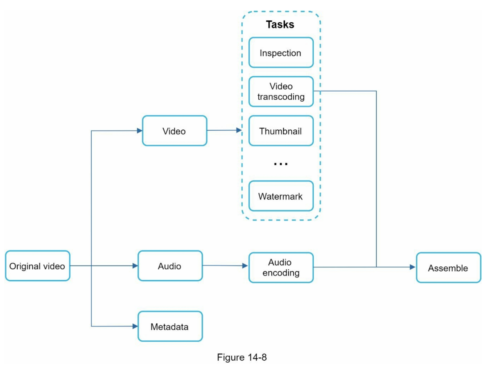

在图14-8中，原始视频被分割成视频、音频和元数据。下面是一些可以应用于视频文件的任务。

* Inspection：确保视频有良好的质量，并且没有畸形。
* Video encodings：视频被转换以支持不同的分辨率、编解码器、比特率等。图14-9显示了一个视频编码文件的例子。
* Thumbnail：缩略图可以由用户上传或由系统自动生成。
* Watermark：视频封面，包含关于你的视频的识别信息。

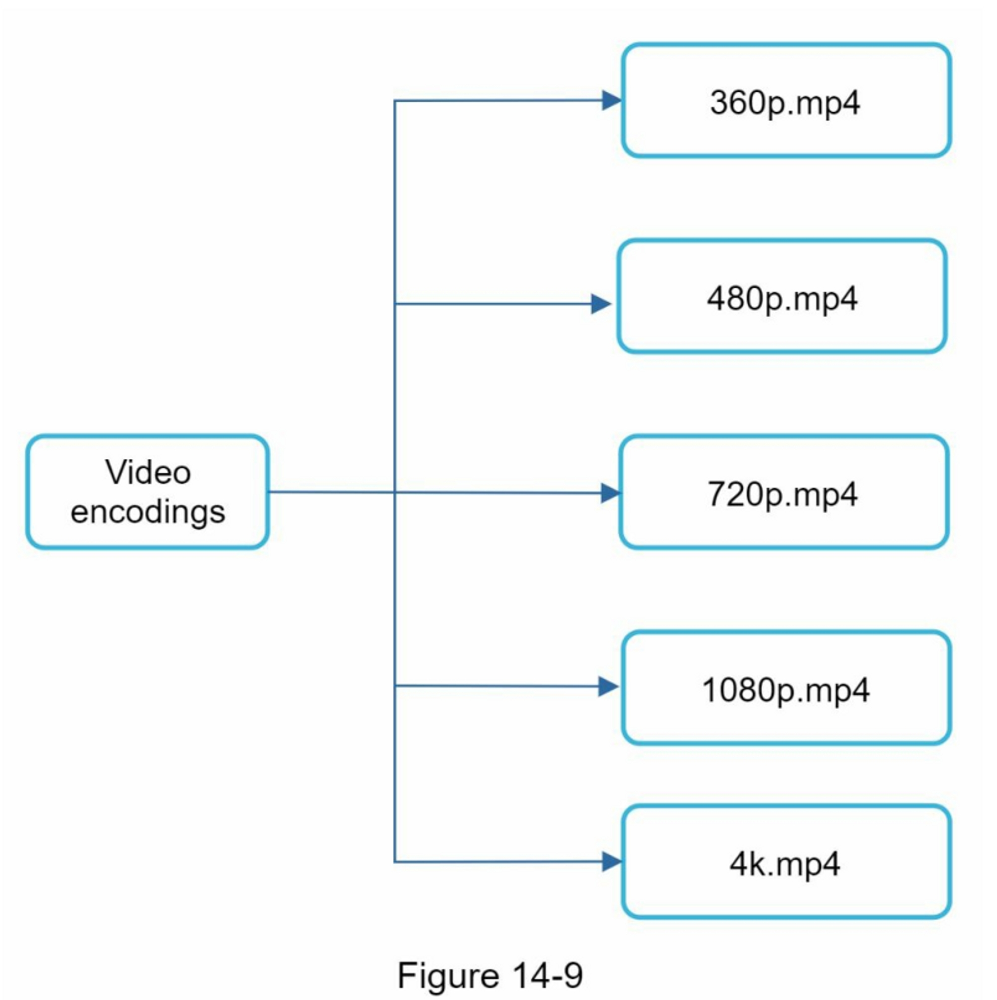

#### 视频转码架构

提议利用云服务的视频转码架构如图14-10所示。

该架构有六个主要组成部分：预处理器（preprocessor）、DAG调度器（DAG scheduler）、资源管理器（resource manager）、任务工作者（task workers,）、临时存储（temporary storage,）和作为输出的编码视频（encoded video a）。让我们仔细看看每个组件。

**预处理器**

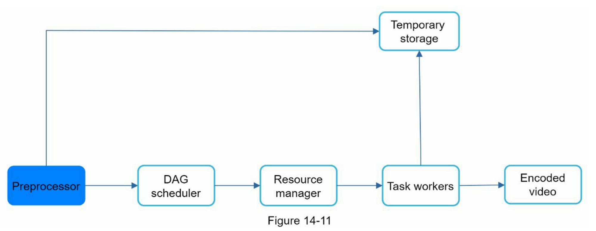

预处理器有4个职责：

1. 视频分割：视频流被拆分或进一步拆分为更小的图片组 (GOP) 对齐方式。 GOP 是按特定顺序排列的一组/帧帧。 每个块都是一个独立的可玩单元，通常有几秒钟的长度。
2. 一些旧的移动设备或浏览器可能不支持视频分割。 预处理器通过 GOP 对齐方式为老客户分割视频。
3.  DAG 生成。 处理器根据客户端程序员编写的配置文件生成 DAG。 图 14-12 是一个简化的 DAG 表示，它有 2 个节点和 1 个边：

    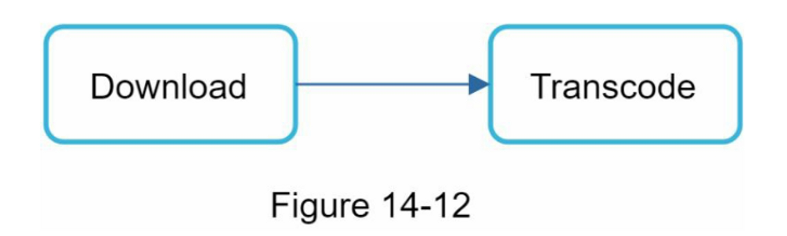

    这个DAG表示法是由下面两个配置文件生成的（图14-13）：

    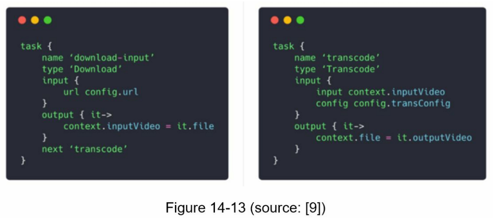
4. 缓存数据：预处理器是分段视频的缓存。 为了获得更好的可靠性，预处理器将 GOP 和元数据存储在临时存储中。 如果视频编码失败，系统可以使用持久化数据进行重试操作。

**DAG调度器**

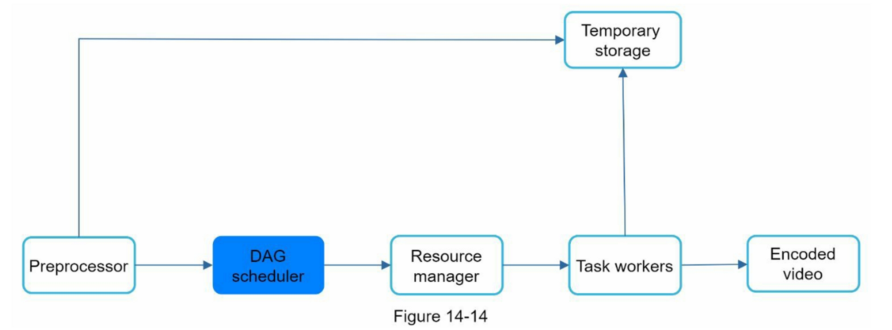

DAG调度器把DAG图分割成各阶段的任务，并把它们放在资源管理器的任务队列中。图14-15显示了DAG调度器如何工作的一个例子。

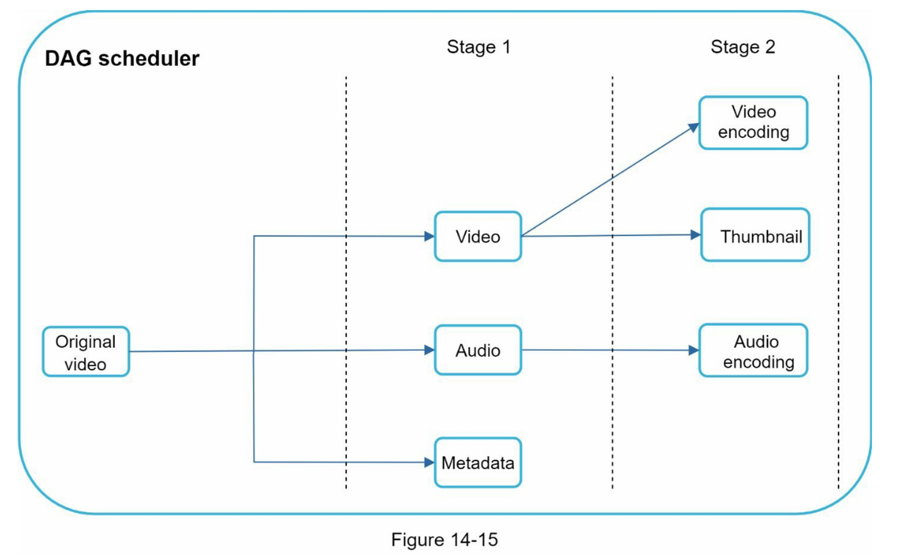

如图14-15所示，原始视频被分割成三个阶段。第1阶段：视频、音频和元数据。视频文件在第2阶段被进一步分成两个任务：视频编码和缩略图。音频文件需要进行音频编码，作为第2阶段任务的一部分。

**资源管理器**

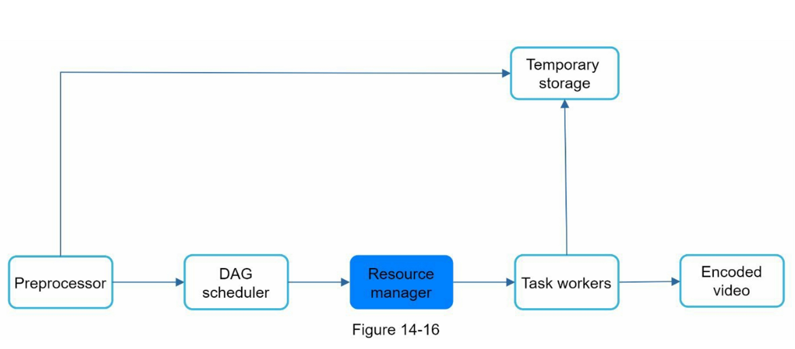

资源管理器负责管理资源分配的效率。它包含3个队列和一个任务调度器，如图14-17所示。

* Task queue：是一个优先级队列，包含要执行的任务。
* Worker queue：是一个包含 Worker 利用率信息的优先级队列。
* Task scheduler：它挑选最佳任务/工作者，并指示所选的任务工作者执行工作。

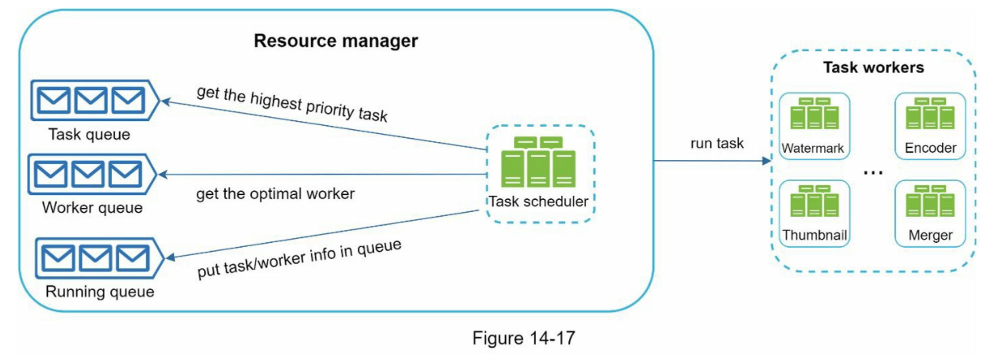

资源管理器的工作原理如下：

* 任务调度器从任务队列中获得最高优先级的任务。
* 任务调度器从工作者队列中获得最佳的任务工作者来运行任务。
* 任务调度器指示所选的任务工作者运行该任务。
* 任务调度器绑定任务/工作信息并将其放入运行队列。
* 一旦工作完成，任务调度器就会将工作从运行队列中移除。

**任务工作者**

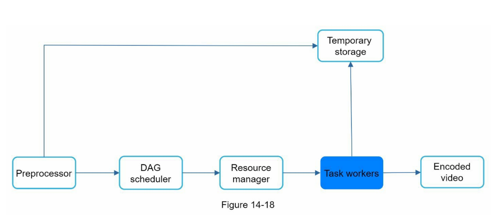

任务工作者运行在DAG中定义的任务。不同的任务工作者可以运行不同的任务，如图14-19所示。

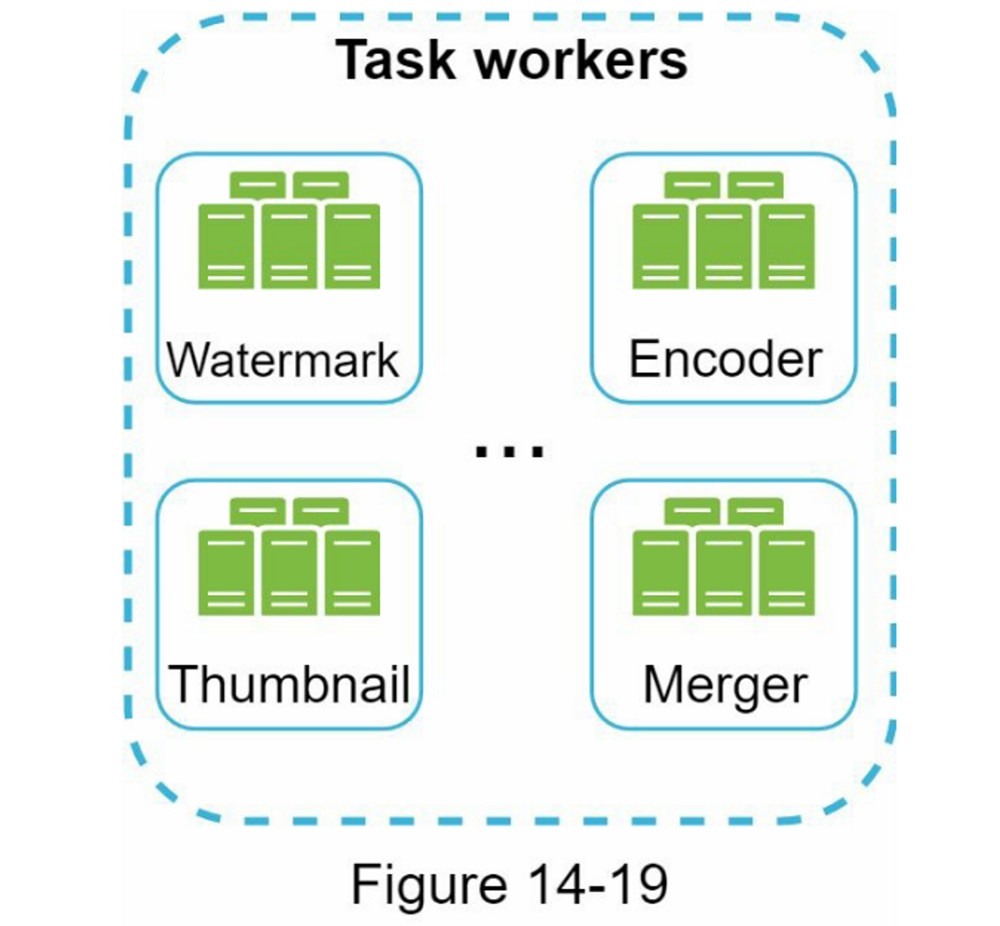

**临时存储**

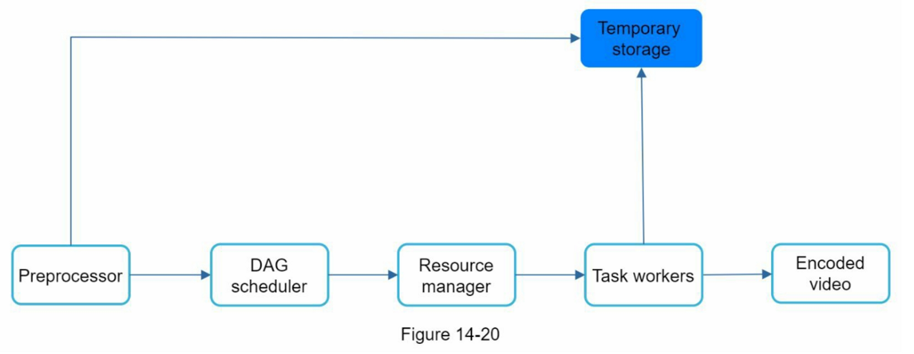

这里使用了多种存储系统。存储系统的选择取决于数据类型、数据大小、访问频率、数据寿命等因素。例如，元数据经常被工作者访问，而且数据大小通常很小。因此，在内存中缓存元数据是一个好主意。对于视频或音频数据，我们把它们放在blob存储中。一旦相应的视频处理完成，临时存储中的数据就会被释放出来。

**编码后的视频**

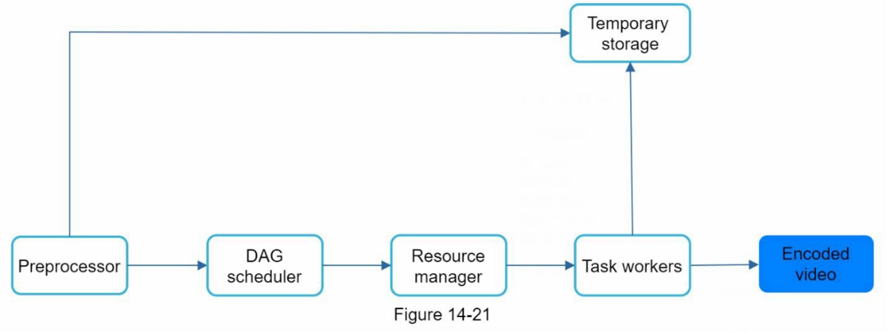

编码后的视频是编码管道的最终输出。下面是一个输出的例子： funny\_720p.mp4 。

#### 系统优化

在这一点上，你应该对视频上传流程、视频流媒体流程和视频转码有良好的理解。接下来，我们将通过优化来完善系统，包括速度、安全和成本节约。

**速度优化：并行化视频上传**

将一个视频作为一个整体上传是低效的。我们可以通过GOP对齐将视频分割成小块，如图14-22所示。

这允许在前一次上传失败时快速恢复上传。按GOP分割视频文件的工作可以由客户端实现，以提高上传速度，如图14-23所示。 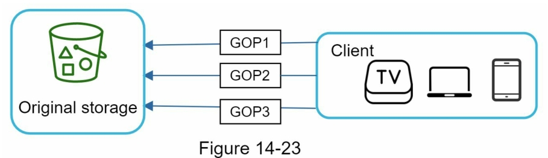

**速度优化：将上传中心放在靠近用户的地方**

另一种提高上传速度的方法是在全球设立多个上传中心（图14-24）。美国的人可以把视频上传到北美的上传中心，而中国的人可以把视频上传到亚洲的上传中心。为了实现这一目标，我们使用CDN作为上传中心。

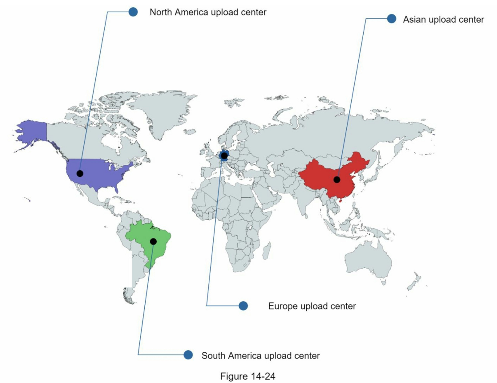

**速度优化：无处不在的并行性**

实现低延迟需要大量的尝试。另一个优化是构建一个低耦合的系统并实现高并行性。

我们的设计需要做一些修改以实现高并行性。让我们放大视频从原始存储到CDN的流程。该流程如图14-25所示，显示出输出取决于前一步的输入。这种依赖性使并行化变得困难。

为了使系统更加低耦合，我们引入了消息队列，如图14-26所示。让我们用一个例子来解释消息队列如何使系统更加松散耦合。

* 在引入消息队列之前，编码模块必须等待下载模块的输出。
* 引入消息队列后，编码模块不需要再等待下载模块的输出。如果消息队列中存在事件，编码模块可以并行地执行这些工作。

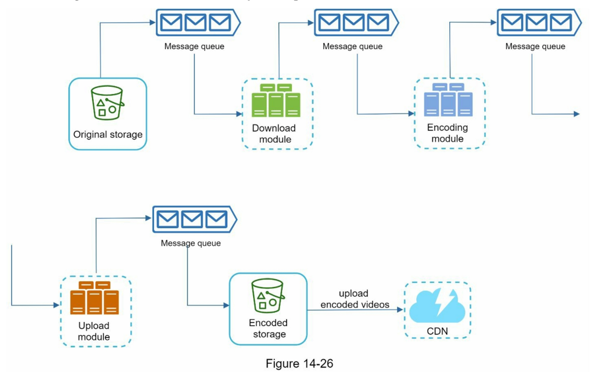

**安全优化：预签名的上传URL**

安全是任何产品最重要的方面之一。为了确保只有授权用户将视频上传到正确的位置，我们引入了预签名的URL，如图14-27所示。

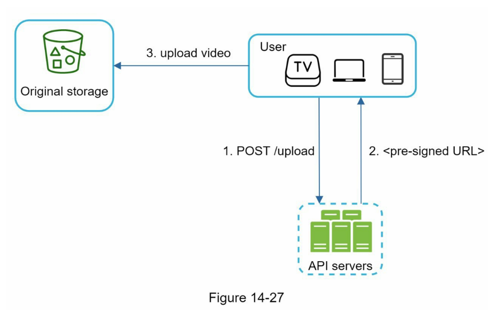

上传的流程更新如下：

1. 客户端向API服务器发出HTTP请求，以获取预签名的URL，从而获得对URL中标识的对象的访问许可。预签名的URL一词是通过上传文件到Amazon S3使用的。其他云服务提供商可能使用不同的名称。例如，微软Azure blob存储支持同样的功能，但称之为 "Shared Access Signature"\[10]。
2. API服务器以预先签署的URL进行响应
3. 一旦客户端收到响应，它就使用预先签署的URL上传视频。

**安全优化：保护你的视频**

许多内容制作者不愿意在网上发布视频，因为他们担心自己的原创视频会被盗。为了保护有版权的视频，我们可以采取以下三种安全方案之一：

1. 数字版权管理（DRM）系统：三个主要的DRM系统是苹果FairPlay、谷歌Widevine和微软PlayReady。
2. AES加密：你可以对视频进行加密并配置一个授权策略。加密的视频在播放时将被解密。这确保了只有授权用户才能观看加密的视频。
3. 视频水印：这是在你的视频上面叠加一个图像，包含你的视频的识别信息。它可以是你的公司标志或公司名称。

#### 成本节约优化

CDN是我们系统的一个重要组成部分。它确保了在全球范围内的快速视频传输。然而，通过粗略计算，我们知道CDN是昂贵的，特别是当数据规模很大时。我们如何才能减少成本？

以前的研究表明，YouTube视频流遵循长尾分布\[11] \[12]。这意味着少数热门视频被频繁访问，但其他许多视频的观众很少或没有。基于这一观察，我们进行了一些优化。

1.  CDN仅面向非常受欢迎的视频服务，其他视频由我们高容量存储视频服务器进行服务。

    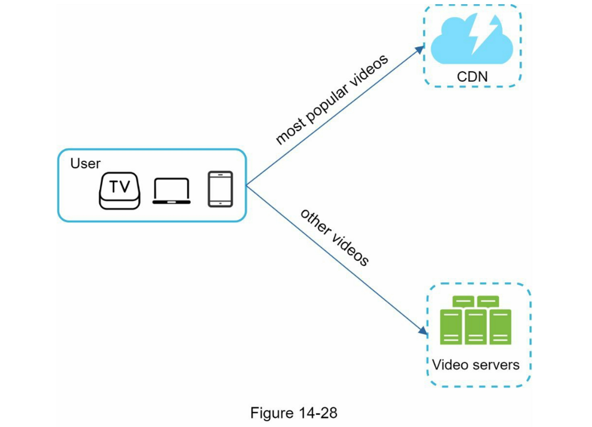
2. 对于不太受欢迎的内容，我们可能不需要存储许多编码的视频版本。短视频可以按需编码。
3. 有些视频只在某些地区流行。没有必要将这些视频分发到其他地区。
4. 像Netflix那样建立你自己的CDN，并与互联网服务提供商（ISP）合作。建立自己的CDN是一个巨大的项目；然而，这对大型流媒体公司来说可能是有意义的。ISP可以是Comcast、AT\&T、Verizon或其他互联网供应商。ISP分布在世界各地，离用户很近。通过与ISP合作，你可以改善观看体验，减少带宽费用。

所有这些优化都是基于内容流行度、用户访问模式、视频大小等。在做任何优化之前，分析历史观看模式是很重要的。这里有一些关于这个主题的有趣文章。\[12] \[13].

#### 错误处理

对于一个大规模的系统，系统错误是不可避免的。为了建立一个高度容错的系统，我们必须优雅地处理错误并快速恢复。存在两种类型的错误：

* 可恢复的错误。对于可恢复的错误，如视频段转码失败，一般的想法是重试几次操作。如果任务继续失败，而且系统认为它不能恢复，它就会向客户返回一个适当的错误代码。
* 不可恢复的错误。对于不可恢复的错误，如畸形的视频格式，系统会停止与视频相关的运行任务，并向客户端返回适当的错误代码。

以下剧本涵盖了每个系统组件的典型错误：

* 上传错误：重试几次。
* 分割视频错误：如果旧版本的客户端不能通过GOP对齐来分割视频，整个视频就会被传递给服务器。分割视频的工作是在服务器端完成的。
* 转码错误：重试。
* 预处理程序错误：重新生成DAG图。
* DAG调度器错误：重新调度一个任务。
* 资源管理器队列宕机：使用副本。
* 任务工作器故障：在新的工作器上重试任务。
* API服务器故障：API服务器是无状态的，所以请求将被引导到不同的API服务器。
* 元数据缓存服务器宕机：数据被多次复制。如果一个节点发生故障，你仍然可以访问其他节点来获取数据。我们可以调出一个新的缓存服务器来取代死去的那个。
* 元数据DB服务器停机：
  * Master停机了：如果主站倒下了，促进其中一个从站作为新的主站。
  * 从属服务器宕机了：如果一个从属服务器宕机，你可以使用另一个从属服务器进行读取，并调出另一个数据库服务器来代替死去的那个。

### 第4步：总结

在这一章中，我们介绍了YouTube等视频流服务的架构设计。如果在面试结束时有多余的时间，这里有几个补充要点。

* 扩展API层：因为API服务器是无状态的，所以很容易横向扩展API层。
* 扩展数据库：你可以谈谈数据库复制和分片。
* 现场直播：它指的是一个视频如何被记录和实时播放的过程。虽然我们的系统不是专门为直播设计的，但直播和非直播有一些相似之处：都需要上传、编码和流媒体。显著的区别是：
  * 实时流媒体有更高的延迟要求，所以可能需要不同的流媒体协议。
  * 实时流媒体对并行性的要求较低，因为小块的数据已经被实时处理。
  * 实时流媒体需要不同的错误处理集。任何花费太多时间的错误处理都是不可接受的。
* 视频下架：对侵犯版权、色情等违法行为的视频进行下架。 有些可以在上传过程中被系统发现，而另一些则可能通过用户标记发现。

恭喜你走到了这一步！现在给自己一个鼓励，干得漂亮！

### 参考资料

* \[1] YouTube by the numbers: [https://www.omnicoreagency.com/youtube-statistics/](https://www.omnicoreagency.com/youtube-statistics/)
* \[2] 2019 YouTube Demographics:[https://blog.hubspot.com/marketing/youtube-demographics](https://blog.hubspot.com/marketing/youtube-demographics)
* \[3] Cloudfront Pricing: [https://aws.amazon.com/cloudfront/pricing/](https://aws.amazon.com/cloudfront/pricing/)
* \[4] Netflix on AWS: [https://aws.amazon.com/solutions/case-studies/netflix/](https://aws.amazon.com/solutions/case-studies/netflix/)
* \[5] Akamai homepage: [https://www.akamai.com/](https://www.akamai.com/)
* \[6] Binary large object: [https://en.wikipedia.org/wiki/Binary\_large\_object](https://en.wikipedia.org/wiki/Binary\_large\_object)
* \[7] Here’s What You Need to Know About Streaming Protocols:
* [https://www.dacast.com/blog/streaming-protocols/](https://www.dacast.com/blog/streaming-protocols/)
* \[8] SVE: Distributed Video Processing at Facebook Scale:[https://www.cs.princeton.edu/\~wlloyd/papers/sve-sosp17.pdf](https://www.cs.princeton.edu/\~wlloyd/papers/sve-sosp17.pdf)
* \[9] Weibo video processing architecture (in Chinese):
* [https://www.upyun.com/opentalk/399.html](https://www.upyun.com/opentalk/399.html)
* \[10] Delegate access with a shared access signature:[https://docs.microsoft.com/en-us/rest/api/storageservices/delegate-access-with-shared-access-](https://docs.microsoft.com/en-us/rest/api/storageservices/delegate-access-with-shared-access-signature)
* \[11] YouTube scalability talk by early YouTube employee: [https://www.youtube.com/watch](https://www.youtube.com/watch?v=w5WVu624fY8)
* \[12] Understanding the characteristics of internet short video sharing: A youtube-based measurement study. [https://arxiv.org/pdf/0707.3670.pdf](https://arxiv.org/pdf/0707.3670.pdf)
* \[13] Content Popularity for Open Connect: [https://netflixtechblog.com/content-popularity-for-open-connect-b86d56f613b](https://netflixtechblog.com/content-popularity-for-open-connect-b86d56f613b)
