<!-- TOC -->
* [第1步：了解问题并确定设计范围](#第1步了解问题并确定设计范围)
* [第2步：提出高层次的设计方案并获得认同](#第2步提出高层次的设计方案并获得认同)
  * [API](#api)
  * [摆脱单一服务器](#摆脱单一服务器)
  * [同步冲突](#同步冲突)
  * [高层设计](#高层设计)
* [第3步：深入设计](#第3步深入设计)
  * [块服务器](#块服务器)
  * [元数据数据库](#元数据数据库)
  * [上传流程](#上传流程)
  * [下载流程](#下载流程)
  * [通知服务](#通知服务)
  * [节省储存空间](#节省储存空间)
  * [故障处理](#故障处理)
* [第4步：总结](#第4步总结)
* [参考资料](#参考资料)
<!-- TOC -->

# 设计 Google Drive

近年来，Google Drive、Dropbox、Microsoft OneDrive、Apple iCloud 等云存储服务非常流行。在本章中，你需要设计 Google Drive。

在开始设计之前，让我们花点时间了解一下 Google Drive。 Google Drive 是一种文件存储和同步服务，可帮助您在云端存储文档、照片、视频和其他文件。您可以从任何计算机、智能手机和平板电脑访问您的文件。你可以轻松地与朋友、家人和同事共享这些文件 [1]。图 15-1 和 15-2 分别显示了 Google Drive 在浏览器和移动应用程序中的样子。

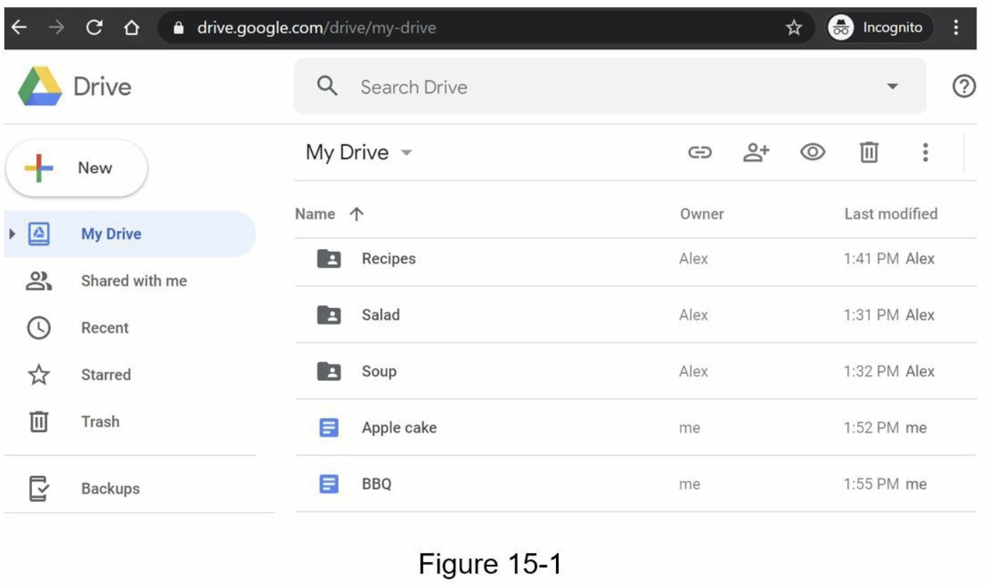

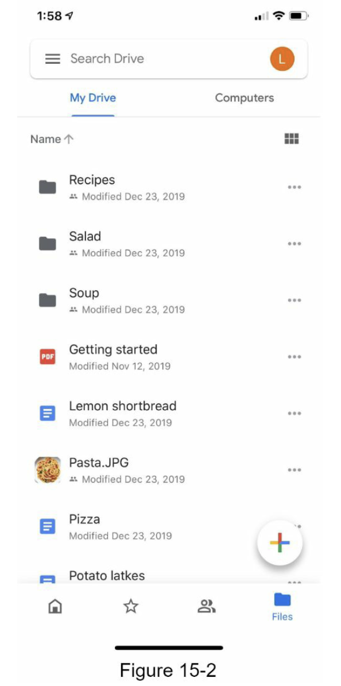

## 第1步：了解问题并确定设计范围

设计 Google Drive 是一项大工程，因此提出问题以缩小范围很重要。

候选人：最重要的特征是什么？

面试官：上传下载文件，文件同步，通知。

候选人：这是一个移动应用程序、一个网络应用程序，还是两者兼而有之？

面试官：都是。

考生：支持的文件格式有哪些？

面试官：任何文件类型。

候选人：文件需要加密吗？

面试官：是的，存储中的文件必须加密。

候选人：文件大小有限制吗？

面试官：是的，文件必须为 10 GB 或更小。

候选人：产品有多少用户？

面试官：10M DAU

在本章中，我们重点关注以下功能：

- 添加文件。添加文件的最简单方法是将文件拖放到 Google Drive 中。
- 下载文件。
- 跨多个设备同步文件。将文件添加到一台设备后，它会自动同步到其他设备。
- 查看文件修订内容。
- 与您的朋友、家人和同事共享文件
- 当文件被编辑、删除或与您共享时发送通知。

本章未讨论的功能包括：

- 可靠性。可靠性对于存储系统来说极其重要，数据丢失是不可接受的。
- 同步速度快。如果文件同步花费太多时间，用户将变得不耐烦并放弃该产品。
- 带宽使用。如果产品占用大量不必要的网络带宽，用户会不高兴，尤其是当他们使用移动数据时。
- 可扩展性。该系统应该能够处理大量的流量。
- 高可用性。当某些服务器离线、速度变慢或出现意外网络错误时，用户应该仍然可以使用该系统。

### 粗略估算

- 假设该应用程序有 5000 万注册用户和 1000 万 DAU。
- 用户获得10 GB 的可用空间。
- 假设用户每天上传2 个文件。平均文件大小为 500 KB。
- 1:1 的读写比。
- 分配的总空间：5000 万 * 10 GB = 500 PB
- 上传 API 的 QPS：1000 万 * 2 次上传/24 小时/3600 秒 = ~ 240
- 峰值 QPS = QPS * 2 = 480
## 第2步：提出高层次的设计方案并获得认同

我们将使用稍微不同的方法，而不是从一开始就展示高级设计图。我们将从简单的事情开始：在单个服务器中构建所有内容。然后，逐步扩大规模以支持数百万用户。通过做这个练习，它会刷新你对书中涵盖的一些重要主题的记忆。

让我们从下面列出的单个服务器设置开始：

- 一个用于上传和下载文件的 Web 服务器。
- 一个数据库，用于跟踪元数据，如用户数据、登录信息、文件信息等。
- 一个存储系统来存储文件。我们分配了1TB的存储空间来存储文件。

我们花了几个小时设置了一个 Apache 网络服务器、一个 MySql 数据库和一个名为 drive/ 的目录作为根目录来存储上传的文件。在 drive/ 目录下，有一个目录列表，称为名称空间。每个命名空间都包含该用户的所有上传文件。服务器上的文件名与原始文件名保持一致。通过加入命名空间和相对路径，可以唯一标识每个文件或文件夹。

图15-3显示了/drive目录在左边的样子和它在右边的扩展视图的一个例子。

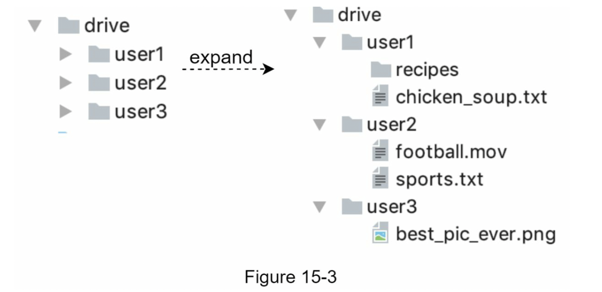

### API

API 是什么样子的？我们主要需要 3 个 API：上传文件、下载文件和获取文件修订。

1. 上传文件到Google Drive

   支持两种类型的上传：

    - 简单上传。当文件较小时使用此上传类型。
    - 可恢复上传。当文件很大并且网络中断的可能性很高时，请使用此上传类型。

   以下是可恢复上传 API 的示例：
   [https://api.example.com/files/upload?uploadType=resumable](https://api.example.com/files/upload?uploadType=resumable)
   
    参数：

    - uploadType=resumable
    - data: 待上传的本地文件

   可恢复上传通过以下 3 个步骤 [2] 实现：

    - 发送初始请求以检索可恢复 URL。
    - 上传数据并监控上传状态。
    - 如果上传受到干扰，请继续上传。
3. 从Google Drive下载文件

   示例 API：[https://api.example.com/files/download](https://api.example.com/files/download)

   参数：

    - path：下载文件路径

   示例参数：

    ```jsx
    {
    "path": "/recipes/soup/best_soup.txt"
    }
    ```

4. 获取文件修订

   示例 API：[https://api.example.com/files/list_revisions](https://api.example.com/files/list_revisions)

   参数：

    - path：要获取修订历史记录的文件的路径
    - 要返回的最大修订数。

   示例参数：

    ```jsx
    {
    "path": "/recipes/soup/best_soup.txt",
    "limit": 20
    }
    ```

   所有 API 都需要用户身份验证并使用 HTTPS。安全套接字层 (SSL) 保护客户端和后端服务器之间的数据传输。

### 摆脱单一服务器

随着更多文件的上传，最终您会收到如图 15-4 所示的空间已满警报。

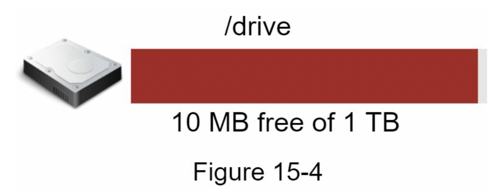

仅剩 10 MB 的存储空间！这是紧急情况，因为用户无法再上传文件。想到的第一个解决方案是将数据分片，因此将其存储在多个存储服务器上。图 15-5 显示了基于 user_id 的分片示例。

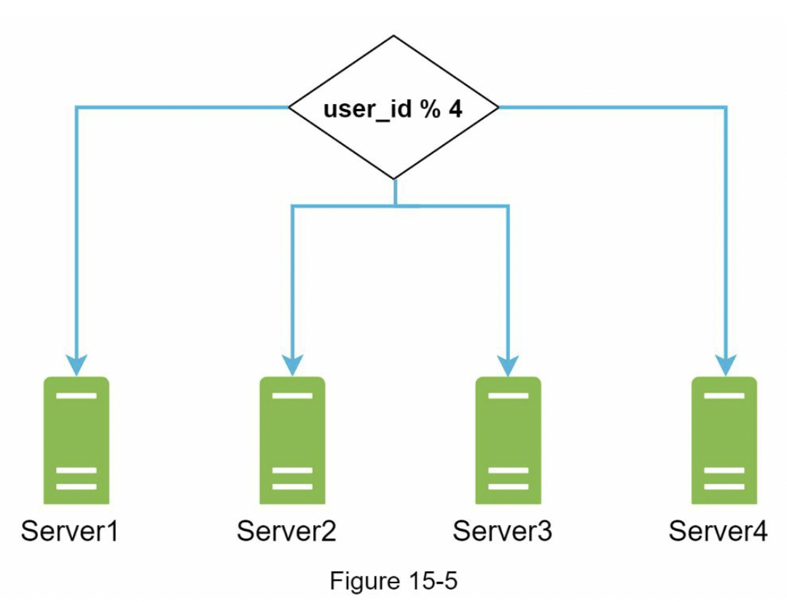

你通宵达旦地设置了数据库分片，并密切监控。一切又顺利地运行了。你已经阻止了火灾的发生，但你仍然担心在存储服务器中断的情况下可能出现的数据损失。你四处打听，你的后台大师朋友弗兰克告诉你，许多领先的公司如Netflix和Airbnb都使用Amazon S3进行存储。"亚马逊简单存储服务（Amazon S3）是一种对象存储服务，提供行业领先的可扩展性、数据可用性、安全性和性能" [3]。你决定做一些研究，看看它是否合适。

大量阅读后，您对 S3 存储系统有了很好的了解，并决定将文件存储在 S3 中。 Amazon S3 支持同区域和跨区域复制。一个地区是指亚马逊网络服务（AWS）拥有数据中心的地理区域。如图15-6所示，数据可以在同区域（左侧）和跨区域（右侧）复制。冗余文件存储在多个区域，以防止数据丢失并确保可用性。存储桶就像文件系统中的文件夹。

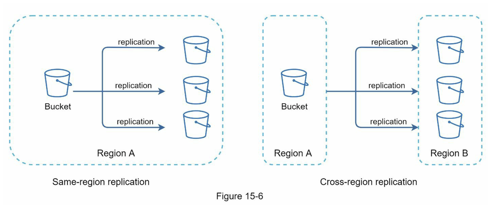

把文件放到S3后，你终于可以睡个好觉了，不用担心数据丢失。为了阻止类似的问题在未来发生，你决定对可以改进的地方做进一步研究。以下是你发现的几个方面：

- 负载均衡器：添加负载均衡器来分配网络流量。负载均衡器确保流量均匀分布，如果 Web 服务器出现故障，它将重新分配流量。
- Web 服务器：添加负载均衡器后，可以根据流量负载轻松添加/删除更多Web 服务器。
- 元数据数据库：将数据库移出服务器以避免单点故障。同时，设置数据复制和分片以满足可用性和可扩展性要求。
- 文件存储：Amazon S3 用于文件存储。为确保可用性和持久性，文件被复制到两个不同的地理区域。

应用上述改进后，您已成功将 Web 服务器、元数据数据库和文件存储从单个服务器中分离出来。更新后的设计如图 15-7 所示。

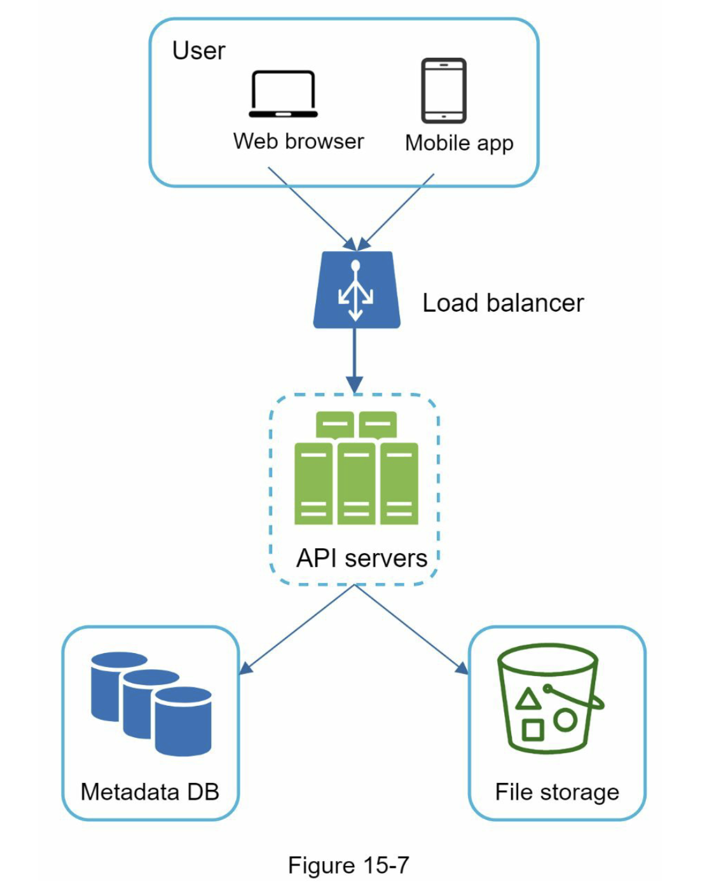

### 同步冲突

  对于像 Google Drive 这样的大型存储系统，同步冲突时有发生。当两个用户同时修改同一个文件或文件夹时，就会发生冲突。我们如何解决冲突？这是我们的策略：先处理的版本获胜，后处理的版本接收冲突。图 15-8 显示了同步冲突的示例。

  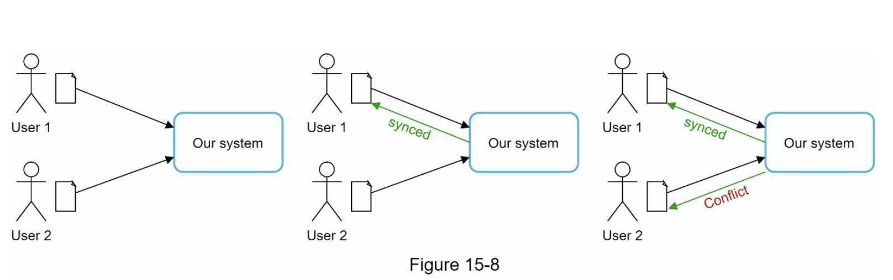

  在图 15-8 中，用户 1 和用户 2 试图同时更新同一个文件，但是用户 1 的文件首先被我们的系统处理。用户 1 的更新操作通过，但用户 2 发生同步冲突。我们如何解决用户 2 的冲突？我们的系统提供同一文件的两个副本：用户 2 的本地副本和来自服务器的最新版本（图 15-9）。用户 2 可以选择合并两个文件或用另一个版本覆盖一个版本。

  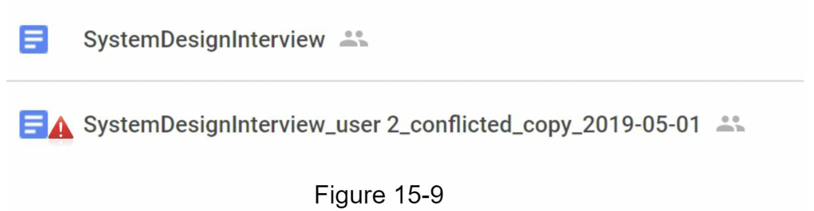

  当多个用户同时编辑同一个文档时，保持文档同步是一项挑战。有兴趣的读者可以参考参考资料[4] [5]。

### 高层设计

  图 15-10 说明了建议的高级设计。让我们检查系统的每个组件。

  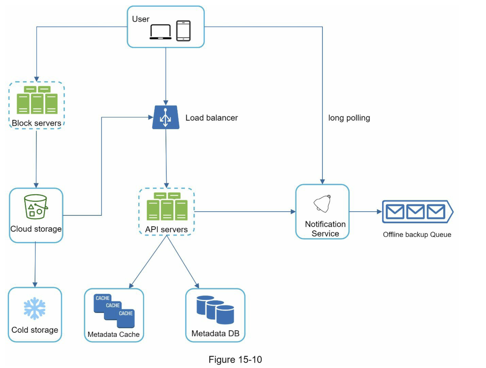

  **User**：用户通过浏览器或移动应用程序使用该应用程序。

  **Block servers**：块服务器将块上传到云存储。块存储，简称块级存储，是一种在基于云的环境中存储数据文件的技术。一个文件可以分成几个块，每个块都有一个唯一的哈希值，存储在我们的元数据数据库中。每个块都被视为一个独立的对象并存储在我们的存储系统 (S3) 中。为了重建文件，块以特定顺序连接。至于块大小，我们参考了Dropbox：它把一个块的最大大小设置为4MB [6]。

  **Cloud storage**：文件被分割成更小的块并存储在云存储中。

  **Cold storage**：冷存储是一种为存储非活动数据而设计的计算机系统，意味着文件在很长一段时间内不会被访问。

  **Load balancer**：负载均衡器在 API 服务器之间平均分配请求。

  **API servers**：这些服务器负责除上传流程以外的几乎所有工作。API服务器用于用户认证、管理用户资料、更新文件元数据等。

  **Metadata database**：它存储用户、文件、块、版本等元数据。请注意，文件存储在云端，元数据数据库仅包含元数据。

  **Metadata cache**：一些元数据被缓存以便快速检索。

  **Notification service**：它是一个发布者/订阅者系统，允许在某些事件发生时将数据从通知服务传输到客户端。在我们的具体案例中，通知服务会在其他地方添加/编辑/删除文件时通知相关客户，以便他们可以提取最新的更改。

  **Offline backup queue**：如果客户端离线并且无法拉取最新的文件更改，离线备份队列会存储信息，以便在客户端在线时同步更改。我们已经在高层讨论了 Google Drive 的设计。有些组件很复杂，值得仔细检查；我们将在深入讨论中详细讨论这些。

## 第3步：深入设计

在本节中，我们将仔细研究以下内容：块服务器、元数据数据库、上传流程、下载流程、通知服务、节省存储空间和故障处理。

### 块服务器

对于定期更新的大文件，在每次更新时发送整个文件会消耗大量带宽。提出了两种优化来最小化传输的网络流量：

- 增量同步。修改文件时，使用同步算法 [7] [8] 仅同步修改的块而不是整个文件。
- 压缩。对块进行压缩可以显著减少数据大小。因此，根据文件类型，使用压缩算法对块进行压缩。例如，gzip和bzip2是用来压缩文本文件的。压缩图像和视频则需要不同的压缩算法。

在我们的系统中，块服务器负责上传文件的繁重工作。块服务器通过将文件分成块、压缩每个块并加密它们来处理从客户端传递的文件。不是将整个文件上传到存储系统，而是只传输修改过的块。

图 15-11 显示了添加新文件时块服务器的工作方式。

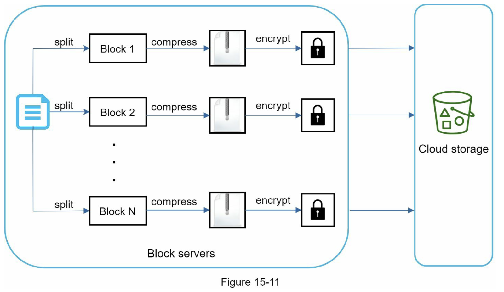

- 一个文件被分割成更小的块。
- 每个块都使用压缩算法进行压缩。
- 为了确保安全，每个块在发送到云存储之前都经过加密。
- 块被上传到云存储。

图 15-12 说明了增量同步，这意味着只有修改过的块才会传输到云存储。突出显示的块“块 2”和“块 5”表示已更改的块。使用增量同步，只有这两个块被上传到云存储。

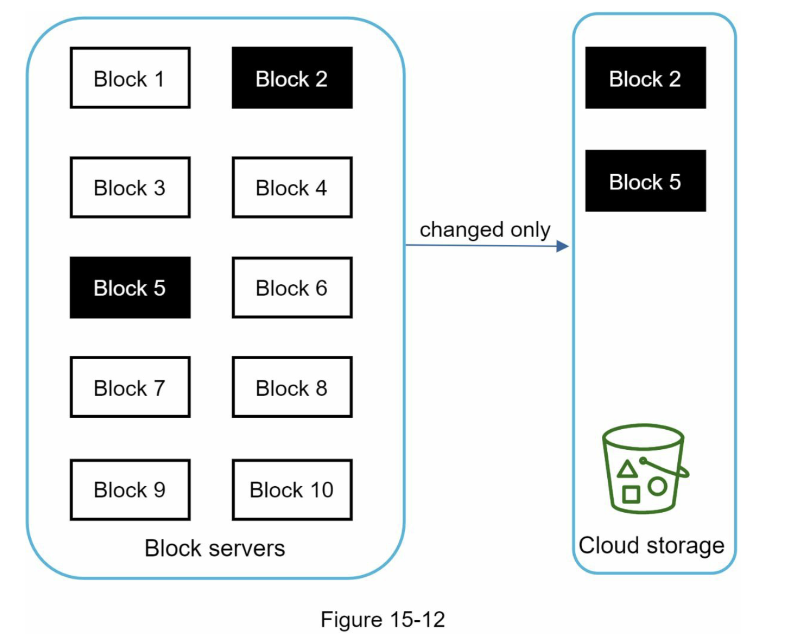

块服务器允许我们通过提供增量同步和压缩来节省网络流量。

#### 高一致性要求

我们的系统默认要求强一致性。一个文件同时被不同的客户端显示不同是不可接受的。系统需要为元数据缓存和数据库层提供强一致性。

内存缓存默认采用最终一致性模型，这意味着不同的副本可能有不同的数据。要实现强一致性，我们必须确保以下几点：

- 缓存副本和主服务器中的数据是一致的。
- 在数据库写入时使缓存无效，以确保缓存和数据库保持相同的值。

在关系数据库中实现强一致性很容易，因为它维护了 ACID（原子性、一致性、隔离性、持久性）属性 [9]。但是，NoSQL 数据库默认不支持 ACID 属性。 ACID 属性必须以编程方式合并到同步逻辑中。在我们的设计中，我们选择关系数据库，因为 ACID 是原生支持的。

### 元数据数据库

图 15-13 显示了数据库模式设计。请注意这是一个高度简化的版本，因为它只包含最重要的表和有趣的字段。

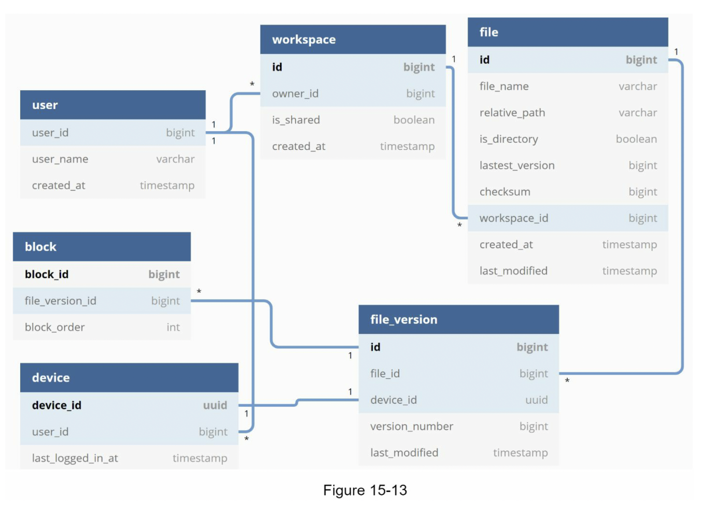

**User**：用户表包含有关用户的基本信息，例如用户名、电子邮件、个人资料照片等。

**Device**：设备表存储设备信息。 Push_id 用于发送和接收移动推送通知。请注意，一个用户可以拥有多个设备。

**Namespace**：命名空间是用户的根目录。

**File**：文件表存储与最新文件相关的所有内容。

**File_version**：它存储文件的版本历史。现有行是只读的，以保持文件修订历史的完整性。

**Block**：它存储与文件块相关的所有内容。任何版本的文件都可以通过以正确的顺序连接所有块来重建。

### 上传流程

让我们讨论一下客户端上传文件时会发生什么。为了更好地理解流程，我们绘制了如图 15-14 所示的时序图。

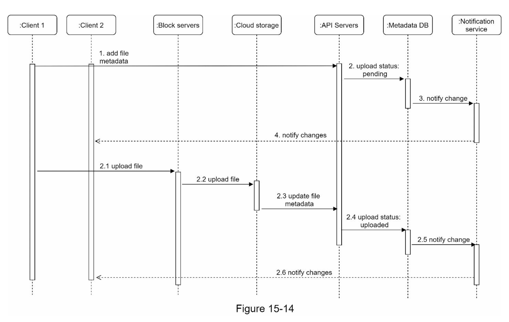

在图 15-14 中，并行发送了两个请求：添加文件元数据和将文件上传到云存储。两个请求都来自客户端 1。

- 添加文件元数据
    1. 客户端1发送了一个请求，要求添加新文件的元数据。
    2. 将新的文件元数据存储在元数据数据库中，并将文件上传状态改为 "pending"。
    3. 通知通知服务正在添加一个新的文件。
    4. 通知服务通知相关客户端（客户端2）有文件正在上传
- 上传文件到云存储
    1. 客户端 1 将文件内容上传到块服务器。
    2. 块服务器将文件分块成块，压缩，加密块，并将它们上传到云存储。
    3. 文件上传完成后，云存储触发上传完成回调。请求被发送到 API 服务器。
    4. 在Metadata DB 中，文件状态改为 "uploaded"。
    5. 通知通知服务文件状态更改为“uploaded”。
    6. 通知服务通知相关客户端（客户端2）文件已完全上传。

编辑文件时，流程类似，不再赘述。

### 下载流程

当一个文件在其他地方被添加或编辑时，会触发下载流。客户端如何知道一个文件是由另一个客户端添加或编辑的？客户端有两种方法可以知道：

- 如果客户端 A 在线，而另一个客户端更改了文件，通知服务将通知客户端 A 某处发生了更改，因此需要拉取最新数据。
- 如果客户端A在文件被另一个客户端修改时处于离线状态，数据将被保存到缓存中。当脱机的客户端再次上线时，它就会拉出最新的变化

一旦客户端知道一个文件被改变，它首先通过API服务器请求元数据，然后下载块来构建文件。图15-15显示了详细的流程。注意，由于空间的限制，图中只显示了最重要的部分。

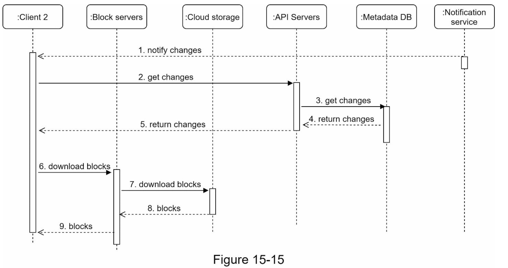

1. 通知服务通知客户端某个文件在其他地方发生了更改。
2. 一旦客户端 2 知道有新的更新可用，它就会发送一个获取元数据的请求。
3. API 服务器调用元数据数据库来获取更改的元数据。
4. 元数据返回给API服务器。
5. 客户端 2 获取元数据。
6. 一旦客户端收到元数据，它就会向块服务器发送请求以下载块。
7. 区块服务器首先从云存储中下载区块。
8. 云存储返回块给块服务器。
9. 客户端2下载所有新块重建文件

### 通知服务

为了保持文件的一致性，本地执行的任何文件变更都需要通知其他客户端以减少冲突。通知服务就是为这个目的而构建的。在高层设计中，通知服务允许在事件发生时将数据传输到客户端。这里有几个选项：

- 长轮询。 Dropbox 使用长轮询 [10]
- WebSocket。 WebSocket 在客户端和服务器之间提供持久连接。沟通是双向的。

尽管这两种选择都很好，但出于以下两个原因，我们选择了长轮询：

- 通知服务的通信不是双向的。服务器向客户端发送有关文件更改的信息，反之亦然。
- WebSocket 适用于实时双向通信，例如聊天应用程序。对于 Google 云端硬盘，通知发送不频繁，没有突发数据。

使用长轮询，每个客户端都会建立到通知服务的长轮询连接。如果检测到对文件的更改，客户端将关闭长轮询连接。关闭连接意味着客户端必须连接到元数据服务器才能下载最新的更改。收到响应或达到连接超时后，客户端立即发送新请求以保持连接打开。

### 节省储存空间

为了支持文件版本历史并确保可靠性，同一文件的多个版本被存储在多个数据中心。如果频繁地备份所有文件的修订版，存储空间就会很快被填满。提出了三种技术来减少存储成本：

- 去除重复的数据块。在账户层面消除多余的块是节省空间的一个简单方法。如果两个块有相同的哈希值，那么它们就是相同的。
- 采用智能数据备份策略。可以应用两种优化策略：
    - 设置限制：我们可以为要存储的版本数量设置限制。如果达到限制，最旧的版本将被新版本替换。
    - 只保留有价值的版本。有些文件可能会被频繁地编辑。例如，为一个大量修改的文件保存每个编辑过的版本可能意味着该文件在短时间内被保存1000多次。为了避免不必要的复制，我们可以限制保存版本的数量。我们对最近的版本给予更多的权重。实验有助于找出保存的最佳版本数
- 将不常用的数据移动到冷存储。冷数据是数月或数年未活跃的数据。像 Amazon S3 冰川 [11] 这样的冷存储比 S3 便宜得多。
### 故障处理

在一个大规模的系统中可能会出现故障，我们必须采取设计策略来解决这些故障。你的面试官可能有兴趣听听你是如何处理以下系统故障的：

- 负载均衡器故障：如果负载均衡器出现故障，辅助节点将变为活动状态并接收流量。负载均衡器通常使用心跳相互监控，心跳是负载均衡器之间发送的周期性信号。如果负载均衡器在一段时间内没有发送心跳，则认为它失败了。
- 块服务器故障：如果块服务器发生故障，其他服务器将接管未完成或挂起的作业。
- 云存储故障：S3 bucket在不同地域多次复制。如果文件在一个区域不可用，可以从不同区域获取它们。
- API服务器故障：是无状态服务。如果 API 服务器发生故障，流量将通过负载均衡器重定向到其他 API 服务器。
- 元数据缓存故障：元数据缓存服务器被多次复制。如果一个节点宕机，您仍然可以访问其他节点以获取数据。我们将启动一个新的缓存服务器来替换发生故障的服务器。
- 元数据数据库故障
    - Master down：如果master宕机，提升其中一个slave充当新的master，并拉起一个新的slave节点。
    - Slave down：如果一个slave down了，可以用另一个slave进行读操作，带上另一台数据库服务器来代替失效的。
- 通知服务失败：每个在线用户与通知服务器保持一个长轮询连接。因此，每个通知服务器都与许多用户相连。根据 2012 年的 Dropbox 谈话 [6]，每台机器打开超过 100 万个连接。如果服务器出现故障，所有长轮询连接都会丢失，因此客户端必须重新连接到不同的服务器。即使一台服务器可以保持许多打开的连接，它也无法立即重新连接所有丢失的连接。重新连接所有丢失的客户端是一个相对缓慢的过程。
- 离线备份队列故障：队列被多次复制。如果一个队列发生故障，该队列的消费者可能需要重新订阅备用队列。

## 第4步：总结

在本章中，我们提出了一个支持 Google Drive 的系统设计。强一致性、低网络带宽和快速同步的结合使设计变得有趣。我们的设计包含两个流程：管理文件元数据和文件同步。通知服务是系统的另一个重要组成部分。它使用长轮询来使客户端保持最新的文件更改。

像任何系统设计面试问题一样，没有完美的解决方案。每个公司都有其独特的限制，你必须设计一个系统来适应这些限制。了解你的设计和技术选择的权衡是很重要的。如果还有几分钟的时间，你可以谈谈不同的设计选择。

例如，我们可以从客户端直接向云存储上传文件，而不是通过块服务器。这种方法的优点是，它使文件的上传速度更快，因为文件只需要传输一次到云存储中。在我们的设计中，一个文件首先被传输到块服务器，然后再传输到云存储。然而，这种新方法也有一些缺点：

- 首先，同样的分块、压缩和加密逻辑必须在不同的平台（iOS、Android、Web）上实现。这是很容易出错的，需要大量的工程努力。在我们的设计中，所有这些逻辑都在一个集中的地方实现：块服务器。
- 其次，由于客户端很容易被黑客攻击或操纵，在客户端实现加密逻辑并不理想。

该系统的另一个有趣的演变是将在线/离线逻辑转移到一个单独的服务中。让我们称之为存在服务。通过将在线服务从通知服务器中移出，在线/离线功能可以很容易地被其他服务集成。

恭喜你走到这一步！现在拍拍自己的背。做得好！

## 参考资料

  [1] Google Drive: https://www.google.com/drive/

  [2] Upload file data: https://developers.google.com/drive/api/v2/manage-uploads

  [3] Amazon S3: https://aws.amazon.com/s3

  [4] Differential Synchronization https://neil.fraser.name/writing/sync/

  [5] Differential Synchronization youtube talk https://www.youtube.com/watch?v=S2Hp_1jqpY8

  [6] How We’ve Scaled Dropbox: https://youtu.be/PE4gwstWhmc

  [7] Tridgell, A., & Mackerras, P. (1996). The rsync algorithm.

  [8] Librsync. (n.d.). Retrieved April 18, 2015, from https://github.com/librsync/librsync

  [9] ACID: https://en.wikipedia.org/wiki/ACID

  [10] Dropbox security white paper:

  https://www.dropbox.com/static/business/resources/Security_Whitepaper.pdf

  [11] Amazon S3 Glacier: https://aws.amazon.com/glacier/faqs/