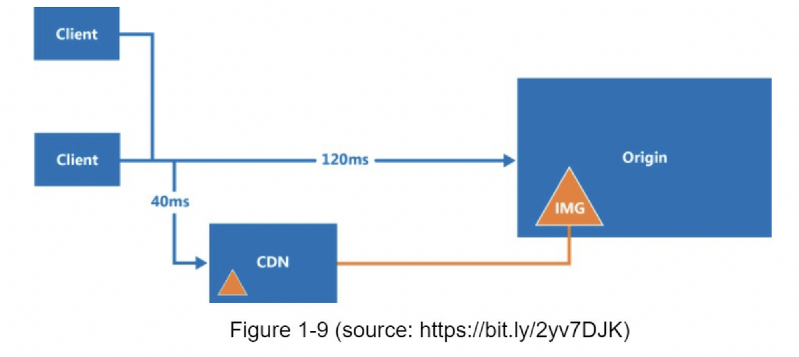

<!-- TOC -->
  * [单服务器设置](#单服务器设置)
  * [数据库](#数据库)
    * [垂直扩展 vs 水平扩展](#垂直扩展 vs 水平扩展)
  * [负载均衡](#负载均衡)
  * [数据库复制](#数据库复制)
  * [缓存](#缓存)
    * [缓存层](#缓存层)
    * [使用缓存的注意事项](#使用缓存的注意事项)
  * [CDN](#cdn)
    * [使用CDN的注意事项](#使用CDN的注意事项)
  * [无状态web层](#无状态web层)
    * [有状态的架构](#有状态的架构)
    * [无状态的架构](#无状态的架构)
  * [数据中心](#数据中心)
  * [消息队列](#消息队列)
  * [日志记录、指标、自动化](#日志记录、指标、自动化)
    * [添加消息队列和不同的工具](#添加消息队列和不同的工具)
  * [数据库扩展](#数据库扩展)
    * [垂直扩展](#垂直扩展)
    * [水平扩展](#水平扩展)
  * [百万用户及以上](#百万用户及以上)
  * [参考资料](#参考资料)
<!-- TOC -->

## 单服务器设置

  千里之行始于足下，构建一个复杂的系统也是一样的。首先，一切都在一台服务器上面运行。图1-1显示了单个服务器设置的图示，其中所有的内容都在一个服务器上运行：web app, database, cache, 等待。

  

  为了理解这些设置，研究请求流和流量源是很有帮助的，让我们先看下请求流（图1-2）

  

1. 用户用过域名访问网站，例如：[api.mysite.com](http://api.mysite.com/)，通常，域名系统（DNS）是由第三方提供的付费服务，并不是我们自己的服务器托管。
2. IP地址返回到浏览器或手机APP，在这个例子中，IP地址返回的是：15.125.23.214
3. 一旦获得IP地址，超文本传输协议（Http）请求直接发送到你的web服务。
4. web服务返回HTML页面，或响应JSON数据以进行展示。

  下一步，让我们检查一下流量源，web服务器的流量来着两个源：web应用程序和移动应用程序
- web应用程序：它使用服务器语言（Python、Java等）的组合方式来处理业务逻辑、存储等以及客户端语言（HTML、JavaScript）来进行演示。
- 移动应用程序：HTTP协议是移动应用程序和web服务器之间的通信协议，JSON是常用的API响应格式数据，因为其足够简单，
## 数据库

  随着用户技术的增长，一台服务是不够的。我们需要多台服务器：一台用于web/mobile流量，另一台用户数据库（图 1-3）。分隔开web/mobile流量（web层）和数据库（数据层）服务器允许它们独立扩展。

  

- **使用什么数据库？**

  你可以在传统关系型数据库和非关系型数据库之间选择，让我们来调查下它们有什么不同。

  关系型数据库也称为关系数据库管理管理系统（RDBMS）或SQL数据库。最流行的有：MySQL，Oracle数据库，PostgreSQL等。关系数据库在表和行中表示和存储数据，你可以使用SQL跨不同的数据库表来执行连接操作。

  非关系型数据库称为NoSQL数据库，最流行的有：CouchDB，Neo4j，Cassandra, HBase, Amazon DynamoDB 等。这些数据库分为四类：键值存储，图形存储，列存储和文档存储。非关系型数据库通常不支持join操作。

  对于大多数开发者而言，关系型数据库是最好的选择，因为它们已经存在超过了40年，而且它们工作的很好。然而，如果关系型数据库不能满足你特殊用例，则关键是探索关系型数据库之外的内容。

  在以下情况，非关系型数据库可能是正确的选择：

    - 你的应用程序需要超低延迟
    - 你的数据是非结构化的，或者没有任何关系数据
    - 你只需要序列号和反序列化数据（SON, XML, YAML等）
    - 你需要存储大量数据
### 垂直扩展 vs 水平扩展

  垂直扩展，又称为“向上扩展”，是指为你的服务器增加更大的功率（CPU、RAM等）的过程。

  水平扩展，又称为“横向扩展”，是指允许你向资源池中添加更多的服务器来进行扩展。

  当流量降低时，垂直扩展是一个很好的选择，简单是其主要优势。不幸的是，它有严重的局限性

- 垂直扩展有一个硬性限制，不可能为单个服务器无限制的添加CPU和内存
- 垂直扩展没有故障转移和冗余，如果一台服务出现宕机，网站和应用程序都会彻底奔溃。

  由于垂直扩展的局限性，水平扩展对于大规模应用更为理想。

  在以前的设计中，用户直接连接到web服务器，如果服务器下线，用户将不能访问网站。在另一种情况下，如果许多用户同时访问web服务器，并且它达到了web服务器的限制，则用户通常会遇到响应较慢或者无法连接到服务器的情况。

  负载均衡是解决这些问题的最佳技术方案。

## 负载均衡

  负载均衡平均的分发进入web服务器的流量，图1-4显示了负载均衡是如何工作的

  

  如图1-4显示，用户直接连接负载均衡的公网IP。通过此配置，客户端不再直接访问web服务器，为了更好的安全，私有IP用于服务之间的通信。私有IP是仅在相同网络的服务器之间可访问的IP地址。然而，它无法通过互联网访问。负载均衡通过专有IP于web服务器进行通信。

  在图1-4中，在添加了一个负载均衡和第二个web服务器后，我们成功的解决了没有故障转移问题并提高了web层的可用性。

  详细解释如下：

- 如果服务1下线，所有的流量会被路由到服务2。这可以防止网站离线，我们还将向服务器池中添加一个新的健康的服务器以平衡负载。
- 如果网站流量快速增加，并且两台服务器不足以处理流量，那么负载均衡可以很好的处理这个问题，你只需要向web服务器池中添加更多的服务器，负载均衡会自动发送请求给他们。

  现在，web层看起来不错，那数据层呢？当前设计具有一个数据库，所以它不能支持故障转移和冗余。数据库复制是解决只写问题的常用技术，让我们来看看吧。

## 数据库复制

  引用自维基百科：“数据库复制可适用于许多数据库管理系统，通常在原始(master)和副本(slaves)之间伴随着主/从关系”。

  主数据库通常仅支持写的操作。从数据库从主数据库中复制数据并且仅支持读操作。所有数据修改命令，如：insert，delete，update 都必须发送到主数据库。

  大多数应用程序需要更高的读写比率，因此，系统中从库的数量通常大于主库的数量。

  图1-5展示了一个主库和多个从库。

  

  数据库复制的优点：

- 更好的性能：在这个主/从模型中，所有的写入和更新都发生在主节点，而所有的读操作分布在从节点。该模型提高了性能，因为它允许并行处理更多的查询。
- 可靠性：如果你的其中一台数据库被台风、地震等自然灾害破坏，数据仍然会被保存。你无需担心数据丢失，因为数据已跨多个位置进行复制。
- 高可用性：通过跨不同位置复制数据，即使一台数据库离线，你的网站仍在运行，因为你可以访问存储在另一台数据库服务器中的数据。

在上一节中，我们讨论了负载均衡是如何帮组提高系统可用性的。在这里我们问相同的问题：如果其中一台数据库离线了怎么办？图1-5中讨论的架构设计可以处理这种情况：

- 如果只有一台从数据库并且它离线了，读操作会被临时转发到主数据库。一旦发现问题，一个新的从库将会替换掉旧的从库，如果有多个从数据库是可用的，读操作会被转发到其他健康的从数据库，
- 如果主库离线了，一个从库会被提升为新的主库，所有的数据库操作都会临时在新的主库上执行。一个新的从库将会立即替换旧的从库进行数据复制。在生产系统中，提升一个新的主库上更复杂的，因为从库中的数据可能不是最新的，丢失的数据需要通过运行数据恢复脚本来更新。尽管一些其他的复制方法比如多主和循环复制可能有所帮助，但他们的配置更加复杂；这些讨论将超出本书的讨论范围，感兴趣的读者可以参考列出的参考资料。

图1-6展示了添加负载均衡和数据库复制后的系统设计。

让我们来看一下这个设计：

- 用户从DNS获取负载均衡的IP地址
- 用户通过获得的IP地址链接负载均衡
- HTTP请求被路由到Server1或Server2
- Web服务器从从库中获取用户数据
- Web服务器将任意的数据修改操作路由到主库，这包括写入，更新和删除操作。

  现在，你对web层和数据库层已经有了一个深刻的理解，是时候提升负载和响应时间了。这可以通过添加缓存层并将静态内容(JavaScript/CSS/图像/视频文件)转发到内容分发网络(CDN)来完成。

##  缓存

  缓存上一个临时存储区域，用于将昂贵的响应结果或频繁的访问数据存储在内存中，以便之后的请求能被更快的处理。如图所示1-6中，每次加载一个新的网页时，都会执行一个或多个数据库查询以获取数据。重复调用数据库会极大地影响应用的性能，缓存可以缓解此问题。

  ### 缓存层

  缓存层是一个临时数据缓存层，比数据库更快。拥有单独的缓存层的好处，包括更好的系统性能、减少数据库工作负载的能力以及独立扩展缓存层的能力。图1-7展示了缓存服务器的可能设置：

  

  收到请求后，web服务器首先检查缓存中是否有可用的响应。如果有，它将数据发回给客户端。如果没有，它请求数据库，保存响应结果到缓存中，并将结果发送给客户端。这种缓存策略称为读缓存。之前的一项研究解释了不同的缓存策略是如何工作的。

  与缓存服务器交互很简单，因为大多数缓存服务器都提供了通用变成语言的API。以下代码显示了典型的Memcached API：

  

### 使用缓存的注意事项

这里有一些使用缓存系统的注意事项：

- 决定何时缓存：当数据频繁读取但不经常修改时，请考虑使用缓存。由于缓存数据存储在易失的内存中，所以缓存服务器不适合持久化数据。例如，如果缓存服务器重启了，内从中所有的数据都会丢失，因此，重要的数据应该保存在持久数据存储中。
- 过期政策：实施过期政策时一个很好的做法，一旦缓存数据过期，它就会从缓存中删除。当没有过期策略时，缓存数据将被永久的保存在内存中。建议不要将过期时间设置的太短，因为这会导致系统过于频繁地从数据库从新加载数据。于此同时，建议不要将过期时间设置的太长，因为数据可能会过时。
- 一致性：这涉及保持数据存储和缓存同步。可能会发生不一致，因为对数据存储和缓存的修改操作不在一个事物中。在跨多个区域扩展时，保持数据存储和缓存之间的一致性具有挑战性。有关更多信息，请参阅Facebook发布的“Scaling Memcache at Facebook”论文。
- 减少故障：单个缓存服务器存在潜在的单点故障(SPOF)，在维基百科中定义如下：“单点故障是系统的一部分，如果它发生故障，将使整个系统停止工作。”。因此，建议跨不同数据中心使用多个缓存服务器以避免单点故障(SPOF)

  

- 驱逐策略：一旦缓存满了，把数据添加到缓存的任何请求都可能导致已有缓存数据被删除，这称为缓存逐出。最近最少使用(LRU)是最受欢迎的逐出策略。可以使用其他逐出策略，例如：最不常用(LFU)或先进先出(FIFO)，以满足不同的使用场景。
## CDN

CDN是一个由地理上分散的服务器组成的网络，用于传送静态内容。CDN服务器缓存静态内容，如：图片、视频、CSS、JavaScript文件等。

动态内容缓存是一个相对较新的概念，超出了本书的范围。它支持缓存基于请求路径、查询字符串、cookie、和请求头的HTML页面。有关更多信息，请参阅参考资料[9]中提到的文章，本书重点介绍如何使用CDN缓存静态内容。

以下是CDN在高层的工作原理：当用户访问一个网站时，离用户最近的CDN服务器将提供静态内容。直观的说，来着CDN服务的用户越多，网站加载速度就越慢。例如，如果CDN服务器在旧金山，那么洛杉矶的用户将比欧洲的用户更快的获取内容。图1-9是一个很好的例子，展示了CDN如何缩减加载时间。

图1-10演示了CDN工作流程

1. 用户A尝试通过图片URL获取image.png。这个URL的域名是由CDN提供商提供，以下两个图像URL是用于演示URL在Amazon和Akamai CDN上的示例：
    - https://mysite.cloudfront.net/logo.jpg
    - https://mysite.akamai.com/image-manager/img/logo.jpg
2. 如果CDN服务器缓存中没有这个图片image.png，CDN服务器将从源请求文件，源可以上web服务器或在线存储，如Amazon S3。
3. 源返回image.png给CDN服务器，其中包括可选的HTTP头 过期时间(TTL)，它表示图像的缓存时间。
4. CDN缓存图片并将其返回给用户A。在TTL过期之前，图像一直被缓存在CDN中。
5. 用户B发送一个请求获取相同的图片
6. 只要TTL未过期，图像就会从缓存中返回。

### 使用CDN的注意事项

- 成本：CDN上由第三方提供运营，你需要为进出CDN的数据传输付费，缓存不经常使用的资产没有明显优势，因此应该考虑将他们移除CDN。
- 设置适当的缓存过期时间：对于时间敏感的内容，设置缓存过期时间上很重要的，缓存过期时间不能太长也不能太短。如果太长，内容可能不再新鲜，如果太短，可能会导致内容从源服务器重复重新加载到CDN中。
- CDN回退：你应该考虑你的网站/应用程序如何应对CDN故障，如果出现临时CDN中断，客客户端应该能够检测到问题并从源请求资源。
- 使文件无效：在缓存过期之前，你可以从CDN中删除文件，通过执行以下操作：
    - 通过CDN服务商提供的API使CDN对象失效
    - 使用对象版本控制来提供不同版本的对象。对对象进行版本控制，可以向URL中添加参数例如版本号，例如：version 2 被添加到了查询字符串中：image.png?v=2

添加CDN和缓存后的设计如图1-11 所示

1. web服务器不再提供静态资产(JS、CSS、图像等)，它们是从CDN获取的以获得更好的性能。
2. 通过缓存减轻了数据库的负载
## 无状态web层

  现在是时候考虑水平扩展web层了，为此，我们需要将状态(例如用户会话数据)移除web层。一个好的做法是将会话数据存储在持久性存储中，比如关系型数据库或NoSQL。集群中的每个web服务器都可以从数据库访问状态数据，这称为无状态web层。

  ### 有状态的架构

  有状态服务和无状态服务有一些关键区别。有状态服务会记住从一个请求到下一个请求的客户端数据(状态)。无状态服务不会保留任何状态信息。

  图1-12显示了有状态架构的示例。

  

  在图1-12 中，用户A的会话数据和头像数据存储在Server1中，要对用户A进行身份验证，必须将HTTP请求路由到Server1，如果将请求路由到其他服务器，则身份验证会失败，以为Server2不包含用户A的会话数据。同样，用户B的所有Http请求都必须路由到Server2，来自用户C的所有Http请求都必须被发送到Server3。

  问题是，来自同一个客户端的每个请求都必须被路由到同一个服务。这可以通过发多数负载均衡中的粘性会话来实现；然而，这会增加开销，使用这种方法增加或删除服务器要困难得多，处理服务器故障也是一个挑战。

  ### 无状态的架构

  无状态架构如图1-13所示

  

  在无状态架构中，来自用户的所有请求会被发送至任意的web服务器，并从共享的数据存储中获取状态数据。状态数据存储在共享的数据存储中，并不再web服务器中，一个无状态的系统更简单、更健壮且可扩展。

  图1-14显示了更新无状态web层的设计

  

  在图1-14中，我们从web层移除了会话数据并且将它们存储在了持久性的数据存储中。共享的数据存储可以是关系型数据库，Memcached/Redis, NoSQL等。选择NoSQL数据存储是因为它易于扩展。自动扩展说指根据流量负载自动添加或删除web服务器。从web服务器中删除状态数据后，可以根据流量负载添加或删除服务器，从而轻松实现web层的自动缩放。

  你的网站发展迅速，吸引了大量国际用户，为了提高可用性并在更广泛的地理区域提供更好的用户体验，支持多个数据中心至关重要。

## 数据中心

  图1-15显示了具有两个数据中心的示例设置。在正常操作中，用户通过geoDNS路由(也称为地址路由)到最近的数据中心，美国东部的流量为%，美国西部的流量为(100-x)%。geoDNS是一种DNS服务，允许根据用户的位置将域名解析为IP地址。

  

  在发生任何重大数据中心中断的情况下，我们将所有的流量引导至健康的数据中心。图1-16中，数据中心2(美西)离线，100%的流量路由到数据中心1(美东)

  

  要实现多数据中心配置，必须要解决几个技术难题：

- 流量重定向：需要有效的工具将流量重定向到正确的数据中心。geoDNS可以根据用户位置将流量引导至用户最近的数据中心。
- 数据同步：来自不同地区的用户可以使用不同的本地数据库或缓存，在故障切换的情况下，流量可能被路由到不可用的数据中心。一种常见的策略是跨多个数据中心复制数据。先前的研究显示了Netflix如何实现异步多数据中心复制[11]
- 测试和部署：对于多数据中心设置，在不同位置测试网站/应用程序非常重要，自动化部署工具对于保持所有数据中心的服务一致至关重要。

  为了更进一步扩展我们的系统，我们需要解耦系统的不同组件，以便他们可以独立扩展。消息队列是许多真实世界分布式系统用来解决这个问题的关键策略。

## 消息队列

  消息队列说一个持久的组件，存储在内存中，支持异步通信，它充当缓冲区并分发异步请求。消息队列的基础架构非常简单，输入服务，被称为生产者/发布者，创建消息，并将它们发送到消息队列中。其他服务或服务器，称为消费者/订阅者，连接到队列，并执行消息定义的动作。

  模型如图1-17所示

  

  节藕使消息队列成为构建可伸缩且可靠的应用程序的首选架构。使用消息队列，生产者可以在消费者无法处理消息时将消息发布到队列中。即使生产者不可用，消费者也可以从队列中获取数据。

  考虑下面的用例：你的应用程序支持照片自定义，包括剪裁、锐化、模糊等。这些定制任务需要一些时间才能完成。在图1-18中，web servers将照片处理任务发布到消息队列中。照片处理工作者从消息队列中获取作业并异步执行照片定制任务。生产者和消费者可以独立扩展，当队列的大小变得很大时，添加更多的工作者以减少处理时间。但是，如果大部分时间队列说空的，则可以减少worker的数量。

  

## 日志记录、指标、自动化

  当使用在几台服务器上运行的小型网站时，日志记录、指标、和自动化支持时很好的选择，但并不是必须的。但是，现在你的网站已经发展成为大型企业服务，那么投资这些工具是必不可少的。

  日志记录：监视错误日志很重要，因为它有助于识别系统中的错误和问题。你可以在每个服务器层面监控错误日志，或使用工具将它们汇总到一个集中的服务中，以便于搜索和查看。

  指标：收集不同类型的指标有助于我们获得业务洞察能力和了解系统的健康状态。以下一些指标是有用的：

- 主机级别的指标：CPU、内存、磁盘I/O等
- 聚合级别的指标：例如，整个数据库层、缓存层的性能
- 关键业务指标：每日活跃用户、留存数、收入等

自动化：当系统变得庞大而复杂时，我们需要构建或利用自动化工具来提高生产力。持续集成时一种很好的做法，在这个过程中，每个代码的检查都是通过自动化来验证的，使团队能够及时发现问题。此外，将你的构建、测试、部署过程等自动化，可以显著提高开发人员的生产力。

### 添加消息队列和不同的工具

图1-19显示了更新后的设计，限于篇幅有限，图中仅显示了一个数据中心。

1. 该设计包含一个消息队列，有助于使系统更松耦合和故障恢复能力。
2. 日志记录、监控、指标、自动化工具也包括其中。

  

随着数据每天都在增长，你的数据库会变得更加过载，是时候扩展数据层了。

## 数据库扩展

  这里有两种广泛的数据库扩展方法：垂直扩展和水平扩展

  ### 垂直扩展

  垂直扩展，也被称为向上扩展，是指想服务器中添加更多的能力（如CPU、内存、磁盘等）来进行扩展。

  这里有一些强大的数据库服务器。根据亚马逊关系数据库服务(RDS)[12]，你可以得到一个24TB内存的数据库服务。这种强大的数据库服务器可以存储和处理大量的数据。例如，stackoverflow.com在2013年有超过1000万的每月独立访客，但它只有1个主数据库[13]。

然而，垂直扩展也有一些严重的缺点：

- 你可以向你的服务器中添加更多的CPU、内存等，但是是有硬件限制的。如果你有一个庞大的用户群，一台服务是不够的。
- 单点故障的风险更大
- 垂直扩展的总体成本更高，强大的服务器要贵得多。

### 水平扩展

水平扩展，有称为分片，是添加更多服务器的做法。图1-20比较了垂直扩展和水平扩展。

分片将大型数据库分成更小、更易于管理的部分，称为分片。每个分片共享相同的模式，尽管每个分片上的实际数据对该分片来说是独一无二的。

图1-21展示了一个分片数据库的示例。用户数据根据用户ID分配到数据库服务。任何时候，当你访问数据时，都会使用一个Hash函数来找到响应的分片。在我们的示例中，user_id % 4 被用作hash函数。如果结果为0，分片0被用来存储和获取数据。如果结果为1，分片1被使用。相同的逻辑也适用于其他分片。

图1-22 显示了在分片数据库中的用户表

分片建的选择是实施分片策略时要考虑的重要因素。分片建（称为分区键）由一个或多个列组成，决定数据的分布方式。如图1-22所示，“user_id”是分片键，分片键允许你将数据库查询路由到正确的数据库来有效地检索和修改数据。在选择分片键时，最重要的一个指标是选择一个可以均匀分布数据的键。

分片是扩展数据库的一项伟大技术，但它远不是一个完美的解决方案。它给系统引入了复杂性和新的挑战。

- 重新分片数据：在以下情况，需要从新分片数据。
    1. 由于快速增长，单个分片无法再容纳更多数据
    2. 由于数据分布不均匀，某些分片可能比其他分片更快被耗尽，当分片耗尽时，需要更新分片功能并移动数据。将在第 5 章中讨论的一致性哈希是解决此问题的常用技术。
- 名人问题：这也被称为热点key问题。对一个特定分片的过度访问可能会导致服务器过载。想象一下 Katy Perry、Justin Bieber 和 Lady Gaga 的数据最终都在同一个分片上，对于社交应用来说，这个分片将会被读操作淹没。为了解决这个问题，我们可能需要为每一个名人分配一个分片，每个分片甚至可能需要进一步划分。
- 加入和去规范化：一旦数据库跨多个服务分片，就很难跨数据库分片执行连接操作。一个常见的解决方法是对数据库进行非规范化，以便可以在单个表中执行查询。

  在图1-23中，我们对数据库进行分片，以支持快速增长的数据流量。同时，一些非关系型的功能被移入到NoSQL以减少数据库负载。这里有一篇文章介绍了很多NoSQL的使用案例[14]。

  

## 百万用户及以上

扩展系统是一个持续迭代的过程。重复我们在本章中学到的知识可以使我们走的更远。需要更多的微调和新策略来扩展到数百万用户。例如，你可能需要优化你的系统，将系统解耦为更小的服务。本章所学的知识为应对新的挑战提供了一个良好的应对基础。在本章最后，我们提供了一个关于我们如何扩展我们系统以支持数百万用户的总结。

- 保持web层无状态
- 在每一层建立冗余
- 尽可能多得缓存数据
- 支持多个数据中心
- 在CDN中托管静态数据
- 通过分片扩展数据层
- 将层拆分为单独的服务
- 监控你的系统并使用自动化工具

  祝贺你学到了这一步! 现在拍拍自己的屁股吧，干得漂亮!

## 参考资料

[1] Hypertext Transfer Protocol: [https://en.wikipedia.org/wiki/Hypertext_Transfer_Protocol](https://en.wikipedia.org/wiki/Hypertext_Transfer_Protocol)

[2] Should you go Beyond Relational Databases?:
  [https://blog.teamtreehouse.com/should-you-go-beyond-relational-databases](https://blog.teamtreehouse.com/should-you-go-beyond-relational-databases)

[3] Replication:  [https://en.wikipedia.org/wiki/Replication_(computing)](https://en.wikipedia.org/wiki/Replication_(computing))

[4] Multi-master replication:
  [https://en.wikipedia.org/wiki/Multi-master_replication](https://en.wikipedia.org/wiki/Multi-master_replication)

[5] NDB Cluster Replication: Multi-Master and Circular Replication:
  [https://dev.mysql.com/doc/refman/5.7/en/mysql-cluster-replication-multi-master.html](https://dev.mysql.com/doc/refman/5.7/en/mysql-cluster-replication-multi-master.html)
  
[6] Caching Strategies and How to Choose the Right One:
  [https://codeahoy.com/2017/08/11/caching-strategies-and-how-to-choose-the-right-one/](https://codeahoy.com/2017/08/11/caching-strategies-and-how-to-choose-the-right-one/)
  
[7] R. Nishtala, "Facebook, Scaling Memcache at," 10th USENIX Symposium on Networked
  Systems Design and Implementation (NSDI ’13).
  
[8] Single point of failure: [https://en.wikipedia.org/wiki/Single_point_of_failure](https://en.wikipedia.org/wiki/Single_point_of_failure)
  
[9] Amazon CloudFront Dynamic Content Delivery:
  [https://aws.amazon.com/cloudfront/dynamic-content/](https://aws.amazon.com/cloudfront/dynamic-content/)
  
[10] Configure Sticky Sessions for Your Classic Load Balancer:
  [https://docs.aws.amazon.com/elasticloadbalancing/latest/classic/elb-sticky-sessions.html](https://docs.aws.amazon.com/elasticloadbalancing/latest/classic/elb-sticky-sessions.html)
  
[11] Active-Active for Multi-Regional Resiliency:
  [https://netflixtechblog.com/active-active-for-multi-regional-resiliency-c47719f6685b](https://netflixtechblog.com/active-active-for-multi-regional-resiliency-c47719f6685b)
  
[12] Amazon EC2 High Memory Instances:
  [https://aws.amazon.com/ec2/instance-types/high-memory/](https://aws.amazon.com/ec2/instance-types/high-memory/)
  
[13] What it takes to run Stack Overflow:
  [http://nickcraver.com/blog/2013/11/22/what-it-takes-to-run-stack-overflow](http://nickcraver.com/blog/2013/11/22/what-it-takes-to-run-stack-overflow)
  
[14] What The Heck Are You Actually Using NoSQL For:
  [http://highscalability.com/blog/2010/12/6/what-the-heck-are-you-actually-using-nosql-](http://highscalability.com/blog/2010/12/6/what-the-heck-are-you-actually-using-nosql-)
  for.html