<!-- TOC -->
* [设计一个限流器](#设计一个限流器)
  * [第1步：了解问题并确定设计范围](#第1步了解问题并确定设计范围)
  * [第2步：提出高层次的设计方案并获得认同](#第2步提出高层次的设计方案并获得认同)
    * [速率限制器放在哪里](#速率限制器放在哪里)
    * [速率限制算法](#速率限制算法)
      * [令牌桶算法](#令牌桶算法)
      * [漏斗算法](#漏斗算法)
      * [固定窗口计数算法](#固定窗口计数算法)
      * [滑动窗口日志算法](#滑动窗口日志算法)
      * [滑动窗口计数算法](#滑动窗口计数算法)
    * [高层次的架构](#高层次的架构)
  * [第3步：深入设计](#第3步深入设计)
    * [限流规则](#限流规则)
    * [超过速率限制](#超过速率限制)
    * [速率限制器请求头](#速率限制器请求头)
    * [详细设计](#详细设计)
    * [分布式环境下的限流器](#分布式环境下的限流器)
      * [竞争条件](#竞争条件)
      * [同步问题](#同步问题)
    * [性能优化](#性能优化)
    * [监控](#监控)
  * [第4步：总结](#第4步总结)
  * [参考资料](#参考资料)
<!-- TOC -->

# 设计一个限流器

在一个网络系统中，限速器被用于控制客户端或服务端发送流量的速率。在HTTP世界中，限速器限制在指定时间内运行发送客户端请求数。如果API请求记数超过了限速器设置的阈值，则所有超出的调用都会被阻止。这里有一些例子：

- 一个用户每秒最多可以写2个帖子
- 你每天最多可以从同一个 IP 地址创建 10 个帐户。
- 你每周可以从同一台设备领取奖励的次数不超过 5 次。

在本章中，您需要设计一个速率限制器。在开始设计之前，我们先看看使用 API 限速器的好处：

- 防止拒绝服务 (DoS) 攻击造成的资源匮乏 [1]。大型科技公司发布的几乎所有 API 都强制执行某种形式的速率限制。例如，Twitter将推文数量限制为每3小时300条[2]。Google docs APIs有如下默认限制：每个用户每60秒读取请求300次[3]。速率限制器通过阻止多余的调用来防止DoS攻击，无论是有意还是无意的。
- 降低成本。限制多余的请求意味着减少服务器，将更多资源分配给高优先级的API。速率限制对于使用付费第三方API的公司来说极为重要。例如，你对以下外部API的调用是按次数收费的：检查信用、付款、检索健康记录等。限制调用次数对减少成本至关重要。
- 防止服务器过载。为了减少服务器的负荷，使用速率限制器来过滤由机器人或用户的不当行为造成的过量请求。
## 第1步：了解问题并确定设计范围

速率限制可以通过不同的算法来实现，每一种算法都有其优点和缺点。面试官和候选人之间的互动有助于阐明我们试图建立的速率限制器的类型。

候选人：我们要设计什么样的速率限制器？是客户端的速率限制器还是服务器端的API速率限制器？

面试官：好问题。我们专注于服务器端的API速率限制器

候选人：速率限制器是否根据IP、用户ID或其他属性来限制API请求？

面试官：速率限制器应该足够灵活，以支持不同的节流规则。

候选人：该系统的规模是多少？它是为初创企业还是拥有庞大用户群的大公司建立的？

面试官：该系统必须能够处理大量的请求。

候选人：系统会在分布式环境下工作吗？

面试官：是的。

候选人：速率限制器是一个单独的服务还是应该在应用程序代码中实现？

面试官：这是你的设计决定。

候选人：是否需要通知被限流的用户？

面试官：是的。

**要求**

以下是对系统要求的概述

- 准确地限制过多的请求
- 低延迟：限速器不能减慢Http响应时间
- 尽可能的占用更少的内存
- 分布式速率限制，要求可以在多个服务器或进程之间共享
- 异常处理，当用户的请求受到限制时，向用户显示明确的例外情况
- 高容错性。如果速率限制器有任何问题（例如，一个缓存服务器离线），它不会影响整个系统。

## 第2步：提出高层次的设计方案并获得认同

让我们保持简单并使用基本的客户端和服务器模型来进行通信。

### 速率限制器放在哪里

直观地说，你可以在客户端或服务器端实现一个速率限制器。

- 客户端实现。 一般来说，客户端是执行速率限制的不可靠场所，因为客户端请求很容易被恶意行为者伪造。 此外，我们可能无法控制客户端实现。
- 服务端实现。图4-1显示了一个放在服务器端的速率限制器。

  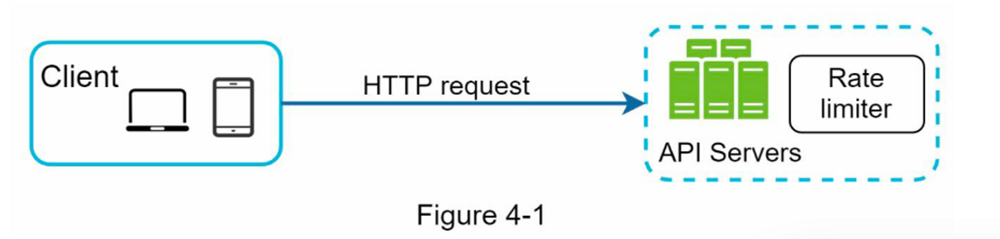

除了客户端和服务器端实现之外，还有另一种方法。 我们创建了一个速率限制器中间件，而不是在 API 服务器上放置速率限制器，它可以限制对 API 的请求，如图 4-2 所示：

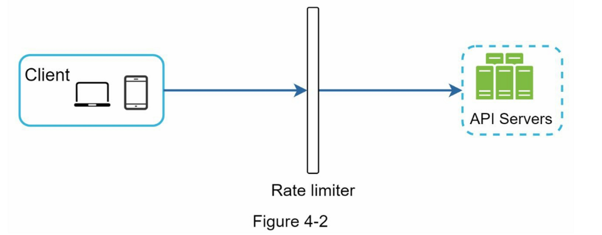

让我们使用图 4-3 中的示例来说明速率限制在该设计中的工作原理。
假设我们的 API 允许每秒 2 个请求，客户端在一秒钟内向服务器发送 3 个请求。 前两个请求被路由到 API 服务器。 但是，速率限制器中间件会限制第三个请求并返回 HTTP 状态代码 429。HTTP 429 响应状态代码表示用户发送了过多的请求。

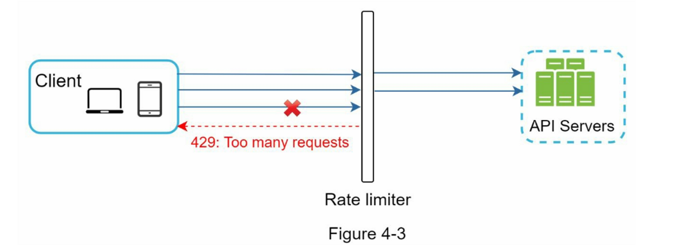

云微服务[4]已经广泛流行，速率限制通常在一个叫做API网关的组件中实现。API网关是一个完全管理的服务，支持限速、SSL、认证、IP白名单、服务静态内容等。现在，我们只需要知道API网关是一个支持速率限制的中间件。

在设计速率限制器时，要问自己的一个重要问题是：速率限制器应该在哪里实现，在服务器端还是在网关中？这没有绝对的答案。这取决于你公司目前的技术栈、工程资源、优先级、目标等。这里有一些通用的指南：

- 评估你目前的技术栈，如编程语言、缓存服务等。确保你目前的编程语言能够有效地在服务器端实现速率限制。
- 确定适合你业务需求的速率限制算法。当你在服务器端实施一切时，你可以完全控制算法。然而，如果你使用第三方网关，你的选择可能是有限的。
- 如果你已经使用了微服务架构，并在设计中包含了一个API网关来执行认证、IP白名单等，你可以在API网关上添加一个速率限制器。
- 建立你自己的速率限制服务需要时间。如果你没有足够的工程资源来实现速率限制器，商业API网关是一个更好的选择。

### 速率限制算法
    
速率限制可以用不同的算法来实现，每一种算法都有明显的优点和缺点。尽管本章并不关注算法，但在高层次上了解它们有助于选择正确的算法或算法组合来适应我们的使用情况。

下面是一个流行算法的列表：

- 令牌桶（Token bucket）
- 漏斗（Leaking bucket）
- 固定窗口计数（Fixed window counter）
- 滑动窗口日志（Sliding window log）
- 滑动窗口计数（Sliding window counter）

#### 令牌桶算法
    
令牌桶（Token bucket）算法广泛用于速率限制。 它简单易懂，被互联网公司广泛使用。 Amazon [5] 和 Stripe [6] 都使用这个算法来限制他们的 API 请求。

**工作原理如下：**

- 令牌桶是一个具有预定义容量的容器。 令牌被定期以预设速率放入桶中， 一旦桶满了，就不再添加令牌。 如图4-4所示，令牌桶容量为4，注入装置每秒向桶中放入2个令牌，一旦桶满了，多余的令牌就会溢出。

  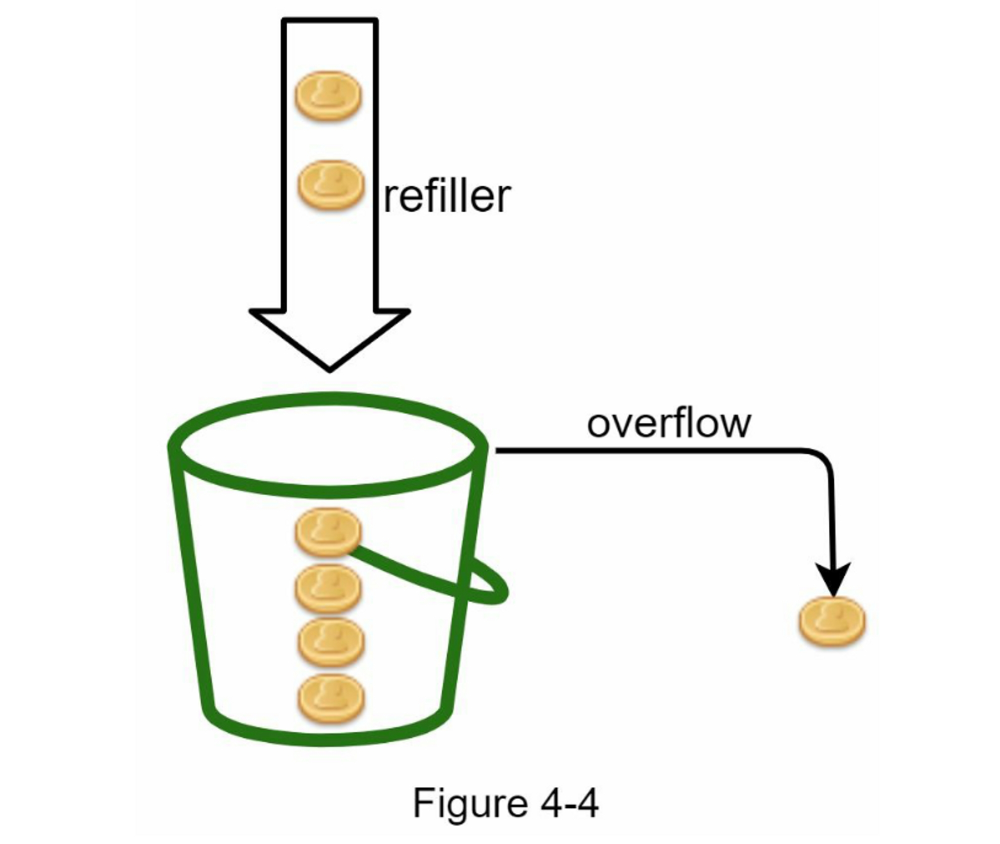

- 每个请求都会消耗一个令牌。当一个请求到达时，我们检查桶中是否有足够的令牌。图4-5解释了它是如何工作的。
    - 如果有足够的令牌，我们为每个请求取出一个令牌，然后请求通过。
    - 如果没有足够的令牌，请求被放弃。
    
    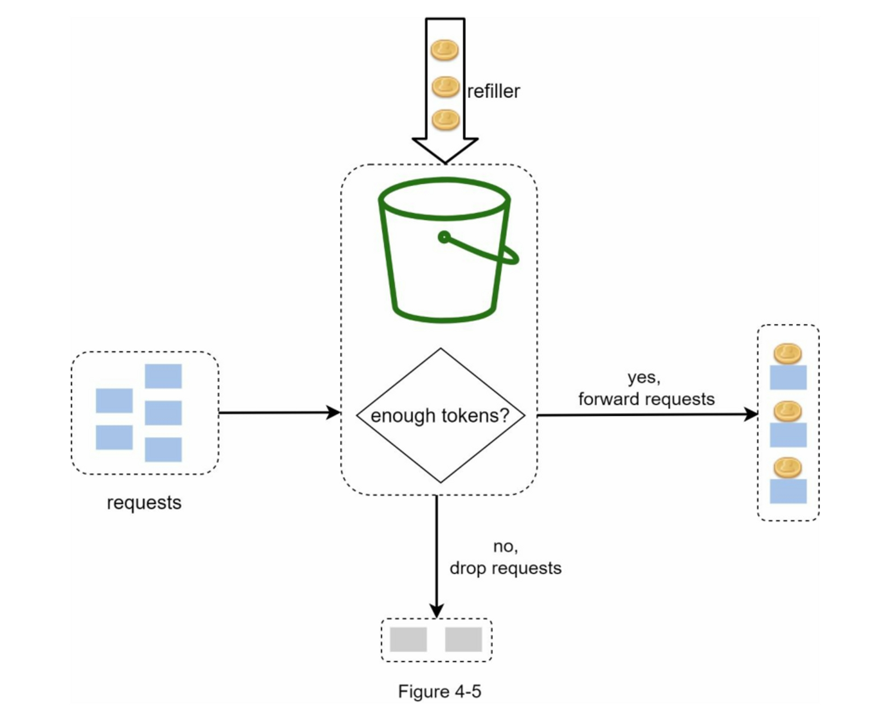

图 4-6 说明了令牌消耗、重新填充和速率限制逻辑的工作原理。 在此示例中，令牌桶大小为 4，重新填充速率为每 1 分钟 4 个。
    
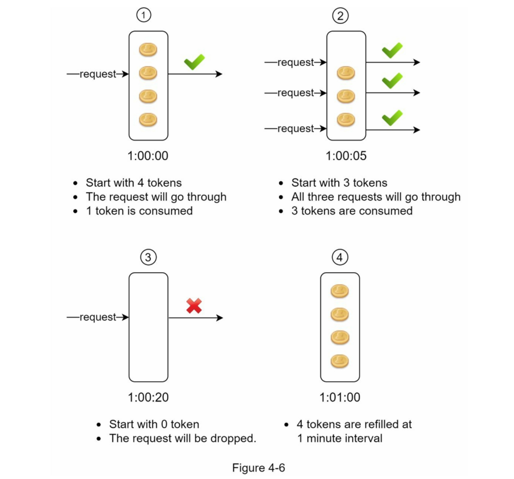

令牌桶算法需要两个参数：

1. 桶大小：桶内允许的最大令牌数。
2. 填充速率：每秒放入到桶内的令牌数量。

我们需要多少个桶？

这是多样化的，它取决于速率限制规则。这里有几个例子。

- 通常有必要为不同的API端点设置不同的桶。例如，如果一个用户被允许每秒发1个帖子，每天添加150个朋友，以及每秒喜欢5个帖子，那么每个用户需要3个桶。
- 如果我们需要根据IP地址对请求进行节流，每个IP地址都需要一个桶。
- 如果系统允许每秒最多10,000个请求，那么有一个由所有请求共享的全局桶是合理的。

**优点**

- 算法容易实现
- 节省内存
- 令牌桶允许短时间内的流量突发。只要有剩余的令牌，请求就可以通过。

**缺点**

- 算法中的两个参数是桶大小和令牌重新填充率。 但是，正确调整它们可能具有挑战性
        
#### 漏斗算法
    
漏斗（Leaking bucket）算法与令牌桶类似，只是请求是以固定的速度处理的。它通常用先入先出（FIFO）队列来实现。

该算法的工作原理如下。

- 当一个请求到达时，系统检查队列是否已满。如果没有满，该请求就会被添加到队列中。
- 否则，该请求将被放弃
- 从队列中提取请求并定期处理

图4-7解释了该算法的工作原理：

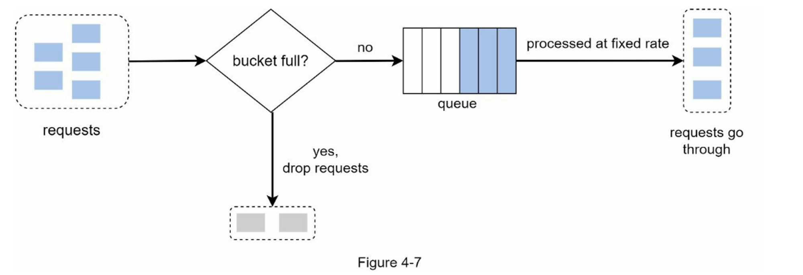

漏斗算法需要以下两个参数

- 桶的大小：它等于队列的大小。队列容纳了要以固定速度处理的请求。
- 流出率：它定义了在一个固定的速率下可以处理多少个请求，通常以秒为单位。

Shopify，一家电子商务公司，使用泄漏桶来限制速度[7]。

**优点：**

- 鉴于队列大小有限，内存效率高。
- 请求以固定的速率处理，因此它适用于需要稳定流出速率的用例。

**缺点：**

- 突发的流量使队列中充满了旧的请求，如果这些请求没有得到及时处理，最近的请求将受到速率限制。
- 算法中有两个参数，要适当地调整它们可能并不容易。
    
#### 固定窗口计数算法
    
固定窗口计数（Fixed window counter）算法工作原理如下：

- 该算法将时间线划分为固定大小的时间窗口，并为每个窗口分配一个计数器。
- 每个请求都会使计数器增加一个
- 一旦计数器达到预定的阈值，新的请求就会被放弃，直到新的时间窗口开始。

让我们用一个具体的例子来看看它是如何工作的。在图4-8中，时间单位是1秒，系统允许每秒钟最多有3个请求。在每个秒窗口中，如果收到的请求超过3个，额外的请求就会被放弃，如图4-8所示：

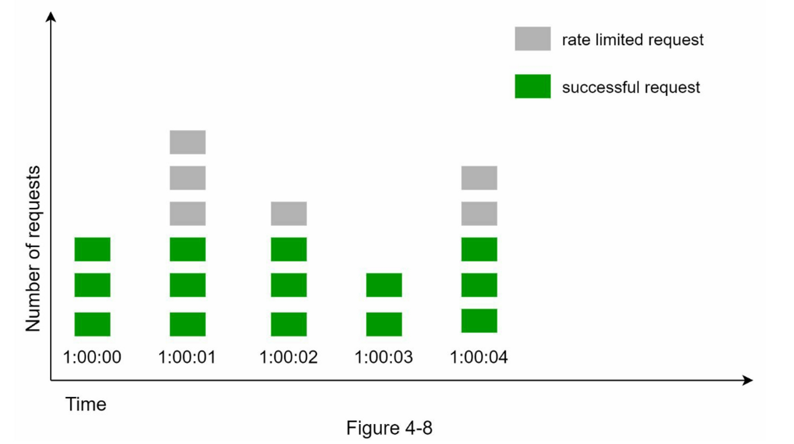

该算法的一个主要问题是，在时间窗口边缘的突发流量可能会导致超过允许配额的请求。考虑以下情况：


在图4-9中，系统允许每分钟最多有5个请求，可用的配额在整点分钟时重置。正如所见，在2:00:00和2:01:00之间有5个请求，在2:01:00和2:02:00之间还有5个请求。在2:00:30和2:01:30之间的1分钟窗口，有10个请求通过。这是允许的请求数的两倍。

**优点：**

- 内存高效
- 容易理解
- 在单位时间窗口结束时重新设置可用配额，适合某些使用情况

**缺点：**

- 窗口边缘的流量激增可能导致超过允许配额的请求被通过（有突刺）
    
#### 滑动窗口日志算法
    
如前所述，固定窗口计数（Sliding window log）算法有一个主要问题：它允许更多的请求在窗口的边缘通过。滑动窗口日志算法解决了这个问题。

它的工作原理如下：

- 该算法对请求的时间戳进行跟踪。时间戳数据通常保存在缓存中，如Redis的sorted[8] 。
- 当一个新的请求进来时，删除所有过期的时间戳。过时的时间戳被定义为比当前时间窗口的开始时间更早的时间戳。
- 将新请求的时间戳添加到日志中
- 如果日志大小与允许的计数相同或更低，则接受请求。否则，它将被拒绝

我们用图4-10所示的一个例子来解释该算法。

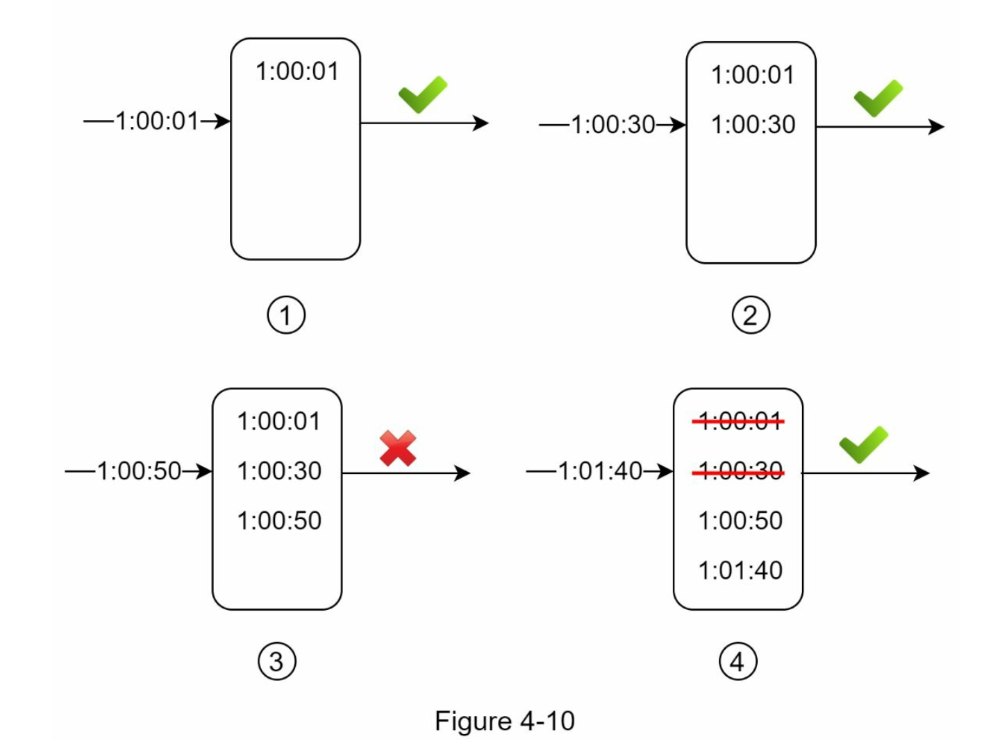

在这个例子中，速率限制器允许每分钟2个请求。通常情况下，Linux的时间戳会存储在日志中。然而，在我们的例子中，为了提高可读性，使用了人类可读的时间表示法。

- 当一个新的请求在1:00:01到达时，该日志是空的。因此，该请求被允许
- 一个新的请求在1:00:30到达，时间戳1:00:30被插入到日志中。插入后，日志大小为2，不大于允许的数量。因此，该请求被允许。
- 一个新的请求在1:00:50到达，时间戳被插入到日志中。插入后，日志大小为3，大于允许的大小2。因此，这个请求被拒绝，尽管时间戳仍然在日志中。
- 一个新的请求在1:01:40到达。在[1:00:40,1:01:40]范围内的请求是在最新的时间范围内，但在1:00:40之前发送的请求是过时的。两个过期的时间戳1:00:01 和1:00:30被从日志中删除。在删除操作之后，日志大小变成了2；因此，请求被接受。

**优点：**

- 这种算法实现的速率**限制是非常准确**的。在任何滚动窗口中，请求都不会超过速率限制。

**缺点：**

- 该算法消耗了大量的内存，因为即使一个请求被拒绝，其时间戳仍可能被存储在内存中
#### 滑动窗口计数算法
    
滑动窗口计数器(Sliding window counter)算法是一种混合方法，结合了固定窗口计数器和滑动窗口日志。该算法可以通过两种不同的方法来实现。我们将在本节中解释一种实现方法，并在本节末尾提供另一种实现方法的参考。

图4-11说明了这种算法的工作原理：

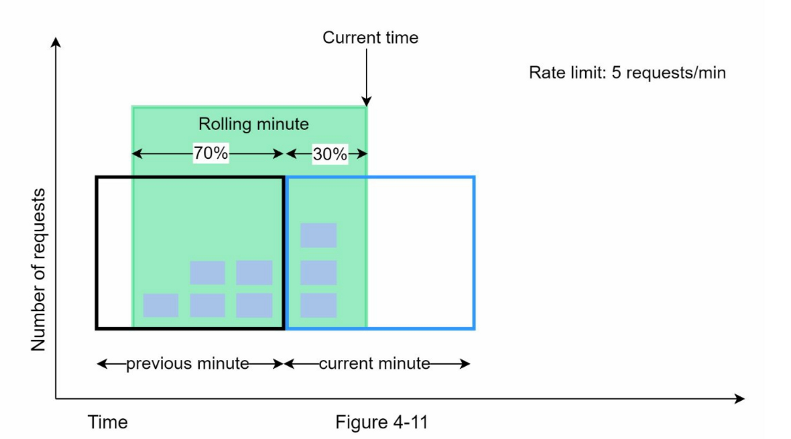

假设速率限制器允许每分钟最多有7个请求，上一分钟有5个请求，当前一分钟有3个请求。对于在当前分钟内到达30%位置的新请求，滚动窗口中的请求数用以下公式计算：

- 当前窗口的请求+前一个窗口的请求*滚动窗口和前一个窗口的重叠百分比
- 使用这个公式，我们得到3 + 5 * 0.7% = 6.5个请求。根据不同的使用情况，这个数字可以向上或向下取整。在我们的例子中，它被向下四舍五入为6。

由于速率限制器每分钟最多允许7个请求，当前的请求可以通过。然而，再收到一个请求后，就会达到限制。

由于篇幅所限，我们在此不讨论其他的实现。有兴趣的读者可以参考参考资料[9]。这种算法并不完美。它有优点也有缺点。

**优点：**

- 它平滑了流量的峰值，因为速率是基于前一个窗口的平均速率。
- 内存高效

**缺点：**

- 它只适用于不太严格的回看窗口。它是实际速率的近似值，因为它假设前一个窗口的请求是均匀分布的。然而，这个问题可能并不像它看起来那么糟糕。根据Cloudflare[10]所做的实验，在4亿个请求中，只有0.003%的请求被错误地允许或限制速率
### 高层次的架构
    
限流算法的基本思想很简单。在高层次上，我们需要一个计数器来跟踪来自同一用户、IP地址等的多少个请求。如果计数器大于限制值，则请求被禁止。

我们应该在哪里存储计数器？由于磁盘访问速度慢，使用数据库并不是一个好主意。选择内存缓存是因为它速度快并且支持基于时间的过期策略。例如，Redis[11]是实现速率限制的一个流行选择。它是一个内存中的存储，提供两个命令：`INCR`和`EXPIRE`

- `INCR`：它使存储的计数器加1。
- EXPIRE：它为计数器设置一个超时。如果超时过后，计数器会被自动删除。

图4-12显示了速率限制的高层结构，其工作原理如下：

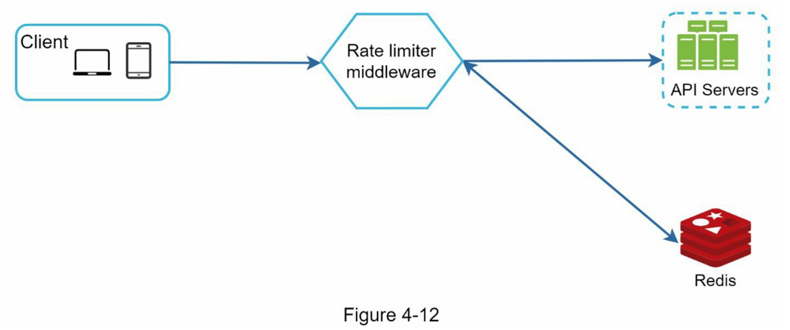

- 客户端向限流中间件发送请求
- 限流中间件从Redis中相应的桶中获取计数器，并检查是否达到限制
    - 如果达到限制，则拒绝该请求
    - 如果没有达到限制，请求会被发送到API服务器。同时，系统会增加计数器并将其保存回Redis。

## 第3步：深入设计

图4-12中的高层设计并没有回答以下问题：

- 如何创建速率限制规则？这些规则储存在哪里？
- 如何处理受限的请求？

在这一节中，我们将首先回答关于限流规则的问题，然后介绍处理限流请求的策略。最后，我们将讨论分布式环境中的限流、详细的设计、性能优化和监控。

### 限流规则

`Lyft`开源了他们的速率限制组件[12]。我们将窥探该组件的内部情况，并看看一些速率限制规则的例子。

```java
domain: messaging
descriptors:
  - key: message_type
    Value: marketing
    rate_limit:
      unit: day
      requests_per_unit: 5
```

在上述例子中，系统被配置为每天最多允许5条营销信息。下面是另一个例子：

```java
domain: auth
descriptors:
  - key: auth_type
    Value: login
    rate_limit:
      unit: minute
      requests_per_unit: 5
```

这个规则显示，客户不允许在1分钟内登录超过5次。规则一般写在配置文件中并保存在磁盘上。

### 超过速率限制

  如果一个请求被限制了速率，API会向客户端返回一个HTTP响应代码429（请求太多）。根据不同的使用情况，我们可能会将速率受限的请求排队等候以后处理。例如，如果一些订单由于系统过载而受到速率限制，我们可以保留这些订单以便以后处理。

### 速率限制器请求头

一个客户如何知道它是否被节流？客户端如何知道在被节流之前允许的剩余请求的数量？答案就在HTTP响应头中。速率限制器向客户端返回以下 HTTP 标头：

- X-Ratelimit-Remaining：窗口内允许请求的剩余数量
- X-Ratelimit-limit：它表示客户端在每个时间窗口可以进行多少次调用
- X-Ratelimit-Retry-After：等待的秒数，直到你可以再次提出请求而不被节流。

当用户发送过多请求时，将向客户端返回 429 too many requests 错误和 X-Ratelimit-Retry-After 标头。

### 详细设计

图 4-13 给出了系统的详细设计。

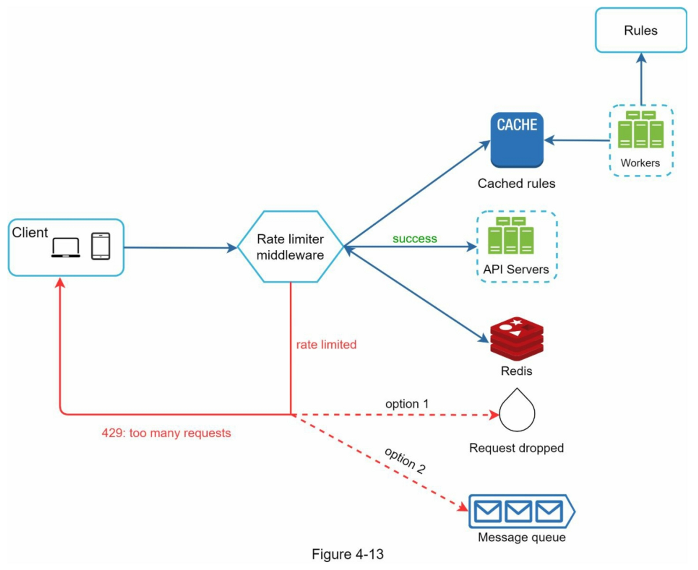

- 规则被存储在磁盘上。工作者经常从磁盘中提取规则，并将其存储在高速缓存中。
- 当客户端向服务器发送请求时，该请求首先被发送到限流中间件。
- 限流中间件从缓存中加载规则。它从Redis缓存中获取计数器和最后一次请求的时间戳。根据响应，限流器决定：
    - 如果请求没有速率限制，它将被转发到API服务器。
    - 如果请求受到速率限制，速率限制器会向客户端返回 429 too many requests 错误。 同时，请求被丢弃或转发到队列。
### 分布式环境下的限流器

构建一个在单服务器环境下工作的速率限制器并不困难。然而，扩展系统以支持多个服务器和并发线程是一个不同的故事。有两个挑战:

- 竞争条件
- 同步问题
#### 竞争条件

  如前所述，限流器在高层的工作原理如下

    - 从Redis读取计数器的值
    - 检查 ( counter + 1 ) 是否超过阈值
    - 如果不是，则将 Redis 中的计数器值加 1

  如图4-14所示，在高度并发的环境中会发生竞赛条件。

  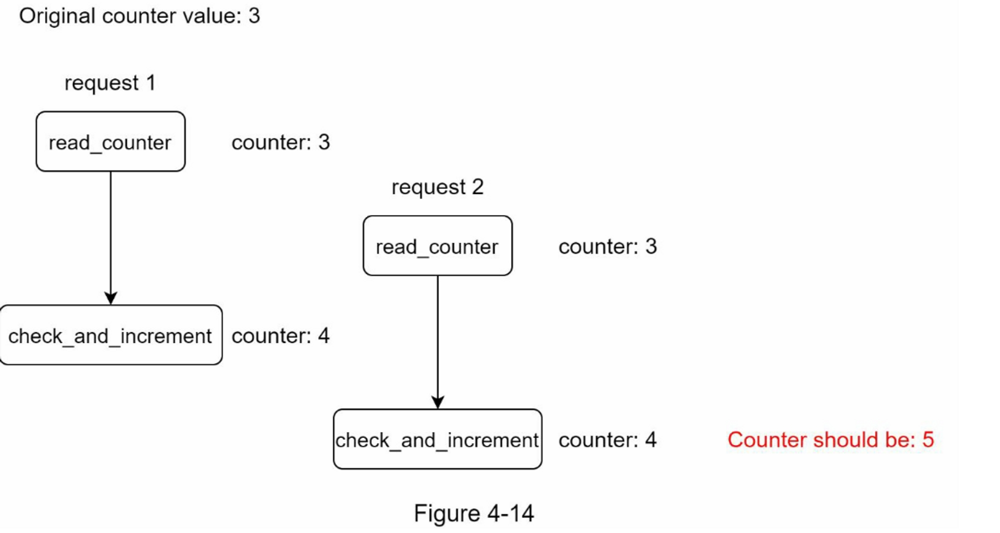

  假设 Redis 中的计数器值为 3。如果两个请求在其中一个请求写回值之前同时读取计数器值，则每个请求都会将计数器加 1 并在不检查另一个线程的情况下将其写回。 两个请求（线程）都认为它们具有正确的计数器值 4。但是，正确的计数器值应该是 5

  锁是解决竞争条件最明显的解决方案。 但是，锁会显着降低系统速度。 通常使用两种策略来解决这个问题：
  Lua 脚本 [13] 和 Redis [8] 中的 sorted sets 数据结构。 对这些策略感兴趣的读者可以参考相应的参考资料[8] [13]。

#### 同步问题

  同步是分布式环境中要考虑的另一个重要因素。 要支持数百万用户，一个速率限制器服务器可能不足以处理流量。
  当使用多个速率限制器服务器时，需要同步。 例如，在图 4-15 的左侧，客户端 1 将请求发送到速率限制器 1，客户端 2 将请求发送到速率限制器 2。由于 Web 层是无状态的，客户端可以将请求发送到不同的速率限制器，如图所示，在图 4-15 的右侧。 如果没有发生同步，限速器 1 不包含有关客户端 2 的任何数据。因此，限速器无法正常工作。
  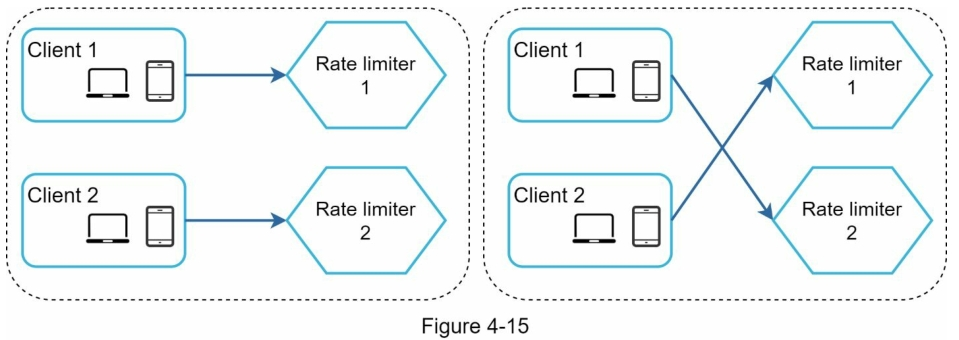

  一种可能的解决方案是使用粘性会话，允许客户端将流量发送到相同的速率限制器。 这个解决方案是不可取的，因为它既不可扩展也不灵活。 更好的方法是使用像 Redis 这样的集中式数据存储。

  设计如图 4-16 所示：

  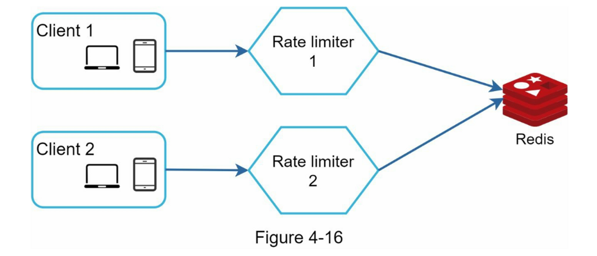

### 性能优化

  性能优化是系统设计面试中的一个常见话题。我们将涉及两个方面的改进。

  首先，多数据中心的设置对速率限制器至关重要，因为对于远离数据中心的用户来说，延迟很高。大多数云服务提供商在世界各地建立了许多边缘服务器位置。例如，截至2020年5月20日，Cloudflare有194个地理上分布的边缘服务器[14]。流量被自动路由到最近的边缘服务器，以减少延时。

  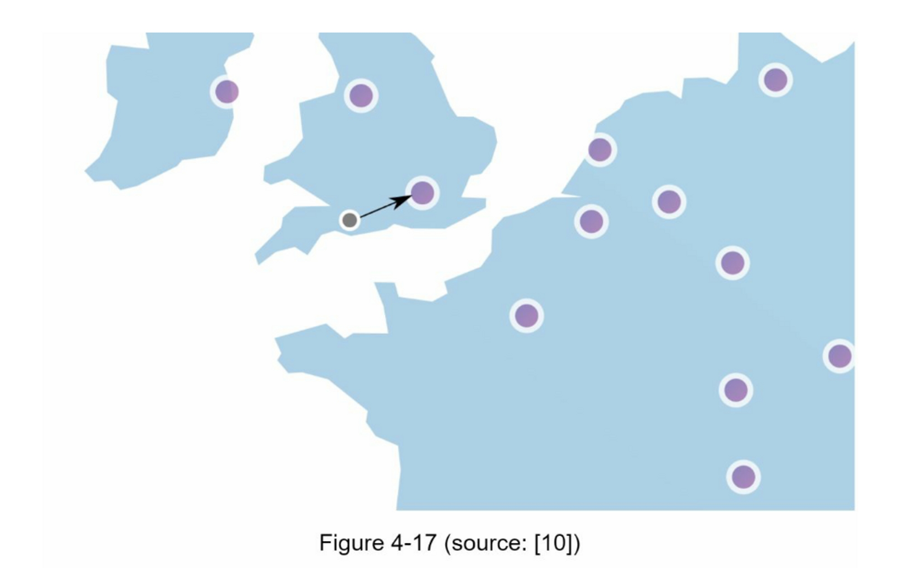

  第二，用最终的一致性模型来同步数据。如果你不清楚最终的一致性模型，请参考 "第6章：设计一个键值存储 "中的 "一致性 "部分。

### 监控

限流器到位后，最重要的是要收集分析数据以检查限流器是否有效。

首先，我们要确保：

- 限流算法是有效的
- 限流规则是有效的

例如，如果速率限制规则过于严格，则会丢弃许多有效请求。 在这种情况下，我们想稍微放宽规则。 在另一个示例中，我们注意到当流量突然增加时（如闪购），我们的限速器变得无效。 在这种场景下，我们可能会更换算法来支持突发流量。 令牌桶很适合这种场景。

## 第4步：总结

在这一章中，我们讨论了速率限制的不同算法和它们的优点和缺点。

讨论的算法包括：

- 令牌桶
- 漏斗
- 固定窗口
- 滑动窗口日志
- 滑动窗口计数

然后，我们讨论了系统架构、分布式环境中的速率限制器、性能优化和监控。 与任何系统设计面试问题类似，如果时间允许，您可以提及其他谈话要点:

- 硬件 与 软件限流对比
    - 硬件：请求的数量不能超过阈值
    - 软件：请求可以在短时间内超过阈值
- 不同级别的限流。在本章中，我们只讨论了应用程序级别（HTTP：第 7 层）的限流，可以在其他层应用限流。例如，你可以使用Iptables[15]（IP：第3层）按IP地址应用速率限制。注意：开放系统互连模型（OSI模型）有7层[16]。第1层：物理层，第2层：数据链路层，第3层：网络层，第4层：传输层，第5层：会话层，第6层：表示层，第7层：应用层。
- 避免被限速，使用最佳实践设计您的客户端：
    - 使用客户端缓存，以避免频繁调用API
    - 了解限制，不要在短时间内发送太多请求
    - 包含捕获异常或错误的代码，以便客户端可以从异常中恢复正常
    - 为重试逻辑增加足够的回退时间

恭喜你走到了这一步！现在给自己一个鼓励，干得漂亮！

## 参考资料

  [1] Rate-limiting strategies and techniques: https://cloud.google.com/solutions/rate-limiting-strategies-techniques

  [2] Twitter rate limits: https://developer.twitter.com/en/docs/basics/rate-limits

  [3] Google docs usage limits: https://developers.google.com/docs/api/limits

  [4] IBM microservices: https://www.ibm.com/cloud/learn/microservices

  [5] Throttle API requests for better throughput:

  https://docs.aws.amazon.com/apigateway/latest/developerguide/api-gateway-request-throttling.html

  [6] Stripe rate limiters: https://stripe.com/blog/rate-limiters

  [7] Shopify REST Admin API rate limits: https://help.shopify.com/en/api/reference/rest-admin-api-rate-limits

  [8] Better Rate Limiting With Redis Sorted Sets:https://engineering.classdojo.com/blog/2015/02/06/rolling-rate-limiter/

  [9] System Design — Rate limiter and Data modelling:https://medium.com/@saisandeepmopuri/system-design-rate-limiter-and-data-modelling-9304b0d18250

  [10] How we built rate limiting capable of scaling to millions of domains:https://blog.cloudflare.com/counting-things-a-lot-of-different-things/

  [11] Redis website: https://redis.io/

  [12] Lyft rate limiting: https://github.com/lyft/ratelimit

  [13] Scaling your API with rate limiters:https://gist.github.com/ptarjan/e38f45f2dfe601419ca3af937fff574d#request-rate-limiter

  [14] What is edge computing: https://www.cloudflare.com/learning/serverless/glossary/what-is-edge-computing/

  [15] Rate Limit Requests with Iptables: https://blog.programster.org/rate-limit-requests-with-iptables

  [16] OSI model: https://en.wikipedia.org/wiki/OSI_model#Layer_architecture