# 第05章：一致性hash设计

## CHAPTER 05：DESIGN CONSISTENT HASHING

## 第05章：一致性hash设计

为了实现水平扩展，在服务器之间高效、均匀地分配请求/数据非常重要。一致哈希是实现这一目标的常用技术。但首先，让我们深入研究一下这个问题。

#### 再哈希问题

如果你有n个缓存服务器，平衡负载的一个常用方法是使用以下哈希方法：

`serverIndex = hash(key) % N`，其中N是服务器池的大小

让我们用一个例子来说明它是如何工作的。如表5-1所示，我们有4个服务器和8个字符串键及其哈希值。

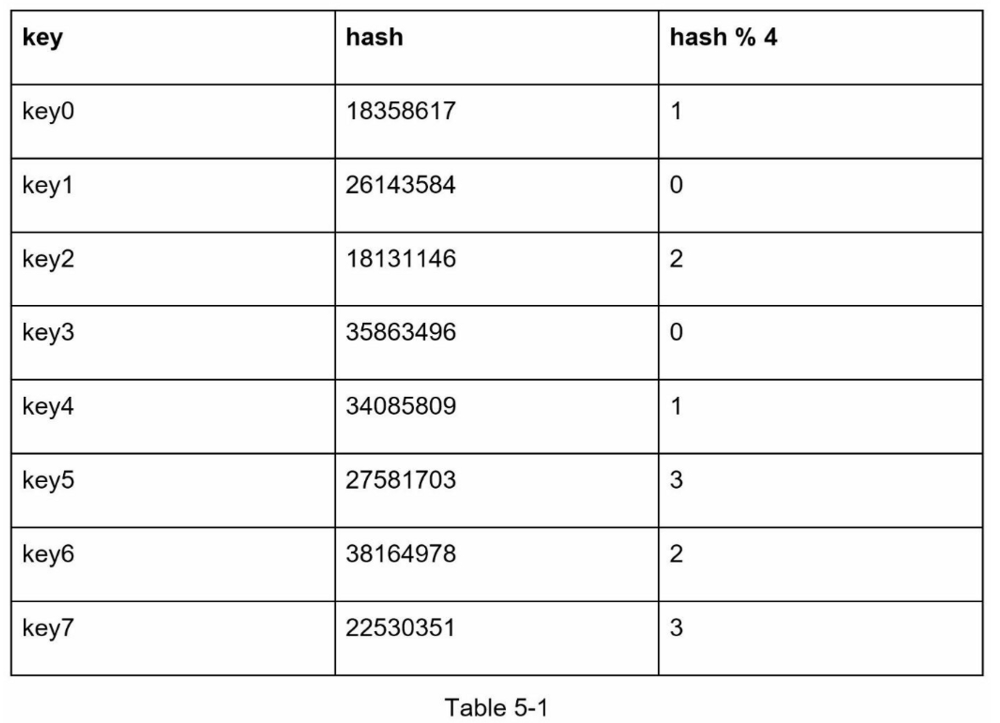

为了获取存储键的服务器，我们进行求余操作 `f(key) % 4`。例如，hash(key0) % 4 = 1意味着客户端必须联系服务器1来获取缓存的数据。图5-1显示了基于表5-1的键的分布情况

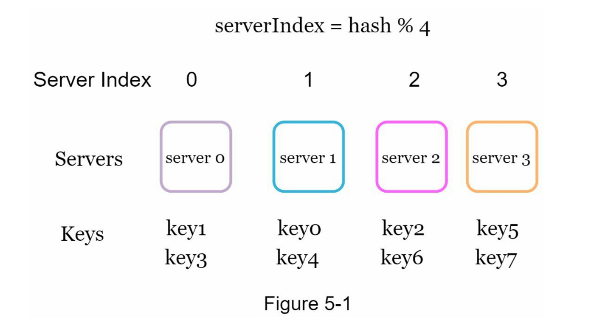

当服务器池的大小是固定的，而且数据分布均匀时，这种方法效果很好。然而，当增加新的服务器，或删除现有的服务器时，问题就会出现。

例如，如果服务器1下线了，服务器池的大小就变成了3。使用相同的哈希函数，我们得到的键的哈希值是相同的。 但是应用求余操作，我们会得到不同的服务器索引，因为服务器的数量减少了1。 通过应用`hash % 3`，我们得到的结果如表5-2所示：

图5-2显示了基于表5-2的新的键分布。

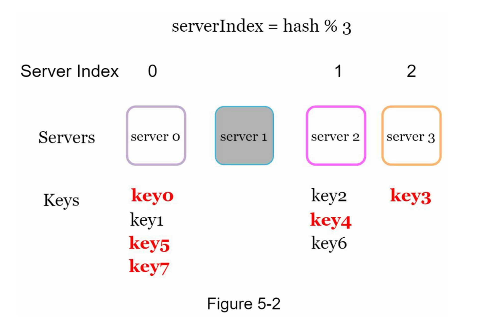

如图5-2所示，大多数键都被重新分配，而不仅仅是最初存储在脱机服务器（服务器1）中的键。 这意味着，当服务器1离线时，大多数缓存客户会连接到错误的服务器来获取数据，这就造成了高速缓存失误的风暴。一致性哈希是一种有效的技术来缓解这个问题。

#### 一致性哈希

引用自维基百科：“一致性哈希是一种特殊的哈希，当重新调整哈希表的大小并使用一致性哈希时，平均只需要重新映射 k/n 个键，其中 k 是键的数量，n 是槽的数量。 相比之下，在大多数传统的哈希表中，数组槽数量的变化导致几乎所有键都被重新映射 \[1]”

#### 哈希空间和哈希环

现在我们了解了一致性哈希的定义，让我们看看它是如何工作的。假设使用`SHA-1`作为哈希函数`f`，哈希函数的输出范围为：x0,x1,x2,x3,...,xn。 在密码学中，SHA-1 的哈希空间从 0 到 2^160 - 1。也就是说，x0 对应 0，xn 对应 2^160 – 1，中间的所有其他哈希值都在 0 和 2^160 – 1 之间。 图 5-3 显示了哈希空间。

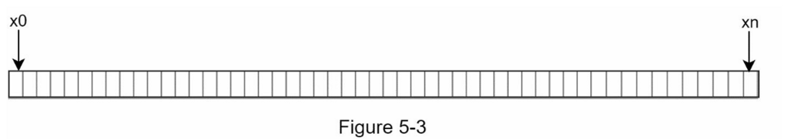

通过收集两端，我们得到一个哈希环，如图5-4所示：

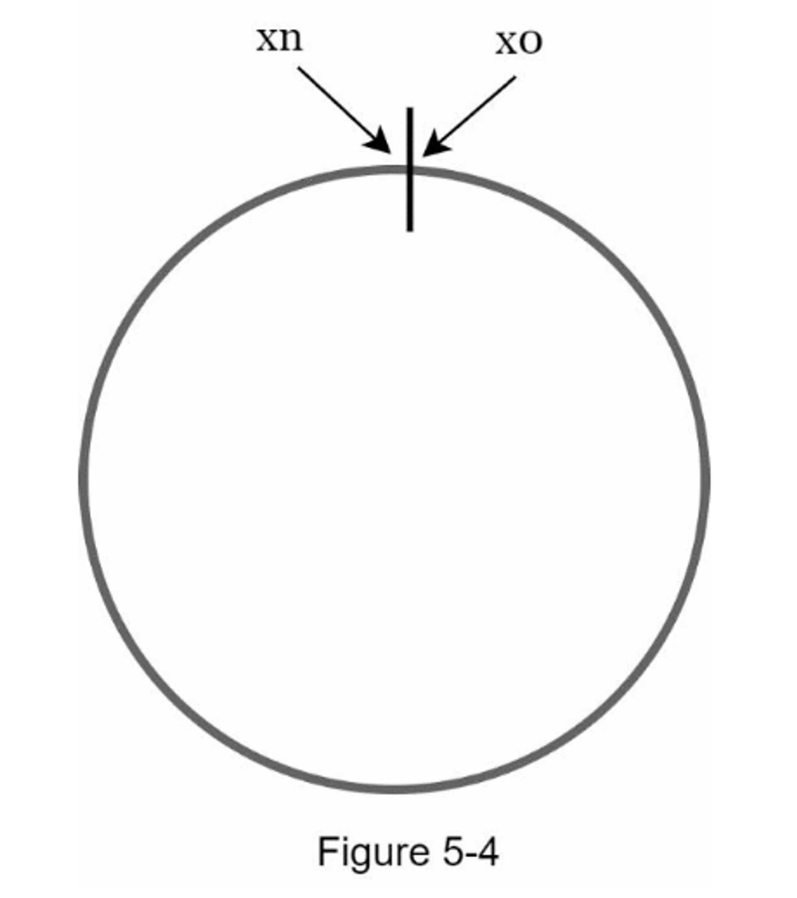

#### 哈希服务器

使用相同的哈希函数 f，我们根据服务器的 IP 或名称将服务器映射到环上。 图 5-5 显示哈希环上映射了 4 个服务器

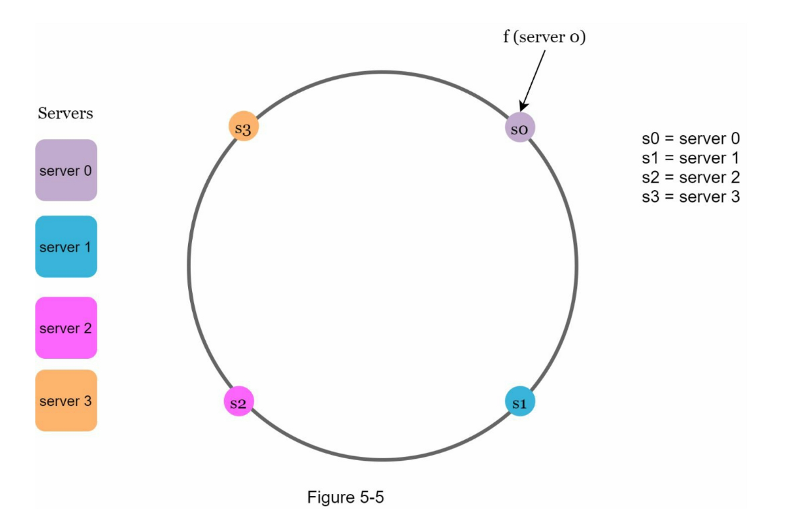

#### 哈希键

值得一提的是，这里使用的哈希函数与“rehashing problem”中的哈希函数不同，没有模运算。 如图5-6所示，4个缓存键（key0、key1、key2、key3）被哈希到哈希环Server lookup。 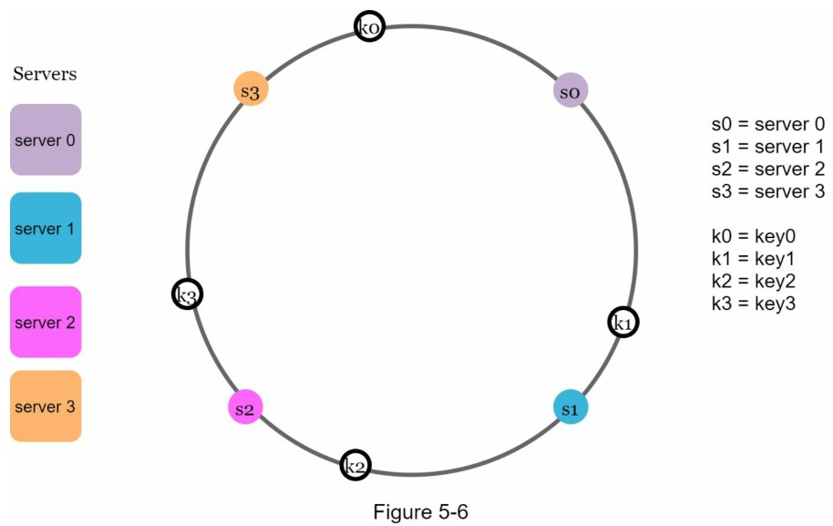

#### 服务器查找

为了确定键存放在哪个服务器上，我们从键在环上的位置顺时针查找，直到找到一个服务器。 图5-7解释了这个过程。顺时针方向查找，`key0`存储在`server0`；`key1`存储在`server1`；`key2`存储在`server2`，`key3`存储在`server3`。 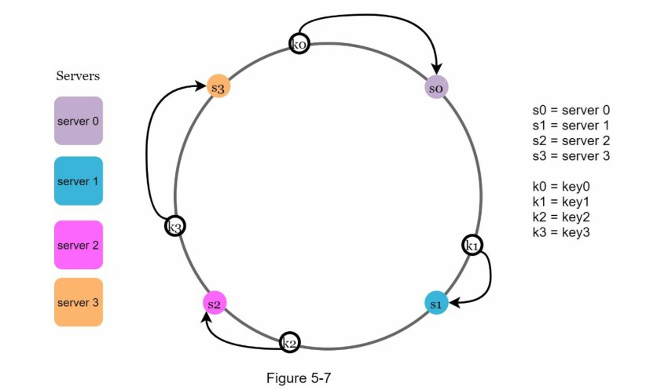

#### 添加一台服务器

使用上述逻辑，增加一台新的服务器将只需要重新分配一部分的键。

在图5-8中，新增`server4`后，只需要重新分配`key0`即可。 k1、k2 和 k3 保留在相同的服务器上。 让我们仔细看看其中的逻辑，在加入`server4`之前，`key0`是存放在`server0`上的。现在`key0`会存放在`server4`上，因为`server4`是从`key0`在环上顺时针方向第一个遇到的`server`。 根据一致性哈希算法，其他键不会被重新分配。

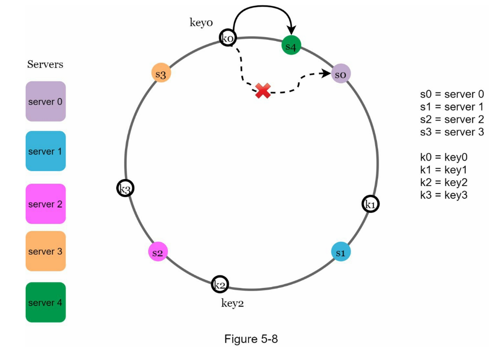

#### 移除一台服务器

当一台服务器被移除时，只有一小部分的键需要用一致的哈希法进行重新分配。 在图5-9中，当`server1`被移除时，只有`key1`必须被重新映射到server2。 其余的键不受影响。

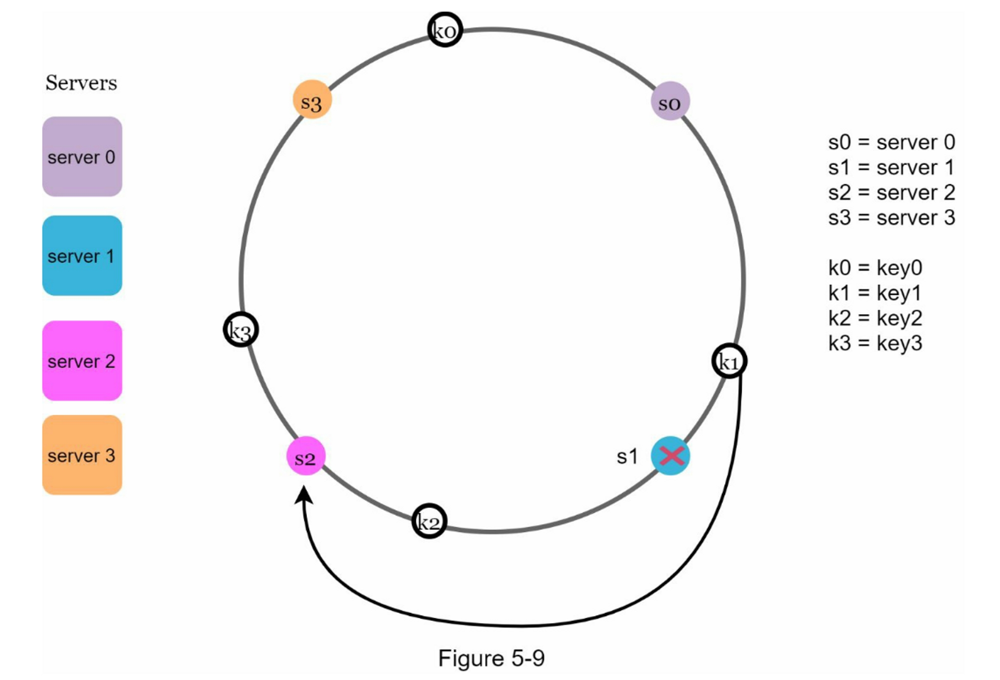

#### 基本方法中的两个问题

一致哈希算法是由麻省理工学院的Karger等人提出的\[1]。

基本步骤如下：

1. 使用均匀分布的哈希函数将服务器和键映射到环上。
2. 要想知道一个键被映射到哪个服务器，从键的位置顺时针查找，直到找到环上的第一个服务器。

这种方法存在两个问题：

1.  首先，考虑到可以添加或删除服务器，**不可能保持环上所有服务器的分区大小相同**。 分区是相邻服务器之间的哈希空间。 分配给每个服务器的环上分区的大小可能非常小或相当大。在图5-10中，如果删除s1，s2的分区（用双向箭头突出显示）是s0和s3分区的两倍。

    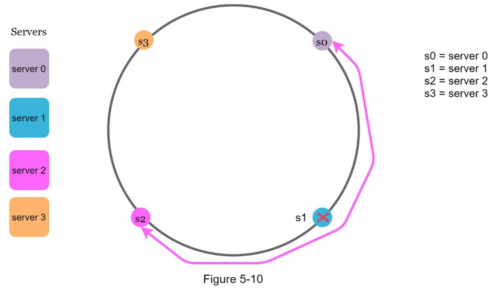
2.  第二，在环上有可能出现**不均匀的键分布**。例如，如果服务器被映射到图5-11中所列的位置，大部分的密钥都存储在`serve2`上。然而，`server1`和`serser3`没有数据。

    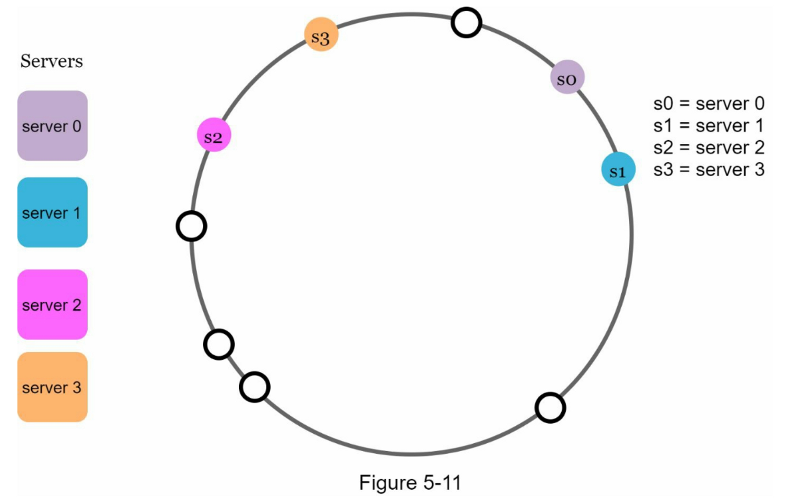

**一种叫做虚拟节点或复制的技术被用来解决这些问题**

#### 虚拟节点

虚拟节点是指真实节点，每个服务器由环上的多个虚拟节点表示。在图5-12中，server0和server1都有3个虚拟节点。 3是任意选择的；而在现实世界的系统中，虚拟节点的数量要大得多。我们不用s0，而是用s0\_0、s0\_1和s0\_2来代表环上的server0。 同样地，s1\_0、s1\_1和s1\_2代表环上的server1。通过虚拟节点，每个服务器负责多个分区。标签为s0的分区（边）由server0管理。 另一方面，标签为s1的分区则由server1管理。

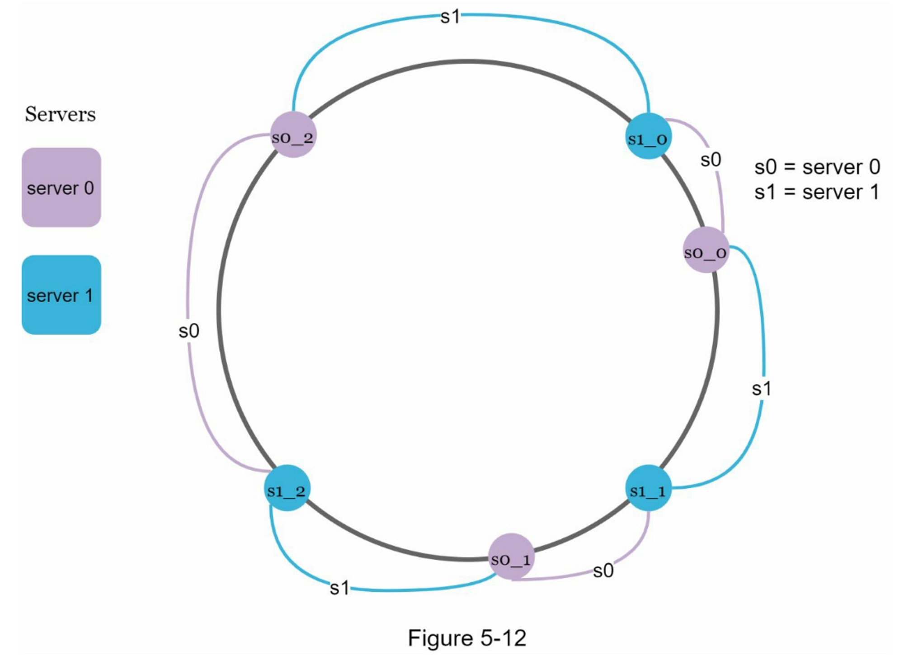

为了找到键存储在哪个服务器上，我们从键的位置顺时针方向找到环上遇到的第一个虚拟节点。 在图5-13中，为了找出k0存储在哪个服务器上，我们从k0的位置顺时针方向找到虚拟节点s1\_1，它就是是server1。

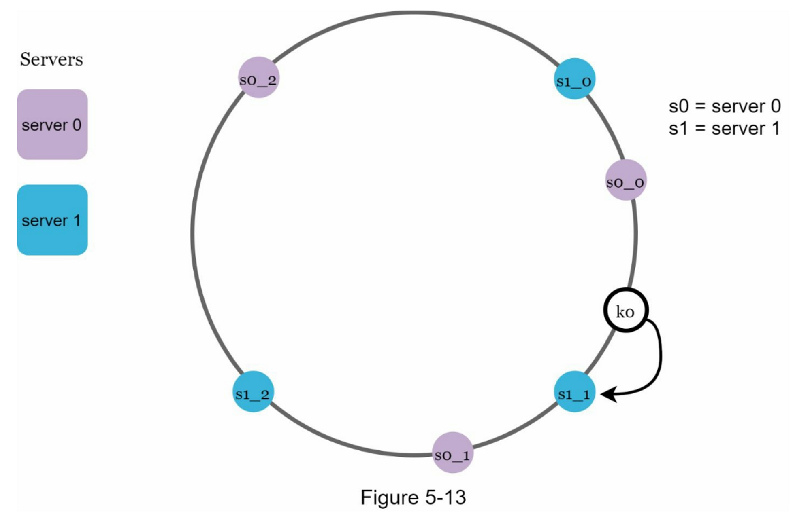

随着虚拟节点数量的增加，密钥的分布变得更加均衡。 这是因为随着虚拟节点数量的增加，标准偏差变小，导致数据分布更加均衡。 标准偏差衡量数据的离散程度。 一项在线研究 \[2] 的实验结果显示，对于一两百个虚拟节点，标准偏差在均值的 5%（200 个虚拟节点）和 10%（100 个虚拟节点）之间。 当我们增加虚拟节点的数量时，标准偏差会更小。 但是，需要更多空间来存储有关虚拟节点的数据。 这是一个权衡，我们可以调整虚拟节点的数量以满足我们的系统要求。

#### 找出受影响的键

当一个服务器被添加或删除时，有一部分数据需要重新分配。我们怎样才能找到受影响的范围来重新分配？

在图5-14中，Server 4加入环中。 受影响的范围从 s4（新添加的节点）开始并沿环逆时针方向移动，直到找到服务器（s3）。 因此，位于 s3 和 s4 之间的键需要重新分配给 s4。

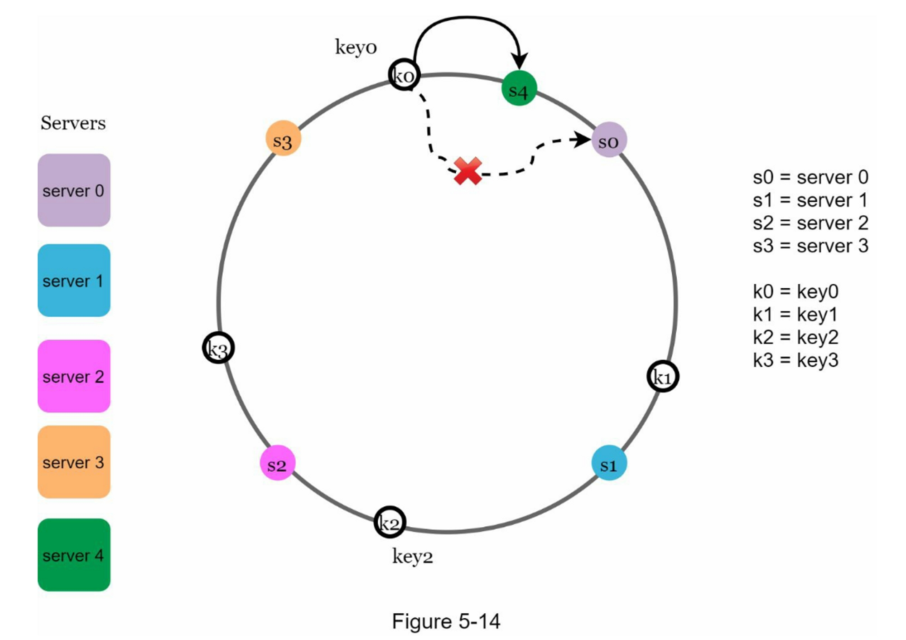

如图 5-15 所示，当一个服务器（s1）被移除时，受影响的范围从 s1（被移除的节点）开始并沿环逆时针方向移动，直到找到一个服务器（s0）。 因此，位于 s0 和 s1 之间的密钥必须重新分配给 s2。

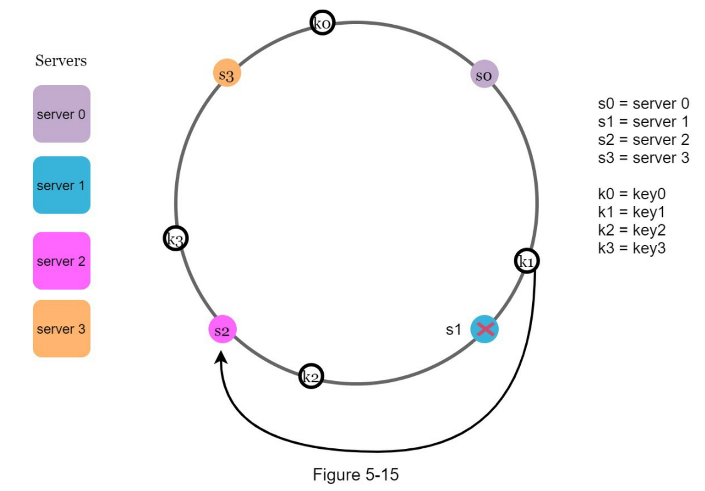

#### 总结

在这一章中，我们深入讨论了一致性哈希，包括为什么需要它以及它是如何工作的。

一致性哈希的好处包括：

* 当服务器被添加或删除时，很小一部分的键被重新分配。
* 容易水平扩展，因为数据分布更加均匀。
* 缓解热点健问题。 对特定分片的过度访问可能会导致服务器过载。 想象一下 Katy Perry、Justin Bieber 和 Lady Gaga 的数据最终都在同一个分片上。 一致性哈希通过更均匀地分配数据来缓解这个问题。

一致性哈希广泛用于现实世界的系统，包括一些著名的系统：

* 亚马逊 Dynamo 数据库的分区组件 \[3]
* Apache Cassandra 中跨集群的数据分区 \[4]
* Discord 聊天应用 \[5]
* Akamai 内容分发网络 \[6]
* Maglev 网络负载均衡器 \[7]

恭喜你走到了这一步！现在给自己一个鼓励，干得漂亮！

#### 参考资料

\[1] Consistent hashing: https://en.wikipedia.org/wiki/Consistent\_hashing

\[2] Consistent Hashing:

https://tom-e-white.com/2007/11/consistent-hashing.html

\[3] Dynamo: Amazon’s Highly Available Key-value Store:

https://www.allthingsdistributed.com/files/amazon-dynamo-sosp2007.pdf

\[4] Cassandra - A Decentralized Structured Storage System:

http://www.cs.cornell.edu/Projects/ladis2009/papers/Lakshman-ladis2009.PDF

\[5] How Discord Scaled Elixir to 5,000,000 Concurrent Users:

https://blog.discord.com/scaling-elixir-f9b8e1e7c29b

\[6] CS168: The Modern Algorithmic Toolbox Lecture #1: Introduction and Consistent

Hashing: http://theory.stanford.edu/\~tim/s16/l/l1.pdf

\[7] Maglev: A Fast and Reliable Software Network Load Balancer:

https://static.googleusercontent.com/media/research.google.com/en//pubs/archive/44824.pdf
