<!-- TOC -->
* [理解问题并确定设计范围](#理解问题并确定设计范围)
* [单一服务器的键值存储](#单一服务器的键值存储)
* [分布式键值存储](#分布式键值存储)
* [系统组件](#系统组件)
* [数据分区](#数据分区)
* [数据复制](#数据复制)
* [一致性](#一致性)
* [一致性模型](#一致性模型)
* [不一致的解决方法：版本控制](#不一致的解决方法版本控制)
* [故障处理](#故障处理)
* [系统构架图](#系统构架图)
* [写入路径](#写入路径)
* [读取路径](#读取路径)
* [总结](#总结)
* [参考资料](#参考资料)
<!-- TOC -->

# key-value 存储设计

键值存储，也称为键值数据库，是一种非关系数据库。每个唯一标识符都存储为一个键及其关联值，这种数据配对称为“键值”对。

在键值对中，键必须是唯一的，通过键可以访问与键关联的值。键可以是纯文本或散列值。出于性能原因，短键效果更好。键是什么样子的？

- 纯文本键：“last_logged_in_at”
- 哈希键：253DDEC4

键值对中的值可以是字符串、列表、对象等。在键值存储中，值通常被视为不透明的对象，如Amazon dynamo [1], Memcached [2], Redis [3], 等。

下面是一个键值存储中的数据片段：

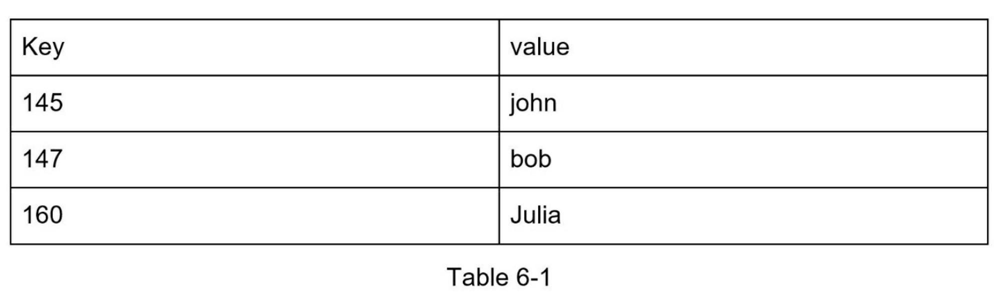

在本章中，你需要设计一个支持以下操作的键值存储：

- put(key, value) // 插入与“key”关联的“value”
- get(key) // 获取与“key”关联的“value”
## 理解问题并确定设计范围

这里没有完美的设计。每种设计都在读取、写入和内存使用方面取得了特定的权衡。必须在一致性和可用性之间做出另一个权衡。

在本章中，我们设计了一个包含以下特征的键值存储：

- 键值对的大小很小：不到 10 KB。
- 有能力存储大数据。
- 高可用性：系统响应迅速，即使在出现故障时也是如此。
- 高可扩展性：系统可以扩展以支持大数据集。
- 自动缩放：服务器的添加/删除应该根据流量自动进行。
- 可调节的一致性。
- 低延迟。

## 单一服务器的键值存储

  开发一个驻扎在单个服务器中的键值存储很容易，一种直观的方法是将键值对存储在哈希表中，该哈希表将所有内容保存在内存中。

  为了在一个服务器中容纳更多的数据，可以做两个优化措施：

    - 数据压缩
    - 只在内存中存储经常使用的数据，其余的存储在磁盘上

  即使进行了这些优化，单个服务器也可以很快达到其容量。需要分布式键值存储来支持大数据

## 分布式键值存储

  分布式键值存储也称为分布式哈希表，它将键值对分布在许多服务器上。在设计分布式系统时，了解 CAP（C一致性、A可用性、P分区容错性）定理很重要。

  CAP 定理指出，分布式系统不可能同时提供以下三种保证中的两种以上：一致性、可用性和分区容错性。让我们熟悉一些定义。

  **一致性**：一致性意味着所有客户端无论连接到哪个节点，都在同一时间看到相同的数据。

  **可用性**：可用性意味着即使某些节点已关闭，任何请求数据的客户端都会得到响应。

  **分区容忍度**：分区表示两个节点之间的通信中断，分区容错意味着系统在网络分区的情况下继续运行。

  CAP 定理指出，必须牺牲三个属性之一来支持 3 个属性中的 2 个，如图 6-1 所示：

  如今，键值存储根据它们支持的两个 CAP 特性进行分类：

  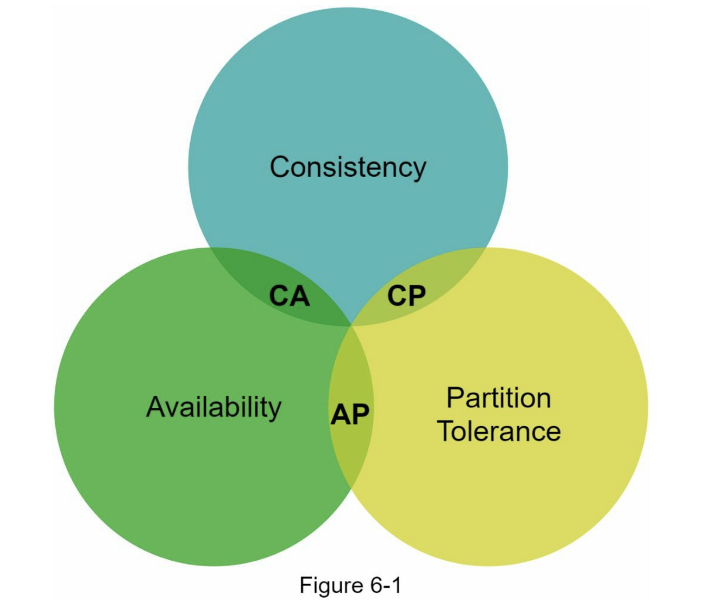

  **CP（一致性和分区容错）系统**：CP 键值存储在牺牲可用性的同时支持一致性和分区容错。

  **AP（可用性和分区容错）系统**：AP 键值存储支持可用性和分区容错，同时牺牲一致性

  **CA（一致性和可用性）系统**：CA 键值存储支持一致性和可用性，同时牺牲分区容错性。由于网络故障是不可避免的，分布式系统必须容忍网络分区。因此，CA 系统不能存在于现实世界的应用程序中。

  您在上面阅读的内容主要是定义部分。为了更容易理解，让我们看一些具体的例子。在分布式系统中，数据通常会被复制多次。假设数据被复制到三个副本节点n1、n2和n3上，如图6-2所示。

- **理想情况**

  在理想世界中，网络分区永远不会发生。写入 n1 的数据会自动复制到 n2 和 n3。实现了一致性和可用性。

  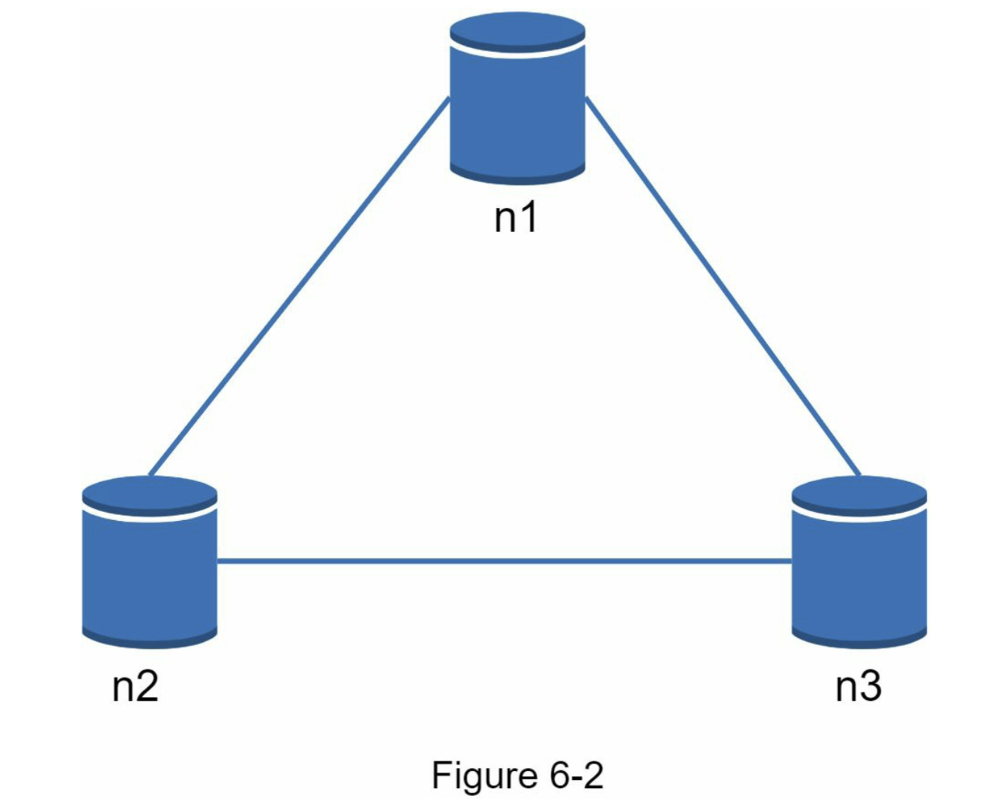

- **真实世界的分布式系统**

  在分布式系统中，分区是不可避免的，当出现分区时，我们必须在一致性和可用性之间做出选择。图6-3中，n3宕机，无法与n1、n2通信。如果客户端将数据写入 n1 或 n2，则数据无法传播到 n3。如果数据写入 n3 但尚未传播到 n1 和 n2，则 n1 和 n2 将具有陈旧数据。

  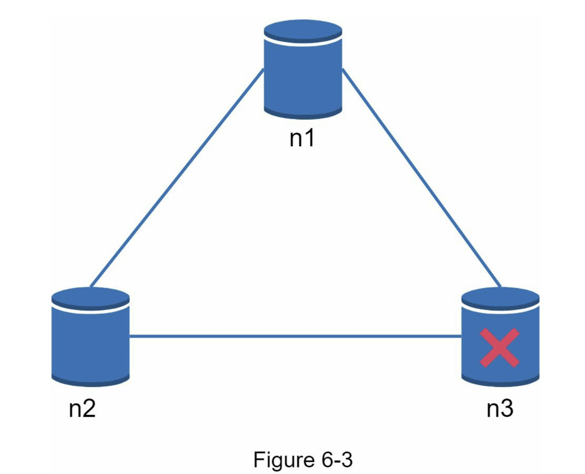

  如果我们选择一致性大于可用性（CP系统），我们必须阻止所有对n1和n2的写操作，以避免这三个服务器之间的数据不一致，这使得系统不可用。银行系统通常有极高的一致性要求。例如，对于银行系统来说，显示最新的余额信息是至关重要的。如果由于网络分区而发生不一致，在不一致问题解决之前，银行系统会返回一个错误。

  然而，如果我们选择可用性大于一致性（AP系统），系统就会一直接受读取，即使它可能返回陈旧的数据。对于写，n1和n2将继续接受写，当网络分区解决后，数据将被同步到n3。

  选择正确的 CAP 以确保适合你的用例是构建分布式键值存储的重要一步。你可以与面试官讨论这个问题并相应地设计系统

## 系统组件

  在本节中，我们将讨论以下用于构建键值存储的核心组件和技术：

- 数据分区
- 数据复制
- 一致性
- 不一致解决方案
- 故障处理
- 系统架构图
- 写入路径
- 读取路径

下面的内容主要基于三个流行的键值存储系统：Dynamo [4]、Cassandra [5] 和 BigTable [6]。

## 数据分区

对于大型应用程序，将完整的数据集放在单个服务器中是不可行的。实现这一点的最简单方法是将数据拆分为更小的分区并将它们存储在多个服务器中。分区数据时有两个挑战：

- 跨多个服务器平均分配数据。
- 当节点被添加或删除时，尽量减少数据移动。

第 5 章中讨论的一致性哈希是解决这些问题的一种很好的技术。让我们重新审视一致性哈希在高层次上的工作原理。

- 首先，服务器被放置在哈希环上。在图 6-4 中，8 个服务器，分别用 s0、s1、...、s7 表示，放在哈希环上。
- 接下来，将一个键散列到同一个环上，并将其存储在顺时针方向移动时遇到的第一个服务器上。例如，key0 使用此逻辑存储在 s1 中。

  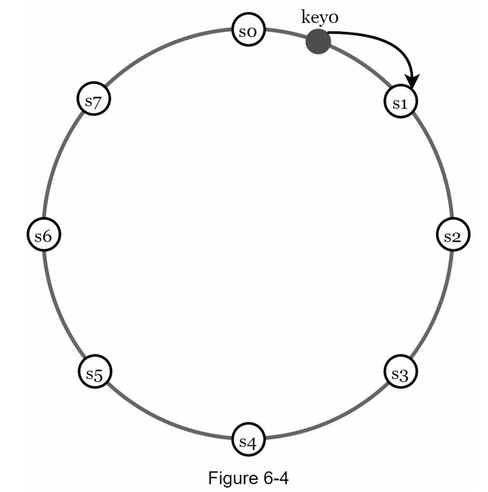

使用一致性哈希对数据进行分区有以下优点：

  - 自动缩放：可以根据负载自动添加和删除服务器
  - 异构性：服务器的虚拟节点数与服务器容量成正比。例如，容量越大的服务器分配的虚拟节点越多。

## 数据复制

为了实现高可用性和可靠性，必须在 N 个服务器上异步复制数据，其中 N 是一个可配置参数。这N台服务器的选择逻辑如下：将key映射到哈希环上的某个位置后，从该位置顺时针走，选择环上的前N台服务器存储数据副本。在图 6-5（N = 3）中，key0 被复制到 s1、s2 和 s3。

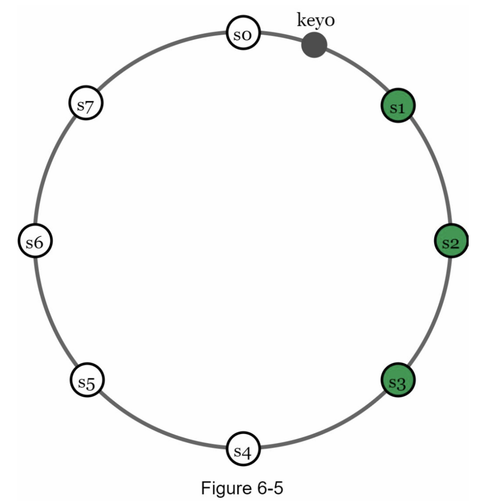

对于虚拟节点，环上的前 N 个节点可能由少于 N 个物理服务器拥有。为避免此问题，我们在执行顺时针行走逻辑时仅选择唯一的服务器。

由于停电、网络问题、自然灾害等原因，同一数据中心内的节点经常同时发生故障。为了更好的可靠性，副本被放置在不同的数据中心，数据中心之间通过高速网络连接。

## 一致性

由于数据在多个节点进行复制，因此必须跨副本同步。Quorum 共识可以保证读写操作的一致性。 让我们先建立几个定义。

N = 副本数

W = 大小为 W 的规定写入。要将写入操作视为成功，必须从 W 个副本确认写入操作。

R = 大小为 R 的读取规定人数。为了使读取操作被认为是成功的，读取操作必须等待至少R个副本的响应。

考虑以下图 6-6 中所示的示例，其中 N = 3。

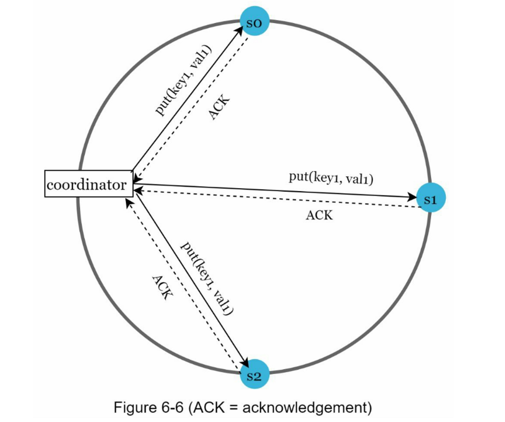

W = 1 并不意味着数据写在一台服务器上。 例如，对于图 6-6 中的配置，数据被复制到 s0、s1 和 s2。 W = 1 表示协调器必须至少收到一个确认才能认为写操作成功。例如，如果我们收到来自 s1 的确认，我们就不再需要等待来自 s0 和 s2 的确认。 协调器充当客户端和节点之间的代理。

W、R和N的配置是一个典型的延迟和一致性之间的权衡。如果W = 1 或R = 1，操作会很快返回，因为协调器只需要等待来自一个副本的响应。 如果 W 或 R > 1，系统提供更好的一致性； 但是，查询会变慢，因为协调器必须等待最慢副本的响应。

如果W+R>N，就能保证强一致性，因为至少有一个重叠的节点拥有最新的数据，以保证一致性。

如何配置N、W和R以适应我们的使用情况？

下面是一些可能的设置：

- 如果R=1，W=N，系统被优化为快速读取
- 如果W=1，R=N，系统被优化为快速写入
- 如果W+R>N，就可以保证强一致性（通常N=3，W=R=2）。
- 如果W+R<=N，则不能保证强一致性

根据要求，我们可以调整W、R、N的值，以达到理想的一致性水平。

## 一致性模型

一致性模型是设计键值存储时要考虑的另一个重要因素。 一致性模型定义了数据一致性的程度，并且存在多种可能的一致性模型：

- 强一致性：任何读操作都会返回一个与最新的写数据项的结果相对应的值。客户端永远不会看到过期的数据
- 弱一致性：后续的读操作可能看不到最新的值。
- 最终一致性：这是弱一致性的一种特殊形式。只要有足够的时间，所有的更新都会被传播，而且所有的副本都是一致的。

强一致性通常是通过强迫一个副本不接受新的读/写，直到每个副本都同意当前的写来实现的。这种方法对于高可用系统来说并不理想，因为它可能会阻塞新的操作。Dynamo和Cassandra采用最终一致性，这是我们推荐的键值存储的一致性模型。

从并发写入来看，最终一致性允许不一致的值进入系统，并迫使客户端读取这些值来进行调和。下一节将解释调和是如何与版本管理一起工作的。

## 不一致的解决方法：版本控制

复制提供了高可用性，但会导致副本之间的不一致。 **版本控制**和**矢量锁**用于解决不一致问题。版本化意味着将每一次数据修改都视为一个新的不可更改的数据版本。在我们谈论版本控制之前，让我们用一个例子来解释不一致是如何发生的：

如图6-7所示，副本节点n1和n2的值相同。 让我们称这个值为原始值。 server 1 和 server 2 通过 get(“name”) 操作获得相同的值。

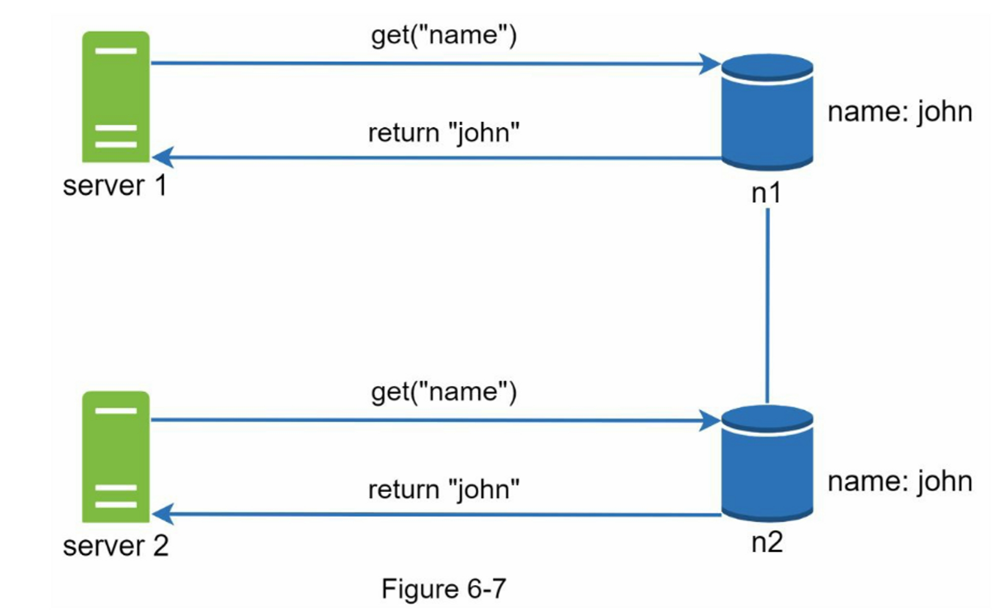

接下来，server 1 将名称更改为“johnSanFrancisco”，server 2 将名称更改为“johnNewYork”，如图 6-8 所示。 这两个更改是同时执行的。 现在，我们有冲突的值，称为版本 v1 和 v2。

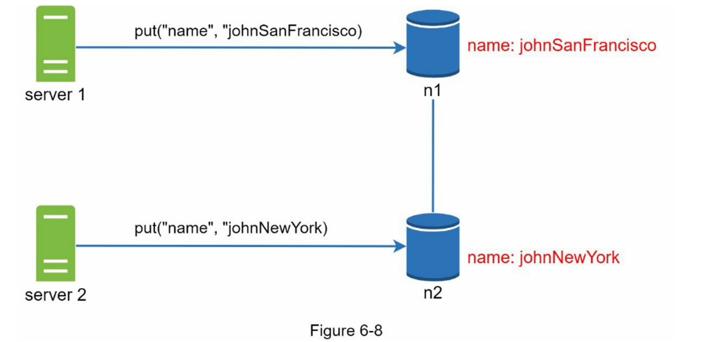

在此示例中，可以忽略原始值，因为修改是基于它的。 但是，没有明确的方法来解决最后两个版本的冲突。 为了解决这个问题，我们需要一个可以检测冲突并协调冲突的版本控制系统。

**向量时钟**是解决此问题的常用技术。

让我们来看看向量时钟是如何工作的。

向量时钟是与数据项关联的键值 [server, version] 对。 它可用于检查一个版本是否先于、成功或与其他版本冲突。

假设一个向量时钟用 D([S1, v1], [S2, v2], ..., [Sn, vn]) 表示，其中 D 是数据项，v1 是版本计数器，s1 是服务器数字等。如果数据项 D 被写入服务器 Si，系统必须执行以下任务之一：

- 如果 [Si, vi] 存在，则增加 vi。
- 否则，创建一个新的条目[Si, 1]。

上面的抽象逻辑用一个具体的例子来解释，如图6-9所示：

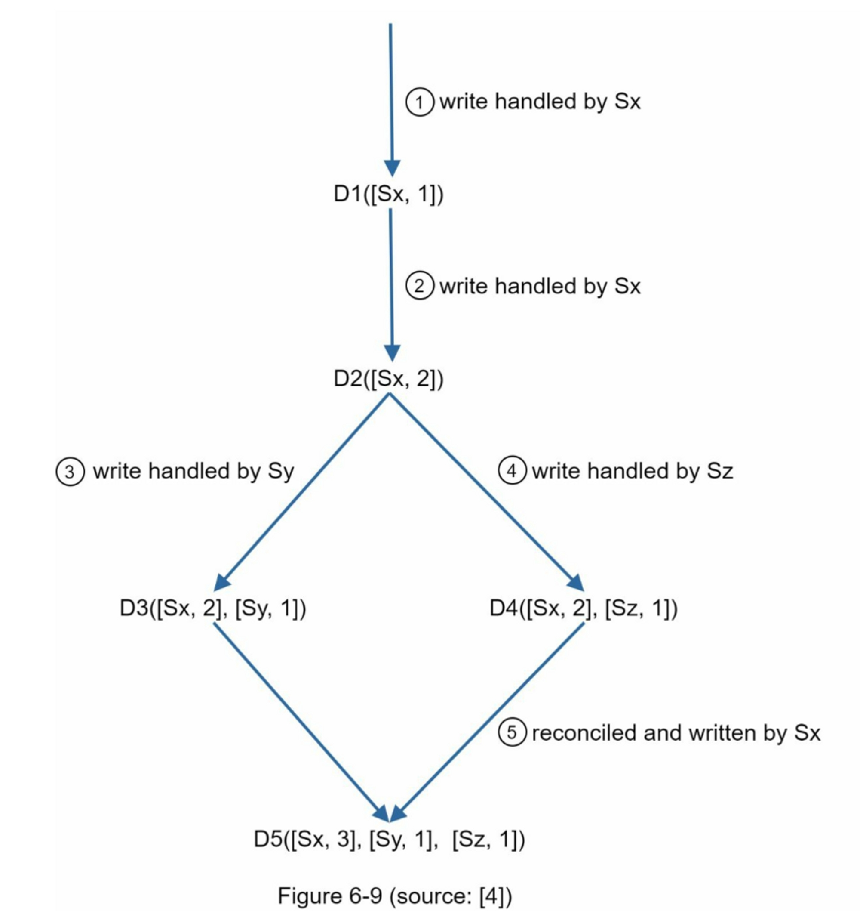

1. 客户端向系统写入数据项 D1，写入由服务器 Sx 处理，服务器现在具有向量时钟 D1[(Sx, 1)]。
2. 另一个客户端读取最新的 D1，将其更新为 D2，然后写回。 D2 继承自 D1，因此它会覆盖 D1。 假设写入由同一个服务器 Sx 处理，该服务器现在具有向量时钟 D2([Sx, 2])。
3. 另一个客户端读取最新的 D2，将其更新为 D3，然后写回。 假设写操作由服务器 Sy 处理，它现在有向量时钟 D3([Sx, 2], [Sy, 1]))。
4. 另一个客户端读取最新的 D2，将其更新为 D4，然后写回。 假设写入由服务器 Sz 处理，它现在有 D4([Sx, 2], [Sz, 1]))。
5. 当另一个客户端读取D3和D4时，发现冲突，这是由于数据项D2被Sy和Sz同时修改造成的。 冲突由客户端解决，并将更新的数据发送到服务器。 假设写入由 Sx 处理，它现在有 D5([Sx, 3], [Sy, 1], [Sz, 1])。 我们将很快解释如何检测冲突。

使用向量时钟，如果Y的向量时钟中的每个参与者的版本计数器大于或等于版本X中的版本计数器，则很容易判断版本X是版本Y的祖先（即无冲突）。例如，向量时钟 D([s0, 1], [s1, 1])] 是 D([s0, 1], [s1, 2]) 的祖先。因此，未记录任何冲突。

类似地，如果 Y 的向量时钟中有任何参与者的计数器小于其在 X 中对应的计数器，则可以判断版本 X 是 Y 的兄弟版本（即存在冲突）。例如，以下两个 矢量时钟表示存在冲突：D([s0, 1], [s1,2]) 和 D([s0, 2], [s1, 1])

尽管向量时钟可以解决冲突，但也有两个明显的缺点。 首先，向量时钟增加了客户端的复杂性，因为它需要实现冲突解决逻辑。

其次，向量时钟中的 [server: version] 对可能会快速增长。为了解决这个问题，我们为长度设置了一个阈值，如果超过了限制，则删除最旧的对。这可能导致协调效率低下，因为后代关系无法准确确定。然而，基于Dynamo论文[4]，亚马逊在生产中还没有遇到这个问题；因此，这可能是大多数公司可以接受的解决方案。

## 故障处理

与任何大规模的系统一样，故障不仅是不可避免的，而且是常见的。处理故障情况是非常重要的。在本节中，我们首先介绍检测故障的技术。然后，我们将介绍常见的故障解决策略。

- 故障检测

  在分布式系统中，仅因为另一台服务器这样说就认为一台服务器已宕机是不够的。 通常，至少需要两个独立的信息源才能将服务器标记为宕机。

  如图 6-10 所示，all-to-all 多播是一种直接的解决方案。 但是，当系统中有很多服务器时，这是低效的。

  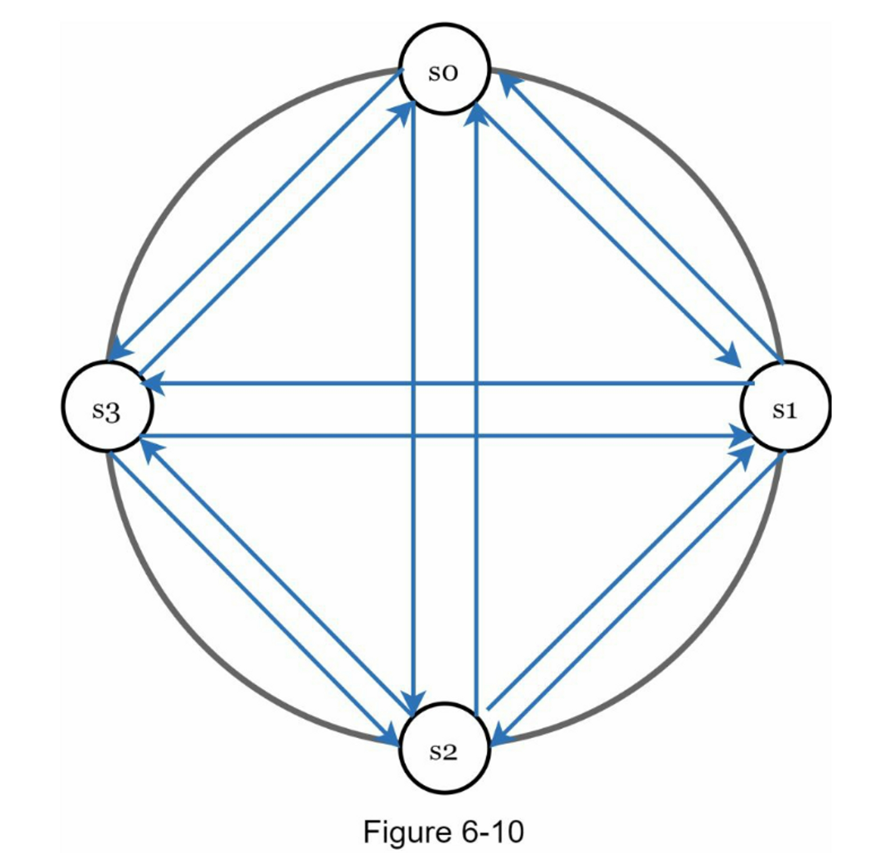

  一个更好的解决方案是使用分散的故障检测方法，如`gossip`协议。`gossip`协议的工作原理如下：

    - 每个节点维护一个节点成员列表，其中包含成员ID和心跳计数器。
    - 每个节点定期增加它的心跳计数器
    - 每个节点定期向一组随机节点发送心跳，然后再传播到另一组节点上
    - 一旦节点收到心跳，成员名单就会更新到最新信息。
    - 如果心跳没有增加超过预定的时间，该成员被认为是离线的。

  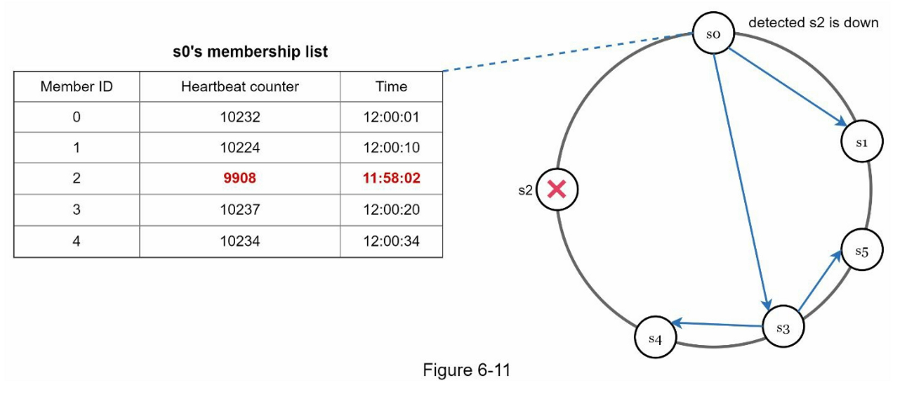

  如图6-11所示：

    - 节点s0维护一个节点成员列表，如左侧所示
    - 节点s0注意到节点s2（成员ID=2）的心跳计数器很长时间没有增加。
    - 节点s0向一组随机节点发送包括s2的信息的心跳。一旦其他节点确认s2的心跳计数器长时间没有更新，节点s2就会被标记下来，这个信息会传播给其他节点。

- 处理暂时性故障

  通过`gossip`协议检测到故障后，系统需要部署一定的机制来确保可用性。 在严格的仲裁方法(`quorum`)中，读取和写入操作可以被阻止，如仲裁共识部分所示。

  一种称为“草率仲裁(`sloppy quorum`)”[4] 的技术用于提高可用性。 系统不会强制执行法定人数要求，而是选择前 W 个健康的服务器进行写入，并选择前 R 个健康的服务器进行哈希环上的读取。 离线服务器将被忽略。

  如果由于网络或服务器故障导致服务器不可用，将由另一台服务器临时处理请求，当宕机服务器启动时，更改将被推回以实现数据一致性。这个过程称为**暗示切换（hinted handof）**。由于图6-12中s2不可用，读写暂时交由s3处理，当 s2 重新上线时，s3 会将数据交还给 s2。

    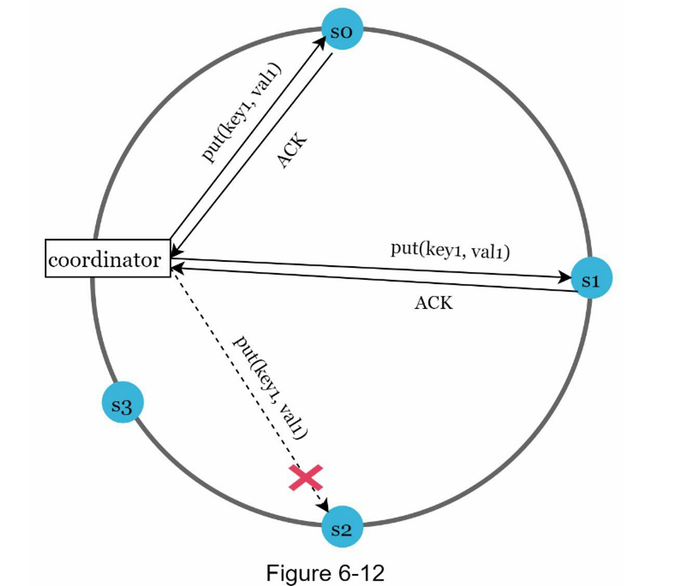

- 处理永久性故障

  提示切换用于处理临时故障。 如果副本永久不可用怎么办？

  为了处理这种情况，我们实施了一个**反熵协议（anti-entropy protocol）**来保持副本同步。 反熵需要比较副本上的每条数据，并将每个副本更新为最新版本。

  Merkle树用于检测不一致，并尽量减少传输的数据量。

  引自维基百科 [7]：“哈希树或 Merkle 树是一棵树，其中每个非叶节点都标有其子节点的标签或值（如果是叶子）的哈希值。 哈希树允许对大型数据结构的内容进行高效和安全的验证”。

  假设键空间是从 1 到 12，下面的步骤展示了如何构建 Merkle 树，突出显示的框表示不一致。

    - 第1步：将密钥空间划分为桶（在我们的例子中为4个），如图6-13所示。 一个桶被用作根级节点，以保持树的有限深度

    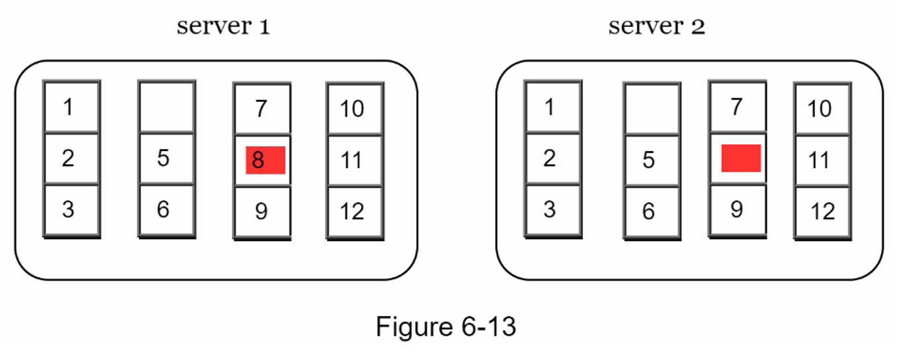

    - 第2步：一旦创建了桶，使用统一的散列方法对桶中的每个密钥进行散列（图6-14）。

    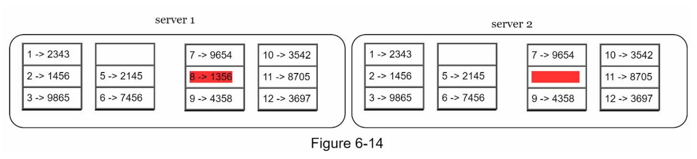

    - 第3步：为每个桶创建一个哈希节点（图6-15）

    

    - 第4步：通过计算子代的哈希值，向上建立树，直到根（图6-16）。

    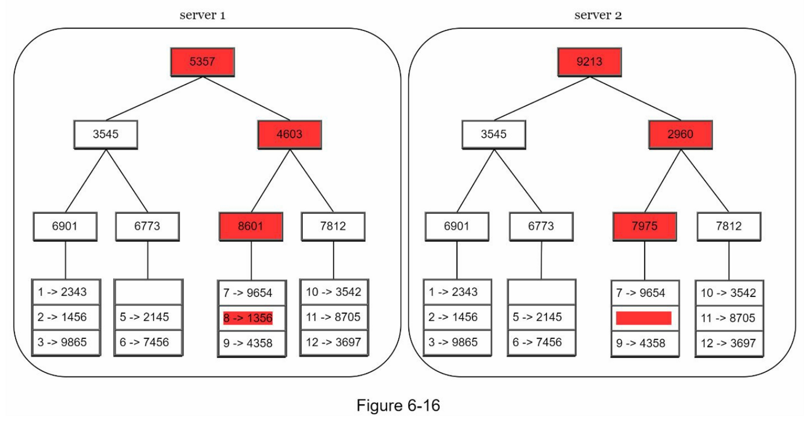

  要比较两个Merkle树，首先要比较根哈希值。如果根哈希值匹配，则两个服务器有相同的数据。如果根哈希值不一致，那么就比较左边的子哈希值，然后是右边的子哈希值。你可以遍历该树，找到哪些桶没有被同步，并只同步这些桶。

  使用Merkle树，需要同步的数据量与两个副本之间的差异成正比，而不是它们包含的数据量。在现实世界的系统中，桶的大小是相当大的。例如，一个可能的配置是每十亿个键有一百万个桶，所以每个桶只包含1000个键。

- 处理数据中心的中断故障

  数据中心的中断可能是由于停电、网络中断、自然灾害等原因造成的。为了建立一个能够处理数据中心中断的系统，在多个数据中心之间**复制数据**是非常重要的。即使一个数据中心完全离线，用户仍然可以通过其他数据中心访问数据。

## 系统构架图

现在我们已经讨论了设计键值存储时的不同技术考虑，我们可以将注意力转移到架构图上，如图 6-17 所示。

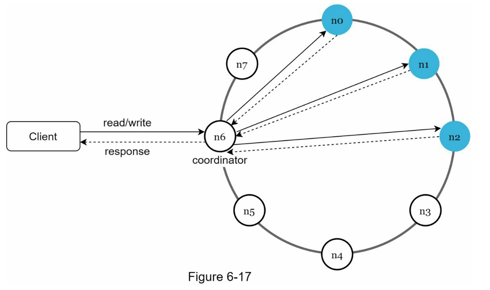

架构的主要特点列举如下：

- 客户端通过简单的API与键值存储通信：get(key)和put(key, value)。
- 协调器是一个节点，在客户端和键值存储之间充当代理。
- 节点采用一致性hash的散列方式分布在一个环上。
- 该系统是完全去中心化的，所以添加和移动节点可以自动进行。
- 数据在多个节点上复制。
- 不存在单点故障，因为每个节点都有相同的职责。

由于设计是分散的，每个节点执行许多任务，如图6-18所示。

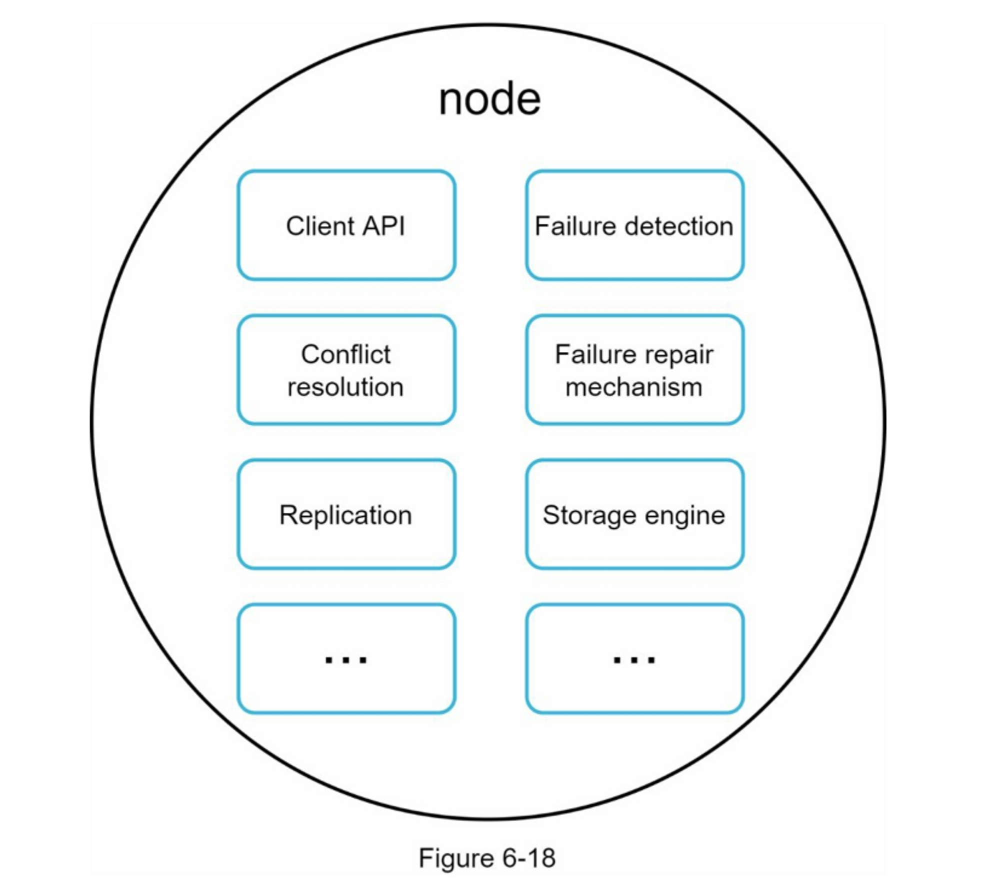

## 写入路径

图 6-19 解释了将写请求定向到特定节点后会发生什么。 请注意，建议的写/读路径设计主要基于 Cassandra [8] 的体系结构。

1. 写入请求持久保存在提交日志文件中。
2. 数据保存在内存缓存中。

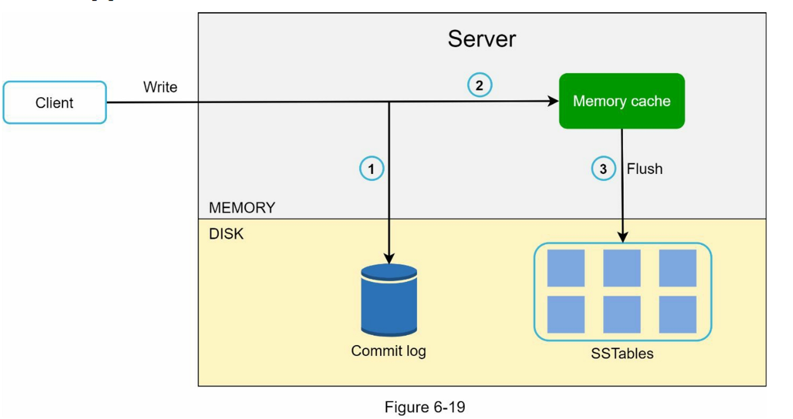

1. 当内存缓存已满或达到预定义的阈值时，数据将刷新到磁盘上的 SSTable [9]。 注意：排序字符串表 (SSTable) 是 <key, value> 对的排序列表。 有兴趣进一步了解 SStable 的读者，请参阅参考资料 [9]。

## 读取路径

读取请求被引导到一个特定的节点后，它首先检查数据是否在内存缓存中。如果是，数据就会被返回给客户端，如图6-20所示。

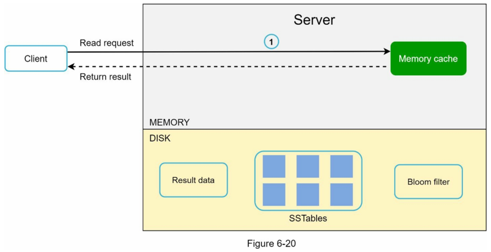

如果数据不在内存中，就会从磁盘中检索出来。我们需要一个有效的方法来找出哪个SSTable中包含了该键。**布隆过滤器**[10]通常被用来解决这个问题。

当数据不在内存中时，读取路径如图6-21所示。

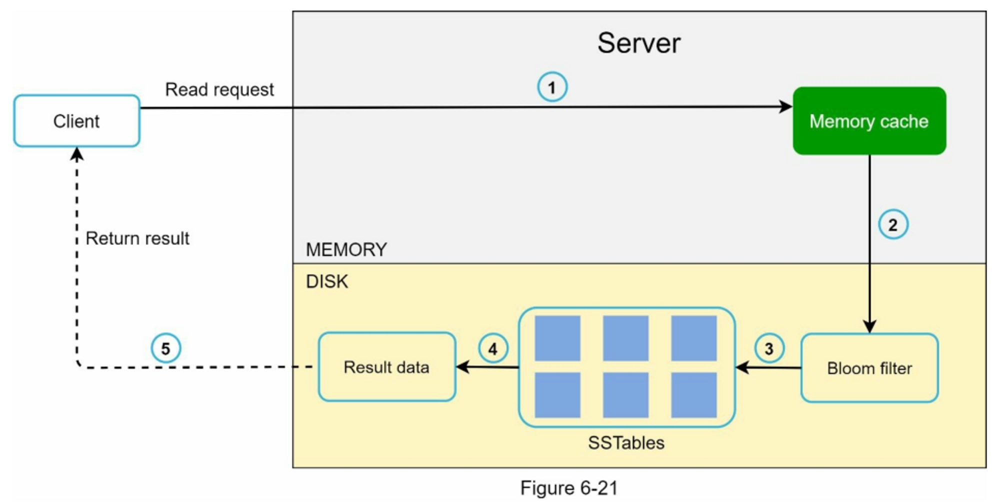

1. 系统首先检查数据是否在内存中。如果没有，就转到第2步。
2. 如果数据不在内存中，系统会检查Bloom过滤器。
3. Bloom过滤器被用来计算哪些SSTables可能包含密钥。
4. SSTables会返回数据集的结果。
5. 数据集的结果被返回给客户端。

## 总结

  本章涵盖了许多概念和技术。为了加深记忆，下表总结了分布式键值存储的特点和相应的技术。

  | 目标/问题 | 技术                                       |
  |------------------------------------------| --- |
  | 存储大数据的能力 | 使用一致性哈希将负载分散到多个服务器上                      |
  | 高可用性读取 | 数据复制  多数据中心设置                            |
  | 高可用性写入 | 使用向量时钟（vector clocks）进行版本控制和冲突解决         |
  | 数据分区 | 一致性哈希                                    |
  | 增量可扩展性 | 一致性哈希                                    |
  | 异质性（heterogeneity） | 一致性哈希                                    |
  | 处理临时性故障 | 草率仲裁（sloppy quorum）和暗示切换（hinted handoff） |
  | 处理永久性故障 | Merkle 树                                 |
  | 处理数据中心中断 | 跨数据中心复制                                  |

## 参考资料

  - [1] Amazon DynamoDB: [https://aws.amazon.com/dynamodb/](https://aws.amazon.com/dynamodb/)
  - [2] memcached: [https://memcached.org/](https://memcached.org/)
  - [3] Redis: [https://redis.io/](https://redis.io/)
  - [4] Dynamo: Amazon’s Highly Available Key-value Store:
  [https://www.allthingsdistributed.com/files/amazon-dynamo-sosp2007.pdf](https://www.allthingsdistributed.com/files/amazon-dynamo-sosp2007.pdf)
  - [5] Cassandra: [https://cassandra.apache.org/](https://cassandra.apache.org/)
  - [6] Bigtable: A Distributed Storage System for Structured Data:
  [https://static.googleusercontent.com/media/research.google.com/en//archive/bigtable-](https://static.googleusercontent.com/media/research.google.com/en//archive/bigtable-)
  osdi06.pdf
  - [7] Merkle tree: [https://en.wikipedia.org/wiki/Merkle_tree](https://en.wikipedia.org/wiki/Merkle_tree)
  - [8] Cassandra architecture: [https://cassandra.apache.org/doc/latest/architecture/](https://cassandra.apache.org/doc/latest/architecture/)
  - [9] SStable: [https://www.igvita.com/2012/02/06/sstable-and-log-structured-storage-leveldb/](https://www.igvita.com/2012/02/06/sstable-and-log-structured-storage-leveldb/)
  - [10] Bloom filter [https://en.wikipedia.org/wiki/Bloom_filter](https://en.wikipedia.org/wiki/Bloom_filter)