# 第2章 附近的好友

在本章中，我们将为一个移动应用的新功能"附近的好友"设计一个可扩展的后端系统。对于选择加入并授予位置访问权限的用户，移动客户端会显示地理位置上靠近的好友列表。如果你想看一个真实的例子，可以参考这篇关于Facebook应用类似功能的文章[1]。

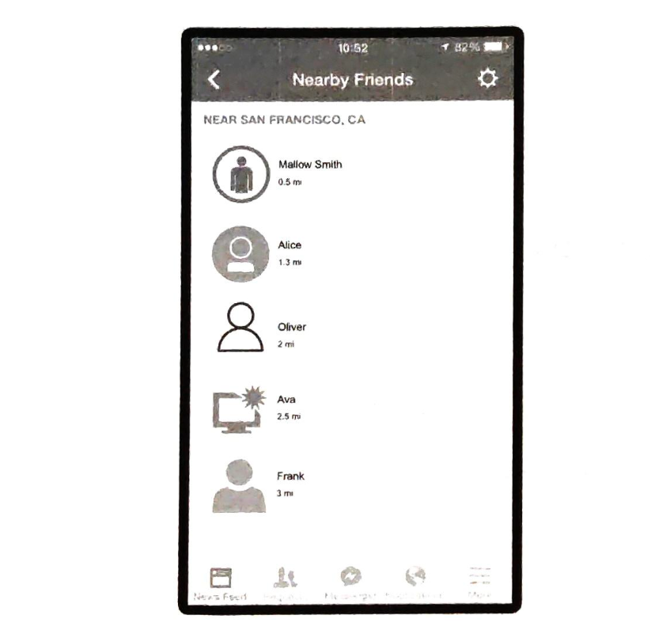

图2.1: Facebook的附近好友功能

如果你读过第1章"邻近服务"，你可能会想知道为什么我们需要单独一章来设计"附近的好友"，因为它看起来与邻近服务很相似。但如果仔细思考，你会发现有重大区别。在邻近服务中，商家的地址是静态的，因为它们的位置不会改变，而在"附近的好友"中，数据更加动态，因为用户的位置经常变化。

## 第1步 - 理解问题并确定设计范围
任何达到Facebook规模的后端系统都十分复杂。在开始设计之前，我们需要问一些澄清性问题来缩小范围。

候选人：多近的距离才算是"附近"？  
面试官：5英里。这个数字应该是可配置的。

候选人：我可以假设距离是按用户之间的直线距离计算吗？在现实生活中，用户之间可能会有河流等障碍物，导致实际行程距离更长。  
面试官：是的，这是一个合理的假设。

候选人：这个应用有多少用户？我可以假设有10亿用户，其中10%使用附近好友功能吗？  
面试官：是的，这是一个合理的假设。

候选人：我们需要存储位置历史记录吗？  
面试官：是的，位置历史记录对机器学习等不同用途很有价值。

候选人：如果一个好友超过10分钟没有活动，这个好友是否会从附近好友列表中消失？或者我们应该显示最后已知的位置？  
面试官：我们可以假设不活跃的好友将不再显示。

候选人：我们需要担心GDPR或CPA等隐私和数据法律吗？  
面试官：好问题。为了简单起见，现在暂时不用考虑这个问题。

### 功能需求
- 用户应该能够在移动应用上查看附近的好友。每个好友条目都会显示与用户的距离以及该距离信息的最后更新时间。
- 附近好友列表应该每隔几秒钟更新一次。

### 非功能需求
- 低延迟。及时接收好友的位置更新很重要。
- 可靠性。系统整体需要可靠，但偶尔的数据点丢失是可以接受的。
- 最终一致性。位置数据存储不需要强一致性。在不同副本中接收位置数据有几秒钟的延迟是可以接受的。

### 粗略估算
让我们做一个粗略估算来确定我们的解决方案需要解决的潜在规模和挑战。以下是一些约束和假设：

- 附近的好友定义为位置在5英里半径范围内的好友。
- 位置刷新间隔为30秒。这是因为人类步行速度较慢（平均每小时3~4英里）。30秒内行走的距离对"附近的好友"功能影响不大。
- 平均每天有1亿用户使用"附近的好友"功能。
- 假设并发用户数是DAU（日活跃用户）的10%，所以并发用户数是1000万。
- 平均每个用户有400个好友。假设所有好友都使用"附近的好友"功能。
- 应用每页显示20个附近的好友，并可以根据请求加载更多附近的好友。

| QPS计算                                                                                                                                                                |
|:---------------------------------------------------------------------------------------------------------------------------------------------------------------------|
| - 1亿DAU <br/> - 并发用户数：10% × 1亿 = 1000万 <br/> - 用户每30秒报告一次位置 <br/> - 位置更新OPS = 1000万 / 30 = ~334,000 |

在其他章节中，我们通常在高层设计之前讨论API设计和数据模型。然而，对于这个问题，客户端和服务器之间的通信协议可能不是一个简单的HTTP协议，因为我们需要将位置数据推送给所有好友。在不了解高层设计的情况下，很难知道API是什么样的。因此，我们先讨论高层设计。

### 高层设计
从高层次来看，这个问题需要一个高效的消息传递设计。从概念上讲，用户希望收到每个在附近的活跃好友的位置更新。理论上，这可以完全采用点对点的方式，即用户可以与附近的每个活跃好友保持持久连接（图2.2）。

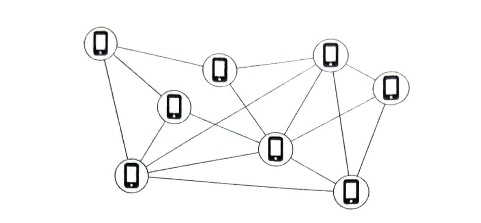  
图2.2: 点对点

对于连接可能不稳定且电量预算有限的移动设备来说，这种解决方案并不实用，但这个想法为总体设计方向提供了一些启发。
一个更实用的设计是有一个共享的后端，如图2.3所示：

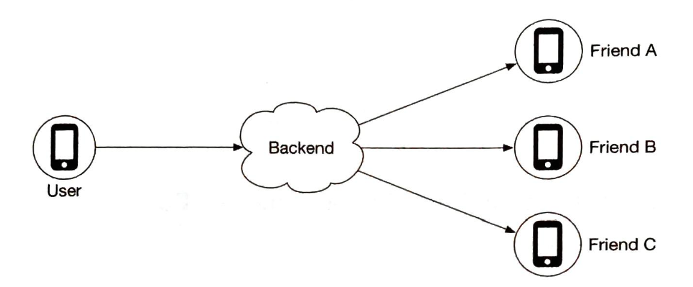  
图2.3: 共享后端

图2.3中后端的职责是什么？
- 接收所有活跃用户的位置更新。
- 对于每个位置更新，找到应该接收它的所有活跃好友，并将其转发到这些用户的设备。
- 如果两个用户之间的距离超过某个阈值，则不将其转发给接收者的设备。

这听起来很简单。问题是什么？好吧，要大规模实现这一点并不容易。我们有1000万活跃用户。每个用户每30秒更新一次位置信息，每秒有334K次更新。如果平均每个用户有400个好友，并且我们进一步假设大约10%的好友在线且在附近，那么后端每秒需要转发334K × 400 × 10% = 1400万次位置更新。这是大量需要转发的更新。

### 建议的设计
我们首先为较小规模的后端提出一个高层设计。之后在深入探讨部分，我们将优化设计以实现扩展。
图2.4显示了应该满足功能需求的基本设计。让我们逐一介绍设计中的每个组件。

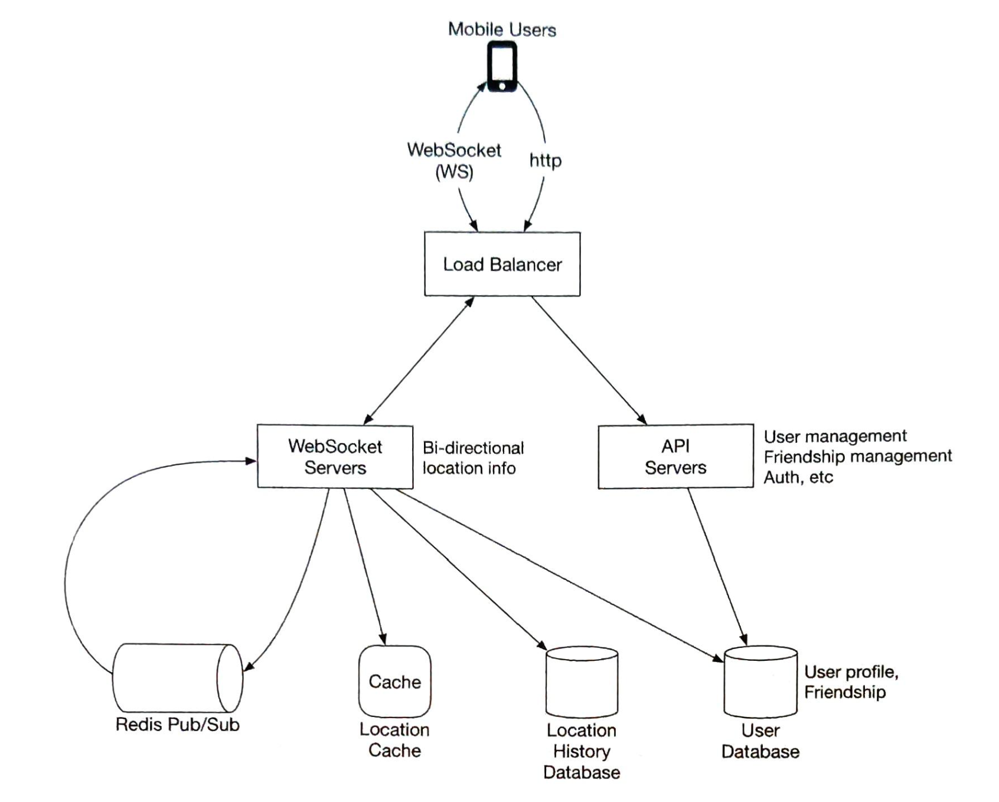  
图2.4: 高层设计

#### 负载均衡器
负载均衡器位于RESTful API服务器和有状态的双向WebSocket服务器前面。它将流量分配到这些服务器上以均匀分散负载。

#### RESTful API服务器
这是一个无状态HTTP服务器集群，处理典型的请求/响应流量。API请求流程如图2.5所示。这个API层处理添加/删除好友、更新用户资料等辅助任务。这些都很常见，我们不会详细讨论。

  
图2.5: RESTful API请求流程

#### WebSocket服务器
这是一个有状态服务器集群，处理好友位置的近实时更新。每个客户端与这些服务器中的一个维护一个持久的WebSocket连接。当有一个位置更新来自搜索半径内的好友时，更新会通过这个连接发送给客户端。

WebSocket服务器的另一个主要职责是处理"附近的好友"功能的客户端初始化。它为移动客户端提供所有在线的附近好友的位置信息。我们稍后会详细讨论这是如何完成的。
注意：本章中"WebSocket连接"和"WebSocket连接处理程序"是可以互换的。

#### Redis位置缓存
Redis用于存储每个活跃用户的最新位置数据。缓存中的每个条目都设置了生存时间（TTL，Time To Live）。当TTL过期时，用户不再活跃，位置数据会从缓存中清除。每次更新都会刷新TTL。其他支持TTL的KV存储也可以使用。

#### 用户数据库
用户数据库存储用户数据和用户好友关系数据。可以使用关系数据库或NoSQL数据库。

#### 位置历史数据库
该数据库存储用户的历史位置数据。它与"附近的好友"功能没有直接关系。

#### Redis Pub/Sub服务器
Redis Pub/Sub[2]是一个非常轻量级的消息总线。Redis Pub/Sub中的频道创建成本很低。一个具有GB内存的现代Redis服务器可以容纳数百万个频道（也称为主题）。图2.6显示了Redis Pub/Sub的工作原理。

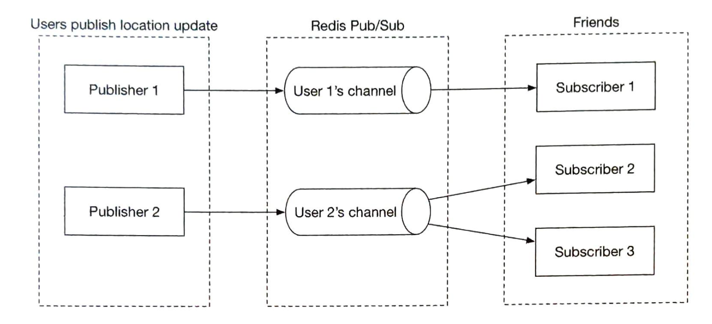  
图2.6: Redis Pub/Sub

在这个设计中，通过WebSocket服务器接收的位置更新会发布到Redis Pub/Sub服务器中用户自己的频道。每个活跃好友的专用WebSocket连接处理程序都会订阅该频道。当有位置更新时，WebSocket处理程序函数会被调用，并且对于每个活跃好友，该函数会重新计算距离。如果新距离在搜索半径内，新的位置和时间戳会通过WebSocket连接发送给好友的客户端。其他具有轻量级频道的消息总线也可以使用。

现在我们已经了解了每个组件的功能，让我们从系统的角度来看看当用户的位置发生变化时会发生什么。

#### 周期性位置更新
移动客户端通过持久的WebSocket连接发送周期性的位置更新。流程如图2.7所示。

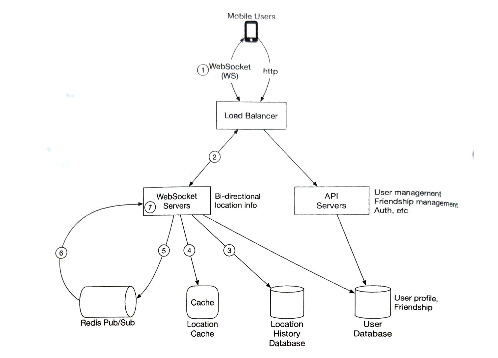  
图2.7: 周期性位置更新

1. 移动客户端向负载均衡器发送位置更新。
2. 负载均衡器将位置更新转发到该客户端在WebSocket服务器上的持久连接。
3. WebSocket服务器将位置数据保存到位置历史数据库。
4. WebSocket服务器在位置缓存中更新新位置。更新会刷新TTL。WebSocket服务器还将新位置保存在用户的WebSocket连接处理程序的变量中，用于后续的距离计算。
5. WebSocket服务器将新位置发布到Redis Pub/Sub服务器中用户的频道。步骤3到5可以并行执行。
6. 当Redis Pub/Sub在某个频道收到位置更新时，它会将更新广播给所有订阅者（WebSocket连接处理程序）。在这种情况下，订阅者是发送更新的用户的所有在线好友。对于每个订阅者（即用户的每个好友），其WebSocket连接处理程序都会收到用户位置更新。
7. 在收到消息时，WebSocket服务器（连接处理程序所在的服务器）计算发送新位置的用户（位置数据在消息中）与订阅者（位置数据存储在订阅者的WebSocket连接处理程序的变量中）之间的距离。
8. 这一步没有在图中画出。如果距离没有超过搜索半径，新的位置和最后更新时间戳会通过WebSocket连接发送给订阅者的客户端。否则，更新会被丢弃。

由于理解这个流程非常重要，让我们用一个具体的例子再次检查它，如图2.8所示。在开始之前，让我们做一些假设。

- 用户1的好友：用户2、用户3和用户4
- 用户5的好友：用户4和用户6

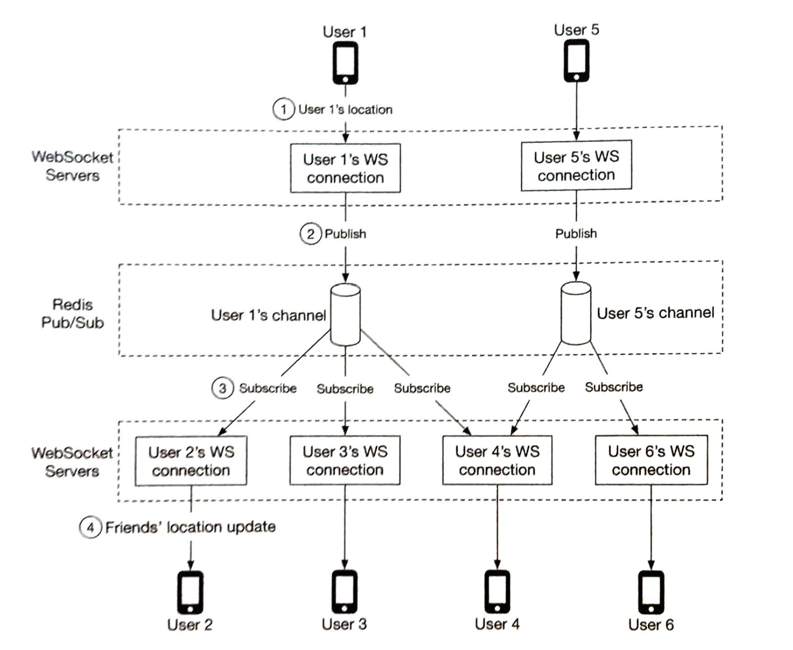  
图2.8: 向好友发送位置更新

1. 当用户1的位置发生变化时，他们的位置更新被发送到持有用户1连接的WebSocket服务器。
2. 位置被发布到Redis Pub/Sub服务器中用户1的频道。
3. Redis Pub/Sub服务器将位置更新广播给所有订阅者。在这种情况下，订阅者是WebSocket连接处理程序（用户1的好友）。
4. 如果发送位置的用户（用户1）与订阅者（用户2）之间的距离没有超过搜索半径，新位置会被发送到客户端（用户2）。

这个计算对频道的每个订阅者都会重复进行。由于平均每个用户有10个好友，并且我们假设10%的好友在线且在附近，因此每个用户的位置更新大约需要转发40次位置更新。

#### API设计
现在我们已经创建了一个高层设计，让我们列出需要的API。

WebSocket：用户通过WebSocket协议发送和接收位置更新。至少需要以下API。
1. 周期性位置更新
   请求：客户端发送纬度、经度和时间戳
   响应：无

2. 客户端接收位置更新
   发送的数据：好友位置数据和时间戳

3. WebSocket初始化
   请求：客户端发送纬度、经度和时间戳
   响应：客户端接收好友位置数据

4. 订阅新好友
   请求：WebSocket服务器发送好友ID
   响应：好友的最新纬度、经度和时间戳

5. 取消订阅好友
   请求：WebSocket服务器发送好友ID
   响应：无

HTTP请求：API服务器处理添加/删除好友、更新用户资料等任务。这些都很常见，我们不会在这里详细讨论。

#### 数据模型
另一个需要讨论的重要元素是数据模型。我们已经在高层设计中讨论了用户数据库，所以让我们专注于位置缓存和位置历史数据库。

#### 位置缓存
位置缓存存储所有已启用附近好友功能的活跃用户的最新位置。我们使用Redis作为这个缓存。缓存的键/值如表2.1所示。


表2.1：位置缓存

为什么不使用数据库来存储位置数据？
"附近的好友"功能只关心用户的当前位置。因此，我们只需要存储每个用户的一个位置。Redis是一个很好的选择，因为它提供超快的读写操作。它支持TTL，我们用它来自动清除不再活跃的用户。当前位置不需要持久存储。如果Redis实例宕机，我们可以用一个空的新实例替换它，让缓存随着新的位置更新流入而填充。活跃用户可能会在缓存预热时错过一两个更新周期的好友位置更新。这是一个可以接受的权衡。在深入探讨部分，我们将讨论当缓存被替换时如何减少对用户的影响。

#### 位置历史数据库
位置历史数据库存储用户的历史位置数据，模式如下：

|user_id| latitude| longitude| timestamp|
|:----------:|:---------:|:---------:|:---------:|

我们需要一个能够很好地处理大量写入工作负载并且可以水平扩展的数据库。Cassandra是一个很好的候选。我们也可以使用关系数据库。然而，使用关系数据库时，历史数据将无法适应单个实例，所以我们需要对数据进行分片。最基本的方法是按用户ID分片。这种分片方案确保负载在所有分片之间均匀分布，并且在操作上很容易维护。

## 第3步 - 深入设计
我们在上一节创建的高层设计在大多数情况下都能工作，但在我们的规模下可能会出现问题。在本节中，我们将一起发现随着规模增加而出现的瓶颈，并在此过程中研究消除这些瓶颈的解决方案。

### 每个组件的扩展性如何？
#### API服务器
扩展RESTful API层的方法是众所周知的。这些是无状态服务器，有很多方法可以根据CPU使用率、负载或I/O自动扩展集群。我们不会在这里详细讨论。

#### WebSocket服务器
对于WebSocket集群，根据使用情况自动扩展并不难。然而，WebSocket服务器是有状态的，所以在移除现有节点时需要小心。在可以移除节点之前，应该允许所有现有连接耗尽。为了实现这一点，我们可以在负载均衡器上将节点标记为"正在耗尽"，这样就不会有新的WebSocket连接路由到正在耗尽的服务器。一旦所有现有连接都关闭（或经过合理的长时间等待），就可以移除服务器。
在WebSocket服务器上发布应用软件的新版本需要同样的谨慎。
值得注意的是，有状态服务器的有效自动扩展是一个好的负载均衡器的工作。大多数云负载均衡器都能很好地处理这项工作。

#### 客户端初始化
移动客户端在启动时与其中一个WebSocket服务器实例建立持久的WebSocket连接。每个连接都是长期运行的。大多数现代语言都能够以合理的小内存占用维护许多长期运行的连接。

当WebSocket连接初始化时，客户端发送用户的初始位置，服务器在WebSocket连接处理程序中执行以下任务：

1. 更新位置缓存中用户的位置。
2. 将位置保存在连接处理程序的变量中，用于后续计算。
3. 从用户数据库加载所有用户的好友。
4. 向位置缓存发出批量请求，获取所有好友的位置。注意，因为我们在位置缓存中的每个条目上设置了与不活跃超时期间匹配的TTL，如果一个好友不活跃，他们的位置将不会在位置缓存中。
5. 对于缓存返回的每个位置，服务器计算用户与该位置的好友之间的距离。如果距离在搜索半径内，好友的资料、位置和最后更新时间戳通过WebSocket连接返回给客户端。
6. 对于每个好友，服务器订阅Redis Pub/Sub服务器中好友的频道。我们稍后会解释我们对Redis Pub/Sub的使用。由于创建新频道的成本很低，用户订阅所有活跃和不活跃好友的频道。不活跃的好友会在Redis Pub/Sub服务器上占用少量内存，但在他们上线之前不会消耗任何CPU或I/O（因为他们不发布更新）。
7. 将用户的当前位置发送到Redis Pub/Sub服务器中用户的频道。

#### 用户数据库
用户数据库包含两个不同的数据集：用户资料（用户ID、用户名、资料URL等）和好友关系。这些数据集在我们的设计规模下可能无法适应单个关系数据库实例。好消息是，数据可以通过基于用户ID的分片实现水平扩展。关系数据库分片是一种非常常见的技术。
作为旁注，在我们设计的规模下，用户和好友关系数据集很可能由专门的团队管理，并通过内部API提供。在这种情况下，WebSocket服务器将使用内部API而不是直接查询数据库来获取用户和好友相关的数据。无论是通过API访问还是直接数据库查询，在功能或性能方面都没有太大区别。

#### 位置缓存
我们选择Redis来缓存所有活跃用户的最新位置。如前所述，我们还在每个键上设置TTL。TTL在每次位置更新时都会更新。这限制了最大内存使用量。在峰值时有1000万活跃用户，每个位置占用不超过100字节，一个具有多GB内存的现代Redis服务器应该能够轻松容纳所有用户的位置信息。

然而，有1000万活跃用户大约每30秒更新一次，Redis服务器将需要处理每秒334K次更新。这个数字可能有点太高，即使对于现代的高端服务器来说也是如此。幸运的是，这个缓存数据很容易分片。每个用户的位置数据是独立的，我们可以通过基于用户ID对位置数据进行分片，将负载均匀地分散到几个Redis服务器上。

为了提高可用性，我们可以将每个分片上的位置数据复制到一个备用节点。如果主节点宕机，可以快速提升备用节点以最小化停机时间。

#### Redis Pub/Sub服务器
Pub/Sub服务器用作路由层，将消息（位置更新）从一个用户定向到所有在线好友。如前所述，我们选择Redis Pub/Sub是因为创建新频道的成本很低。当有人订阅时就会创建新频道。如果消息发布到没有订阅者的频道，消息会被丢弃，对服务器的负载很小。当创建频道时，Redis使用少量内存来维护一个哈希表和一个链表[3]来跟踪订阅者。如果用户离线时频道没有更新，在创建频道后不会使用CPU周期。我们在设计中以以下方式利用这些特性：

1. 我们为每个使用"附近的好友"功能的用户分配一个唯一的频道。用户在应用初始化时会订阅每个好友的频道，无论好友是否在线。这简化了设计，因为后端不需要处理在好友变为活跃时订阅好友的频道，或在好友变为不活跃时处理取消订阅。
2. 这种权衡是设计会使用更多内存。正如我们稍后会看到的，内存使用不太可能成为瓶颈。在这种情况下，用更高的内存使用换取更简单的架构是值得的。

我们需要多少Redis Pub/Sub服务器？让我们计算一下内存和CPU使用情况。

内存使用
假设为每个使用附近好友功能的用户分配一个频道，我们需要1亿个频道（10亿 × 10%）。假设平均每个用户有10个活跃好友使用这个功能（这包括附近或不附近的好友），并且在内部哈希表和链表中跟踪每个订阅者需要约20字节的指针，那么需要约200GB（1亿 × 20字节 × 10个好友 / 10^9 = 20GB）来保存所有频道。对于一个具有100GB内存的现代服务器，我们需要约2个Redis Pub/Sub服务器来保存所有频道。

CPU使用
如前所计算，Pub/Sub服务器每秒向订阅者推送约1400万次更新。虽然没有实际基准测试很难准确估计现代Redis服务器每秒可以推送多少消息，但可以安全地假设单个Redis服务器无法处理这种负载。让我们选择一个保守的数字，假设具有千兆网络的现代服务器每秒可以处理约100,000次订阅者推送。考虑到我们的位置更新消息很小，这个数字可能过于保守。使用这个保守估计，我们需要将负载分配到1400万 / 100,000 = 140个Redis服务器上。同样，这个数字可能过于保守，实际需要的服务器数量可能要少得多。

从计算中，我们得出结论：
- Redis Pub/Sub服务器的瓶颈是CPU使用率，而不是内存使用率
- 为了支持我们的规模，我们需要一个分布式Redis Pub/Sub集群

#### 分布式Redis Pub/Sub服务器集群
我们如何将频道分配到数百个Redis服务器上？好消息是频道之间是独立的。这使得基于发布者的用户ID进行分片来将频道分散到多个Pub/Sub服务器变得相对容易。但从实际操作的角度来看，有数百个Pub/Sub服务器，我们应该更详细地讨论如何做到这一点，因为服务器不可避免地会时不时地宕机。

在这里，我们引入一个服务发现组件到我们的设计中。有许多可用的服务发现包，其中etcd[4]和ZooKeeper[5]是最受欢迎的。我们对服务发现组件的需求很基本。我们需要这两个功能：

1. 能够在服务发现组件中保存服务器列表，并提供简单的UI或API来更新它。从根本上说，服务发现是一个用于保存配置数据的小型键值存储。使用图2.9作为例子，哈希环的键和值可能如下所示：
```
Key: /config/pub_sub_ring
Value: ["p_1", "p_2", "p_3", "p_4"]
```

2. 客户端（在这种情况下是WebSocket服务器）能够订阅"Value"（Redis Pub/Sub服务器）的任何更新。

在第1点提到的"Key"下，我们在服务发现组件中存储所有活跃Redis Pub/Sub服务器的哈希环（关于哈希环的详细信息，请参见《系统设计面试》第1卷中的一致性哈希章节或[6]）。Redis Pub/Sub服务器的发布者和订阅者使用哈希环来确定每个频道要与哪个Pub/Sub服务器通信。例如，在图2.9中，频道2位于Redis Pub/Sub服务器1中。

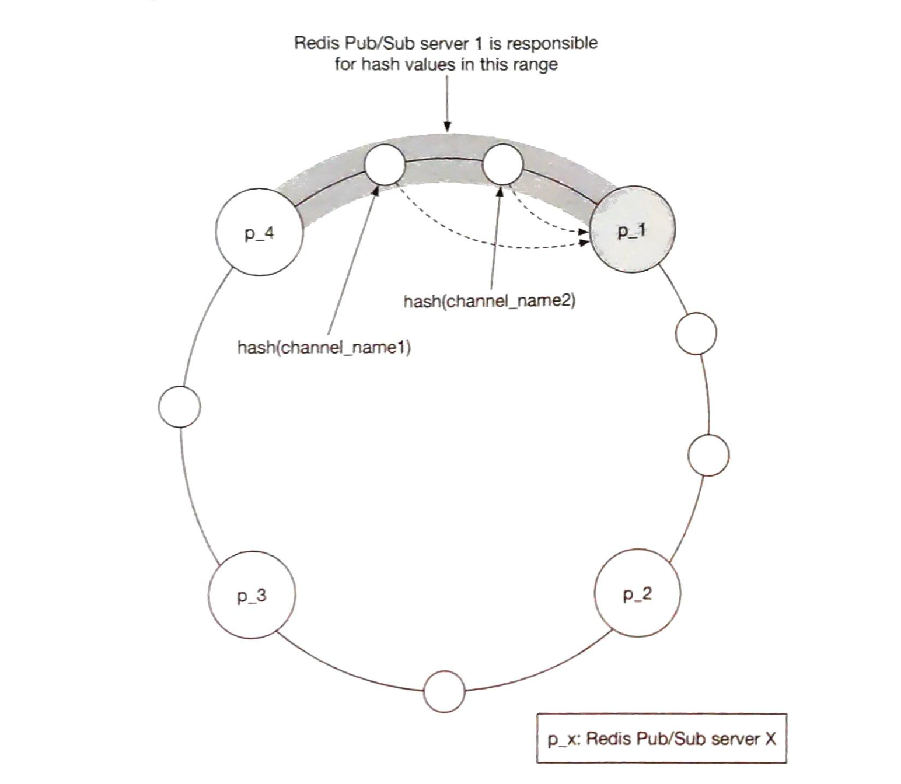
图2.9：一致性哈希

图2.10显示了当WebSocket服务器向用户的频道发布位置更新时会发生什么。

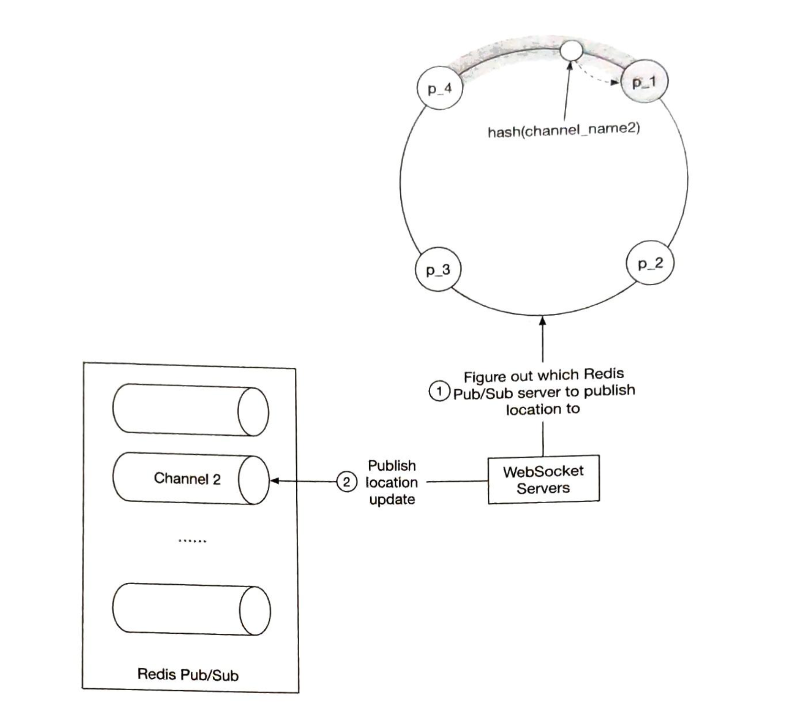
图2.10：确定正确的Redis Pub/Sub服务器

1. WebSocket服务器查询哈希环以确定要写入的Redis Pub/Sub服务器。真实数据存储在服务发现中，但为了效率，每个WebSocket服务器可以缓存哈希环的副本。WebSocket服务器订阅哈希环的任何更新以保持其本地内存副本最新。
2. WebSocket服务器将位置更新发布到该Redis Pub/Sub服务器上的用户频道。

订阅频道以获取位置更新使用相同的机制。

#### Redis Pub/Sub服务器的扩展考虑
我们应该如何扩展Redis Pub/Sub服务器集群？我们是否应该根据流量模式每天进行扩缩容？这对无状态服务器来说是一种很常见的做法，因为风险低且可以节省成本。要回答这些问题，让我们检查Redis Pub/Sub服务器集群的一些特性。

1. Pub/Sub频道上发送的消息不会在内存或磁盘中持久化。它们被发送给频道的所有订阅者后立即删除。如果没有订阅者，消息就会被丢弃。从这个意义上说，通过Pub/Sub频道的数据是无状态的。

2. 然而，Pub/Sub服务器确实存储了频道的状态。具体来说，每个频道的订阅者列表是Pub/Sub服务器跟踪的关键状态。如果一个频道被移动（当频道的Pub/Sub服务器被替换时可能发生这种情况，或者当在哈希环上添加新服务器或删除旧服务器时），那么被移动频道的每个订阅者都必须知道这一点，这样他们就可以从旧服务器取消订阅该频道，并在新服务器上重新订阅替换频道。从这个意义上说，Pub/Sub服务器是有状态的，必须协调与服务器所有订阅者的操作以最小化服务中断。

出于这些原因，我们应该将Redis Pub/Sub集群更多地视为有状态集群，类似于我们处理存储集群的方式。对于有状态集群，扩缩容有一些运营开销和风险，所以应该谨慎规划。通常会对集群进行过度配置，以确保它能够处理日常峰值流量，并留有一些舒适的余地，以避免不必要的集群调整。

当我们不可避免地需要扩展时，要注意这些潜在问题：
- 当我们调整集群大小时，哈希环上的许多频道将被移动到不同的服务器。当服务发现组件通知所有WebSocket服务器哈希环更新时，将会产生大量的重新订阅请求。
- 在这些大规模重新订阅事件期间，客户端可能会错过一些位置更新。虽然对我们的设计来说偶尔的丢失是可以接受的，但我们应该尽量减少这种情况的发生。
- 由于可能的中断，应该在一天中使用量最低的时候进行调整。

实际上如何进行调整？这很简单。按照以下步骤：
- 确定新的环大小，如果是扩容，则配置足够的新服务器
- 用新内容更新哈希环的键
- 监控你的仪表板。WebSocket集群的CPU使用率应该会出现一些峰值

使用上面图2.9中的哈希环，如果我们要添加2个新节点，比如说p_5和p_6，哈希环将这样更新：
```
旧：["p_1", "p_2", "p_3", "p_4"]
新：["p_1", "p_2", "p_3", "p_4", "p_5", "p_6"]
```

#### Redis Pub/Sub服务器的运维考虑
替换现有Redis Pub/Sub服务器的运营风险要低得多。它不会导致大量频道被移动。只需要处理被替换服务器上的频道。这很好，因为服务器不可避免地会宕机并需要定期替换。

当Pub/Sub服务器发生宕机时，监控软件应当及时通知值班运维人员。本章不涉及监控软件如何监控Pub/Sub服务器的健康状况的具体细节。值班运维人员在服务发现中更新哈希环键，用新的备用节点替换死掉的节点。WebSocket服务器会收到更新通知，每个服务器然后通知其连接处理程序在新的Pub/Sub服务器上重新订阅频道。每个WebSocket处理程序保存它已订阅的所有频道的列表，在收到服务器的通知后，它会检查每个频道与哈希环的对应关系，以确定是否需要在新服务器上重新订阅频道。

使用上面图2.9中的哈希环，如果p_1宕机，我们用p1_new替换它，哈希环将这样更新：
```
旧：["p_1", "p_2", "p_3", "p_4"]
新：["p1_new", "p_2", "p_3", "p_4"]
```

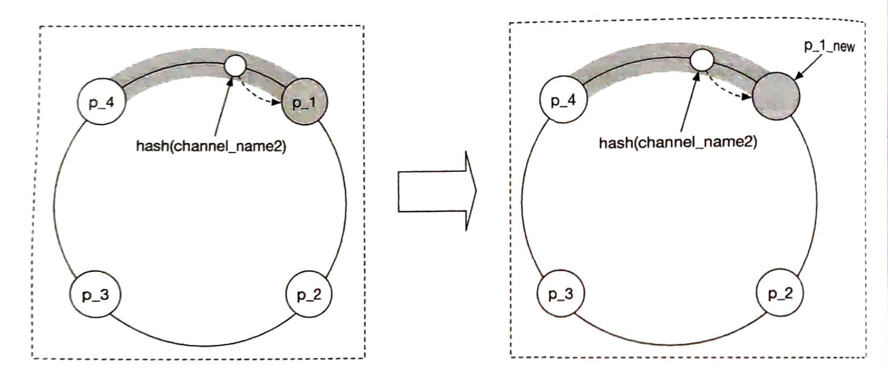
图2.11：替换Pub/Sub服务器

#### 添加/删除好友
当用户添加或删除好友时客户端应该做什么？当添加新好友时，需要通知客户端的WebSocket连接处理程序，这样它就可以订阅新好友的Pub/Sub频道。

由于"附近的好友"功能是更大应用生态系统的一部分，我们可以假设"附近的好友"功能可以在移动客户端上注册一个回调，在添加新好友时触发。回调被调用时，会向WebSocket服务器发送消息以订阅新好友的Pub/Sub频道。如果新好友处于活跃状态，WebSocket服务器还会返回一条包含新好友最新位置和时间戳的消息。

同样，当删除好友时，客户端可以在应用程序中注册一个回调。回调会向WebSocket服务器发送消息以取消订阅该好友的Pub/Sub频道。

这个订阅/取消订阅回调也可以在好友选择加入或退出位置更新时使用。

#### 拥有很多好友的用户
值得讨论的是，拥有很多好友的用户是否会在我们的设计中造成性能热点。我们在这里假设好友数量有硬性上限。（例如，Facebook有5000个好友的上限）。好友关系是双向的，这与粉丝模式不同 - 在粉丝模式中，名人可能拥有数百万的粉丝。

在有数千个好友的场景中，Pub/Sub订阅者会分散在集群中的许多WebSocket服务器上。更新负载会分散在它们之间，不太可能造成任何热点。

用户会在其频道所在的Pub/Sub服务器上产生稍多的负载。由于有超过100个Pub/Sub服务器，这些"大户"用户会分散在Pub/Sub服务器之间，增加的负载不应该使任何单个服务器过载。

#### 附近的随机人
你可以把这一节称为额外加分，因为它不在最初的功能需求中。如果面试官想要更新设计以显示选择共享位置的随机人怎么办？

一种利用我们设计的方法是按地理哈希添加一个Pub/Sub频道池。（有关地理哈希的详细信息，请参见第1章"邻近服务"）。如图2.12所示，一个区域被分为四个地理哈希网格，为每个网格创建一个频道。

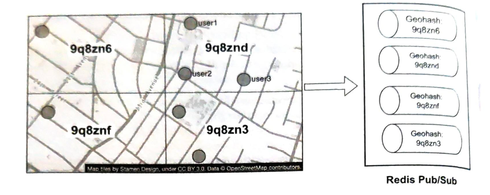
图2.12：Redis Pub/Sub频道

网格内的任何人都订阅相同的频道。让我们以图2.13中的网格9q8znd为例。

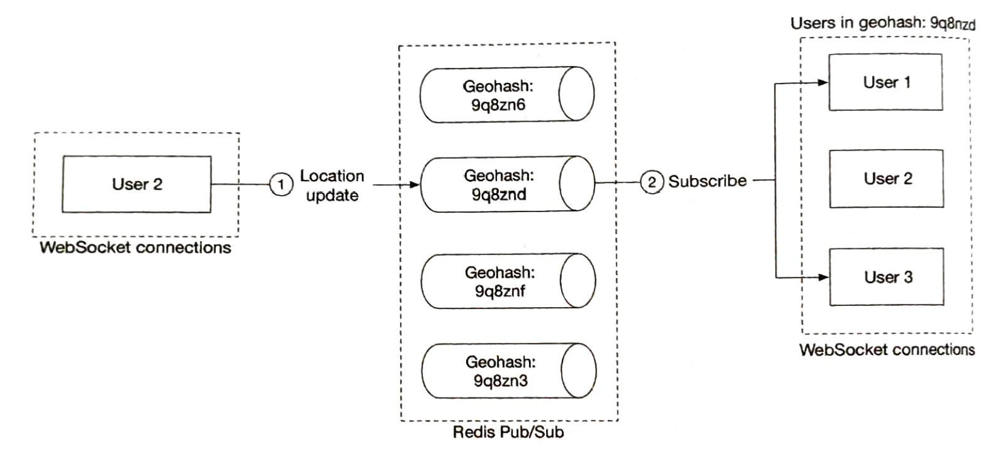
图2.13：向附近的随机人发布位置更新

1. 这里，当用户2更新他们的位置时，WebSocket连接处理程序计算用户的地理哈希ID，并将位置发送到该地理哈希的频道。
2. 附近订阅该频道的任何人（不包括发送者）都会收到位置更新消息。

为了处理靠近地理哈希网格边界的人，每个客户端可以订阅用户所在的地理哈希和周围八个地理哈希网格。图2.14显示了所有9个高亮显示的地理哈希网格的示例。

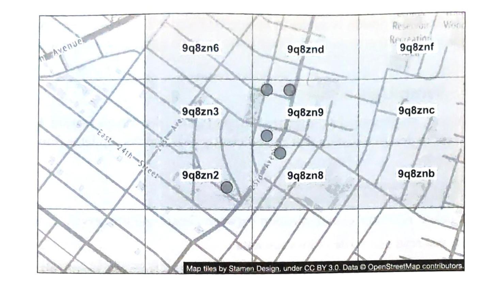
图2.14：九个地理哈希网格

#### Redis Pub/Sub的替代方案
作为路由层，是否有Redis Pub/Sub的好替代方案？答案是肯定的。Erlang[7]对这个特定问题来说是一个很好的解决方案。我们认为Erlang是比上面提出的Redis Pub/Sub更好的解决方案。然而，Erlang相当小众，招聘优秀的Erlang程序员很难。但如果你的团队有Erlang专业知识，这是一个很好的选择。

那么，为什么选择Erlang？Erlang是一种通用编程语言和运行时环境，专为高度分布式和并发应用程序而构建。当我们在这里说Erlang时，我们特指Erlang生态系统本身。这包括语言组件（Erlang或Elixir[8]）和运行时环境及库（称为BEAM[9]的Erlang虚拟机和称为OTP[10]的Erlang运行时库）。

Erlang的强大之处在于其轻量级进程。Erlang进程是在BEAM VM上运行的实体。它比Linux进程要便宜几个数量级。一个最小的Erlang进程占用约300字节，我们可以在单个现代服务器上运行数百万个这样的进程。如果Erlang进程中没有工作要做，它就只是坐在那里，根本不使用任何CPU周期。换句话说，在我们的设计中将1000万活跃用户中的每一个都建模为单个Erlang进程是非常便宜的。

Erlang也很容易在多个Erlang服务器之间分布。运营开销很低，有很好的工具支持安全地调试实时生产问题。部署工具也很强大。

我们如何在设计中使用Erlang？我们会用Erlang实现WebSocket服务，并用分布式Erlang应用程序替换整个Redis Pub/Sub集群。在这个应用程序中，每个用户都被建模为一个Erlang进程。当客户端更新用户的位置时，用户进程会从WebSocket服务器接收更新。用户进程还订阅用户好友的Erlang进程的更新。订阅在Erlang/OTP中是原生的，很容易构建。这形成了一个连接网络，可以高效地将位置更新从一个用户路由到多个好友。

## 第4步 - 总结
在本章中，我们提出了一个支持附近好友功能的设计。从概念上讲，我们想要设计一个系统，可以高效地将位置更新从一个用户传递给他们的好友。

一些核心组件包括：
- WebSocket：客户端和服务器之间的实时通信
- Redis：位置数据的快速读写
- Redis Pub/Sub：路由层，将位置更新从一个用户定向到所有在线好友

我们首先在较低规模下提出了一个高层设计，然后讨论了随着规模增加而出现的挑战。我们探讨了如何扩展以下内容：
- RESTful API服务器
- WebSocket服务器
- 数据层
- Redis Pub/Sub服务器
- Redis Pub/Sub的替代方案

最后，我们讨论了当用户有很多好友时的潜在瓶颈，并为"附近的随机人"功能提出了一个设计。  
恭喜你走到这一步！现在给自己一个鼓励。干得好！

## 参考资料
[1] Facebook推出"附近的好友"。https://techcrunch.com/2014/04/17/facebook-nearby-friends/  
[2] Redis Pub/Sub。https://redis.io/topics/pubsub  
[3] Redis Pub/Sub内部原理。https://making.pusher.com/redis-pubsub-under-the-hood/  
[4] etcd。https://etcd.io/  
[5] ZooKeeper。https://zookeeper.apache.org/  
[6] 一致性哈希。https://www.toptal.com/big-data/consistent-hashing  
[7] Erlang。https://www.erlang.org/  
[8] Elixir。https://elixir-lang.org/  
[9] BEAM简介。https://www.erlang.org/blog/a-brief-beam-primer/  
[10] OTP。https://www.erlang.org/doc/design_principles/des_princ.html