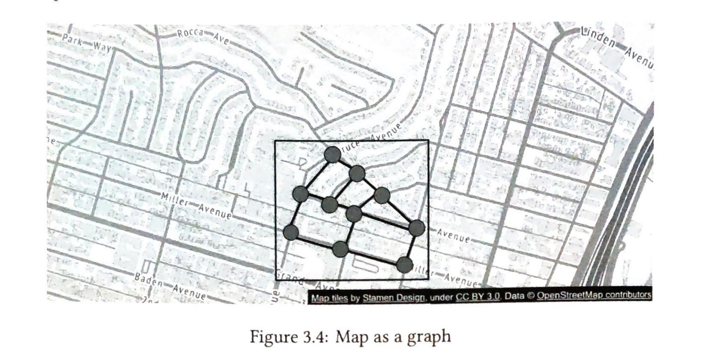
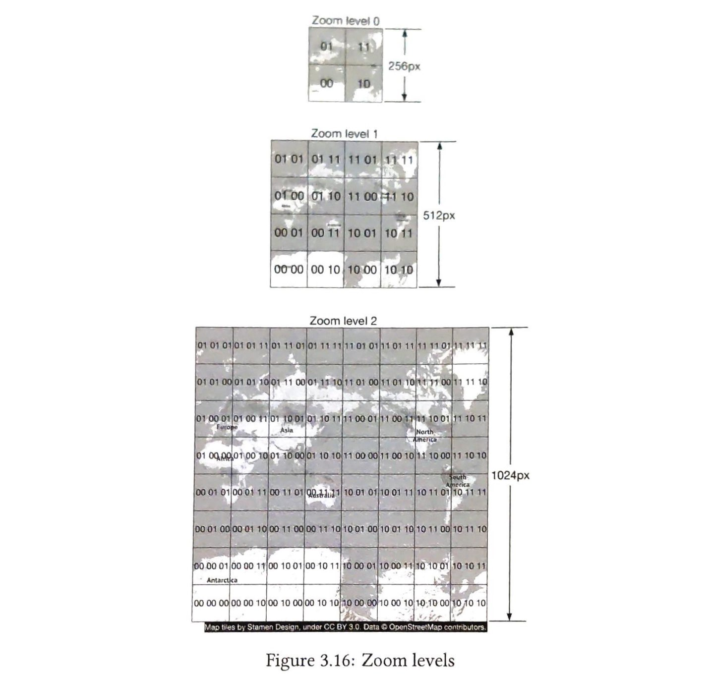

# 3 谷歌地图

在本章中，我们设计一个简化版的谷歌地图。在我们进行系统设计之前，让我们先了解一下谷歌地图。谷歌于 2005 年启动了谷歌地图项目，并开发了一个 Web 地图服务。它提供了许多服务，例如卫星图像、街道地图、实时交通状况和路线规划 [1]。

谷歌地图帮助用户找到方向并导航到他们的目的地。截至 2021 年 3 月，谷歌地图拥有 10 亿日活跃用户，覆盖全球 99% 的区域，以及 2500 万次关于准确和实时位置信息的每日更新 [2]。鉴于谷歌地图的巨大复杂性，重要的是确定我们版本支持的功能。

## 步骤 1 - 理解问题并确定设计范围

面试官和候选人之间的互动可能如下所示：

**候选人：** 我们期望有多少日活跃用户？
**面试官：** 10 亿 DAU。

**候选人：** 我们应该关注哪些功能？方向、导航和预计到达时间 (ETA)？
**面试官：** 我很高兴你问了这个问题并考虑了这些。我们不需要设计所有这些。

**候选人：** 我们的系统是否需要考虑交通状况？
**面试官：** 是的，交通状况对于准确的 ETA 估算非常重要。

**候选人：** 关于不同的出行方式，如驾车、步行、公交等怎么样？
**面试官：** 我们应该能够支持不同的出行方式。

**候选人：** 我们应该支持多站点路线吗？
**面试官：** 允许用户定义多个站点是好的，但让我们暂时不关注它。

**候选人：** 关于商家地点和照片怎么样？我们期望有多少照片？
**面试官：** 我很高兴你问了这个问题并考虑了这些。我们不需要设计这些。

在本章的其余部分，我们专注于三个关键特性。我们需要支持的主要设备是移动电话。

*   用户位置更新。
*   导航服务，包括 ETA 服务。
*   地图渲染。

### 非功能需求和约束

*   **准确性：** 不应给用户错误的指示。
*   **流畅导航：** 在客户端，用户应该体验到非常流畅的地图渲染。
*   **数据和电池使用：** 客户端应尽可能少地使用数据和电池。这对于移动设备非常重要。
*   **通用可用性和可扩展性要求。**

在深入探讨设计之前，我们将简要介绍一些基本概念和术语，这些术语在设计谷歌地图时很有用。

### 地图 101

#### 定位系统
世界是一个绕其轴线旋转的球体。最顶部是北极，最底部是南极。

  
[图 3.1：纬度和经度（来源：[3]）]

*   **纬度 (Latitude)：** 表示我们有多靠北或靠南
*   **经度 (Longitude)：** 表示我们有多靠东或靠西

#### 从 3D 到 2D
将点从 3D 球体转换到 2D 平面的过程称为"地图投影"。
有不同的地图投影方式，每种方式都有其自身的优缺点。几乎所有方式都会扭曲实际的几何形状。下面我们可以看到一些例子。

  
[图 3.2：地图投影（来源：维基百科 [4] [5] [6] [7]）]  
*   墨卡托投影 (Mercator projection)
*   皮尔斯梅花投影 (Peirce quincuncial projection)
*   割圆锥投影 (Gall-Peters projection)
*   温克尔投影 (Winkel tripel projection)

谷歌地图选择了墨卡托投影的一种修改版本，称为 Web 墨卡托。有关定位系统和投影的更多详细信息，请参阅 [3]。

#### 地理编码 (Geocoding)
地理编码是将地址转换为地理坐标的过程。例如，"1600 Amphitheatre Parkway, Mountain View, CA"被地理编码为纬度/经度对（纬度 37.423021，经度 -122.083739）。
另一方面，从纬度/经度对到实际人类可读地址的转换称为反向地理编码。

地理编码的一种方法是插值 [8]。此方法利用来自不同来源（例如地理信息系统 (GIS)）的数据，其中街道网络被映射到地理坐标空间。

#### 地理哈希 (Geohashing)
地理哈希是一种将地理区域编码为短字符串字母和数字的编码系统。其核心是，它将地球描述为一个扁平化的表面，并递归地将网格划分为子网格，直到每个网格达到某个大小阈值。我们用 0 到 3 的数字串来表示网格，这些数字串是递归创建的。

假设初始平面尺寸为 20,000km x 10,000km。在第一次划分后，我们将得到 4 个尺寸为 10,000km x 5,000km 的网格。我们用 00, 01, 10 和 11 来表示它们，如图 3.3 所示。我们进一步将每个网格划分为 4 个网格，并使用相同的命名策略。每个子网格现在的尺寸是 5,000km x 2,500km。我们递归地划分网格，直到每个网格达到某个大小阈值。

  
[图 3.3：Geohashing]  
级别 0: 01, 11, 00, 10
级别 1: 0101, 0111, ... , 1010
级别 2: 010101, 010111, ... , 101010
...
地图瓦片来自 Stamen Design, 在 CC BY 3.0 许可下。数据来自 OpenStreetMap 贡献者。

Geohashing 有许多用途。在我们的设计中，我们使用 geohashing 进行地图瓦片化。有关 geohashing 及其好处的更多细节，请参阅 [9]。

#### 地图渲染
我们不会详细介绍地图渲染，但值得一提的是基础。地图渲染的一个基本概念是瓦片化。与其一次性渲染整个地图（这对于大图像来说可能是个问题），不如将世界分解成更小的瓦片。客户端只下载用户所在区域的相关瓦片，并将它们像马赛克一样拼接起来进行显示。

有不同的地图缩放级别对应的不同瓦片集。客户端根据地图视口的缩放级别选择适当的瓦片集。这提供了合适的地图细节级别，而不会消耗过多的带宽。为了说明这一点，假设当客户端完全缩小以显示整个世界时，我们不需要下载数千个高缩放级别的瓦片。所有细节都将浪费掉。相反，客户端将下载最低缩放级别的一个瓦片，该瓦片用单个 256 x 256 像素图像表示整个世界。

#### 用于导航算法的道路数据处理
大多数路由算法是 Dijkstra 或 A* 寻路算法的变种。精确算法选择是一个复杂的话题，我们本章不会深入探讨。重要的是要注意，所有这些算法都在图数据结构上运行，其中交叉点是节点，道路是图的边。图 3.4 显示了一个示例：

  
[图 3.4：地图作为图]  
地图瓦片来自 Stamen Design, 在 CC BY 3.0 许可下。数据来自 OpenStreetMap 贡献者。

寻路性能对图的大小极其敏感。将整个世界的道路网络表示为单个图会消耗太多内存，并且对于任何这些算法来说都太大而无法有效运行。我们需要将图分解成可管理的单元以适应我们的设计规模。

一种方法是将世界分解成称为路由瓦片 (routing tiles) 的小网格。我们通过采用 geohashing 等平铺技术来实现这一点。我们将世界划分为小网格。对于每个网格，我们提取网格内的道路（交叉点）和网格内的地理区域所覆盖的边（道路）组成的图数据结构。我们将这些称为路由瓦片。每个路由瓦片都持有对其连接的所有其他瓦片的引用。这样，路由算法可以将它们拼接在一起，形成一个更大的路由图，代表这些互连的路由瓦片。

通过将道路网络分解成路由瓦片，这些路由瓦片可以按需加载，路由算法可以显著减少内存消耗，并通过仅在需要时加载一小组路由瓦片来提高寻路性能，并且仅在需要时加载额外的瓦片。

  
[图 3.5：路由瓦片]  
路由瓦片 1 | 路由瓦片 2 | 路由瓦片 3
地图瓦片来自 Stamen Design, 在 CC BY 3.0 许可下。数据来自 OpenStreetMap 贡献者。

> **提醒**
> 在图 3.5 中，我们称这些网格为路由瓦片。路由瓦片类似于地图瓦片，因为两者都是覆盖某些地理区域的网格。地图瓦片是 PNG 图像，而路由瓦片是覆盖瓦片区域的道路数据的二进制文件。

#### 分层路由瓦片 (Hierarchical routing tiles)
高效的导航路由还需要在正确的细节级别上拥有道路数据。例如，对于跨国路由，在最低细节级别运行路由算法会很慢。图被拼接在一起形成这些详细的街道级路由瓦片。它会产生一个可能太大且消耗过多内存的详细路由图。

通常有三组具有不同细节级别的路由瓦片。在最详细的级别，路由瓦片很小，只包含当地道路。在下一个级别，瓦片更大，包含连接区域的主要干道。在最低细节级别，瓦片覆盖大片区域，包含连接城市和州的主要高速公路。在每个级别，瓦片都可以边缘连接以形成在不同缩放级别运行的路由图。例如，对于高速公路入口，从本地街道 A 到高速公路 F，在小瓦片中会有一个从节点（街道 A）到大瓦片中节点（高速公路 F）的引用。参见图 3.6 的不同尺寸路由瓦片示例。

  
[图 3.6：不同尺寸的路由瓦片]

### 粗略估算
现在我们理解了基础知识，让我们做一个粗略的估算。由于设计的重点是移动设备，数据使用和电池消耗是两个重要的考虑因素。

在我们深入估算之前，这里有一些英制/公制转换供参考。

*   1 英尺 = 0.3048 米
*   1 公里 (km) = 0.6214 英里
*   1 公里 = 1,000 米

#### 存储使用
我们需要存储三种类型的数据。

*   **世界地图：** 详细计算如下所示。
*   **元数据：** 鉴于每个地图瓦片的数据可以忽略不计，我们可以在计算中跳过元数据。
*   **道路信息：** 面试官告诉我们有 TB 级的原始道路数据来自外部来源。我们将这些数据集转换为路由瓦片，这些瓦片的大小也可能是 TB 级。

#### 世界地图
我们在第 60 页的"地图 101"部分讨论了地图瓦片的概念。有许多地图瓦片集，每个对应一个缩放级别。为了了解整个地图瓦片图像集合所需的存储量，估算最高缩放级别下最大瓦片集的大小会很有信息量。首先，假设有 21 个缩放级别，最高缩放级别是 21。在那里，大约有 4.3 万亿个瓦片（表 3.1）。让我们假设每个瓦片是一个 256 x 256 像素的压缩 PNG 图像，图像大小约为 100KB。最高缩放级别的整个集合将需要大约 4.4 万亿 x 100KB = 440PB。

在表 3.1 中，我们展示了每个缩放级别的瓦片数量的进展。

| 缩放级别 (Zoom) | 瓦片数量 (Number of Tiles) |
| :------------- | :----------------------- |
| 0              | 1                        |
| 1              | 4                        |
| 2              | 16                       |
| 3              | 64                       |
| 4              | 256                      |
| 5              | 1 024                    |
| 6              | 4 096                    |
| 7              | 16 384                   |
| 8              | 65 536                   |
| 9              | 262 144                  |
| 10             | 1 048 576                |
| 11             | 4 194 304                |
| 12             | 16 777 216               |
| 13             | 67 108 864               |
| 14             | 268 435 456              |
| 15             | 1 073 741 824            |
| 16             | 4 294 967 296            |
| 17             | 17 179 869 184           |
| 18             | 68 719 476 736           |
| 19             | 274 877 906 944          |
| 20             | 1 099 511 627 776        |
| 21             | 4 398 046 511 104        |
**表 3.1：缩放级别**

然而，请记住，大约 90% 的地球表面是自然的，大部分是无人居住的区域，如海洋、沙漠、湖泊和山脉。由于这些区域作为图像高度可压缩，我们可以保守地将存储估计减少 80 ~ 90%。这将使存储大小减少到 44 到 88PB。我们选择一个中间值 50PB。

接下来，让我们估计每个后续较低缩放级别会占用多少存储空间。在每个较低缩放级别，南北方向和东西方向的瓦片数量都减半。这导致瓦片总数减少 4 倍，这使得缩放级别的存储大小也减少 4 倍。通过每个较低缩放级别，总大小的数学公式为：`50 + 50/4 + 50/16 + ... ≈ 67PB`。这只是一个粗略的估计。知道我们需要大致 100PB 来存储所有不同缩放级别的地图瓦片就足够了。

#### 服务器吞吐量
为了估算服务器吞吐量，让我们回顾一下我们需要支持的请求类型。主要有两种类型的请求。第一种是导航请求。这些是由客户端发送以启动导航会话的。第二种是位置更新请求。这些是客户端在导航会话期间四处移动时发送的。位置数据被下游服务以多种不同方式使用。例如，位置数据用于实时交通数据。我们将在设计深入探讨部分介绍位置数据的使用案例。

现在我们可以分析导航请求的服务器吞吐量。假设我们有 10 亿 DAU，每个用户平均每周使用导航总共 35 分钟，或者说每周 50 亿分钟。

一种简单的方法是每秒发送 GPS 坐标，这将导致每秒 3000 亿次请求（50 亿分钟 x 60）或每秒 300 万 QPS (`3000 亿请求 / 10^5 秒 = 300 万`)。然而，客户端可能不需要每秒发送 GPS 更新。我们可以批量处理客户端上的位置更新，并以较低的频率（例如，每 15 秒或 30 秒）发送它们，以减少写入 QPS。实际频率可能取决于用户移动速度等因素。如果他们被困在交通中，客户端可以降低 GPS 更新速度。在我们的设计中，假设 GPS 更新被批量处理，并每 15 秒发送一次。使用此假设，QPS 降低到 200,000 (`3 百万 / 15`)。
假设峰值 QPS 是平均值的五倍。位置更新的峰值 QPS = `200,000 x 5 = 1 百万`。

## 步骤 2 - 提出高层设计并获得认可

现在我们对谷歌地图有了更多的了解，我们准备提出一个高层设计（图 3.7）。

### 高层设计
  
[图 3.7：高层设计]  
移动用户 -> CDN (预计算地图图像 (源站))
移动用户 -> 负载均衡器
负载均衡器 -> 导航服务 -> 地理编码数据库 (Geocoding DB)
负载均衡器 -> 导航服务 -> 路由瓦片 (对象存储)
负载均衡器 -> 位置服务 -> 用户位置数据库 (User Location DB)

高层设计支持三个特性。让我们逐一看看。

1.  位置服务
2.  导航服务
3.  地图渲染

### 位置服务

位置服务负责记录用户的位置更新。架构如图 3.8 所示。

  
[图 3.8：位置服务]  
移动用户 -> 负载均衡器 -> 位置服务 -> 用户位置数据库

基本设计要求客户端每隔 *t* 秒发送位置更新，其中 *t* 是一个可配置的间隔。周期性更新有几个好处。首先，我们可以利用位置数据流来随着时间的推移改进我们的系统。我们可以使用这些数据来监控实时交通、检测新的或封闭的道路，以及分析用户行为以实现个性化，例如。其次，我们可以利用位置数据在必要时近乎实时地为用户提供更准确的 ETA 并重新规划路线。

但是我们真的需要立即将每个位置更新发送到服务器吗？答案可能是否定的。位置历史可以在客户端缓冲，并以较低的频率批量发送到服务器。例如，如图 3.9 所示，位置更新每秒记录一次，但仅作为每 15 秒一批次的一部分发送到服务器。这显著减少了发送到所有客户端的总更新流量。

  
[图 3.9：批量请求]  
(时间轴显示每 15 秒发送一个包含多个位置记录的批次)
批次 3 (loc 45, ...) --- 15s --- 批次 2 (loc 32, loc 31, loc 30, ..., loc 17, loc 16) --- 15s --- 批次 1 (loc 15, ..., loc 2, loc 1)

对于像谷歌地图这样的系统，即使位置更新是批量的，写入量仍然很高。我们需要一个针对高写入量和高可扩展性进行优化的数据库，例如 Cassandra。我们可能还需要将位置数据记录到一个流处理引擎，如 Kafka，用于进一步处理。我们将在深入探讨部分讨论这一点。

什么通信协议可能是一个好的选择？带有 keep-alive 选项 [10] 的 HTTP 在这里可能是个不错的选择，因为它非常高效。HTTP 请求可能看起来像这样：

`POST /v1/locations`
参数
`locs`: JSON 编码的 (纬度, 经度, 时间戳) 元组数组。

### 导航服务

此组件负责找到从点 A 到点 B 的合理快速路径。我们可以容忍一点延迟。计算出的路线不必是最快的，但准确性至关重要。

如图 3.7（译者注：原文此处为 3.8，根据上下文应为高层设计图 3.7） 所示，用户通过负载均衡器向导航服务发送 HTTP 请求。该请求包括起点和终点作为参数。API 可能看起来像这样：

`GET /v1/nav?origin=1355+market+street,SF&destination=Disneyland`

导航请求的结果可能如下所示：

```json
{
  "distance": { "text": "0.2 mi", "value": 259 },
  "duration": { "text": "1 min", "value": 83 },
  "end_location": { "lat": 37.4038943, "lng": -121.9410454 },
  "html_instructions": "Head <b>northeast</b> on <b>Brandon St</b> toward <b>Alum Rock Ave</b><div style=\"font-size:0.9em\">Restricted usage road</div>",
  "polyline": { "points": "_fhcFjbngVuAWsDsCal"},
  "start_location": { "lat": 37.4027166, "lng": -121.9435889 },
  "geocoded_waypoints": [ {
      "geocoder_status": "OK",
      "partial_match": true,
      "place_id": "ChIJmt1fawWR02aVVVX2Ykg",
      "types": [ "locality", "political" ]
    }, {
      "geocoder_status": "OK",
      "partial_match": true,
      "place_id": "ChIJa3ApQG6tXawRLYeiBMUi7bM",
      "types": [ "locality", "political" ]
    } ],
  "travel_mode": "DRIVING"
}
```

请参考 [11] 了解更多关于谷歌地图官方 API 的细节。

到目前为止，我们还没有考虑实时交通和路线变化。这些问题由自适应 ETA 服务解决，该服务将在深入探讨部分进行讨论。

### 地图渲染

正如我们在粗略估算中讨论的那样，整个地图瓦片集合在各种缩放级别下大约有数百 PB。将整个数据集保存在服务器上供客户端根据客户端视口的当前位置和缩放级别按需获取是不切实际的。

客户端应该何时从服务器获取新的地图瓦片？以下是一些场景：

*   用户正在缩放和平移地图视口以探索他们的周围环境。
*   在导航过程中，用户移出当前地图瓦片进入邻近瓦片。

我们正在处理大量数据。让我们看看如何有效地为客户端提供地图瓦片。

#### 选项 1
服务器根据客户端位置和客户端视口的缩放级别动态构建地图瓦片。考虑到位置和缩放级别组合的数量是无限的，动态生成地图瓦片有几个严重的缺点：

*   它给服务器集群带来了巨大的负载，需要动态生成每个地图瓦片。
*   由于地图瓦片是动态生成的，因此很难利用缓存。

#### 选项 2
另一个选项是为每个缩放级别预先生成一组静态地图瓦片。地图瓦片是静态的，每个瓦片使用诸如 geohashing 之类的细分方案覆盖固定的矩形网格。每个瓦片因此由其 geohash 表示。换句话说，有一个唯一的 geohash 与每个网格相关联。当客户端需要地图瓦片时，它首先确定基于其缩放级别要使用的地图瓦片集合。然后它通过将其位置转换为适当缩放级别的 geohash 来计算地图瓦片 URL。
这些静态的、预先生成的图像由 CDN 提供，如图 3.10 所示。


  
[图 3.10：预生成图像由 CDN 提供]  
移动用户 -> CDN -> 预计算地图图像 (源站)

在上图中，移动用户发出 HTTP 请求以从 CDN 获取瓦片。如果 CDN 尚未提供该特定瓦片，它会从源服务器获取副本，在本地缓存，然后返回给用户。对于后续请求，即使这些请求来自不同的用户，CDN 也会返回缓存的副本，而无需联系源服务器。

这种方法更具可扩展性和性能，因为地图瓦片是从最近的存在点 (POP) 提供的，如图 3.11 所示。地图瓦片的静态特性使其高度可缓存。

  
[图 3.11：有 CDN vs 无 CDN]  
无 CDN：服务器 <-- 300 ms --> 用户
有 CDN：
用户 <-- 10 ms --> POP
POP <-- ... --> POP
POP <-- ... --> 源服务器
POP <-- ... --> POP

保持移动数据使用量低很重要。让我们计算客户端在典型导航会话期间需要加载的数据量。请注意，以下计算未考虑客户端缓存。由于用户每天可能会走相似的路线，因此数据使用量可能比使用客户端缓存要低得多。

#### 数据使用
假设用户以 30km/h 的速度移动，并且在某个缩放级别，每个图像覆盖一个 200m x 200m 的区块（一个区块由 256 像素表示，平均图像大小为 100KB）。对于 1km x 1km 的区域，我们需要 25 个图像或 2.5MB (`25 x 100KB`) 的数据。因此，如果速度是 30km/h，我们需要每小时 75MB (`30 x 2.5MB`) 或每分钟 1.25MB 的数据。

接下来，我们估算 CDN 数据使用量。以我们的规模，成本是一个重要的考虑因素。

#### 通过 CDN 的流量
如前所述，我们每天提供 50 亿分钟的导航。这转化为每天 50 亿 x 1.25MB = 6.25 PB 的地图数据。因此，我们每秒需要提供 62,500MB (`6.25 PB / 10^5 秒`) 的数据。这些地图图像将从世界各地的 POP 提供。假设有 200 个 POP。每个 POP 只需要每秒提供几百 MB (`62,500 / 200`)。

在地图渲染设计中，还有一个最终细节我们只简要触及过。客户端如何知道使用哪些 URL 从 CDN 获取地图瓦片？请记住，在使用我们讨论的选项 2 时，地图瓦片是静态的，并基于固定的网格集预先生成，每个集合代表一个离散的缩放级别。

由于网格基于 geohash，并且每个网格有一个唯一的 geohash，因此客户端计算 geohash（对于地图瓦片）非常高效。此计算可以在客户端完成，我们可以从 CDN 获取静态图像瓦片。例如，谷歌总部图像瓦片的 URL 可能看起来像这样：`https://cdn.map-provider.com/tiles/9q9hvu.png`

请参阅第 10 页的第一章邻近服务，了解有关 geohash 编码的更详细讨论。

在客户端计算 geohash 应该工作良好。然而，请记住，此算法被硬编码在所有客户端的所有不同平台上。将更改发布到移动应用程序是一个耗时且有风险的过程。我们必须确保该方法有效。如果我们计划长期使用此编码来收集地图瓦片，并且不太可能更改它。如果我们需要切换到另一种编码方法，风险很低。

另一个值得考虑的选择。与其使用硬编码的客户端算法将纬度/经度对和缩放级别转换为瓦片 URL，不如引入一个服务作为中介，其工作是构建基于相同输入的瓦片 URL。这是一个非常简单的服务。增加的操作灵活性可能值得付出这个代价。这种非常有趣的权衡讨论可以与面试官进行。另一种地图渲染流程如图 3.12 所示。

当用户移动到新位置或新的缩放级别时，地图瓦片服务确定需要哪些瓦片，并转换该信息为一组要检索的瓦片 URL。

  
[图 3.12：地图渲染]  
移动用户 --(1) 获取瓦片 URL --> 负载均衡器 --(2) 转发请求 --> 地图瓦片服务 --(3) 构建瓦片 URL --> 负载均衡器 -> 移动用户 --(4) 下载瓦片 --> CDN

1.  移动用户调用地图瓦片服务以获取瓦片 URL。请求被发送到负载均衡器。
2.  负载均衡器将请求转发给地图瓦片服务。
3.  地图瓦片服务将客户端的位置和缩放级别作为输入，并返回 9 个 URL，包括要渲染的瓦片和八个周围的瓦片。
4.  移动客户端从 CDN 下载瓦片。

我们将在设计深入探讨部分更详细地介绍预计算的地图瓦片。

## 步骤 3 - 设计深入探讨

在本节中，我们将讨论数据模型。然后我们将更详细地讨论位置服务、导航服务和地图渲染。

### 数据模型

我们正在处理四种类型的数据：路由瓦片、用户位置数据、地理编码数据和世界的预计算地图。

#### 路由瓦片
如前所述，初始道路数据集来自不同的来源和权威机构。它包含 TB 级的原始数据。数据集会随着用户使用应用程序不断从用户那里收集的位置数据而不断改进。

此数据集包含大量道路和关联的元数据，例如名称、县、经度、纬度。此数据未组织为图形数据结构，并且不适用于大多数路由算法。我们运行一个周期性的离线处理管道，称为路由瓦片处理服务，将此数据集转换为我们引入的路由瓦片。该服务定期运行以捕获对道路数据的最新更改。

路由瓦片处理服务的输出是路由瓦片。有三组具有不同分辨率的瓦片，如第 60 页的"地图 101"部分所述。每个瓦片包含一个表示瓦片覆盖区域内的交叉口和道路的图节点和边的列表。它还包含对其连接的所有其他瓦片的引用。这些瓦片共同构成了一个互连的道路网络，路由算法可以增量地使用这些道路。

路由瓦片处理服务存储这些瓦片的位置在哪里？大多数图数据都表示为邻接表 [12] 或邻接列表 [13] 在内存中。为了保持瓦片尽可能小以减少存储和网络传输，我们只存储节点和边作为行在数据库中，并认为它需要某种方式来序列化邻接列表到二进制文件中。我们可以使用高性能软件包装，如 Protocol Buffers，将这些瓦片序列化为对象存储。这提供了一种通过其 geohash/ing 对在对象存储中查找瓦片的快速机制。

我们稍后讨论最短路径服务如何使用这些路由瓦片。

#### 用户位置数据
用户位置数据很有价值。我们使用它来更新我们的路由数据和路由瓦片。我们还使用它来构建实时和历史交通数据。我们还使用它通过多个数据流处理服务来更新地图数据。

对于用户位置数据，我们需要一个能够很好地处理写入密集型工作负载并且可以水平扩展的数据库。Cassandra 可能是一个不错的选择。

以下是单个行可能的样子：

| user_id | timestamp  | user_mode | driving_mode | location   |
| :------ | :--------- | :-------- | :----------- | :--------- |
| 101     | 1635740977 | active    | driving      | (20.0, 30.5) |
**表 3.2：位置表**

#### 地理编码数据
此数据库存储地点及其对应的纬度/经度对。我们可以使用键值数据库，例如 Redis，用于快速读取，因为我们有频繁的读取和不频繁的写入。我们使用它将起点或终点转换为路由规划器之前的纬度/经度对。

#### 世界地图的预计算图像
当设备请求地图的特定区域时，我们需要获取附近的道路并计算代表该区域以及所有道路和相关细节的图像。这些计算将是繁重和多余的，因此预先计算它们并将图像缓存起来可能会有所帮助。我们在不同的缩放级别预先计算图像，并将它们存储在像 Amazon S3 这样的云存储中，该存储由 CDN 支持。这是一个示例图像：

  
[图 3.13：预计算瓦片]  
地图瓦片来自 Stamen Design, 在 CC BY 3.0 许可下。数据来自 OpenStreetMap 贡献者。

### 服务

现在我们已经讨论了数据模型，让我们仔细看看一些最重要的服务：位置服务、地图渲染服务和导航服务。

#### 位置服务
在高层设计中，我们讨论了位置服务的工作原理。在本节中，我们将重点关注该服务的数据库设计以及如何使用用户位置数据。

在图 3.14 中，键值存储用于存储用户位置数据。让我们仔细看看。

  
[图 3.14：用户位置数据库]  
移动用户 -> 负载均衡器 -> 位置服务 -> 用户位置数据库

鉴于我们每秒有 100 万次位置更新，我们需要一个支持快速写入的数据库。NoSQL 键值数据库或面向列的数据库将是一个不错的选择。此外，用户的位置是不断变化的，并尽快变得陈旧。因此，我们优先考虑可用性而不是一致性。CAP 定理 [13] 指出我们可以在一致性、可用性和分区容错性这三个属性中选择两个。考虑到我们的约束，我们将选择可用性和分区容错性。一个具有强可用性保证的数据库是一个不错的选择，比如 Cassandra。它可以处理我们的规模并具有强大的可用性保证。

键是 `(user_id, timestamp)` 的组合，值是纬度/经度对。在此设置中，`user_id` 是分区键，`timestamp` 是聚类键。使用 `user_id` 作为分区键的优势在于，它可以快速读取特定用户的最新位置。给定用户的所有数据都存储在同一个分区键中，按 `timestamp` 排序。通过这种安排，检索特定用户在时间范围内的位置数据非常高效。

下面是表格可能的样子：

| key (user_id) | timestamp | lat  | long | user_mode | navigation_mode |
| :------------ | :-------- | :--- | :--- | :-------- | :-------------- |
| 51            | 132053000 | 21.9 | 89.8 | active    | driving         |
**表 3.3：位置数据**

#### 我们如何使用用户位置数据？
用户位置数据至关重要。它支持许多用例。我们使用这些数据来检测新的和封闭的道路。我们使用它作为改进地图随时间推移准确性的输入之一。它还用于实时交通数据。

为了支持这些用例，除了将当前用户位置写入我们的数据库，我们将此信息记录到一个消息队列中，例如 Kafka。Kafka 是一个统一的、低延迟、高吞吐量的数据流平台，专为实时数据馈送而设计。图 3.15 显示了改进后的设计中使用 Kafka 的情况。

  
[图 3.15：位置数据被其他服务使用]  
移动用户 -> 负载均衡器 -> 位置服务 -> 用户位置数据库
位置服务 -> Kafka
Kafka -> 交通更新服务 -> 交通数据库
Kafka -> 机器学习服务 & 个性化 -> 个性化数据库
Kafka -> 路由瓦片处理服务 -> 路由瓦片 (对象存储)
Kafka -> 分析 -> 分析数据库

其他服务消费来自 Kafka 的位置数据流用于各种用例。例如，实时交通服务消化流并更新实时交通数据库。路由瓦片处理服务利用流通过检测新的或封闭的道路以及更新受影响的路由瓦片来改进地图。其他服务也可以接入流用于不同目的。

#### 渲染地图
在本节中，我们将深入探讨预计算地图瓦片和地图渲染优化。这些主要受到谷歌设计 [3] 工作的启发。

#### 预计算瓦片
如前所述，有不同的预计算地图瓦片集，在不同的缩放级别提供适当的地图细节级别，基于客户端的视口大小和缩放级别。谷歌地图使用 21 个缩放级别（表 3.1）。我们也会这样做。

级别 0 是最缩小的级别。整个地图由单个 256 x 256 像素的瓦片表示。

随着每次缩放级别的增加，地图瓦片的数量在南北方向和东西方向上都翻倍。如图 3.16 所示，在缩放级别 1，有 2 x 2 = 4 个瓦片，总分辨率为 512 x 512 像素。在缩放级别 2，有 4 x 4 = 16 个瓦片，总分辨率为 1024 x 1024 像素。随着每次增加，整个瓦片集的像素数量增加 4 倍与上一级别相比。增加的像素数给用户提供了更高层次的细节。这允许客户端在最佳粒度级别渲染地图，而无需下载过多的瓦片到客户端的视口和缩放级别。

  
[图 3.16：缩放级别]  
缩放级别 0 (256px)
01 11
00 10
缩放级别 1 (512px)
0101 0111 1101 1111
0100 0110 1100 1110
0001 0011 1001 1011
0000 0010 1000 1010
缩放级别 2 (1024px)
(更细分的网格)
地图瓦片来自 Stamen Design, 在 CC BY 3.0 许可下。数据来自 OpenStreetMap 贡献者。

#### 优化：使用矢量
随着 WebGL 的开发和实现，一个潜在的改进是将设计从发送图像（栅格瓦片）更改为发送矢量信息（路径和多边形）。客户端从矢量信息中绘制路径和多边形。

矢量瓦片的一个明显优势是矢量数据压缩效果比图像好得多。带宽节省是可观的。

一个不那么明显的优势是矢量瓦片提供了更好的缩放体验。使用栅格图像，客户端从一个缩放级别缩放到另一个级别时，一切都会变得模糊，直到新的瓦片被加载。

#### 导航服务 (续)
让我们回到导航服务。图 3.17 显示了导航服务及其依赖项。

    
[图 3.17：导航服务]  
导航服务 -> 地理编码服务
导航服务 -> 路线规划器服务
路线规划器服务 -> 最短路径服务
路线规划器服务 -> ETA 服务
路线规划器服务 -> 排名器服务
最短路径服务 -> 过滤器服务
最短路径服务 -> 路由瓦片
ETA 服务 -> 交通数据库
ETA 服务 -> 自适应 ETA 和重新路由
自适应 ETA 和重新路由 -> 活跃用户数据库

#### 地理编码服务
该服务将人类可读的地址转换为地理坐标（纬度/经度对）。对于反向操作，它将地理坐标转换为地址。

#### 路线规划器服务
这是导航服务的核心组件。它与多个下游服务交互以找到最佳路线。

#### 最短路径服务
最短路径服务接收起点和终点的纬度/经度对，并返回考虑交通或当前状况的前 k 条最短路径。此计算依赖于道路的结构。在这里，缓存路线可能是有益的，因为图很少改变。

最短路径服务运行 A* 寻路算法的变种，该算法在对象存储中的路由瓦片上运行。以下是概述：

*   算法接收起点和终点的纬度/经度对。纬度/经度对被转换为 geohash，然后用于加载路线的起点和终点。
*   算法从起点路由瓦片开始，遍历图数据结构，并从对象存储（或其本地缓存，如果已加载）水合额外的相邻瓦片，因为它扩展了搜索区域。它连接来自一个级别的瓦片以覆盖相同区域的另一个级别的瓦片。这是算法可以"进入"更大的瓦片，只包含高速公路的方式，例如。算法继续进行，直到找到终点，需要通过水合更多相邻瓦片（或不同分辨率的瓦片）来扩展，直到找到一组最佳路线。

图 3.18（基于 [14]）给出了图遍历中使用的瓦片的概念性概述。

  
[图 3.18：图遍历]  
地图瓦片来自 Stamen Design, 在 CC BY 3.0 许可下。数据来自 OpenStreetMap 贡献者。

#### ETA 服务
路线规划器收到可能的最近路径列表后，它会为每个可能的路径调用 ETA 服务以获取时间估计。为此，ETA 服务使用机器学习来根据当前和历史交通数据预测 ETA。

预测未来 10 或 20 分钟交通状况的挑战需要在一个单独的算法层面得到解决，本讨论不涉及。如果你感兴趣，请参考 [15] 和 [16]。

#### 排名器服务 (Ranker service)
最后，在路线规划器获得 ETA 预测后，它将此信息传递给排名器以应用用户定义的过滤器。一些示例过滤器包括避开收费公路或避开高速公路。然后，排名器服务将路线从最快到最慢进行排名，并返回导航服务的前 k 个结果。

#### 更新器服务 (Updater services)
这些服务接入 Kafka 位置更新流并异步更新一些重要的数据库以保持它们最新。交通数据库和路由瓦片就是一些例子。

路由瓦片处理服务负责将带有新发现的道路和道路封闭的道路数据集转换为持续更新的路由瓦片集。这有助于最短路径服务更加准确。

交通更新服务提取来自活跃用户的流位置更新的交通状况。此洞察被输入到实时交通数据库中。这使得 ETA 服务能够提供更准确的估计。

#### 改进：自适应 ETA 和重新路由
当前设计不支持自适应 ETA 和重新路由。为了解决这个问题，服务器需要跟踪活跃导航用户并根据 ETA 变化更新他们。无论何时交通状况发生变化，我们都需要回答几个重要问题：

*   我们如何跟踪活跃导航用户？
*   我们如何存储数据，以便我们可以有效地根据交通变化定位受影响的用户，例如在特定路由瓦片上的交通拥堵？

让我们从一个简单的解决方案开始。在图 3.19 中，user_1 的导航路线由路由瓦片 r_1, r_2, r_3, ..., r_7 表示。

  
[图 3.19：导航路线]  
r_1 (起点) -> r_2 -> r_3 -> r_4 -> r_5 -> r_6 -> r_7 (目的地)

数据库存储活跃导航用户和路线信息，可能看起来像这样：
`user_1: r_1, r_2, r_3, ..., r_k`
`user_2: r_4, r_6, r_9, ..., r_n`
`user_3: r_2, r_8, r_9, ..., r_m`
...
`user_n: r_2, r_10, r_21, ..., r_l`

假设路由瓦片 2 (r_2) 发生交通事件。要找出哪些用户受到影响，我们可以扫描每一行并检查路由瓦片 2 是否在我们的路由瓦片列表中（参见下面的示例）：

`user_1: r_1, **r_2**, r_3, ..., r_k`
`user_2: r_4, r_6, r_9, ..., r_n`
`user_3: **r_2**, r_8, r_9, ..., r_m`
...
`user_n: **r_2**, r_10, r_21, ..., r_l`

假设表中有 *n* 行，导航的平均长度是 *m*。找到所有受交通变化影响的用户的时间复杂度是 O(n x m)。

我们能让这个过程更快吗？让我们探索一种不同的方法。对于每个活跃导航用户，我们保留当前路由瓦片、下一个分辨率级别的路由瓦片（包含它），并递归地直到文件中的最高分辨率级别（图 3.20）。通过这样做，我们可以快速过滤出许多用户。数据库表的行可能看起来像这样：

`user_1, r_1, super(r_1), super(super(r_1)), ...`

  
[图 3.20：构建路由瓦片]  
此路由瓦片仅包含起点 (Origin) -> O (Level 2 Routing tile)
此路由瓦片包含起点和终点 (Origin & Destination) -> O (Level 1 Routing tile)
目的地 (Destination) -> O (Routing tile)

要找出用户是否受到交通变化的影响，我们只需要检查数据库中一行的最后一个路由瓦片是否包含该路由瓦片。如果不是，则用户不受影响。如果是，则用户受到影响。通过这样做，我们可以快速过滤掉许多用户。

这种方法没有具体说明当交通畅通时会发生什么。例如，如果路由瓦片 2 清除并且用户可以回到旧路线，用户如何知道重新路由可用？一个想法是跟踪所有可能的备用路线，并定期重新计算 ETA，以便在有新路线可用时通知用户。

#### 交付协议 (Delivery protocols)
在导航过程中，路线状况可能会发生变化，服务器需要一种可靠的方式将数据推送到移动客户端。对于从服务器到客户端的交付协议，我们的选择包括移动推送通知、长轮询、WebSocket 和服务器发送事件 (SSE)。

*   移动推送通知不是一个好的选择，因为有效载荷大小非常有限（iOS 为 4,096 字节），并且它不支持 Web 应用程序。
*   WebSocket 通常被认为比长轮询更好，因为它在服务器上的占用空间非常小。
*   由于我们已经排除了移动推送通知和长轮询，因此选择主要在 WebSocket 和 SSE 之间。即使两者都可以工作，我们还是倾向于 WebSocket，因为它支持双向通信和功能，例如最后一英里交付可能需要双向实时通信。

有关 ETA 和重新路由的更多详细信息，请参考 [15]。

现在我们已经设计好了所有部分。请看图 3.21 中的更新设计。

  
[图 3.21：最终设计]  
移动用户 -> 负载均衡器
负载均衡器 -> 地理编码服务 -> 地理编码数据库
负载均衡器 -> 导航服务
导航服务 -> 路线规划器服务
路线规划器服务 -> 最短路径服务 -> 路由瓦片 (对象存储)
路线规划器服务 -> ETA 服务 -> 交通数据库
路线规划器服务 -> 排名器
最短路径服务 -> 过滤器服务 (避开收费站, ...)
ETA 服务 -> 自适应 ETA 和重新路由 -> 活跃用户数据库
自适应 ETA 和重新路由 -> 更新交通服务 -> 位置数据库

## 步骤 4 - 总结

在本章中，我们设计了一个简化的谷歌地图，具有关键功能，例如位置更新、ETA、路线规划和地图渲染。如果你有兴趣扩展系统，一个潜在的改进是为企业客户提供多站点导航功能。例如，对于给定的目的地集，我们需要找到访问所有这些目的地的最佳顺序，并提供导航，基于实时交通状况。这对于像 DoorDash、Uber、Lyft 等送货服务会很有帮助。

恭喜你走到这一步！现在给自己一个鼓励。干得好！

## 章节总结

*   **谷歌地图 (Google Maps)**
   *   **步骤 1 (step 1)**
      *   **功能需求 (functional req)**
         *   用户位置更新 (user location update)
         *   导航服务 (navigation service)
         *   地图渲染 (map rendering)
      *   **非功能需求 (non-functional req)**
         *   高精度 (highly accurate)
         *   流畅导航 (smooth navigation)
         *   数据使用 (data usage)
      *   **估算 (estimation)**
         *   存储 (storage)
         *   服务器流量 (server traffic)
   *   **步骤 2 (step 2)**
      *   **地图 101 (map 101)**
         *   定位系统 (positioning system)
         *   从 3D 到 2D (going from 3d to 2d)
         *   地理编码 (geocoding)
         *   地理哈希 (geohashing)
         *   路由瓦片 (routing tiles)
      *   **高层设计 (high-level design)**
         *   位置服务 (location service)
         *   导航服务 (navigation service)
         *   地图渲染 (map rendering)
   *   **步骤 3 (step 3)**
      *   **数据 (data)**
         *   路由瓦片 (routing tiles)
         *   用户位置 (user location)
         *   地点 (places)
         *   预计算图像 (precomputed images)
      *   **服务 (services)**
         *   位置服务 (location service) -> 如何使用位置数据 (how location data is used)
         *   渲染地图 (rendering map)
            *   预计算瓦片 (precomputed tiles)
            *   使用矢量 (use vectors)
         *   导航服务 (navigation service)
            *   地理编码 (geocoding)
            *   路线规划器 (route planner)
            *   最短路径 (shortest-path)
            *   ETA 服务 (ETA service)
            *   自适应 ETA 和重新路由 (adaptive ETA and rerouting)
   *   **步骤 4 (step 4)** -> 总结 (wrap up)

## 参考资料

1.  谷歌地图。 https://developers.google.com/maps?hl=en_US.
2.  谷歌地图平台。 https://cloud.google.com/maps-platform/.
3.  原型化更流畅的地图。 https://medium.com/google-design/google-maps-cb0326d165f5.
4.  墨卡托投影。 https://en.wikipedia.org/wiki/Mercator_projection.
5.  皮尔斯梅花投影。 https://en.wikipedia.org/wiki/Peirce_quincuncial_projection.
6.  割圆锥投影。 https://en.wikipedia.org/wiki/Gall–Peters_projection.
7.  温克尔投影。 https://en.wikipedia.org/wiki/Winkel_tripel_projection.
8.  地址地理编码。 https://en.wikipedia.org/wiki/Address_geocoding.
9.  Geohashing. https://kousiknath.medium.com/system-design-design-a-geo-spatial-index-for-real-time-location-search-10968fe62b9c.
10. HTTP keep-alive. https://en.wikipedia.org/wiki/HTTP_persistent_connection.
11. Directions API. https://developers.google.com/maps/documentation/directions/start?hl=en_US.
12. 邻接表。 https://en.wikipedia.org/wiki/Adjacency_list.
13. CAP 定理。 https://en.wikipedia.org/wiki/CAP_theorem.
14. 路由瓦片。 https://valhalla.readthedocs.io/en/latest/mjolnir/why_tiles/.
15. 使用 GNN 的 ETA。 https://deepmind.com/blog/article/traffic-prediction-with-advanced-graph-neural-networks.
16. 谷歌地图 101：AI 如何帮助预测交通和确定路线。 https://blog.google/products/maps/google-maps-101-how-ai-helps-predict-traffic-and-determine-routes/.
