# 第四章 分布式消息队列

在本章中，我们将探讨一个系统设计面试中的常见问题：设计一个分布式消息队列。在现代架构中，系统被拆分成小而独立的模块，模块间定义好接口。消息队列能为这些模块提供通信和协调的能力。那消息队列能带来哪些好处呢？

- 解耦。消息队列消除了组件间的紧耦合，使它们可以独立升级。

- 提高拓展性。我们可以根据负载调整生产者和消费者规模。比如，在高峰时段，可以添加更多的消费者来处理增加的流量。

- 增加可用性。如果系统的一部分下线了，其它组件仍可以和队列交互。

- 更好的性能。使用消息队列更容易异步通信。生产者可以向队列中添加消息，不用等待响应。消费者可以在可用时再消费消息。它们之间不用相互等待。

图 4.1 展示一些市面上最受欢迎的分布式消息队列

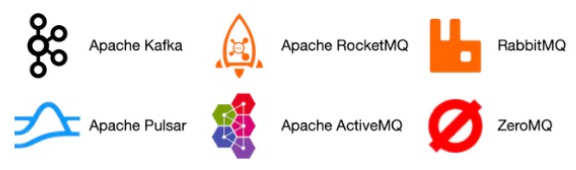

图 4.1：受欢迎的分布式消息队列

### 消息队列 vs 事件流平台

严格来说，Apache Kafka和Pulsar 不是消息队列，而是事件流平台。然而，一些类似的功能模糊了消息队列（RocketMQ、ActiveMQ、RabbitMQ、ZeroMQ等等）和事件流平台（Kafka、Pulsar）的区别。比如，RabbitMQ是一个典型的消息队列，有一个可选的流式功能，允许重复消费消息和保留长消息，它是使用仅追加日志实现的，就像事件流平台一样。Apache Pulsar是Kafka 的主要竞争对手，但它也足够的灵活和高效，可以用作典型的分布式消息队列。

在本章中，我们将设计一个包含**额外功能（比如长消息保留，重复消费消息等等）**的分布式消息队列，这些功能通常只在事件流平台有，会让设计更复杂。所以在整个章节中，我们会指出如果您的面试侧重于更传统的分布式消息队列时，可以简化设计的地方。

## 第一步 - 理解问题并确定设计范围

简而言之，消息队列基本的功能就是：生产者将消息发送到队列，消费者从队列中消费消息。除此之外，还需要考虑性能、消息传递语义、数据保存等等。下面这组问题有助于明确需求并缩小设计范围。

**候选人**：消息的格式和平均大小是多少？只有文本？还是有多媒体？

**面试官**：只有文本消息。消息通常以（KBs）为单位。

**候选人**：消息可以被重复消费吗？

**面试官**：是的，消息可以被不同的消费者重复消费。注意，这是一个附加功能。传统的分布式消息队列在消息成功传递给消费者后不会保留该消息。因此，在传统的消息队列中，消息不能被重复消费。

**候选人**：消息是否要按照生产顺序消费？

**面试官**：是的，消息应该按照生产顺序消费。注意，这是一个附加功能。传统的分布式消息队列通常不会保证传递顺序。

**候选人**：数据要持久化吗？要保留多久？

**面试官**：是的，我们假设数据要保留两周。注意，这是附加功能。传统的分布式消息队列不需要保留消息。

**候选人**：我们要支持多少个生产者和消费者？

**面试官**：越多越好。

**候选人**：我们要支持什么样的数据传输语义？比如，最多一次、至少一次或者恰好一次。

**面试官**：我们肯定要支持至少一次。理想情况下，我们应该支持所有这些语义，并能配置。

**候选人**：目标吞吐量和端到端延迟要求是什么？

**面试官**：它应该支持高吞吐量，来满足像日志聚合的使用场景。也应该支持低延迟，来满足传统消息队列的使用场景。

根据上述对话，我们可以假设有以下功能性需求：

- 生产者将消息发送到消息队列。
- 消费者从消息队列中消费消息。
- 消息可以被重复消费或只消费一次。
- 历史数据可以被截断。
- 消息大小在千字节范围内。
- 能将消息按照添加到队列中的顺序投递给消费者。
- 用户可以配置数据传输语义（至少一次、最多一次或恰好一次）。

### 非功能性需求

- 高吞吐或低延迟，可以根据使用场景配置。
- 可拓展。系统应具有分布式特性，能够支持消息量激增。
- 持久耐用。数据应持久化在磁盘上，并在多个节点间复制。

### 传统消息队列的调整

像RabbitMQ这样的传统消息队列没有事件流平台那么强烈的保留需求，消息在内存中保留的时间仅够它们被消费的。它们提供的磁盘溢出容量[1]，比事件流平台所需的容量小了几个数量级。通常也不维护消息顺序，消息消费顺序可能与生产顺序不同。这些不同点极大的简化了设计，我们将在适当的地方进行讨论。

## 第二步 - 提出高层设计并获得认可

首先，我们来讨论消息队列的基本功能。

图4.2展示了消息队列的关键组件以及组件间的简单交互。

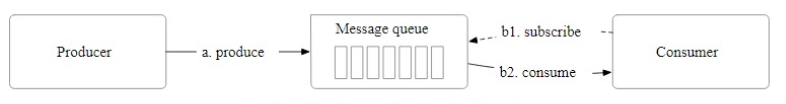

图4.2：消息队列的关键组件

- 生产者向队列中发送消息。
- 消费者订阅队列，并消费订阅的消息。
- 消息队列是一个中间服务，它将生产者和消费者解耦，允许它们各自独立运行和拓展。
- 在客户端/服务端模型中，生产者和消费者都是客户端，而消息队列是服务端。客户端和服务端通过网络通信。

### 消息模型

最流行的消息模型是点对点和发布订阅。

#### 点对点

这种模型常见于传统消息队列。在点对点模型中，被发送到队列中的消息只能被一个消费者消费。可以有多个消费者等待消费队列中的消息，但每条消息只能被一个消费者消费。在图4.3中，消息A只被消费者1消费。

图4.3：点对点模型

一旦消费者确认消息已被消费，这条消息将从队列中移除。在点对点模型中，没有数据保留。相比之下，我们的设计包括一个持久层，将消息保存两周，允许消息被重复消费。

虽然我们的设计可以模拟点对点模型，但其功能更贴近发布-订阅模型。

#### 发布-订阅

首先，我们介绍一个新概念，主题（topic）。主题是用来组织消息的分类。在整个消息队列服务中，每个主题都有一个唯一的名字。

消息会被发送到特定的主题，也可以从特定的主题中读取消息。

在发布-订阅模型中，消息被发送到主题，并由订阅该主题的消费者消费。如图4.4所示，消息A同时被消费者1和消费者2消费。

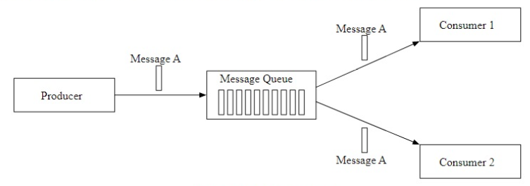

图4.4：发布-订阅模型

我们的分布式消息队列同时支持两种模型。发布-订阅模型通过**主题**实现，点对点模型可以通过**消费组**来模拟。消费组的概念会在消费组章节介绍。

### 主题、分区和代理

如前所述，消息是按主题持久化的。如果主题中的数据量太大，单个服务器无法处理怎么办？

解决这个问题的办法之一是**分区**（partition）。如图4.5所示，我们将主题划分为分区，并将消息均匀分布在分区中。可以将分区视为主题消息的一个小的子集。分区均匀分布在消息队列集群中的各服务器上。这些保存分区的服务器被称为**代理**（broker）。在代理上分布的分区是支持高可拓展的关键。我们可以通过增加分区的数量来扩展主题容量。

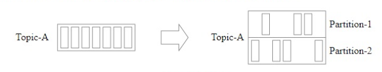

图4.5：分区

每个主题分区都是以FIFO（先进先出）队列的形式进行操作。这意味着在分区内我们可以保持消息的顺序。消息在分区中的位置被称为**偏移量**（offset）。

生产者发送消息，实际上是发送到主题的分区上。每个消息都有一个可选的消息键（比如，用户ID），消息键相同的消息都会被发送到相同的分区。如果没有消息键，消息会被随机发送到一个分区上。

当一个消费者订阅一个主题时，它会从这个主题的一个或多个分区中拉取数据。当多个消费者订阅一个主题时，每个消费者都负责这个主题的部分分区。这些消费者形成了主题的**消费组**（consumer group）。

消息队列集群，包括代理和分区，如图4.6所示。

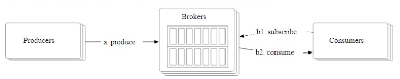

图4.6：消息队列集群

### 消费组

如前所述，我们需要同时支持点对点和发布-订阅模型。**消息组**是一组消费者，它们一起消费主题中的消息。

消费者可以被组织成消费组。每个消费组可以订阅多个主题，并维护自己的消费偏移量。比如，我们可以根据用例对消费者进行分组，计费一组，记账是另一组。

同一组中的消费者可以并行消费，如图4.7所示。

- 消费组1订阅了主题A
- 消费组2订阅了主题A和B

- 主题A同时被消费组1和2订阅，这意味着同一条消息会被多个消费者消费。这种模式支持发布-订阅模型。

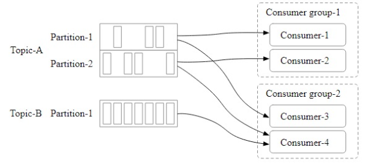

图4.7：消费组

然而，这有一个问题。并行读数据提高了吞吐量，但不能保证同一分区中消息的消费顺序。比如，如果消费者1和消费者2都从分区1中读数据，我们就没法保证分区1中消息的消费顺序。

好消息是我们可以添加一个约束来修复这个问题，即一个分区只能被同一组中的一个消费者消费。如果消费组中消费者的数量大于主题中分区的数量，那么一些消费者将无法从主题中获取数据。比如，在图4.7中，主题B中的消息不能被消费组2中的消费者3消费，因为它已经被同一消费组中的消费者4消费了。

在这个约束下，如果我们把所有消费者都放在同一个消费组中，那么同一分区的消息只能被一个消费者消费，就相当于点对点模型了。分区是最小的存储单元，我们可以提前分配足够多的分区，来避免动态增加分区的数量。这样在处理高并发时，我们只需要增加消费者。

### 高级架构

图4.8展示了更新后的高级设计。

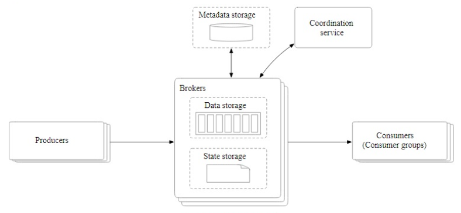

图4.8：高级设计

客户端

- 生产者：向指定主题中发送消息
- 消费组：订阅主题并消费消息

核心服务和存储

- 代理：保存多个分区。一个分区保存一个主题消息的子集。
- 存储：
  - 数据存储：消息持久化在分区的数据存储中。
  - 状态存储：消费状态由状态存储管理。
  - 元数据存储：主题的配置和属性持久化在元数据存储中。

- 协调服务
  - 服务发现：哪些代理是活跃的。
  - 领导人选举：选一个代理作为活动控制器。集群中只有一个活动控制器，负责分配分区。
  - 常用Apache ZooKeeper[2]或etcd[3]来选举控制器。

## 第3步 - 深入设计

为了满足高数据保留要求的同时实现高吞吐量，我们做出了三个重要的设计选择，现在我们详细解释一下。

- 我们选择了一种磁盘上的数据结构，它利用旋转磁盘出色的顺序访问能力和现代操作系统积极的磁盘缓存策略。
- 我们设计的消息数据结构，不需要修改消息，就可以让其从生产者传递到队列，最终传递到消费者。这最大限度地减少了复制需求，在高容量和高流量的系统中，复制是非常昂贵的。

- 我们设计了有利于批处理的系统。小I/O会阻碍高吞吐。因此，只要有可能，我们的设计就使用批处理。生产者批量发送消息。消息队列批量持久化消息。在可能的情况下，消费者也批量获取消息。

### 数据存储

现在我们来更详细地探究持久化消息这块。为了找到最佳选择，我们来考虑下消息队列的流量模式。

- 写密集型，读密集型。
- 没有更新或删除操作。顺便一提，传统的消息队列除非消息落后，否则不会持久化消息。在消息落后的情况下，当队列追上时会有删除操作。我们这里讨论的是数据流平台的持久化。
- 主要是顺序读/写。

选择1：数据库

第一个选择是使用数据库。

- 关系性数据库：创建一个主题表，并将消息以行的形式写入表。
- NoSQL数据：创建一个集合作为主题，并将消息以文档形式写入。

数据库可以处理存储需求，但并不理想，因为很难设计一个在大规模上同时支持写密集型和读密集型访问模式的数据库。数据库解决方案并不适合我们特定的数据使用模式。

这意味着数据库不是最佳选择，还可能成为系统的瓶颈。

选择2：预写日志（WAL）

第二个选择是预写日志（WAL）。WAL只是一个普通文件，新条目会被追加到一个仅追加的日志中。WAL被许多系统使用，比如MySQL中的重做日志[4]和ZooKeeper中的WAL。

我们建议将消息持久化为磁盘上的WAL日志文件。WAL是纯顺序读/写的访问模式。磁盘的顺序读写性能非常好[5]。此外，旋转磁盘的容量很大，而且价格很便宜。

如图4.9所示，新消息被追加到分区的末尾，并有一个单调递增的偏移量。最简单的选择是将日志文件的行号作为偏移量。但是，文件不能无限增长，所以将其分段是一个好主意。

分段后，新消息只会被追加到活动段文件（active segment file）中。当活动段达到一定大小时，将创建一个新的活动段来接收消息，而当前活动段会变成非活动状态，就像其它非活动段一样。非活动段仅处理读请求。如果旧的非活动段文件超过保留或容量限制，可以将其截断。

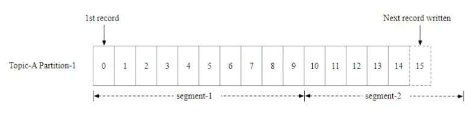

图4.9：追加新消息

同一分区的分段文件都在一个名为Partition-{:partition_id}的文件夹中。结构如图4.10所示。

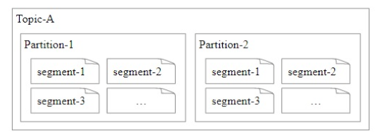

图4.10：数据分段文件在主题分区中的分布

#### 磁盘性能说明

为了满足高数据保留要求，我们的设计很大程度上依赖磁盘来保存大量数据。有一种常见的误解：旋转磁盘很慢，但实际上只有随机访问的情况下很慢。对于我们的工作负载，只要我们设计磁盘上的数据结构去利用顺序访问模式，在现代RAID配置（即将磁盘条带化以提高性能）的磁盘上是可以轻松达到每秒几百兆读写速度的。这对于我们的需求是绰绰有余的，而且成本结构也很有利。

此外，现代操作系统非常积极地在主存中缓存磁盘数据，甚至愿意使用所有可用的空闲内存来缓存磁盘数据。如上所述，WAL也使用了大量操作系统磁盘缓存。

### 消息数据结构

消息的数据结构是高吞吐量的关键。它定义了生产者、消息队列和消费者之间的约定。我们的设计，通过消除消息从生产者到队列，最终到消费者这个传输过程中不必要的数据复制，来实现高性能。如果系统中的任何部分不同意这个约定，就需要变更消息，这会涉及到昂贵的复制，可能会严重影响系统的性能。

下面是消息数据结构的示例模式：

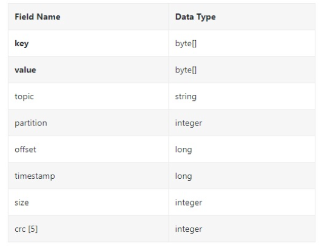

表4.1：消息数据模式

#### 消息键

消息键用来确定消息的分区，按hash(键) % 分区数选择。如果没有定义，则随机选择分区。如果我们需要更灵活，生产者可以定义自己的映射算法来选择分区。请注意，键不等于分区号。

键可以是字符串或数字。它通常带有一些业务信息。分区号是消息队列中的概念，不应该直接暴露给客户端。

使用合适的映射算法，如果分区数量发生变化，消息仍然可以均匀地发送到所有分区。

#### 消息值

消息值是消息的有效负载。它可以是纯文本或压缩的二进制块。

|提醒|
|:--|
|消息的键和值与键值（KV）存储中的键值对不同。在键值存储中，键是唯一的，我们可以通过键找到对应的值。在消息中，键不需要是唯一的，甚至不是必须的，我们也不需要通过键来查找值。|

#### 消息的其它字段

- 主题：消息所属主题的名称。
- 分区：消息所属分区的ID。
- 偏移量：消息在分区中的位置。我们可以通过三个字段的组合来找到一条消息：主题、分区、偏移量。
- 时间戳：消息存储时的时间戳。
- 大小：消息的大小。
- CRC：循环冗余检查（CRC）用来确保原始数据的完整性。

为了支持额外功能，可以根据需求添加一些可选字段。比如，如果标签是可选字段的一部分，可以按标签过滤消息。

### 批处理

批处理在这个设计中非常普遍。我们在生产者、消费者和消息队列本身中批处理消息。批处理是系统性能的关键。在本节中，我们主要关注消息队列中的批处理。稍后，我们再详细讨论生产者和消费者的批处理。

批处理是提升性能的关键，因为：

- 它允许操作系统将消息分组在一起，在单个网络请求中处理，来分摊昂贵的网络往返成本。
- 代理将消息大批量写入仅追加日志时，这些日志会加载到由操作系统维护的更大的顺序写入块和更大的连续磁盘缓存块中。两者都会大大增加顺序磁盘访问吞吐量。

吞吐量和延迟之间需要权衡。如果系统作为传统消息队列部署，那么延迟更重要，可以调整系统使用更小的批次大小。在这种情况下，磁盘的性能会受到一点影响。如果针对吞吐量进行调优，每个主题可能需要更多的分区，来弥补较慢的顺序磁盘写入吞吐量。

到目前为止，我们已经介绍了主磁盘存储子系统，及其相关的磁盘数据结构。现在，让我们换个话题，来讨论生产者和消费者流程。然后，我们再回来深入探讨消息队列的其余部分。

### 生产者流程

如果生产者想要向分区发送消息，它应该连接哪个代理？第一个选择是引入一个路由层。所有发送到路由层的消息都会被路由到“正确的”代理。如果代理有副本，那么“正确的”代理是主副本（leader replica）。我们稍后会介绍复制。

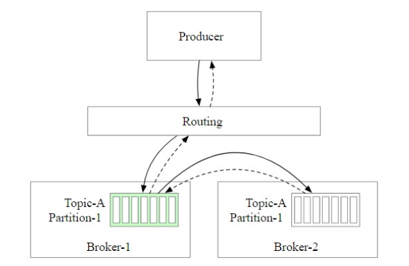

图4.11：路由层

如图4.11所示，生产者尝试向主题-A的分区-1发送消息。

1. 生产者向路由层发送消息。
2. 路由层从元数据存储中读取副本分布计划1，并缓存在本地。当消息到达时，它将消息路由到存储在代理-1中的分区-1主副本上。

> 注解1：每个分区的副本分布称为副本分布计划

3. 主副本接收消息，从副本（follower replica）从主副本拉取数据。
4. 当“足够多”的副本同步了消息，主副本提交数据（保存在磁盘上），这样数据就可以被消费了。然后它响应生产者。

你可能想知道为什么我们需要主副本和从副本，原因是容错。我们将在第113页的“同步副本”部分深入探究这个过程。

这种方法可行，但有一些缺点：

- 新的路由层有开销和额外的网络跳转，会引入额外的网络延迟。
- 请求批处理是提高效率的重要因素。这个设计没有考虑这一点。

图4.12展示了改进后的设计

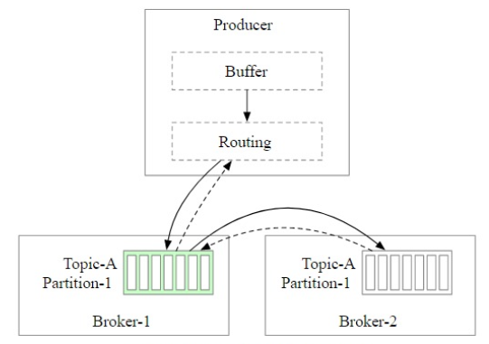

图4.12：带有缓冲区和路由的生产者

路由层被封装进生产者，并在生产者中添加了一个缓冲组件。两者都可以作为生产者客户端库的一部分安装在生产者中。这个改动带来了几个好处：

- 网络跳转越少，延迟越低。
- 生产者可以有自己的逻辑来决定消息应该发送到哪个分区。
- 批处理将消息缓存在内存中，能在单个请求中发送更大批量的消息。这增加了吞吐量。

批处理大小的选择是吞吐量和延迟之间的经典权衡（图4.13）。大批次，吞吐量增加但延迟更高，因为积累批次需要更长的等待时间。小批次，请求发送更快，所以延迟更低，但吞吐量会受影响。生产者可以根据用例调整批次大小。

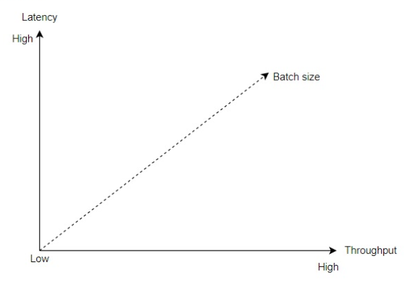

### 消费流程

消费者指定在分区中的偏移量，并从该位置开始接收事件。如图4.14所示。

图4.14：消费流程

#### 推 vs 拉

回答一个重要的问题：代理应将数据推送给消费者，还是消费者应该从代理拉取数据。

##### 推模型

优点：

- 低延迟：代理可以在收到消息后立即将其推送给消费者。

缺点：

- 如果消费速度低于生产速度，消费者可能不堪重负。
- 数据传输速度由代理控制，很难针对不同处理能力的消费者去改变。

##### 拉模型

优点：

- 消费者控制消费速度。我们可以让一组消费者实时处理消息，让另一组消费者批处理消息。
- 如果消费速度低于生产速度，我们可以增加消费者，或者慢慢处理。
- 拉模型更适合批处理。在推模型中，代理不知道消费者能否立即处理消息。如果代理一次向消费者发送一个消息，而消费者处理不及时，新消息将会在缓冲区中等待。拉模型会拉取日志中消费者当前位置之后所有的可用消息（或拉取到配置的最大大小），适合做数据的大批量处理。

缺点：

- 当代理中没有消息时，消费者仍然会继续拉取数据，浪费资源。为了解决这个问题，很多消息队列支持长轮训模式，允许拉取等待指定的时间来获取新消息[6]。

基于这些考虑，大多数消息队列选择拉模型。

图4.15展示了消费者拉模型的工作流程。

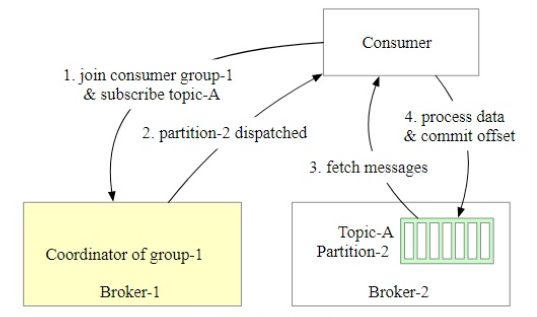

图4.18：拉模型

1. 新消费者想要加入消费组1并订阅主题A。它通过哈希组名找到对应的代理节点。这样做，同一消费组中的所有消费者都连接到同一个代理，这个代理也被称为消费组的协调者（coordinator）。尽管命名相似，但消费组协调者与图4.8中提到的协调服务不同。这个协调者协调消费组，而前面提到的协调服务协调代理集群。
2. 协调者确认消费者已加入消费组，将分区2分配给消费者。有不同的分区分配策略，包括轮训、范围等[7]。
3. 消费者从最后消费的偏移量开始获取消息，该偏移量由状态存储管理。
4. 消费者处理消息，并将偏移量提交给代理。消息处理和偏移量提交的顺序会影响消息传递语义，我们稍后讨论。

### 消费者再均衡

消费者再均衡（rebalance）决定哪个消费者负责哪个分区子集。这个过程可能发生在消费者加入时、消费者离开时、消费者崩溃时、或分区调整时。

当消费者再均衡发生时，协调者起着重要作用。我们先来看看协调者是什么。协调者是负责与消费者通信来实现消费者再平衡的一个代理。协调者接收来自消费者的心跳，并管理它们在分区上的偏移量。

让我们用一个例子来理解协调者和消费者是如何一起工作的。

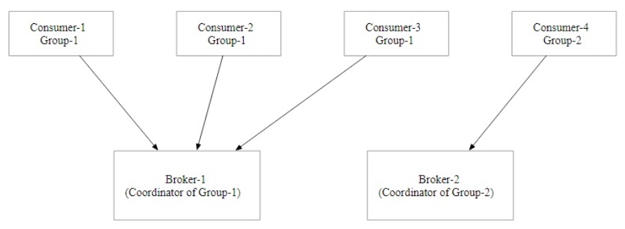

图4.16：消费组协调者

- 如图4.16所示，每个消费者都属于一个消费组。它通过哈希组名来找到指定的协调者。所有来自同一个消费组的消费者都连接到相同的协调者。
- 协调者维护一个已加入消费者的列表。当列表发生变化时，协调者会在组中选举出新的领导人（leader）。
- 消费组的新领导人生成新的分区调度计划，并报告给协调者。协调者会把计划广播（broadcast）给组中的其它消费者。

在分布式系统中，消费者可能会遇到各种各样的问题，包括网络问题、崩溃、重启等。在协调者的角度来看，它们将不再有心跳。当这种情况发生时，协调者将触发再平衡来重新分配分区，如图4.17所示。

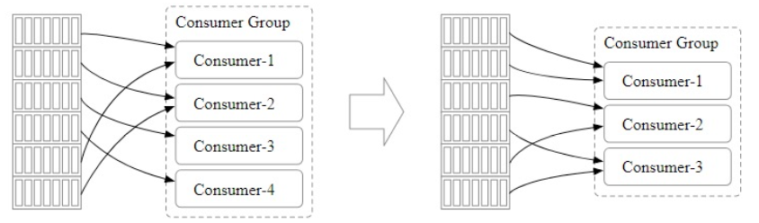

图4.17：消费者再平衡

让我们模拟几个再平衡场景。假设消费组中有两个消费者，订阅的主题中有4个分区。图4.18展示了新消费者B加入消费组的流程。

图4.18：新消费者加入

1. 最初，消费组中只有消费者A。它消费所有分区，并与协调者保持心跳。
2. 消费者B发送加入消费组的请求。
3. 协调者知道是时候进行再平衡了，因此它以被动的方式通知组内的所有消费者。当协调者收到A的心跳时，会要求A重新加入消费组。
4. 当所有消费者都重新加入消费组时，协调者从中选出一个作为领导人，并将选举结果通知给所有消费者。
5. 领导人消费者生成分区调度计划，并将计划发送给协调者。跟随者（follower）消费者向协调者询问分区调度计划。
6. 消费者开始从新分配的分区中消费消息。

图4.19展示了消费者A离开消费组的流程。

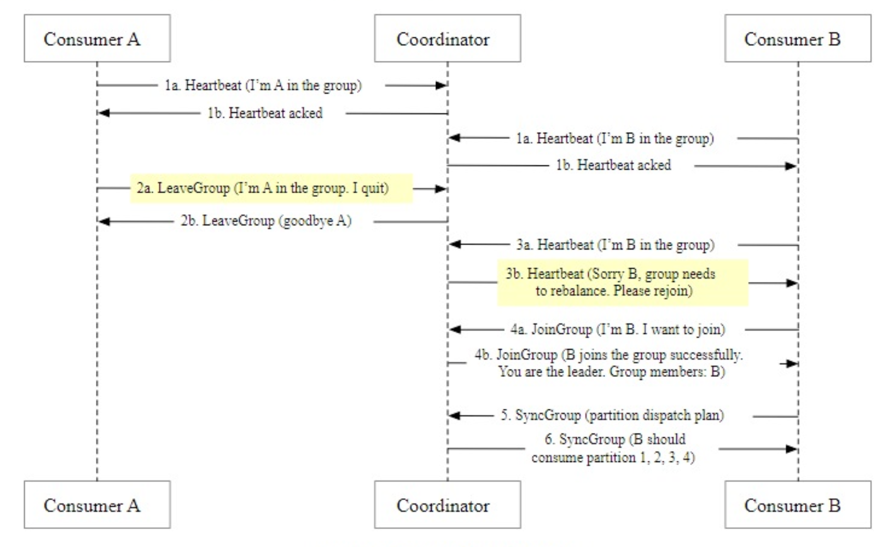

图4.19：现有消费者离开

1. 消费者A和B在同一个消费组中。
2. 消费者A需要被关闭，所以它请求离开消费组。
3. 协调者知道是时候进行再平衡了。当协调者收到B的心跳时，会要求B重新加入消费组。
4. 剩余步骤与图4.18所示相同。

图4.20展示了现有消费者A崩溃时的流程。

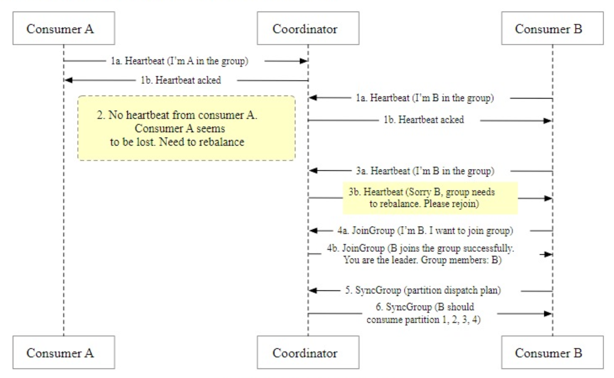

图4.20：现有消费者崩溃

1. 消费者A和B与协调者保持心跳。
2. 消费者A崩溃了，所以没有从消费者A发送到协调者的心跳。当协调者在指定时间内没有从消费者A收到任何心跳信号时，它将消费者标记为死亡。
3. 协调者触发再平衡。
4. 剩余步骤与上一个场景相同。

现在我们已经完成了关于生产者和消费者流程的讨论，让我们回过头继续深入研究消息队列代理的剩余部分。

### 状态存储

在消息队列代理中，状态存储存储以下内容：

- 分区和消费者之间的映射。
- 每个分区中消费组最后消费的偏移量。如图4.21所示，消费组1最后消费的偏移量是6，消费组2是13。

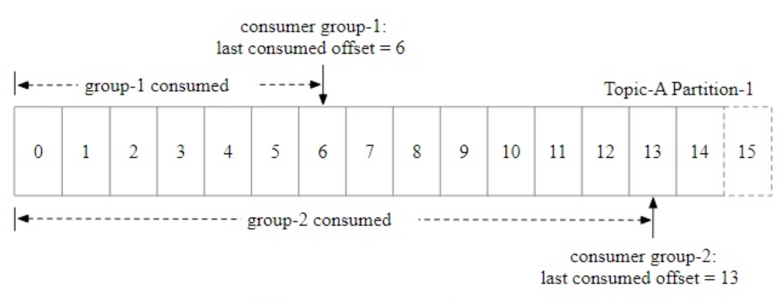

图4.21：消费组最后消费的偏移量

比如，如图4.21所示，消费组1中的消费者顺序消费分区中的消息，并提交消费的偏移量6.这意味着偏移量6及以前的所有消息都已经被消费。如果这个消费者崩溃，同一组中的另一个新消费者会从状态存储中读取最后消费的偏移量，然后继续消费。

消费者状态的数据访问模式是：

- 读写操作频繁，但数据量不高。
- 数据更新频繁，很少被删除。
- 随机读写操作。
- 数据一致性很重要。

很多存储解决方案都可用于存储消费者状态数据。考虑到数据一致性和快速读写的需求，像Zookeeper这样的KV存储是一个很好的选择。Kafka已经将偏移量存储从Zookeeper迁移到了Kafka代理。有兴趣的读者可以阅读参考资料[8]了解更多信息。

### 元数据存储

元数据存储存储主题的配置和属性，包括分区数量、保留期和副本分布。

元数据不经常变更，数据量很小，但对一致性要求高。Zookeeper是存储元数据的好选择。

### ZooKeeper

通过阅读前面的章节，你也许已经感觉到Zookeeper对于设计分布式消息队列非常有帮助。你可能还不熟悉它，Zookeeper是一个为分布式系统提供分层键值存储的基本服务。它通常用于分布式配置服务、同步服务和命名注册中心[2]。

如图4.22所示，Zookeeper用于简化我们的设计。

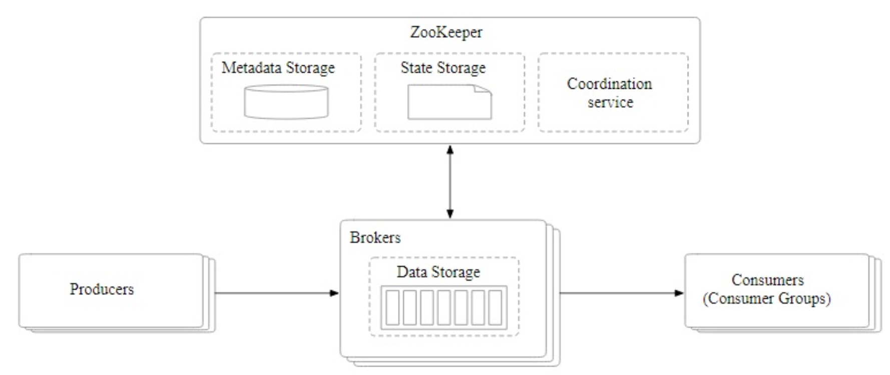

图4.22：Zookeeper

让我们简单回顾下变更。

- 元数据和状态存储迁移到Zookeeper。
- 代理现在只需要维护消息的数据存储。
- Zookeeper帮助代理集群进行领导人选举。

### 复制

在分布式系统中，硬件问题很常见，不能忽视。当磁盘损坏或永久故障时，数据会丢失。复制是实现高可用的经典解决方法。

如图4.23所示，每个分区有3个副本，分布在不同的代理节点上。

对于每个分区，高亮的是主副本，其它的是从副本。生产者只向主副本发送消息。从副本不断从主副本拉取新消息。当消息同步到足够多的副本时，主副本向生产者返回确认。我们将在下面的同步副本一节详细介绍如何定义“足够”。

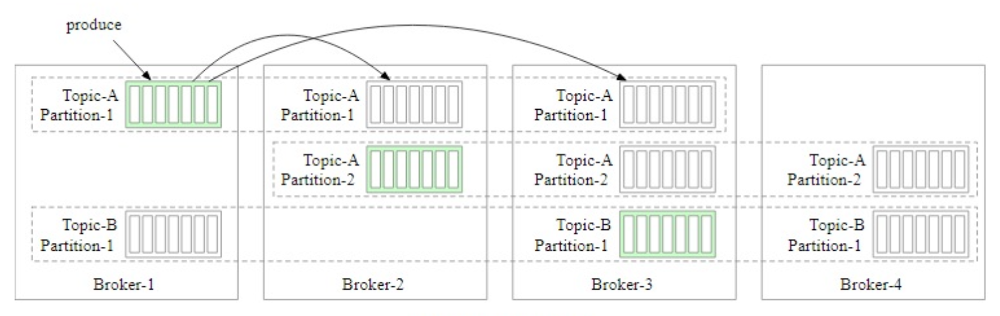

图4.23：复制

每个分区的副本分布称为副本分布计划。比如，图4.23中的分布分布计划可以描述为：

- 主题A的分区1：3个副本，主副本在代理1，从副本在代理2和3；
- 主题A的分区2：3个副本，主副本在代理2，从副本在代理3和4；
- 主题B的分区1：3个副本，主副本在代理3，从副本在代理4和1。

谁制定的副本分布计划？它的工作原理如下：在协调者的帮助下，其中一个代理被选举为领导人。它生成副本分布计划，并将其持久化在元数据存储中。然后所有代理都能按照计划工作了。

如果你有兴趣了解更多关于复制的知识，请查看《数据密集型应用系统设计》的”第五章. 复制“[9]。

#### 同步副本

我们提过消息持久化在多个分区中来避免单节点故障，并且每个分区都有多个副本。消息只写入到主副本，从副本从主副本同步数据。我们需要解决的一个问题是保持它们同步。

同步副本（in-sync replicas，ISR）是指与主副本“同步”的副本。“同步”的定义取决于主题配置。比如，如果replica.lag.max.messages的值是4，则表示只要从副本不落后于主副本超过3个消息，它就不会从ISR[10]中移除。默认情况下，主副本是ISR。

让我们以图4.24所示为例，展示ISR的工作原理。

- 主副本中已提交的偏移量是13。有两个新消息写入了主副本，但还没有提交。已提交偏移量表示这个偏移量及其之前的所有消息都已经同步到ISR中的所有副本。
- 副本2和副本3已经完全追上主副本，所以它们在ISR中，可以获取新消息。
- 副本4没有在配置的延迟时间内完全追上主副本，所以它不在ISR中。当它再次追上时，可以再添加到ISR中。

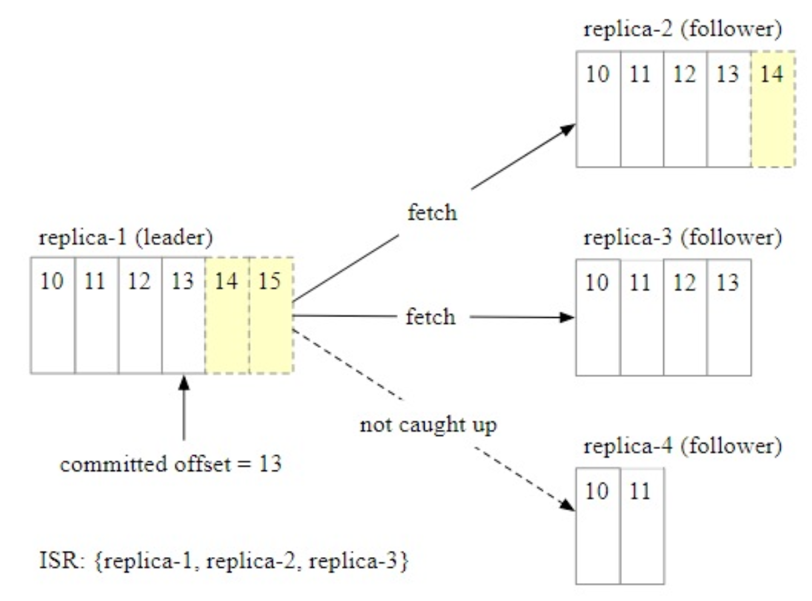

图4.24：ISR工作原理

为什么我们需要ISR？原因是ISR反映了性能和可靠性之间的权衡。如果生产者不想丢失任何消息，最安全的办法是在发送确认之前确保所有副本都已经同步。但是慢副本将导致整个分区变得缓慢或不可用。

既然我们已经讨论了ISR，让我们来看看确认设置。生产者可以选择直到K个ISR接收到消息后才收到确定，其中K是可配置的。

##### ACK=all

图4.25演示了ACK=all的情况。当ACK=all时，生产者在所有ISR都收到消息时才收到ACK。这意味着发送消息要花很长时间，因为我们需要等待最慢的ISR，但它提供了最强的消息可靠性。

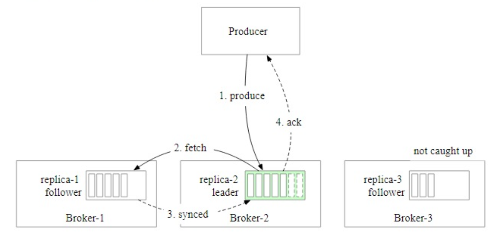

图4.25：ack=all

##### ACK=1

当ACK=1时，生产者在主副本持久化完消息后就收到ACK。通过不等待数据同步，改善延迟。如果主副本在消息ACK后立刻故障，此时消息还没有复制到从节点，那么这个消息就丢失了。这个设置适用于接受偶尔数据丢失的低延迟系统。

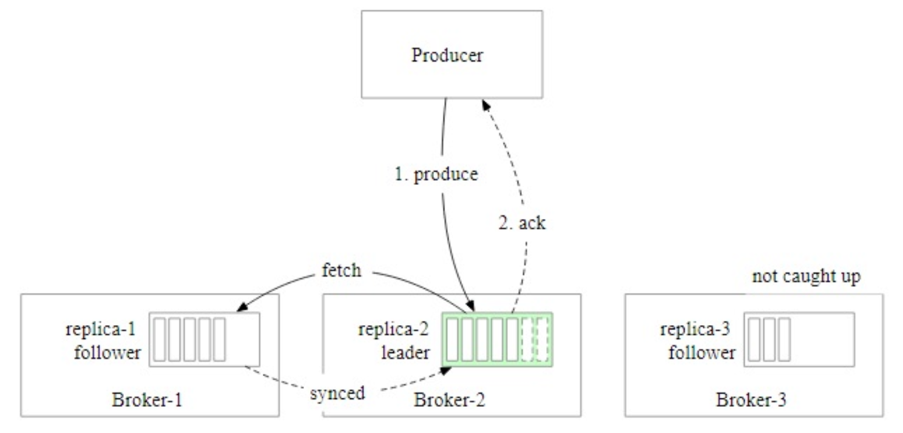

图4.26：ack=1

##### ACK=0

生产者不断向主副本发送消息，不等待任何确认，并且从不重试。这种方法以可能丢失消息为代价，提供最低的延迟。这个设置可能适用于收集指标或日志数据等用例，因为数据量大，偶尔的数据丢失是可以接受的。

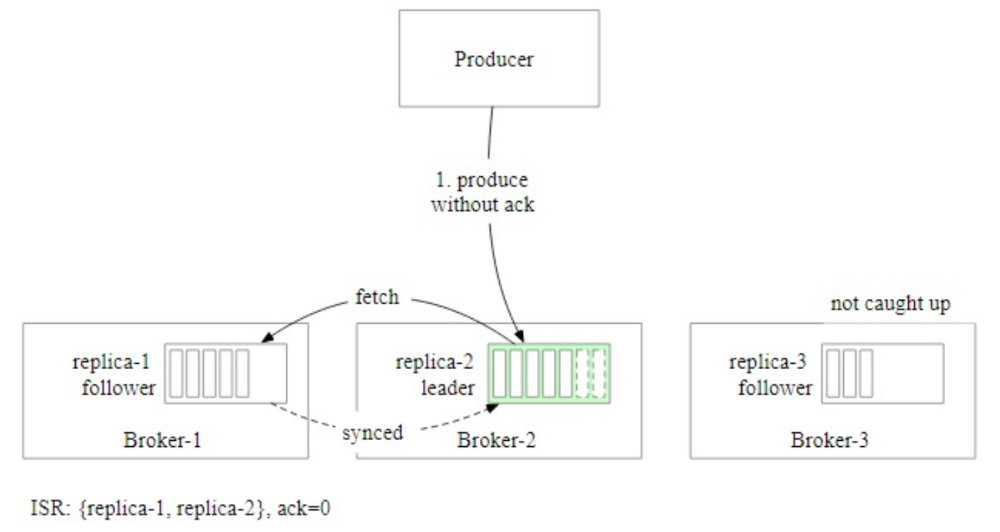

图4.27：ack=0

可配置的ACK允许我们用可靠性换性能。

现在我们来看看消费者方面。最简单的设置是让消费者连接到主副本来消费消息。

你可能想知道这种设计是否会使主副本不堪重负，以及为什么不从ISR读取消息。原因是：

- 设计和操作简单。
- 一个分区中的消息只会分配给一个消费组中的一个消费者，这限制了主副本的连接数。
- 只要主题不是超级热点（hot），主副本的连接数通常不大。
- 如果主题是热点，我们可以通过增加分区和消费者数量来拓展。

在某些情况下，从主副本读取可能不是最佳选择。比如，如果消费者位于与主副本不同的数据中心，读性能会受到影响。在这种情况下，让消费者能够从最近的ISR中读取数据是有价值的。感兴趣的读者可以查阅相关的参考资料[11]。

ISR非常重要。它如何确定副本是否是ISR？通常，每个分区的主副本通过计算每个副本相对于自己的延迟来跟踪ISR列表。如果你对详细的算法感兴趣，可以在参考资料[12] [13]中找到实现。

### 可扩展性

到目前为止，我们已经在设计分布式消息队列系统方面取得了很大的进展。下一步，我们来评估下不同系统组件的可扩展性：

- 生产者
- 消费者
- 代理
- 分区

#### 生产者

生产者在概念上比消费者简单很多，因为它不需要组协调。通过增加或移除生产者实例，可以轻松实现生产者的可拓展性。

#### 消费者

消费组之间是相互隔离的，所以很容易增加或移除消费组。在消费组中，再平衡机制有助于处理消费者被增加、移除或崩溃的情况。有了消费组和再平衡机制，就可以实现消费者的可拓展性和容错性。

#### 代理

在讨论代理的可拓展性前，我们先考虑下代理的故障恢复。

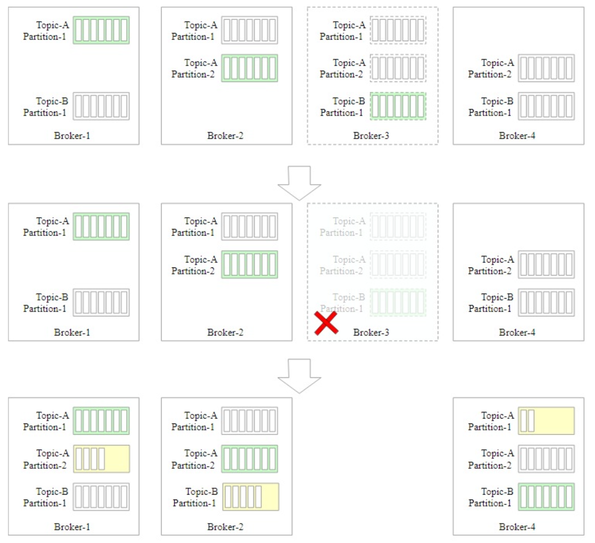

图4.28：代理节点崩溃

让我们用图4.28中的例子来解释故障恢复的工作原理。

1. 假设有4个代理，分区（副本）分布计划如下：
   1. 主题A的分区1：副本在代理1（主副本）、2和3中。
   2. 主题A的分区2：副本在代理2（主副本）、3和4中。
   3. 主题B的分区1：副本在代理3（主副本）、4和1中。

2. 代理3崩溃，也就是说这个节点上的所有分区都丢失了。分区分布计划变更为：
   1. 主题A的分区1：副本在代理1（主副本）和2中。
   2. 主题A的分区2：副本在代理2（主副本）和4中。
   3. 主题B的分区1：副本在代理4和1中。
3. 代理控制器检测到代理3宕机，会为剩余的代理节点生成新的分区分布计划：
   1. 主题A的分区1：副本在代理1（主副本）、2和4（新副本）。
   2. 主题A的分区2：副本在代理2（主副本）、4和1（新副本）。
   3. 主题B的分区1：副本在代理4（主副本）、1和2（新副本）。
4. 新副本作为从副本工作，会追上主副本。

要使代理具有容错性，还需要注意以下事项：

- ISR的最小数量指定了消息被认为成功提交前，生产者必须接收的副本数量。数量越大越安全。但另一方面，我们需要平衡延迟和安全性。
- 如果一个分区的所有副本都在同一个代理节点上，我们就不能容忍这个节点的故障。而且在同一个节点中复制数据也是一个资源浪费。因此，副本不应该在同一个节点中。
- 如果分区的所有副本都崩溃了，那么这个分区的消息将永久丢失。当选择副本数量和副本位置时，需要在数据安全、资源成本和延迟之间进行权衡。将副本分散在不同的数据中心更安全，但会在副本之间同步数据时产生更多的延迟和成本。一种解决方案是数据镜像，它可以帮助我们跨数据中心复制数据，但这超出了本书的范围。参考资料[14]涵盖了这个主题。

现在我们回过头来讨论代理的拓展性。最简单的方法是在增加或移除代理时重新分配副本。

然而，有一个更好的方法。代理控制器可以暂时允许系统中的副本数量超过配置文件中配置的。当新增加的代理追上时，我们再移除不再需要的代理。让我们用图4.29中的例子来理解这种方法。

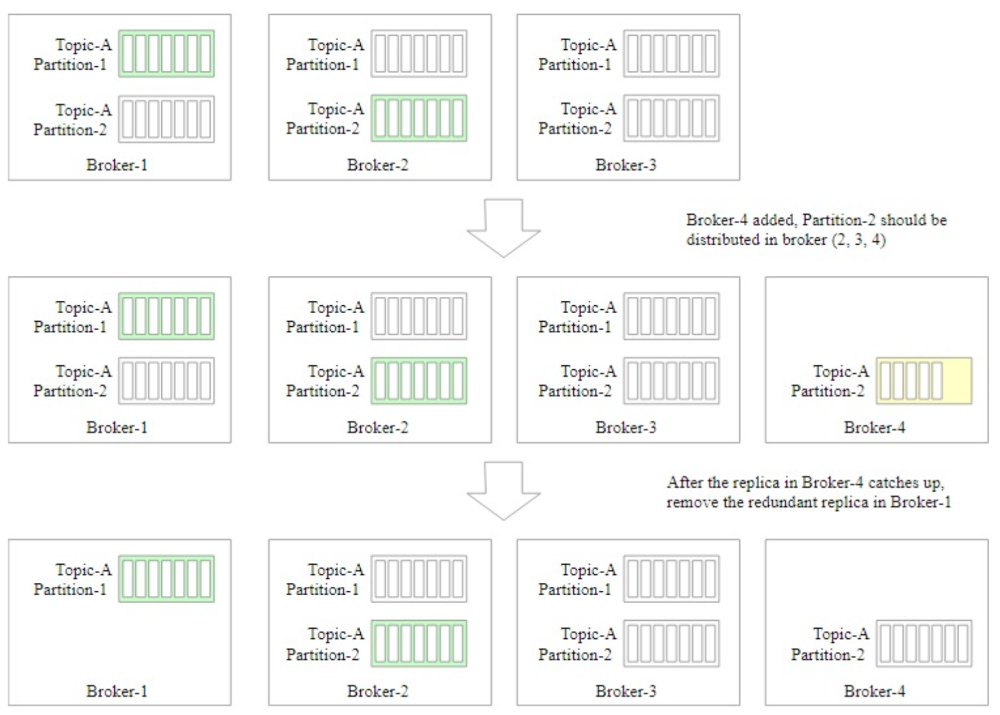

图4.29：增加新代理节点

1. 初始设置：3个代理、2个分区，每个分区有3个副本。
2. 添加新的代理4。假设代理控制器将分区2的副本分布改为代理（2、3、4）。代理4中的新副本开始从代理2主副本复制数据。现在分区2的副本数量暂时大于3.
3. 等代理4中的副本追上，代理1中冗余的副本将被平滑地移除。

通过遵行此过程，可以避免增加代理时的数据丢失。也可以用类似的方式安全移除代理。

#### 分区

出于各种操作原因，比如扩展主题、吞吐量调优、平衡可用性/吞吐量等，我们可能会变更分区的数量。当分区的数量发生变化时，生产者在与任意代理通信后会被通知，消费者也会触发消费者再平衡。因此，这对生产者和消费者都是安全的。

现在让我们考虑下分区数量发生变化时的数据存储层。如图4.30所示，我们向主题中增加了一个分区。

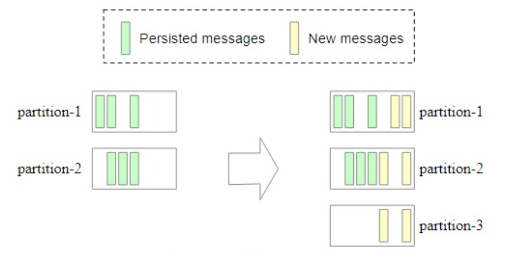

图4.30：增加分区

- 已持久化的消息仍在旧分区中，所以不用数据迁移。
- 增加新分区（分区3）后，新消息将持久化在这三个分区中。

因此，通过增加分区来扩展主题是最简单直接的。

#### 减少分区数量

减少分区数量更复杂，如图4.31所示。

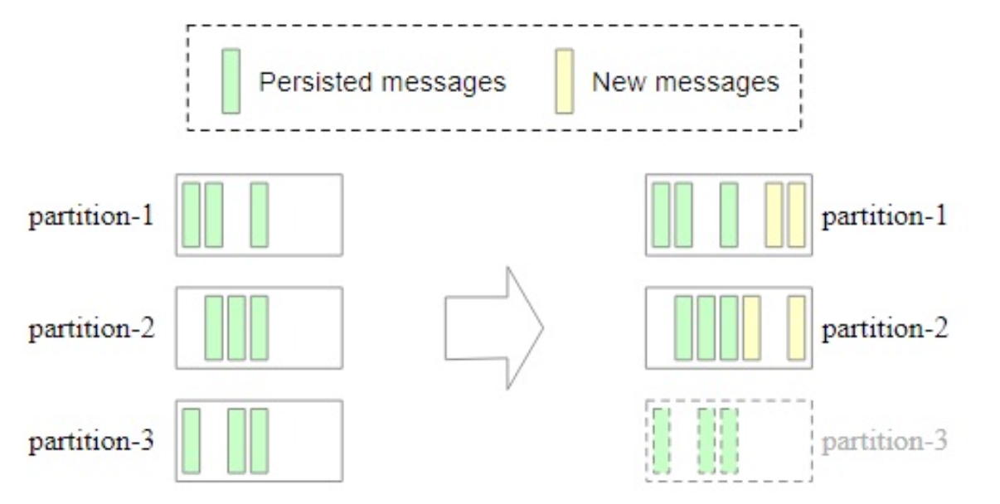

图4.31：减少分区

- 分区3已下线，所以新消息只能由剩余的分区（分区1和分区2）接收。

- 已下线的分区不能立即被移除，因为消费者可能还在消费这些数据。只有在配置的保留期过后，才能截断数据，释放存储空间。减少分区并不是回收数据空间的捷径。
- 在这个过渡期间（分区3已下线），生产者只向剩余的2个分区发送消息，但消费者仍可以从3个分区中消费。当分区下线的保留期过了之后，需要再平衡消费组。

### 数据传输语义

现在我们了解了分布式消息队列的不同组件，让我们再讨论下不同的传输语义：最多一次、至少一次和恰好一次。

#### 最多一次

顾名思义，最多一次表示消息最多只会被投递一次。消息可能会丢失，但不会重复投递。这就是高层次最多一次投递的工作原理。

- 生产者异步地向主题发送消息，不等待确认（ack=0）。如果消息投递失败，不会重试。
- 生产者获取消息，并在数据处理完前提交偏移量。如果消费者在偏移量提交后崩溃，消息不会被重新消费。

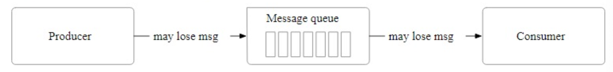

图4.32：最多一次

它适用于监控指标等，接收少量数据丢失的使用场景。

#### 至少一次

在这个数据传输语义下，可以多次传递消息，但不会丢失消息。以下就是它在高层次上的工作原理。

- 生产者通过响应回调同步或异步发送消息，并设置ack=1或ack=all，来确保消息被发送到代理。如果消息发送失败或超时，生产者将不断重试。
- 消费者获取消息后，只有在数据成功处理后才提交偏移量。如果消费者处理消息失败，它会重新消费消息，这样就不会有数据丢失。另一方面，如果消费者处理了消息，但未能将偏移量提交给代理，当消费者重新启动时，消息将被重新消费，导致重复。
- 消息可能会投递给代理和消费者多次。

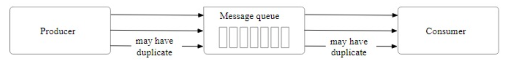

图4.33：至少一次

使用场景：至少一次，不会丢失消息，但同一消息可能会被投递多次。虽然从用户角度来看并不理想，但至少一次语义非常适用于数据重复不是大问题或在消费者端可以去重的场景。比如，每个消息都有一个唯一键，在向数据库写入重复数据时消息会被拒绝。

#### 恰好一次

恰好一次是最难实现的传输语义。它对用户友好，但对系统的性能和复杂性来说代价很高。

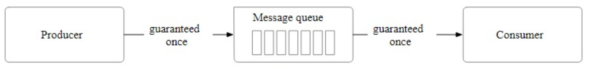

图4.34：恰好一次

使用场景：金融相关的场景（支付、交易、会计等）。当不允许重复，并且下游服务或第三方不支持幂等时，恰好一次尤为重要。

### 高级特性

在本节中，我们将简要讨论一些高级特性，比如消息过滤、延迟消息和定时消息。

#### 消息过滤

主题是包含相同类型消息的逻辑抽象。但是，一些消费者可能只想消费某些子类型的消息。比如，例如，订单系统会将所有与订单相关的活动发送到同一个主题中，但支付系统只关心与结账和退款相关的消息。

一种选择是为支付系统和订单系统分别建立专用的主题。这种方法很简单，但可能会带来一些问题。

- 如果其他系统要不同子类型的消息怎么办？我们是否要给每个消费请求都建一个专用主题？
- 在不同主题上保存相同消息是一种资源浪费。
- 每当有新消费者需求时生产者都需要进行改动，因为生产者和消费者现在是紧耦合的。

因此，我们需要使用其他方法来解决这个需求。幸运的是，消息过滤可以解决。

一种简单的消息过滤方案是：消费者获取完整的消息集，在处理时过滤掉不需要的消息。这种方法很灵活，但会引入不必要的流量，影响系统性能。

更好的解决方案是在代理侧过滤消息，这样消费者只用接收它们关心的消息。实现这一方案需求仔细考虑。如果数据过滤需要解密或反序列化数据，就会降低代理的性能。此外，如果消息包含敏感数据，它们在消息队列中就不应该可读。

因此，代理中的过滤逻辑不应该提取消息的负载（payload）。最好将用于过滤的数据放入消息的元数据中，便于代理高效读取。比如，我们可以给每个消息添加一个标签。代理可以按消息标签的维度过滤消息。如果添加更多标签，消息就可以在多个维度上被过滤。因此，标签列表可以支持大多数过滤需求。为了支持更复杂的逻辑，比如数学公式，代理就需要语法解析器或脚本执行器，这对消息队列来说可能太重了。

通过在每个消息添加标签，消费者可以订阅指定标签的消息，如图4.35所示。感兴趣的读者可以参考参考资料[15]。

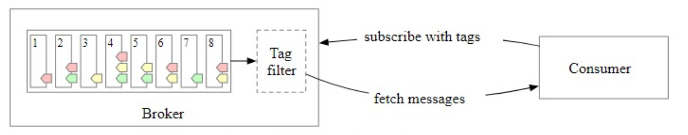

图4.35：按标签过滤消息

#### 延迟消息 & 定时消息

有时你想将消息延迟一段指定时间后再投递给消费者。比如，如果订单在创建后30分钟内未支付，就应该关闭该订单。延迟验证消息（检查付款是否完成）会立即发送，但会在30分钟后才投递给消费者。当消费者收到消息时，它会检查支付状态。如果付款未完成，订单将被关闭。否则，该消息会被忽略。

与发送即时消息不同，我们可以将延迟消息发送到代理侧的临时存储中，而不是立即发送到主题中，然后在时间到达时再将它们投递到主题中。高层次的设计如图4.36所示。

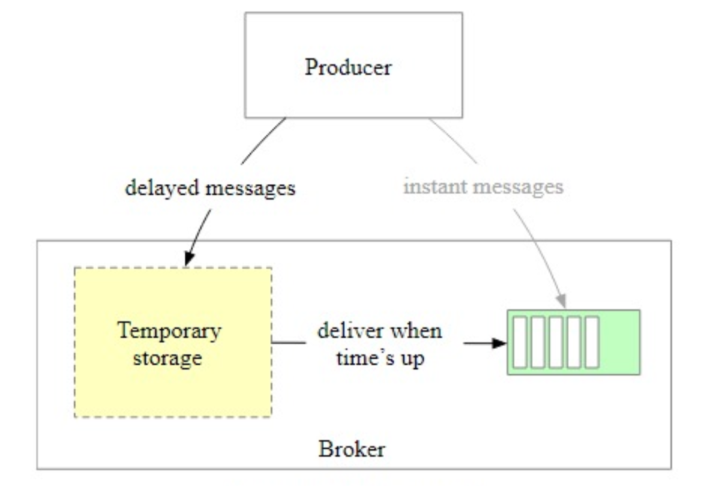

图4.36：延迟消息

系统的核心组件包括临时存储和定时功能。

- 临时存储可以是一个或多个特殊的消息主题。
- 定时功能不在讨论范围内，但这里提供两个流行的解决方案：
  - 具有预定义延迟级别的专用延迟队列[16]。比如，RocketMQ不支持任意时间精度的延迟消息，但支持特定级别的延迟消息。消息延迟级别有：1秒、5秒、10秒、30秒、1分钟、2分钟、3分钟、4分钟、6分钟、8分钟、9分钟、10分钟、20分钟、30分钟、1小时和2小时。
  - 分层时间轮[17]。

定时消息意味着消息应该在预定的时间投递给消费者。整体设计与延迟消息非常相似。

## 第4步 - 总结

在本章中，我们介绍了分布式消息队列的设计，其中包含了一些在数据流平台中常见的高级功能。如果面试最后还有额外时间，下面是一些可以讨论的要点：

- 协议：它定义了在不同节点之间交换信息和传输数据的规则、语法和API。在分布式消息队列中，协议应该能够：

  - 覆盖所有活动，比如生产、消费、心跳等。

  - 有效地传输大量数据。

  - 验证数据的完整性和正确性。

  一些流行的协议包括高级消息队列协议（AMQP）[18]和Kafka协议[19]。

- 重试消费：如果一些消息无法被成功消费，我们就需要重试该操作。为了不阻塞后续的消息，我们如何在一段时间后重试该操作？一个想法是将失败的消息发送到专门的重试主题，这样它们就可以之后再被消费了。
- 历史数据归档：假设存在基于时间或容量的日志保留机制。如果消费者需要重放一些已经被截断的历史消息，我们该如何处理？一个可行的解决方案是使用大容量存储系统，比如HDFS或对象存储，来存储历史数据。

恭喜你学到这里！现在给自己一个赞，干得好！

## 章节总结

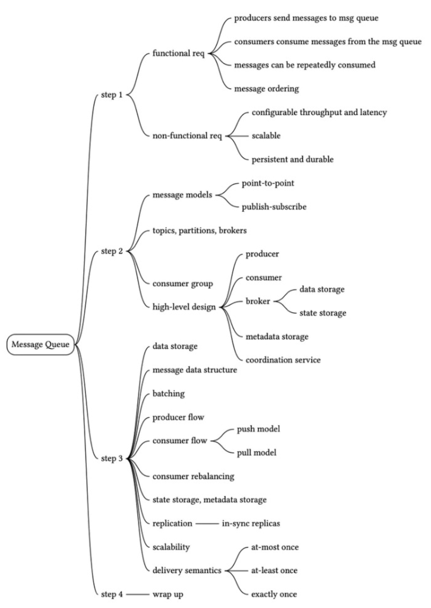

## 参考资料

[1] Queue Length Limit. https://www.rabbitmq.com/docs/maxlength

[2] Apache ZooKeeper Wikipedia. https://en.wikipedia.org/wiki/Apache_ZooKeeper

[3] etcd. https://etcd.io

[4] MySQL. https://www.mysql.com

[5] Comparison of disk and memory performance. https://deliveryimages.acm.org/10.1145/1570000/1563874/jacobs3.jpg

[6] Push vs pull. https://kafka.apache.org/documentation/#design_pull

[7] Kafka 2.0 Documentation. https://kafka.apache.org/20/documentation.html#consumerconfigs

[8] Kafka No Longer Requires ZooKeeper. https://towardsdatascience.com/kafka-no-longer-requires-zookeeper-ebfbf3862104?gi=fe640259bf23

[9] Martin Kleppmann. Replication. In *Designing Data-Intensive Applications*, pages 151-197. O'Reilly Media, 2017.

[10] ISR in Apache Kafka. https://www.cloudkarafka.com/blog/what-does-in-sync-in-apache-kafka-really-mean.html

[11] Global map in a geographic Coordinate Reference System. https://cwiki.apache.org/confluence/display/KAFKA/KIP-39273A+Alow+consumers+to+fetch+from+closest+replica

[12] Hands-free Kafka Replication. https:/www.confluent.io/blog/hands-free-kafka-teplication-a-lesson-in-operational-simplicity

[13] Kafka high watermark: https://rongxinblog.wordpress.com/2016/07/29/kafka-high-watermark

[14] Kafka mirroring. https://wiki.apache.org/confluence/pages/viewpage.action?pageld=27846330

[15] Message filtering in RocketMQdtree. https://partners-intlaliyun.com/help/doc-detail/29543.htm

[16] Scheduled messages and delayed messages in Apache RocketMQ. https://partners-intlaliyun.com/help/doc-detail/43349.htm

[17] Hashed and hierarchical timing wheels. http://www.cs.columbia.edu/~nahum/w6998/papers/sosp87-timing-wheels.pdf

[18] Advanced Message Queuing Protocol. https://en.wikipedia.org/wiki/Advanced_Message_Queuing_Protocol

[19] Kafka protocol guide. https://kafka.apache.org/protocol

[20] HDFS. https://hadoop.apache.org/docs/r1.2.1/hdfs_design.html