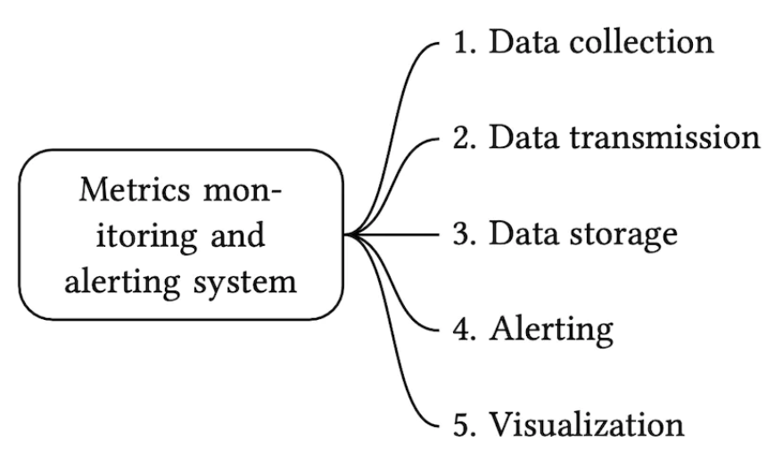
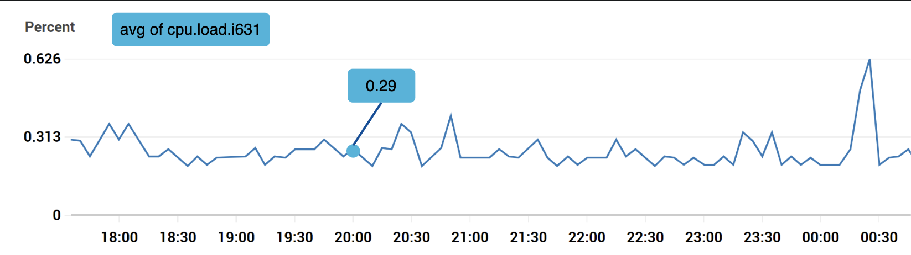
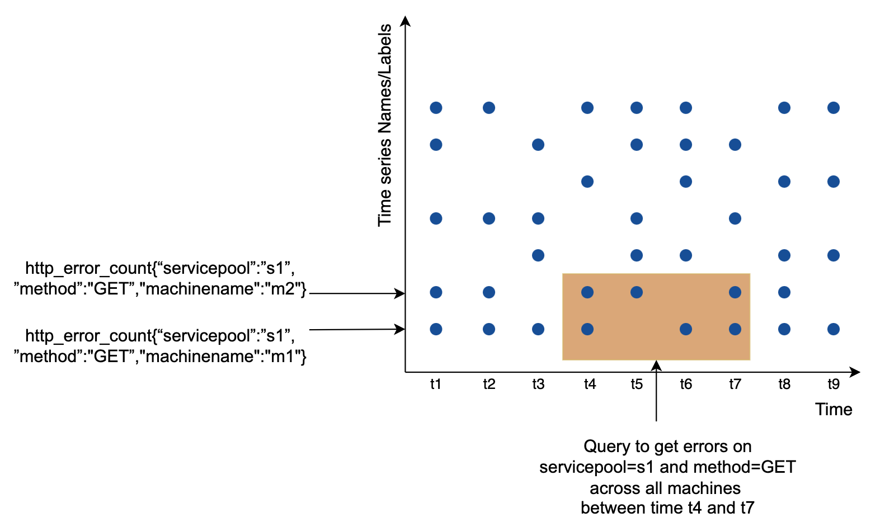
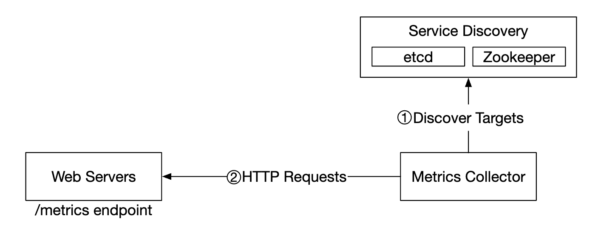
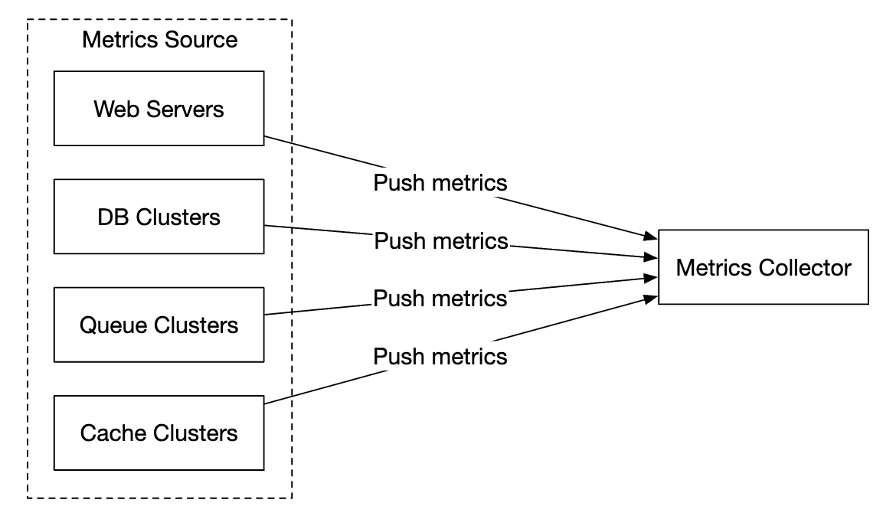
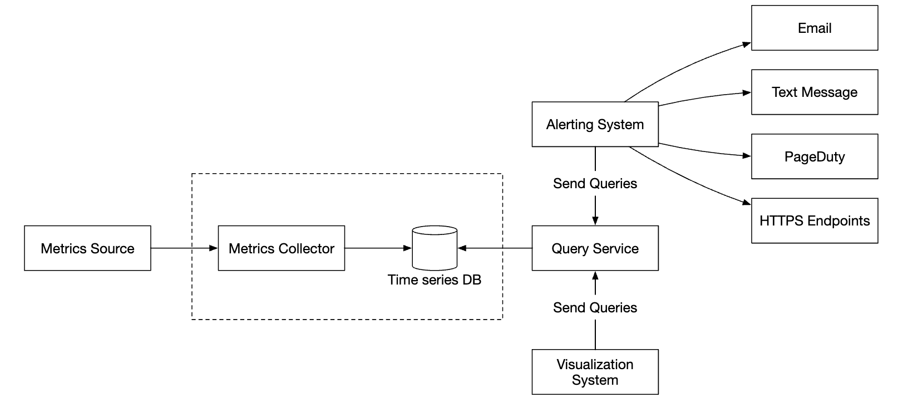
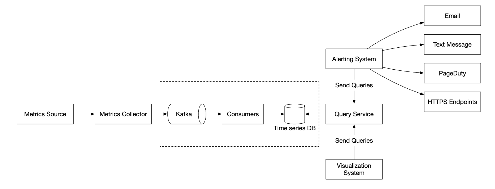
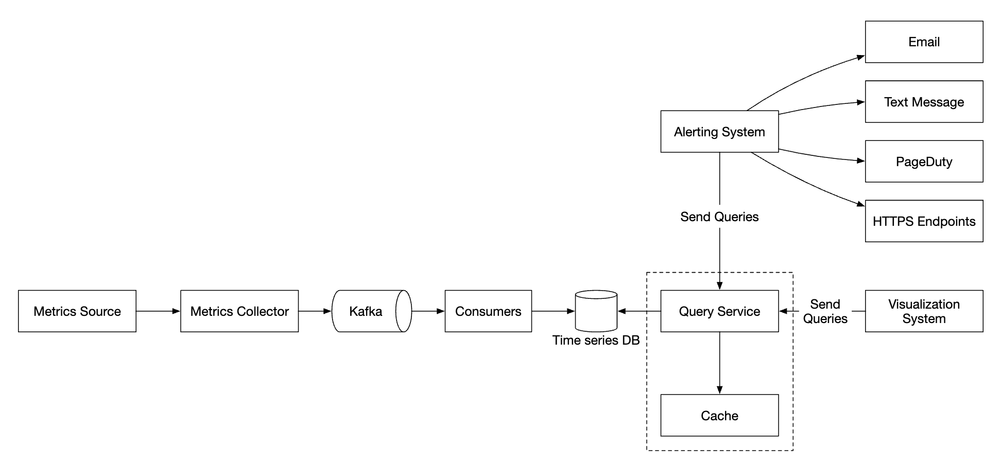
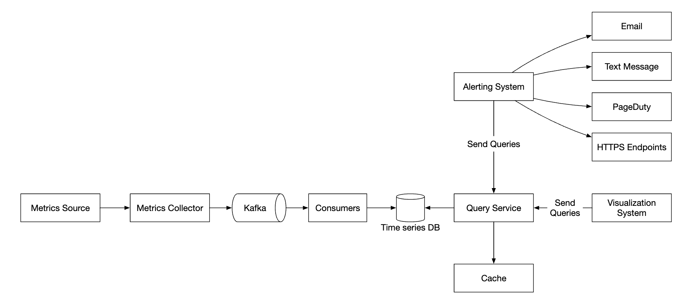

# 指标监控与告警系统

本章聚焦于设计一个高扩展性的指标监控与报警系统，这对于确保系统的高可用性和可靠性至关重要。

# 第1步：了解问题并确定设计范围

指标监控系统可以有多种含义——比如，如果面试官仅仅只关心基础设施指标，你就不应该设计一个日志聚合系统。


首先让我们理解一下问题：
 * 候选人：我们为谁构建这个系统？是为一家大型科技公司设计的内部监控系统，还是像 DataDog 这样的 SaaS 产品？
 * 面试官：我们仅仅构建公司内部的监控系统
 * 候选人：我们需要收集哪一些监控指标?
 * 面试官：操作系统相关指标，比如CPU 负载, 内存使用, 数据磁盘空间等.同时还有一些诸如每秒请求数之类的高级指标，业务指标不在范围内。
 * 候选人：我们这个监控系统监控的基础设施的规模有多大？
 * 面试官：每日活跃用户数达 1 亿，服务器池达 1000 个，每个池有 100 台机器。
 * 候选人：监控数据需要保存多久？
 * 面试官：让我们保留1年。
 * 候选人：可以通过降低指标数据精度来进行长期存储吗？
 * 面试官：保存7天的原始指标数据，接下来30天的数据以1分钟精度存储，再之后以1小时精度存储。
 * 候选人：需要支持哪些告警方式？
 * 面试官：电子邮件、电话、PagerDuty或Webhooks。
 * 候选人：是否需要收集错误或访问日志？
 * 面试官：不需要
 * 候选人：是否需要支持分布式系统追踪？
 * 面试官：不需要

## 功能需求
需要监控的基础设施规模较大：
 * 1亿日活用户
 * 1000个服务器池 × 每池100台机器 × 每台机器约100个指标 = 约1000万指标
 * 数据保留1年
 * 保留最近 7 天的原始数据；对 30 天内的数据进行1分钟粒度的存储；对 1 年内的数据采用 1 小时粒度的存储。

可监控的多种指标:
 * CPU负载
 * 请求数量
 * 内存使用
 * 消息队列中的消息数量

## 非功能性需求
 * 可扩展性：系统应可扩展以支持更多的指标和告警。
 * 低延迟：仪表板和告警查询的延迟需要较低。
 * 可靠性：系统需高度可靠，避免漏掉关键告警。
 * 灵活性：系统应能够轻松集成未来的新技术。

## 不在范围内的需求?
 * 日志监控：ELK Stack是此类需求的流行解决方案。
 * 分布式系统追踪：与请求在多个服务间的生命周期相关的数据收集。

# 第2步：提出高层次的设计方案并获得认同
## 基础组件
指标监控和警报系统涉及五个核心组件：

1. 数据采集：从不同来源收集指标数据。
1. 数据传输：将数据从来源传输到监控系统。
1. 数据存储：组织并存储接收到的数据。
1. 告警：分析数据、检测异常并生成告警。
1. 可视化：以图表等形式展示数据。


## 数据模型
指标数据通常以时间序列的形式记录，其中包含一组带有时间戳的值。该序列可以通过名称和一组可选的标签来识别。

例子 1 - 20:00时生产服务器实例i631的CPU负载是多少？


这个数据可以通过下表识别：


时间序列由指标名称、标签和特定时间的单个点来识别。


例子 2 - 过去 10 分钟内美国西部地区所有 Web 服务器的平均 CPU 负载是多少？
```
CPU.load host=webserver01,region=us-west 1613707265 50

CPU.load host=webserver01,region=us-west 1613707265 62

CPU.load host=webserver02,region=us-west 1613707265 43

CPU.load host=webserver02,region=us-west 1613707265 53

...

CPU.load host=webserver01,region=us-west 1613707265 76

CPU.load host=webserver01,region=us-west 1613707265 83
```

这是一个我们可能从存储中提取的示例数据，用于回答该问题。v平均 CPU 负载可以通过对行最后一列的值取平均值来计算。

时间序列通常以行协议（line protocol）存储，许多监控软件（如Prometheus和OpenTSDB）支持此格式。

每个时间序列由以下部分组成：


一个很好的方式来可视化数据的方法：

 * x 轴表示时间
 * y 轴表示查询的维度 - 例如指标名称、标签等


这些指标数据的写入模式特点是写入密集且高峰读取，但访问频率不高。因为这种数据访问模式是写重型且具有突发读取特性。虽然我们收集了大量的指标，但它们不经常被访问，尽管在某些情况下，比如发生事故时，会有突发的读取需求。

数据存储系统是此设计的核心
 * 不建议使用通用数据库来解决这个问题，即使你可以通过专家级的调优化以实现良好的扩展性
 * 理论上也可以使用NoSQL数据库来实现，但要设计一个可扩展的模式来有效存储和查询时序数据是很困难的。

有很多数据库专门用于存储时序数据。其中有很多提供了自定义的查询接口，能够有效地查询时序数据。
 * OpenTSDB是一个分布式时序数据库，但它基于Hadoop和HBase。如果没有这些基础设施的支持，则很难使用该技术。
 * Twitter 使用 MetricsDB, 而Amazon则提供Timestream。
 * 最受欢迎的两款时序数据库是InfluxDB和Prometheus。它们被设计用来存储大量的时序数据，二者都基于内存缓存加磁盘存储的架构。

InfluxDB的示例规模 - 在配置了8个核心和32GB内存的情况下，每秒超过25万次写入：


指标数据库的内部实现是一个比较专业的知识领域，通常在面试中不会要求你深入了解，除非你在简历中对此有所提及。

对于面试而言，理解指标是时序数据，并且了解流行的时序数据库（如InfluxDB）即可。

时序数据库的一个特点是能够通过标签高效地聚合和分析大量的时序数据。
例如，InfluxDB为每个标签构建索引。

然而，值得注意的是要保持标签的数量较低——即不要使用过多的唯一标签。

## 顶层设计

 * 指标来源 - 可以是应用服务器、SQL 数据库、消息队列等。
 * 指标收集器 - 收集指标数据并写入时序数据库。
 * 时序数据库 - 以时序方式存储指标数据，并提供自定义查询接口以分析大量指标数据。
 * 查询服务 - 方便从时序数据库查询和检索数据。如果数据库接口足够强大，可以完全替代此组件。
 * 告警系统 - 发送告警通知到各种告警目的地。
 * 可视化系统 - 以图表/图形的形式展示指标数据。

# 第3步：深入设计
接下来，我们将深入到系统的几个有趣的部分。

## 指标收集
对于指标收集而言，偶尔的数据丢失并不关键。客户端可以采用“发送即忘”（fire-and-forget）的方式。


指标收集有两种实现方式：拉取（pull） 或 推送（push）。

下面是拉取模型的工作方式：


在这种方案中，指标收集器需要维护一份最新的服务和指标端点列表。我们可以使用 Zookeeper 或 etcd 进行通过**服务发现**来实现。


服务发现包含关于**何时**以及**从哪里**收集指标的配置规则。



以下是指标收集流程的详细说明：
 * 指标收集器从服务发现中获取配置信息，包括拉取间隔、IP 地址、超时及重试参数。
 * 指标收集器通过预定义的 HTTP 端点（例如 /metrics）拉取指标数据，通常由客户端库完成此操作。
 * 另一种方式是，指标收集器可以向服务发现注册变更事件通知，以便在服务端点发生变化时收到通知。
 * 另一种选择是，指标收集器可以定期轮询，检查指标端点配置是否有变化。

在我们的规模下，单个指标收集器 远远不够，必须运行多个实例。
然而，也需要某种同步机制，以确保不同的收集器不会重复收集相同的指标。


一种解决方案是使用一致性哈希环（consistent hash ring），将收集器和服务器映射到哈希环上，并确保每个服务器仅被一个收集器关联。


而推送模型（push model）的工作方式则不同，服务会主动将指标数据推送到指标收集器。


在推送模型这种方案中，通常会在服务实例旁安装一个收集代理（collection agent）。
该代理负责从服务器收集指标，然后推送到指标收集器。


这种模型的一个优点是，我们可以在发送到收集器之前聚合指标数据，从而减少收集器需要处理的数据量。

但另一方面，指标收集器可能会因负载过高而拒绝推送请求。
因此，建议将收集器添加到自动扩展组（auto-scaling group）并置于负载均衡器（load balancer）之后，以提高系统的可扩展性。

那么，哪种方式更好呢？要根据实际情况对两种方法进行权衡（trade-offs），不同的系统会选择不同的架构：
 * Prometheus 采用 拉取（pull） 架构。
 * Amazon CloudWatch 和 Graphite 采用 推送（push） 架构。

以下是推送数据与拉取数据的一些主要区别：
|                                        | Pull                                                                                                                                                                                                    | Push                                                                                                                                                                                                                                    |
| -------------------------------------- | ------------------------------------------------------------------------------------------------------------------------------------------------------------------------------------------------------- | --------------------------------------------------------------------------------------------------------------------------------------------------------------------------------------------------------------------------------------- |
| 易于调试                        | 应应用服务器上的 /metrics 端点可用于随时查看指标数据，甚至可以在你的笔记本电脑上执行此操作。拉取模式更好。          | 如果指标收集器没有收到指标，问题可能由网络问题引起。                                                                                                        |
| 健康检查                          | 如果应用服务器没有响应拉取请求，你可以快速判断应用服务器是否宕机。                        | 如果指标收集器没有收到指标，问题可能由网络问题引起。                                                                                                                |
| 短生命周期任务                     |                                                                                                                                           -                                                              | 一些批处理任务可能生命周期较短，持续时间不足以被拉取到。推送模式胜出。这可以通过为拉取模式引入推送网关来解决 [22]。                                                               |
| 防火墙或复杂的网络设置 | 让服务器拉取指标数据要求所有的指标端点都可访问，在多数据中心架构中可能会遇到问题。这可能需要更复杂的网络基础设施。 | 如果指标收集器配备了负载均衡器和自动扩展组，那么它可以从任何地方接收数据。推送模式更好。                                                              |
| 性能                            | 拉取方法通常使用 TCP。                                                                                                                                   | 推送方法通常使用 UDP。这意味着推送方法提供了更低延迟的指标传输。但是反对观点认为，建立 TCP 连接的开销相较于发送指标数据的负载而言是微不足道的。|
| 数据真实性                     | 需要收集指标的应用服务器会提前在配置文件中定义，因此从这些服务器收集的指标数据是可信的。               | A任何客户端都可以向指标收集器推送数据。这可以通过白名单限制数据来源或要求身份认证来解决。                      |

这其中没有明确的最佳方案。对于大型项目而言，可能需要同时支持推（push）和拉（pull）两种模式。另外，在某些情况下，可能无法安装推送代理（push agent），这使得拉取模式成为唯一可行的选择。

## 扩展指标传输管道



无论我们使用推（push）模型还是拉（pull）模型。指标收集器应该被部署成可自动扩展的。

然而，如果时间序列数据库（TSDB）宕机，可能会导致数据丢失。为缓解这一风险，我们将引入一个队列机制：
* 指标收集器将指标数据推送到 Kafka。
* 消费者或流式处理服务（如 Apache Storm、Flink 或 Spark）对数据进行处理，并将其推送至时间序列数据库。



该方案具有以下优势：
* Kafka 作为一个高可靠性、可扩展的分布式消息平台，能够保证数据传输的稳定性。
* 它将数据收集与数据处理解耦，提高了系统的灵活性。
* 通过在 Kafka 中保留数据，可以防止数据丢失。


Kafka可以指标名称进行分区（partition），使消费者能够基于指标名称聚合数据。
为了进一步扩展，我们可以根据标签（tags）或标签（labels）对数据进行分区，并对指标进行分类和优先级排序，以确保关键指标优先采集。


在使用kafka的方案中，主要的缺点就是Kafka 的运维和管理成本较高。

一个替代方案是使用大规模数据摄取系统，如[Gorilla](https://www.vldb.org/pvldb/vol8/p1816-teller.pdf)。从扩展性的角度来看，该方案的可扩展性与基于 Kafka 的队列机制相当。

## 数据聚合可能发生在哪里
指标数据可以在多个阶段进行聚合，我们需要权衡以下几点：
 * 采集代理（Collection Agent） - 客户端采集代理仅支持简单的聚合逻辑。例如，可以收集 1 分钟内的计数器数据并将其发送到指标收集器。
 * 数据摄取管道（Ingestion Pipeline） - 在写入数据库之前进行数据聚合，需要使用 Flink 等流式处理引擎。这种方式可以减少写入量，但由于未存储原始数据，会导致数据精度损失。
 * 查询侧（Query Side） - 通过可视化系统在查询时对数据进行聚合。这种方式不会导致数据丢失，但由于涉及大量数据处理，查询可能会变慢。

## 查询服务
将查询服务与时间序列数据库分离，可以将可视化和告警系统与数据库解耦，从而使我们能够将数据库与客户端解耦，并根据需要随时更换数据库。

在此处可以添加缓存层，以减少时间序列数据库的负载：



我们也可以完全避免添加查询服务，因为大多数可视化和告警系统都有强大的插件，能够与大多数时间序列数据库进行集成。

如果选择了合适的时间序列数据库，我们可能也不需要引入自己的缓存层。

大多数时间序列数据库不支持 SQL，主要是因为 SQL 在查询时间序列数据时效率较低。以下是一个计算指数移动平均（EMA）的 SQL 查询示例：

```
select id,
       temp,
       avg(temp) over (partition by group_nr order by time_read) as rolling_avg
from (
  select id,
         temp,
         time_read,
         interval_group,
         id - row_number() over (partition by interval_group order by time_read) as group_nr
  from (
    select id,
    time_read,
    "epoch"::timestamp + "900 seconds"::interval * (extract(epoch from time_read)::int4 / 900) as interval_group,
    temp
    from readings
  ) t1
) t2
order by time_read;
```

这是相同查询的 Flux 版本 —— InfluxDB 使用的查询语言：
```
from(db:"telegraf")
  |> range(start:-1h)
  |> filter(fn: (r) => r._measurement == "foo")
  |> exponentialMovingAverage(size:-10s)
```

## 存储层
对于时间序列数据库选择，我们必须谨慎考虑。

根据 Facebook 发布的研究，约85%的查询请求来自过去 26 小时的数据。
如果我们选择一种能够利用这一特性的数据库，可能会对系统性能产生重大影响。InfluxDB 就是其中一个选项。

无论选择哪种数据库，我们都可以采取一些优化措施。数据编码和压缩可以显著减少数据的大小。这些功能通常已经内置于优秀的时间序列数据库中。


在上述示例中，我们可以通过存储时间戳差值（timestamp deltas）代替存储完整的时间戳。

另一个可以采用的技术是降采样（down-sampling）——将高分辨率数据转换为低分辨率，以减少磁盘使用。

我们可以将这一方法应用于旧数据，并让数据科学家配置相关规则，例如：
* s7天 - 不进行降采样
* s30天 - 降采样为 1 分钟
* s1 年 - 降采样为 1 小时

例如，这里是一个精度为10秒的指标表：
| metric | timestamp            | hostname | Metric_value |
| ------ | -------------------- | -------- | ------------ |
| cpu    | 2021-10-24T19:00:00Z | host-a   | 10           |
| cpu    | 2021-10-24T19:00:10Z | host-a   | 16           |
| cpu    | 2021-10-24T19:00:20Z | host-a   | 20           |
| cpu    | 2021-10-24T19:00:30Z | host-a   | 30           |
| cpu    | 2021-10-24T19:00:40Z | host-a   | 20           |
| cpu    | 2021-10-24T19:00:50Z | host-a   | 30           |

这里是一个精度为30秒的指标表：
| metric | timestamp            | hostname | Metric_value (avg) |
| ------ | -------------------- | -------- | ------------------ |
| cpu    | 2021-10-24T19:00:00Z | host-a   | 19                 |
| cpu    | 2021-10-24T19:00:30Z | host-a   | 25                 |

最后，我们还可以使用冷存储（cold storage）来存储不再使用的旧数据。冷存储的财务成本远低于热存储。

## 报警系统


报警配置被加载到缓存服务器中。规则通常以YAML格式定义。以下是一个示例：
```
- name: instance_down
  rules:

  # Alert for any instance that is unreachable for >5 minutes.
  - alert: instance_down
    expr: up == 0
    for: 5m
    labels:
      severity: page
```

告警管理器从缓存中获取告警配置。根据配置规则，它还会在预定的时间间隔内调用查询服务。如果满足规则，将生成告警事件。

告警管理器的其他职责包括：
* 过滤、合并和去重告警 - 例如，如果一个单独实例的告警被触发多次，只会生成一个告警事件。
* 访问控制 - 限制只有特定人员才能进行告警管理操作是非常重要的。
* 重试机制 - 管理器确保至少将告警传播一次。

告警数据库是一个键值数据库，如 Cassandra，用于保存所有告警的状态。它确保至少发送一次通知。一旦告警被触发，告警会被发布到 Kafka。

最后，告警消费者从 Kafka 拉取告警数据，并通过不同的渠道发送通知——电子邮件、短信、PagerDuty、Webhooks等。

在实际应用中，有许多现成的警报系统解决方案。自建的监控系统通常很难证明他的优势。
## 可视化系统
可视化系统展示了在一定时间范围内的指标和告警。以下是使用 Grafana 构建的仪表盘示例：


A high-quality visualization system is very hard to build. It is hard to justify not using an off-the-shelf solution like Grafana.

构建一个高质量的可视化系统是非常困难的。很难找到理由不使用像Grafana这样的现成解决方案

# Step 4 - Wrap up
这是最终的设计
