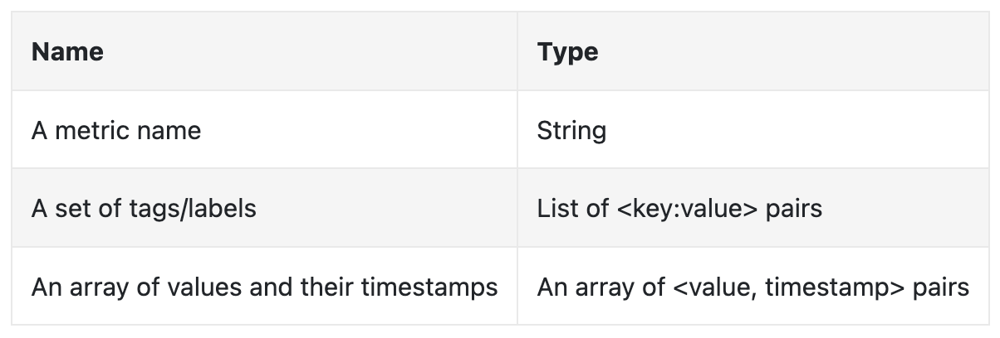
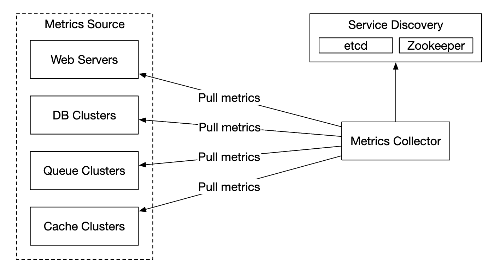

# 指标监控与告警系统

本章聚焦于设计一个高扩展性的指标监控与报警系统，这对于确保系统的高可用性和可靠性至关重要。

# 第一步：理解问题并确定设计范围

指标监控系统可以有多种含义——比如，如果面试官仅仅只关心基础设施指标，你就不应该设计一个日志聚合系统。


首先让我们理解一下问题：
 * 候选人：我们为谁构建这个系统？是为一家大型科技公司设计的内部监控系统，还是像 DataDog 这样的 SaaS 产品？
 * 面试官：我们仅仅构建公司内部的监控系统
 * 候选人：我们需要收集哪一些监控指标?
 * 面试官：操作系统相关指标，比如CPU 负载, 内存使用, 数据磁盘空间等.同时还有一些诸如每秒请求数之类的高级指标，业务指标不在范围内。
 * 候选人：我们这个监控系统监控的基础设施的规模有多大？
 * 面试官：每日活跃用户数达 1 亿，服务器池达 1000 个，每个池有 100 台机器。
 * 候选人：监控数据需要保存多久？
 * 面试官：让我们保留1年。
 * 候选人：可以通过降低指标数据精度来进行长期存储吗？
 * 面试官：保存7天的原始指标数据，接下来30天的数据以1分钟精度存储，再之后以1小时精度存储。
 * 候选人：需要支持哪些告警方式？
 * 面试官：电子邮件、电话、PagerDuty或Webhooks。
 * 候选人：是否需要收集错误或访问日志？
 * 面试官：不需要
 * 候选人：是否需要支持分布式系统追踪？
 * 面试官：不需要

## High-level requirements and assumptions
需要监控的基础设施规模较大：
 * 1亿日活用户
 * 1000个服务器池 × 每池100台机器 × 每台机器约100个指标 = 约1000万指标
 * 数据保留1年
 * 保留最近 7 天的原始数据；对 30 天内的数据进行1分钟粒度的存储；对 1 年内的数据采用 1 小时粒度的存储。

可监控的多种指标:
 * CPU负载
 * 请求数量
 * 内存使用
 * 消息队列中的消息数量

## 非功能性需求
 * 可扩展性：系统应可扩展以支持更多的指标和告警。
 * 低延迟：仪表板和告警查询的延迟需要较低。
 * 可靠性：系统需高度可靠，避免漏掉关键告警。
 * 灵活性：系统应能够轻松集成未来的新技术。

## 不在范围内的需求?
 * 日志监控：ELK Stack是此类需求的流行解决方案。
 * 分布式系统追踪：与请求在多个服务间的生命周期相关的数据收集。

# 第二步：提出高层设计并达成一致
## 基础组件
指标监控和警报系统涉及五个核心组件：

1. 数据采集：从不同来源收集指标数据。
1. 数据传输：将数据从来源传输到监控系统。
1. 数据存储：组织并存储接收到的数据。
1. 告警：分析数据、检测异常并生成告警。
1. 可视化：以图表等形式展示数据。


## 数据模型
指标数据通常以时间序列的形式记录，其中包含一组带有时间戳的值。该序列可以通过名称和一组可选的标签来识别。

例子 1 - 20:00时生产服务器实例i631的CPU负载是多少？


这个数据可以通过下表识别：


时间序列由指标名称、标签和特定时间的单个点来识别。


例子 2 - 过去 10 分钟内美国西部地区所有 Web 服务器的平均 CPU 负载是多少？
```
CPU.load host=webserver01,region=us-west 1613707265 50

CPU.load host=webserver01,region=us-west 1613707265 62

CPU.load host=webserver02,region=us-west 1613707265 43

CPU.load host=webserver02,region=us-west 1613707265 53

...

CPU.load host=webserver01,region=us-west 1613707265 76

CPU.load host=webserver01,region=us-west 1613707265 83
```

这是一个我们可能从存储中提取的示例数据，用于回答该问题。v平均 CPU 负载可以通过对行最后一列的值取平均值来计算。

时间序列通常以行协议（line protocol）存储，许多监控软件（如Prometheus和OpenTSDB）支持此格式。

每个时间序列由以下部分组成：


一个很好的方式来可视化数据的方法：

 * x 轴表示时间
 * y 轴表示查询的维度 - 例如指标名称、标签等

由于我们收集了大量指标，因此数据访问模式是写入密集且读取高峰，但访问频率不高，尽管在突发事件（例如，发生持续事件时）时会突然访问。
这些指标数据的写入模式特点是写入密集且高峰读取，但访问频率不高。因为

这种数据访问模式是写重型且具有突发读取特性。因为我们收集了大量的指标，但它们不经常被访问，尽管在某些情况下，比如发生事故时，会有突发的读取需求。

数据存储系统是此设计的核心
 * 不建议使用通用数据库来解决这个问题，即使你可以通过专家级的调优化以实现良好的扩展性
 * 理论上也可以使用NoSQL数据库来实现，但要设计一个可扩展的模式来有效存储和查询时序数据是很困难的。

有很多数据库专门用于存储时序数据。其中有很多提供了自定义的查询接口，能够有效地查询时序数据。
 * OpenTSDB是一个分布式时序数据库，但它基于Hadoop和HBase。如果没有这些基础设施的支持，则很难使用该技术。
 * Twitter 使用 MetricsDB, 而Amazon则提供Timestream。
 * 最受欢迎的两款时序数据库是InfluxDB和Prometheus。它们被设计用来存储大量的时序数据，二者都基于内存缓存加磁盘存储的架构。

InfluxDB的示例规模 - 在配置了8个核心和32GB内存的情况下，每秒超过25万次写入：


指标数据库的内部实现是一个比较专业的知识领域，通常在面试中不会要求你深入了解，除非你在简历中对此有所提及。

对于面试而言，理解指标是时序数据，并且了解流行的时序数据库（如InfluxDB）即可。

时序数据库的一个特点是能够通过标签高效地聚合和分析大量的时序数据。
例如，InfluxDB为每个标签构建索引。

然而，值得注意的是要保持标签的基数较低——即不要使用过多的唯一标签。


## High-level Design

 * Metrics source - can be application servers, SQL databases, message queues, etc.
 * Metrics collector - Gathers metrics data and writes to time-series database
 * Time-series database - stores metrics as time-series. Provides a custom query interface for analyzing large amounts of metrics.
 * Query service - Makes it easy to query and retrieve data from the time-series DB. Could be replaced entirely by the DB's interface if it's sufficiently powerful.
 * Alerting system - Sends alert notifications to various alerting destinations.
 * Visualization system - Shows metrics in the form of graphs/charts.

# Step 3 - Design Deep Dive
Let's deep dive into several of the more interesting parts of the system.

## Metrics collection
For metrics collection, occasional data loss is not critical. It's acceptable for clients to fire and forget.


There are two ways to implement metrics collection - pull or push.

Here's how the pull model might look like:


For this solution, the metrics collector needs to maintain an up-to-date list of services and metrics endpoints.
We can use Zookeeper or etcd for that purpose - service discovery.

Service discovery contains contains configuration rules about when and where to collect metrics from:


Here's a detailed explanation of the metrics collection flow:

 * Metrics collector fetches configuration metadata from service discovery. This includes pulling interval, IP addresses, timeout & retry params.
 * Metrics collector pulls metrics data via a pre-defined http endpoint (eg `/metrics`). This is typically done by a client library.
 * Alternatively, the metrics collector can register a change event notification with the service discovery to be notified once the service endpoint changes.
 * Another option is for the metrics collector to periodically poll for metrics endpoint configuration changes.

At our scale, a single metrics collector is not enough. There must be multiple instances. 
However, there must also be some kind of synchronization among them so that two collectors don't collect the same metrics twice.

One solution for this is to position collectors and servers on a consistent hash ring and associate a set of servers with a single collector only:


With the push model, on the other hand, services push their metrics to the metrics collector proactively:


In this approach, typically a collection agent is installed alongside service instances. 
The agent collects metrics from the server and pushes them to the metrics collector.


With this model, we can potentially aggregate metrics before sending them to the collector, which reduces the volume of data processed by the collector.

On the flip side, metrics collector can reject push requests as it can't handle the load. 
It is important, hence, to add the collector to an auto-scaling group behind a load balancer.

so which one is better? There are trade-offs between both approaches and different systems use different approaches:
 * Prometheus uses a pull architecture
 * Amazon Cloud Watch and Graphite use a push architecture

Here are some of the main differences between push and pull:
|                                        | Pull                                                                                                                                                                                                    | Push                                                                                                                                                                                                                                    |
| -------------------------------------- | ------------------------------------------------------------------------------------------------------------------------------------------------------------------------------------------------------- | --------------------------------------------------------------------------------------------------------------------------------------------------------------------------------------------------------------------------------------- |
| Easy debugging                         | The /metrics endpoint on application servers used for pulling metrics can be used to view metrics at any time. You can even do this on your laptop. Pull wins.                                          | If the metrics collector doesn’t receive metrics, the problem might be caused by network issues.                                                                                                                                        |
| Health check                           | If an application server doesn’t respond to the pull, you can quickly figure out if an application server is down. Pull wins.                                                                           | If the metrics collector doesn’t receive metrics, the problem might be caused by network issues.                                                                                                                                        |
| Short-lived jobs                       |                                                                                                                                                                                                         | Some of the batch jobs might be short-lived and don’t last long enough to be pulled. Push wins. This can be fixed by introducing push gateways for the pull model [22].                                                                 |
| Firewall or complicated network setups | Having servers pulling metrics requires all metric endpoints to be reachable. This is potentially problematic in multiple data center setups. It might require a more elaborate network infrastructure. | If the metrics collector is set up with a load balancer and an auto-scaling group, it is possible to receive data from anywhere. Push wins.                                                                                             |
| Performance                            | Pull methods typically use TCP.                                                                                                                                                                         | Push methods typically use UDP. This means the push method provides lower-latency transports of metrics. The counterargument here is that the effort of establishing a TCP connection is small compared to sending the metrics payload. |
| Data authenticity                      | Application servers to collect metrics from are defined in config files in advance. Metrics gathered from those servers are guaranteed to be authentic.                                                 | Any kind of client can push metrics to the metrics collector. This can be fixed by whitelisting servers from which to accept metrics, or by requiring authentication.                                                                   |

There is no clear winner. A large organization probably needs to support both. There might not be a way to install a push agent in the first place.

## Scale the metrics transmission pipeline


The metrics collector is provisioned in an auto-scaling group, regardless if we use the push or pull model.

There is a chance of data loss if the time-series DB is down, however. To mitigate this, we'll provision a queuing mechanism:

 * Metrics collectors push metrics data into kafka
 * Consumers or stream processing services such as Apache Storm, Flink or Spark process the data and push it to the time-series DB

This approach has several advantages:
 * Kafka is used as a highly-reliable and scalable distributed message platform
 * It decouples data collection and data processing from one another
 * It can prevent data loss by retaining the data in Kafka

Kafka can be configured with one partition per metric name, so that consumers can aggregate data by metric names.
To scale this, we can further partition by tags/labels and categorize/prioritize metrics to be collected first.


The main downside of using Kafka for this problem is the maintenance/operation overhead.
An alternative is to use a large-scale ingestion system like [Gorilla](https://www.vldb.org/pvldb/vol8/p1816-teller.pdf).
It can be argued that using that would be as scalable as using Kafka for queuing.

## Where aggregations can happen
Metrics can be aggregated at several places. There are trade-offs between different choices:
 * Collection agent - client-side collection agent only supports simple aggregation logic. Eg collect a counter for 1m and send it to the metrics collector.
 * Ingestion pipeline - To aggregate data before writing to the DB, we need a stream processing engine like Flink. This reduces write volume, but we lose data precision as we don't store raw data.
 * Query side - We can aggregate data when we run queries via our visualization system. There is no data loss, but queries can be slow due to a lot of data processing.

## Query Service
Having a separate query service from the time-series DB decouples the visualization and alerting system from the database, which enables us to decouple the DB from clients and change it at will.

We can add a Cache layer here to reduce the load to the time-series database:


We can also avoid adding a query service altogether as most visualization and alerting systems have powerful plugins to integrate with most time-series databases.
With a well-chosen time-series DB, we might not need to introduce our own caching layer as well.

Most time-series DBs don't support SQL simply because it is ineffective for querying time-series data. Here's an example SQL query for computing an exponential moving average:
```
select id,
       temp,
       avg(temp) over (partition by group_nr order by time_read) as rolling_avg
from (
  select id,
         temp,
         time_read,
         interval_group,
         id - row_number() over (partition by interval_group order by time_read) as group_nr
  from (
    select id,
    time_read,
    "epoch"::timestamp + "900 seconds"::interval * (extract(epoch from time_read)::int4 / 900) as interval_group,
    temp
    from readings
  ) t1
) t2
order by time_read;
```

Here's the same query in Flux - query language used in InfluxDB:
```
from(db:"telegraf")
  |> range(start:-1h)
  |> filter(fn: (r) => r._measurement == "foo")
  |> exponentialMovingAverage(size:-10s)
```

## Storage layer
It is important to choose the time-series database carefully.

According to research published by Facebook, ~85% of queries to the operational store were for data from the past 26h.

If we choose a database, which harnesses this property, it could have significant impact on system performance. InfluxDB is one such option.

Regardless of the database we choose, there are some optimizations we might employ.

Data encoding and compression can significantly reduce the size of data. Those features are usually built into a good time-series database.


In the above example, instead of storing full timestamps, we can store timestamp deltas.

Another technique we can employ is down-sampling - converting high-resolution data to low-resolution in order to reduce disk usage.

We can use that for old data and make the rules configurable by data scientists, eg:
 * 7d - no down-sampling
 * 30d - down-sample to 1min
 * 1y - down-sample to 1h

For example, here's a 10-second resolution metrics table:
| metric | timestamp            | hostname | Metric_value |
| ------ | -------------------- | -------- | ------------ |
| cpu    | 2021-10-24T19:00:00Z | host-a   | 10           |
| cpu    | 2021-10-24T19:00:10Z | host-a   | 16           |
| cpu    | 2021-10-24T19:00:20Z | host-a   | 20           |
| cpu    | 2021-10-24T19:00:30Z | host-a   | 30           |
| cpu    | 2021-10-24T19:00:40Z | host-a   | 20           |
| cpu    | 2021-10-24T19:00:50Z | host-a   | 30           |

down-sampled to 30-second resolution:
| metric | timestamp            | hostname | Metric_value (avg) |
| ------ | -------------------- | -------- | ------------------ |
| cpu    | 2021-10-24T19:00:00Z | host-a   | 19                 |
| cpu    | 2021-10-24T19:00:30Z | host-a   | 25                 |

Finally, we can also use cold storage to use old data, which is no longer used. The financial cost for cold storage is much lower.

## Alerting system


Configuration is loaded to cache servers. Rules are typically defined in YAML format. Here's an example:
```
- name: instance_down
  rules:

  # Alert for any instance that is unreachable for >5 minutes.
  - alert: instance_down
    expr: up == 0
    for: 5m
    labels:
      severity: page
```

The alert manager fetches alert configurations from cache. Based on configuration rules, it also calls the query service at a predefined interval.
If a rule is met, an alert event is created.

Other responsibilities of the alert manager are:
 * Filtering, merging and deduplicating alerts. Eg if an alert of a single instance is triggered multiple times, only one alert event is generated.
 * Access control - it is important to restrict alert-management operations to certain individuals only
 * Retry - the manager ensures that the alert is propagated at least once.

The alert store is a key-value database, like Cassandra, which keeps the state of all alerts. It ensures a notification is sent at least once.
Once an alert is triggered, it is published to Kafka.

Finally, alert consumers pull alerts data from Kafka and send notifications over to different channels - Email, text message, PagerDuty, webhooks.

In the real-world, there are many off-the-shelf solutions for alerting systems. It is difficult to justify building your own system in-house.

## Visualization system
The visualization system shows metrics and alerts over a time period. Here's an dashboard built with Grafana:


A high-quality visualization system is very hard to build. It is hard to justify not using an off-the-shelf solution like Grafana.

# Step 4 - Wrap up
Here's our final design:
