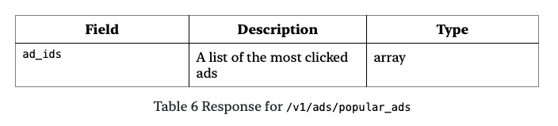
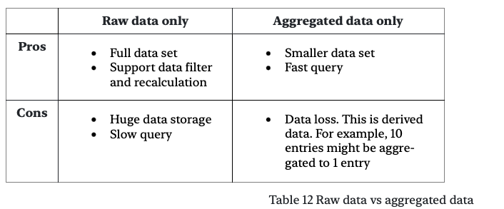
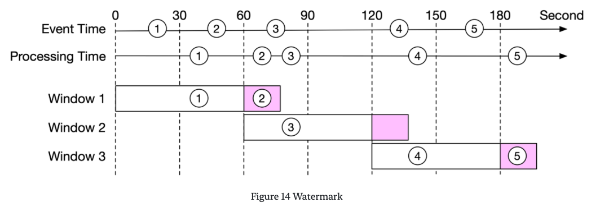
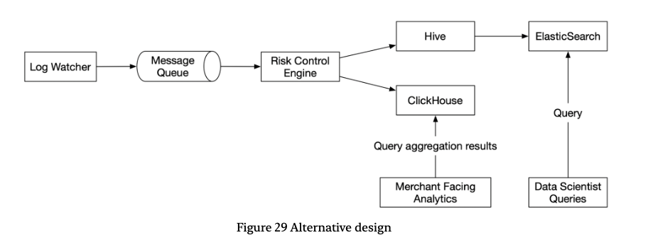

# 广告点击事件聚合

随着 Facebook、YouTube、TikTok 和在线媒体经济的兴起，数字广告在广告总支出中占据了越来越大的份额。因此，跟踪广告点击事件变得非常重要。在本章中，我们将探讨如何设计一个 Facebook 或 Google 规模的广告点击事件聚合系统。

在深入技术设计之前，让我们先了解在线广告的核心概念，以便更好地理解这个主题。在线广告的一个核心优势是其可衡量性，通过实时数据进行量化。

数字广告有一个核心过程叫做实时竞价（Real-Time Bidding, RTB），在这个过程中，数字广告库存被买卖。图 1 显示了在线广告的工作原理。


RTB 过程的速度很重要，因为它通常在不到一秒的时间内完成。

数据的准确性也非常重要。广告点击事件聚合在衡量在线广告的有效性方面发挥着关键作用，这直接影响到广告客户支付的费用。根据点击聚合结果，活动经理可以控制预算或调整竞价策略，例如更改目标受众群体、关键字等。在线广告中使用的关键指标，包括点击率（CTR, click-through rate）[^1] 和转化率（CVR, conversion rate）[^2]，都依赖于聚合的广告点击数据。

## 第一步 - 了解问题并确定设计范围

以下一组问题有助于澄清需求并缩小范围。

候选人：输入数据的格式是什么？

面试官：这是一个位于不同服务器上的日志文件，最新的点击事件追加在日志文件的末尾。事件具有以下属性：`ad_id`、`click_timestamp`、`user_id`、`ip` 和 `country`。

候选人：数据量有多大？

面试官：每天 10 亿次广告点击，总共有 200 万个广告。广告点击事件的数量每年增长 30%。

候选人：需要支持的最重要的查询有哪些？

面试官：系统需要支持以下 3 个查询：

- 返回特定广告在过去 $M$ 分钟内的点击事件数量。
- 返回过去 1 分钟内点击量最多的 100 个广告。两个参数都应该是可配置的。聚合每分钟发生一次。
- 支持通过 `ip`、`user_id` 或 `country` 过滤上述两个查询的数据。

候选人：我们需要担心边界情况吗？我能想到以下几点：

- 可能会有比预期晚到达的事件。
- 可能会有重复的事件。
- 系统的不同部分可能随时宕机，因此我们需要考虑系统恢复。

面试官：这是一个好列表。是的，考虑这些因素。

候选人：延迟要求是什么？

面试官：几分钟的端到端延迟。请注意，RTB 和广告点击聚合的延迟要求是非常不同的。由于响应要求，RTB 的延迟通常少于一秒，而广告点击事件聚合的延迟可以接受几分钟，因为它主要用于广告计费和上报。

通过以上收集的信息，我们得到了功能和非功能需求。

### 功能需求

- 聚合过去 $M$ 分钟内 `ad_id` 的点击次数。
- 返回每分钟点击量前 100 的 `ad_id`。
- 支持通过不同属性进行聚合过滤。
- 数据集的规模达到 Facebook 或 Google 的水平（有关系统规模要求的详细信息，请参见下面的粗略估算部分）。

### 非功能需求

- 聚合结果的正确性很重要，因为数据用于 RTB 和广告计费。
- 正确处理延迟或重复的事件。
- 鲁棒性。系统应对部分故障具有弹性。
- 延迟要求。端到端延迟最多应为几分钟。

### 粗略估算

让我们进行估算，以了解系统的规模及我们需要解决的潜在挑战。

- 10 亿 DAU（每日活跃用户）。
- 假设每个用户平均点击 1 个广告。那就是每天 10 亿个广告点击事件。
- 广告点击 $QPS = \frac{10^9 \ events}{10^5 \ seconds \ in \ a \ day} = 10,000$
- 假设峰值广告点击 QPS 是平均数的 5 倍。峰值 QPS = 50,000 QPS。
- 假设单个广告点击事件占用 0.1 KB 存储。每日存储需求为：$0.1 \ KB \times 1 \ billion = 100 \ GB$。每月存储需求约为 3 TB。

## 第二步 - 提出高层设计并获得认可

在本节中，我们将讨论查询 API 设计、数据模型和高层设计。

### 查询 API 设计

API 设计的目的是在客户端和服务器之间达成一致。在消费应用中，客户端通常是使用产品的最终用户。然而，在我们的案例中，客户端是仪表板用户（数据科学家、产品经理、广告客户等），他们针对聚合服务运行查询。

让我们回顾一下功能需求，以便更好地设计 API：

- 聚合过去 $M$ 分钟内 `ad_id` 的点击次数。
- 返回过去 $M$ 分钟内点击量最多的 $N$ 个广告。
- 支持通过不同属性进行聚合过滤。

我们只需要两个 API 来支持这三个用例，因为过滤（最后一个要求）可以通过向请求添加查询参数来支持。

**API 1：聚合过去 M 分钟内 `ad_id` 的点击次数。**


请求参数为：


响应：


**API 2：返回过去 $M$ 分钟内点击量最多的 $N$ 个 `ad_id`**


请求参数为：


响应：



### 数据模型

系统中有两种类型的数据：原始数据和聚合数据。

#### 原始数据

下面显示了原始数据在日志文件中的样子：

```
[AdClickEvent] ad001, 2021-01-01 00:00:01, user 1, 207.148.22.22, USA
```

表 7 以结构化方式列出了数据字段的样子。数据分散在不同的应用服务器上。


#### 聚合数据

假设广告点击事件每分钟聚合一次。表 8 显示了聚合结果。


为了支持广告过滤，我们在表中添加了一个额外的字段 `filter_id`。具有相同 `ad_id` 和 `click_minute` 的记录按 `filter_id` 分组，如表 9 所示，过滤器在表 10 中定义。


为了支持返回过去 $M$ 分钟内点击量最多的 $N$ 个广告的查询，使用了以下结构。


#### 对比

原始数据和聚合数据存储的对比如下所示：



我们应该存储原始数据还是聚合数据？我们的建议是两者都存储。让我们看看为什么。

- 保留原始数据是个好主意。如果出现问题，我们可以使用原始数据进行调试。如果由于错误导致聚合数据损坏，我们可以在修复错误后从原始数据中重新计算聚合数据。
- 聚合数据也应该被存储。原始数据的大小是巨大的。大尺寸使得直接查询原始数据非常低效。为了解决这个问题，我们在聚合数据上运行读取查询。
- 原始数据作为备份数据。我们通常不需要查询原始数据，除非需要重新计算。旧的原始数据可以移到冷存储中以降低成本。
- 聚合数据作为活动数据。它经过调整以提高查询性能。

#### 选择正确的数据库

在选择正确的数据库时，我们需要评估以下内容：

- 数据是什么样的？数据是关系型的吗？是文档还是二进制大对象？
- 工作流是读密集、写密集，还是两者都有？
- 需要事务支持吗？
- 查询是否依赖于许多在线分析处理（OLAP）函数[^3]，如 SUM、COUNT？

让我们先检查原始数据。尽管我们在正常操作中不需要查询原始数据，但它对数据科学家或机器学习工程师研究用户响应预测、行为定位、相关反馈等是有用的[^4]。

如粗略估算所示，平均写入 QPS 为 10,000，峰值 QPS 可达 50,000，因此系统是写密集型。在读取方面，原始数据用作备份和重新计算的来源，因此理论上读取量很小。

关系型数据库可以完成这项工作，但扩展写入可能会很具挑战性。像 Cassandra 和 InfluxDB 这样的 NoSQL 数据库更为合适，因为它们针对写入和时间范围查询进行了优化。

另一个选择是将数据存储在 Amazon S3 中，使用 ORC[^5]、Parquet[^6] 或 AVRO[^7] 等列式数据格式之一。我们可以对每个文件设置大小上限（例如，10GB），负责写入原始数据的流处理器可以在达到大小上限时处理文件轮换。由于此设置对许多人来说可能不熟悉，因此在本设计中我们以 Cassandra 为例。

对于聚合数据，它在本质上是时间序列的，并且工作流也是读写都很密集。这是因为对于每个广告，我们需要每分钟查询数据库，以便向客户显示最新的聚合计数。此功能对于自动刷新仪表板或及时触发警报非常有用。由于总共有 200 万个广告，因此工作流是读密集型。数据每分钟由聚合服务聚合和写入，因此它也是写密集型。我们可以使用相同类型的数据库来存储原始数据和聚合数据。

现在我们已经讨论了查询 API 设计和数据模型，让我们把高层设计放在一起。

### 高层设计

在实时大数据[^8] 处理中，数据通常作为无界数据流进入和离开处理系统。聚合服务的工作方式也是如此；输入是原始数据（无界数据流），输出是聚合结果（见图 2）。


#### 异步处理

我们目前的设计是同步的。这不好，因为生产者和消费者的容量并不总是相等。考虑以下情况；如果流量突然增加，产生的事件数量远远超过消费者的处理能力，消费者可能会出现内存不足错误或意外关闭。如果同步链中的一个组件宕机，整个系统将停止工作。

一个常见的解决方案是采用消息队列（Kafka）来解耦生产者和消费者。这使得整个过程变为异步，生产者/消费者可以独立扩展。

将我们讨论的所有内容放在一起，我们得出了如图 3 所示的高层设计。日志监视器、聚合服务和数据库通过两个消息队列解耦。数据库写入器从消息队列轮询数据，将数据转换为数据库格式并写入数据库。


第一个消息队列中存储的是什么？它包含广告点击事件数据，如表 13 所示。


第二个消息队列中存储的是什么？第二个消息队列包含两种类型的数据：

1. 按分钟粒度聚合的广告点击计数。


2. 按分钟粒度聚合的点击量前 $N$ 的广告。


你可能会想知道为什么我们不直接将聚合结果写入数据库。简短的回答是，我们需要像 Kafka 这样的第二个消息队列来实现端到端的精确一次语义（原子提交）[^9]。


接下来，让我们深入了解聚合服务的细节。

#### 聚合服务

MapReduce 框架是聚合广告点击事件的一个不错的选择。它的有向无环图（DAG）模型[^10] 非常适合。DAG 模型的关键是将系统分解为小的计算单元，如图 5 所示的 Map/Aggregate/Reduce 节点。


每个节点负责一个单一的任务，并将处理结果发送给下游节点。

**Map 节点**

Map 节点从数据源读取数据，然后过滤和转换数据。例如，Map 节点将 `ad_id % 2 = 0` 的广告发送到节点 1，其他广告发送到节点 2，如图 6 所示。


你可能会想知道我们为什么需要 Map 节点。一个替代方案是设置 Kafka 分区或标签，让聚合节点直接订阅 Kafka。这是可行的，但输入数据可能需要清理或规范化，这些操作可以由 Map 节点完成。另一个原因是，我们可能无法控制数据的生产方式，因此具有相同 `ad_id` 的事件可能会落在不同的 Kafka 分区中。

**Aggregate 节点**

聚合节点每分钟按 `ad_id` 在内存中计数广告点击事件。在 MapReduce 范式中，聚合节点是 Reduce 的一部分。因此，map-aggregate-reduce 过程实际上是 map-reduce-reduce。

**Reduce 节点**

Reduce 节点将来自所有“Aggregate”节点的聚合结果减少为最终结果。例如，如图 7 所示，有三个聚合节点，每个节点包含该节点内点击量前 3 的广告。Reduce 节点将点击量最多的广告总数减少到 3。


DAG 模型代表了众所周知的 MapReduce 范式。它旨在处理大数据并使用并行分布式计算将大数据转换为小或常规大小的数据。

在 DAG 模型中，中间数据可以存储在内存中，不同节点之间可以通过 TCP（在不同进程中运行的节点）或共享内存（在不同线程中运行的节点）进行通信。

##### 主要用例

现在我们了解了 MapReduce 的高层工作原理，让我们看看它是如何被利用来支持主要用例的：

- 聚合过去 $M$ 分钟内的广告点击次数。
- 返回过去 $M$ 分钟内点击量前 $N$ 的广告。
- 数据过滤。

**用例 1：聚合点击次数**

如图 8 所示，输入事件按 `ad_id`（`ad_id % 3`）在 Map 节点中分区，然后在聚合节点中聚合。


**用例 2：返回点击量前 N 的广告**

图 9 显示了获取点击量前 3 的广告的简化设计，该设计可以扩展到前 $N$。输入事件使用 `ad_id` 进行映射，每个 Aggregate Node 维护一个堆数据结构，以便在节点内高效地获取前 3 个广告。在最后一步，Reduce 节点将 9 个广告（每个聚合节点的前 3 个广告）减少为每分钟点击量最多的前 3 个广告。


**用例 3：数据过滤**

为了支持数据过滤，例如“仅显示美国地区 ad001 的聚合点击次数”，我们可以预定义过滤标准并基于这些标准进行聚合。例如，`ad001` 和 `ad002` 的聚合结果如下所示：


该技术称为星型架构[^11]，广泛用于数据仓库中。过滤字段称为维度。该方法具有以下优点：

- 它易于理解和构建。
- 当前的聚合服务可以重用以创建星型架构中的更多维度。无需额外的组件。
- 基于过滤标准访问数据的速度很快，因为结果是预先计算的。

这种方法的一个局限性是，它会产生更多的桶和记录，特别是当我们有很多过滤标准时。

## 第三步 - 设计深入探讨

在本节中，我们将深入探讨以下内容：

- 流处理与批处理
- 时间和聚合窗口
- 交付保证
- 系统扩展
- 数据监控和正确性
- 最终设计图
- 故障容忍

### 流处理与批处理

我们在图 3 中提出的高层架构是一种流处理系统。表 17 显示了三种类型系统的比较[^12]：

[^13]

在我们的设计中，流处理和批处理同时被使用。我们利用流处理来处理到达的数据，并以接近实时的方式生成聚合结果。我们利用批处理进行历史数据备份。

对于同时包含两条处理路径（批处理和流处理）的系统，这种架构称为 lambda[^14]。lambda 架构的一个缺点是你有两条处理路径，这意味着有两个代码库需要维护。kappa 架构[^15] 通过在一个处理路径中结合批处理和流处理来解决这个问题。其关键思想是使用单个流处理引擎处理实时数据处理和连续数据重新处理。图 10 显示了 lambda 和 kappa 架构的比较。


我们的高层设计使用了 kappa 架构，其中历史数据的重新处理也经过实时聚合服务。有关详细信息，请参见“数据重新计算”部分。

#### 数据重新计算

有时我们必须重新计算聚合数据，也称为历史数据重放。例如，如果我们在聚合服务中发现一个重大错误，我们需要从错误引入的点开始，从原始数据重新计算聚合数据。图 11 显示了数据重新计算的流程：

1. 重新计算服务从原始数据存储中检索数据。这是一个批处理作业。
2. 检索到的数据被发送到专用的聚合服务，以便实时处理不会受到历史数据重放的影响。
3. 聚合结果被发送到第二个消息队列，然后更新到聚合数据库中。


重新计算过程重用了数据聚合服务，但使用了不同的数据源（原始数据）。

### 时间

我们需要时间戳来执行聚合。时间戳可以在两个不同的地方生成：

- 事件时间：广告点击发生的时间。
- 处理时间：指处理点击事件的聚合机器的系统时间。

由于网络延迟和异步环境（数据通过消息队列），事件时间和处理时间之间的差距可能很大。如图 12 所示，事件 1 到达聚合服务的时间非常晚（晚了 5 个小时）。


如果使用事件时间进行聚合，我们必须处理延迟事件。如果使用处理时间进行聚合，聚合结果可能不准确。没有完美的解决方案，因此我们需要考虑权衡。


由于数据准确性非常重要，我们建议使用事件时间进行聚合。那么我们如何正确处理延迟事件呢？一种名为“水印”的技术通常用于处理稍微延迟的事件。

在图 13 中，广告点击事件在一分钟的翻转窗口中聚合（有关更多详细信息，请参见“聚合窗口”部分）。如果事件时间用于决定事件是否在窗口中，窗口 1 将错过事件 2，窗口 3 将错过事件 5，因为它们稍晚于各自聚合窗口的结束时间到达。


解决此问题的一种方法是使用“水印”（图 14 中的扩展矩形），它被视为聚合窗口的扩展。这提高了聚合结果的准确性。通过扩展额外的 15 秒（可调节）的聚合窗口，窗口 1 能够包含事件 2，窗口 3 能够包含事件 5。

设置水印的值取决于业务需求。较长的水印可以捕捉到非常晚到达的事件，但会增加系统的延迟。较短的水印意味着数据的准确性较低，但会减少系统的延迟。



请注意，水印技术无法处理长时间延迟的事件。我们可以认为，针对低概率事件设计复杂的系统的 ROI（Return On Investment）并不值得。我们可以通过日终对账（见对账部分）来纠正少量的不准确性。需要考虑的一个权衡是，使用水印可以提高数据准确性，但会增加整体延迟，因为需要更长的等待时间。

### 聚合窗口

根据 Martin Kleppmann 的《Designing data-intensive applications》一书[^16]，窗口函数有四种类型：翻转（也称为固定）窗口、跳跃窗口、滑动窗口和会话窗口。我们将讨论翻转窗口和滑动窗口，因为它们与我们的系统最相关。

在翻转窗口中（图 15 中高亮显示），时间被划分为相同长度、互不重叠的块。翻转窗口非常适合于每分钟聚合广告点击事件（用例 1）。


在滑动窗口中（图 16 中高亮显示），事件在一个窗口中分组，该窗口根据指定的时间间隔在数据流中滑动。滑动窗口可以是重叠的。这是一种满足我们第二个用例的好策略；在过去 $M$ 分钟内获取点击量前 $N$ 的广告。


### 交付保证

由于聚合结果用于计费，因此数据的准确性和完整性非常重要。系统需要能够回答以下问题：

- 如何避免处理重复事件？
- 如何确保所有事件都被处理？

消息队列如 Kafka 通常提供三种交付语义：至多一次、至少一次和精确一次。

#### 我们应该选择哪种交付方式？

在大多数情况下，如果可以接受少量重复，至少一次处理就足够了。

然而，这对我们的系统来说并非如此。数据点相差几个百分点可能导致数百万美元的差异。因此，我们建议对系统使用精确一次交付。如果您有兴趣了解更多关于实际广告聚合系统的信息，请查看 Yelp 的实现[^17]。

#### 数据去重

最常见的数据质量问题之一是重复数据。重复数据可能来自各种来源，在本节中我们讨论两个常见来源。

- 客户端：例如，客户端可能多次重新发送相同的事件。恶意意图发送的重复事件最好由广告欺诈/风险控制组件处理。如果您对此感兴趣，请参考参考材料[^18]。
- 服务器故障：如果聚合服务节点在聚合中途宕机，而上游服务尚未收到确认，则可能会重复发送和聚合相同的事件。让我们仔细看看。

图 17 显示了聚合服务节点（Aggregator）故障如何引入重复数据。聚合器通过存储上游 Kafka 中的偏移量来管理数据消费的状态。


如果步骤 6 失败，可能是由于聚合器故障，事件 100 到 110 已经发送到下游，但新的偏移量 110 并未保存在上游 Kafka 中。在这种情况下，新的聚合器将从偏移量 100 开始消费，即使这些事件已经处理过，也会导致重复数据。

最简单的解决方案（图 18）是使用外部文件存储（如 HDFS 或 S3）来记录偏移量。然而，这个解决方案也有问题。


在步骤 3 中，聚合器将处理事件 100 到 110，前提是外部存储中存储的最后偏移量是 100。如果存储在存储中的偏移量是 110，聚合器将忽略偏移量 110 之前的事件。

但这个设计有一个主要问题：偏移量在聚合结果发送到下游之前就保存到了 HDFS / S3（步骤 3.2）。如果步骤 4 因聚合器故障而失败，则事件 100 到 110 将永远不会被新启动的聚合器节点处理，因为存储在外部存储中的偏移量是 110。

为了避免数据丢失，我们需要在收到下游的确认后保存偏移量。更新后的设计如图 19 所示。


在这个设计中，如果聚合器在执行步骤 5.1 之前宕机，则事件 100 到 110 将再次发送到下游。为了实现“精确一次”处理，我们需要将步骤 4 到步骤 6 之间的操作放在一个分布式事务中。分布式事务是跨多个节点的事务。如果任何操作失败，整个事务将回滚。


正如你所看到的，在大规模系统中去重数据并不容易。如何实现精确一次处理是一个高级主题。如果您对细节感兴趣，请参考参考材料[^9]。

### 扩展系统

通过粗略估算，我们知道业务每年增长 30%，这导致 3 年内容量翻倍。我们如何处理这种增长？让我们看看。

我们的系统由三个独立的组件组成：消息队列、聚合服务和数据库。由于这些组件是解耦的，我们可以独立扩展每一个。

#### 扩展消息队列

我们已经在“分布式消息队列”一章中详细讨论了如何扩展消息队列，因此我们只简要提及几点。

**生产者。** 我们不限制生产者实例的数量，因此生产者的可扩展性可以很容易地实现。

**消费者。** 在消费者组内部，重新平衡机制通过添加或删除节点来帮助扩展消费者。如图 21 所示，通过再添加两个消费者，每个消费者只处理一个分区的事件。


当系统中有数百个 Kafka 消费者时，消费者重新平衡可能会非常慢，可能需要几分钟甚至更长时间。因此，如果需要添加更多消费者，请尽量在非高峰时段进行，以最小化影响。

**Brokers**

- **哈希键**

  使用 `ad_id` 作为 Kafka 分区的哈希键，将来自同一 `ad_id` 的事件存储在同一 Kafka 分区中。在这种情况下，聚合服务可以从一个单一的分区订阅所有同一 `ad_id` 的事件。

- **分区数量**

  如果分区数量发生变化，则相同 `ad_id` 的事件可能会映射到不同的分区。因此，建议提前预分配足够的分区，以避免在生产中动态增加分区数量。

- **主题物理分片**

  通常一个主题是不够的。我们可以按地理位置（`topic_north_america`、`topic_europe`、`topic_asia` 等）或按业务类型（`topic_web_ads`、`topic_mobile_ads` 等）拆分数据。

  - **优点：** 将数据切片到不同主题可以帮助提高系统吞吐量。对于单个主题的消费者较少，消费者组重新平衡的时间也会减少。
  - **缺点：** 它引入了额外的复杂性并增加了维护成本。

#### 扩展聚合服务

在高层设计中，我们谈到了聚合服务是一个 map/reduce 操作。如图 22 所示，所有组件是如何连接在一起的。


如果您对细节感兴趣，请参考参考材料[^19]。通过添加或删除节点，聚合服务可以横向扩展。这里有一个有趣的问题：我们如何提高聚合服务的吞吐量？有两个选择。

选项 1：将具有不同 ad_ids 的事件分配给不同的线程，如图 23 所示。


选项 2：在资源提供者上部署聚合服务节点，如 Apache Hadoop YARN[^20]。您可以将此方法视为利用 multi-processing。

选项 1 实现起来更简单，并且不依赖于资源提供者。然而，在实际应用中，选项 2 更为广泛使用，因为我们可以通过添加更多计算资源来扩展系统。

#### 扩展数据库

Cassandra 本身支持横向扩展，方式类似于一致性哈希。


数据根据哈希值均匀分布到每个节点，并具有适当的副本因子。每个节点根据哈希值保存自己在环上的一部分，并保存其他虚拟节点的副本。

如果我们向集群中添加一个新节点，它会自动在所有节点之间重新平衡虚拟节点。无需手动重新分片。有关更多详细信息，请参见 Cassandra 的官方文档[^21]。

#### 热点问题

接收的数据远远超过其他数据的分片或服务称为热点。这是因为大公司在广告上的预算高达数百万美元，他们的广告被点击的频率更高。由于事件是按 `ad_id` 分区的，因此某些聚合服务节点可能会收到比其他节点多得多的广告点击事件，从而可能导致服务器过载。

通过分配更多的聚合节点来处理热门广告，可以缓解这个问题。让我们看一个例子，如图 25 所示。假设每个聚合节点只能处理 100 个事件。

1. 由于聚合节点中有 300 个事件（超过节点的处理能力），它向资源管理器申请额外的资源。
2. 资源管理器分配更多资源（例如，增加两个聚合节点），以免原始聚合节点过载。
3. 原始聚合节点将事件分成 3 组，每个聚合节点处理 100 个事件。
4. 结果写回原始聚合节点。


还有更复杂的方法来处理这个问题，例如全局-局部聚合或拆分不同聚合。有关更多信息，请参见 [^22]。

### 故障容忍

让我们讨论聚合服务的故障容忍。由于聚合是在内存中进行的，当聚合节点宕机时，聚合结果也会丢失。我们可以通过从上游 Kafka 重放事件来重建计数。

从 Kafka 开始重放数据是很慢的。一个好的做法是将“系统状态”如上游偏移量保存到快照中，并从最后保存的状态恢复。在我们的设计中，“系统状态”不仅仅是上游偏移量，因为我们还需要存储类似于过去 $M$ 分钟内点击量前 $N$ 的广告等数据。

图 26 显示了快照中数据的简单示例。


有了快照，聚合服务的故障恢复过程非常简单。如果一个聚合服务节点失败，我们启动一个新节点并从最新快照恢复数据（图 27）。如果在最后一次快照拍摄后有新事件到达，新的聚合节点将从 Kafka 代理处拉取这些数据以进行重放。


### 数据监控和正确性

如前所述，聚合结果可用于 RTB 和计费目的。监控系统的健康状况并确保正确性至关重要。

#### 持续监控

以下是一些我们可能想要监控的指标：

- 延迟：由于每个阶段都可能引入延迟，因此在事件流经系统的不同部分时跟踪时间戳是非常宝贵的。那些时间戳之间的差异可以作为延迟指标暴露出来。
- 消息队列大小：如果队列大小突然增加，我们可能需要增加更多的聚合节点。请注意，Kafka 是一个作为分布式提交日志实现的消息队列，因此我们需要监控记录延迟指标。
- 聚合节点上的系统资源：CPU、磁盘、JVM 等。

### 对账

对账是指比较不同的数据集以确保数据完整性。与银行业的对账不同，广告点击聚合的结果没有第三方结果可供对账。

我们可以做的是在每天结束时通过批处理作业按事件时间对广告点击事件进行排序，并与实时聚合结果进行对账。如果我们有更高的准确性要求，可以使用较小的聚合窗口；例如，一小时。请注意，无论使用哪个聚合窗口，批处理作业的结果可能与实时聚合结果不完全匹配，因为某些事件可能会迟到（参见时间部分）。

图 28 显示了带有对账支持的最终设计图。


### 另一种设计

在一般的系统设计面试中，您不需要了解大数据管道中不同专用软件的内部工作原理。解释您的思维过程和讨论权衡是非常重要的，这就是我们提出通用解决方案的原因。另一种选择是将广告点击数据存储在 Hive 中，并为更快的查询构建 ElasticSearch 层。聚合通常在 OLAP 数据库中完成，例如 ClickHouse[^23] 或 Druid[^24]。图 29 显示了该架构。



有关更多详细信息，请参见参考材料[^25]。

## 第四步 - 总结

在本章中，我们探讨了如何设计一个 Facebook 或 Google 规模的广告点击事件聚合系统。我们涵盖了：

- 数据模型和 API 设计。
- 使用 MapReduce 范式聚合广告点击事件。
- 扩展消息队列、聚合服务和数据库。
- 缓解热点问题。
- 持续监控系统。
- 使用对账确保正确性。
- 故障容忍。

广告点击事件聚合系统是典型的大数据处理系统。如果您对 Apache Kafka、Apache Flink 或 Apache Spark 等行业标准解决方案有先前的知识或经验，将更容易理解和设计。

恭喜您走到这一步！现在给自己一个赞。干得好！

[^1]: Clickthrough rate (CTR): Definition: https://support.google.com/google-ads/answer/2615875?hl=en
[^2]: Conversion rate: Definition: https://support.google.com/google-ads/answer/2684489?hl=en
[^3]: OLAP functions: https://docs.oracle.com/database/121/OLAXS/olap_functions.htm#OLAXS169
[^4]: Display Advertising with Real-Time Bidding (RTB) and Behavioural Targeting: https://arxiv.org/pdf/1610.03013.pdf
[^5]: LanguageManual ORC: https://cwiki.apache.org/confluence/display/hive/languagemanual+orc
[^6]: Parquet: https://databricks.com/glossary/what-is-parquet
[^7]: What is avro: https://www.ibm.com/topics/avro
[^8]: Big Data: https://www.datakwery.com/techniques/big-data/
[^9]: An Overview of End-to-End Exactly-Once Processing in Apache Flink: https://flink.apache.org/features/2018/03/01/end-to-end-exactly-once-apache-flink.html
[^10]: DAG model: https://en.wikipedia.org/wiki/Directed_acyclic_graph
[^11]: Understand star schema and the importance for Power BI: https://docs.microsoft.com/en-us/power-bi/guidance/star-schema
[^12]: Martin Kleppmann. Designing Data-Intensive Applications. O’Reilly Media, 2017.
[^13]: Apache Flink: https://flink.apache.org/
[^14]: Lambda architecture: https://databricks.com/glossary/lambda-architecture
[^15]: Kappa architecture: https://hazelcast.com/glossary/kappa-architecture
[^16]: Martin Kleppmann. Stream Processing. In Designing Data-Intensive Applications. O’Reilly Media, 2017.
[^17]: End-to-end Exactly-once Aggregation Over Ad Streams: https://www.youtube.com/watch?v=hzxytnPcAUM
[^18]: Ad traffic quality: https://www.google.com/ads/adtrafficquality/
[^19]: Understanding MapReduce in Hadoop: https://www.section.io/engineering-education/understanding-map-reduce-in-hadoop/
[^20]: Flink on Apache Yarn: https://ci.apache.org/projects/flink/flink-docs-release-1.13/docs/deployment/resource-providers/yarn/
[^21]: How data is distributed across a cluster (using virtual nodes): https://docs.datastax.com/en/cassandra-oss/3.0/cassandra/architecture/archDataDistributeDistribute.html
[^22]: Flink performance tuning: https://nightlies.apache.org/flink/flink-docs-master/docs/dev/table/tuning/
[^23]: ClickHouse: https://clickhouse.com/
[^24]: Druid: https://druid.apache.org/
[^25]: Real-Time Exactly-Once Ad Event Processing with Apache Flink, Kafka, and Pinot: https://eng.uber.com/real-time-exactly-once-ad-event-processing/
