# 第10章 实时游戏排行榜

在本章中，我们将讨论，如何为一款联网手机游戏设计排行榜。

什么是排行榜？排行榜在游戏和其他领域很常见，用于显示谁在特定的赛季或比赛对局中领先。用户在完成任务或挑战后会被分配分数，分数最高的用户就会在排行榜上名列前茅。图 10.1 示例，展示了一款手机游戏的排行榜。排行榜显示领先竞争对手的排名，同时也显示用户在排行榜上的位置。

> 译者注：赛季在原文中是 particular tournament，通常翻译为特定赛事或锦标赛，在游戏场景中，翻译为赛季更加贴切国内读者的习惯。之后的 particular tournament 均译为赛季。

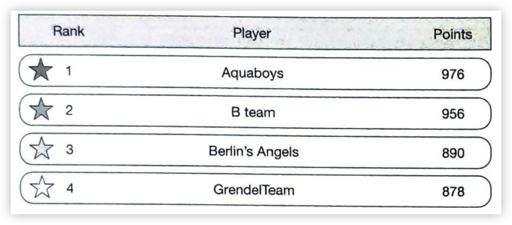
图 10.1: 排行榜


## 第1步 - 理解问题并确定设计范围

排行榜可以非常简单，但有许多不同的事项会增加复杂性。我们应该明确要求。

候选人：排行榜的分数是如何计算的？

面试官：用户赢得一场对局就能得到一分。我们可以采用一个简单的积分系统，每个用户都有一个与之相关的分数。用户每赢得一场对局，我们就应该在他们的总分上加上一分。

候选人：排行榜是否包括所有选手？

面试官：是的。

候选人：排行榜有时间段吗？

面试官：每个月都会有一次新的赛季拉开帷幕，并开始新的排行榜。

候选人：是否可以认为，我们只关心前 10 名用户？

面试官：我们希望显示排行榜上前10名用户以及特定用户的位置。如果时间允许，我们还将讨论如何返回比特定用户高 4 位和低 4 位的用户。

候选人：一次赛季有多少用户？

面试官：日活跃用户 (DAU) 平均500万，月活跃用户 (MAU) 平均 2500 万。

候选人：一次赛季平均要进行多少场对局？

面试官：每位玩家平均每天要打 10 次对局。

候选人：如果两名选手得分相同，如何确定名次？

面试官：在这种情况下，他们的排名是一样的。如果时间允许，我们可以讨论一下如何打破平局。

候选人：排行榜必须是实时的吗？

面试官：是的，我们希望呈现实时结果，或者尽可能接近实时结果。不能展示批量的历史结果。

现在，我们已经收集了所有需求，让我们列出功能需求。

### 功能需求
* 在排行榜上显示前 10 名玩家。

* 显示用户的具体排名。

* 显示比指定用户排名高四位和低四位的玩家。

除了明确功能性需求外，了解非功能性需求也很重要。

### 非功能性需求
* 实时更新分数。

* 得分更新会实时反映在排行榜上。

* 常见的可扩展性、可用性和可靠性要求。

### 粗略估算

让我们进行一些简单的计算，以确定我们的解决方案需要应对的潜在规模和挑战。

在 500 万 DAU 的情况下，如果游戏的玩家在 24 小时内分布均匀，那么平均每秒将有 50 个用户 $({5,000,000 DAU \over 10^6 seconds}\approx 50)$ 。但是，我们知道用户数量很可能不是均匀分布的，在晚上可能会出现高峰，因为不同时区的许多人都有时间玩游戏。为了考虑到这一点，我们可以假设峰值负载是平均值的 5 倍。因此，我们希望允许每秒 250 个用户的峰值负载。

用户获得积分的 QPS：如果一个用户平均每天玩 10 场游戏对局，则用户获得积分的 QPS 为： $50\times10\approx 500$。峰值QP 是平均值的 5 倍： $500\times5=2500$。

获取排行榜前 10 名的 QPS：假设用户每天打开一次游戏，而排行榜前 10 名仅在用户首次打开游戏时加载。其 QPS 约为 50。

## 第2步 - 提出高层设计并获得认可

在本节中，我们将讨论应用程序的接口设计、高层设计和数据模型。

### API设计

在高层次上，我们需要以下三个API接口：

#### `POST /v1/scores`

当用户赢得游戏时，更新用户在排行榜上的位置。请求参数如下。这应该是一个内部 API，只能由游戏服务器调用。客户端不能直接更新排行榜得分。

| 字段 | 描述 |
|------|------|
| user_id | 赢得游戏的用户 |
| points | 用户赢得游戏所获得的积分 |

表 10.1: 请求参数

响应：
| 字段 | 描述 |
|------|------|
| 200 OK | 成功更新用户分数 |
| 400 Bad Request | 更新用户分数失败 |

表 10.2: 响应

#### `GET /v1/scores`

获取排行榜前 10 的用户

响应示例：
```json
{
    "data":[   
        {
            "user_id": "user_id1",
            "user_name": "alice",
            "rank": 1,
            "score": 976
        },
        {
            "user_id": "user_id2",
            "user_name": "bob",
            "rank": 2,
            "score": 965
        }
    ],
    "total": 10
}
```

#### `GET /v1/scores/{:user_id}`

获取指定用户排名。

| 字段 | 描述 |
|------|------|
| user_id | 我们要获取其排名的用户的ID |

表 10.3: 请求参数

响应示例：
```json
{
    "user_info": {
        "user_id": "user5",
        "score": 940,
        "rank": 6,
    }
}
```

### 高层设计

高层设计图，如图 10.2 所示。本设计中有两个服务。游戏服务，允许用户玩游戏；排行榜服务，创建并展示排行榜。

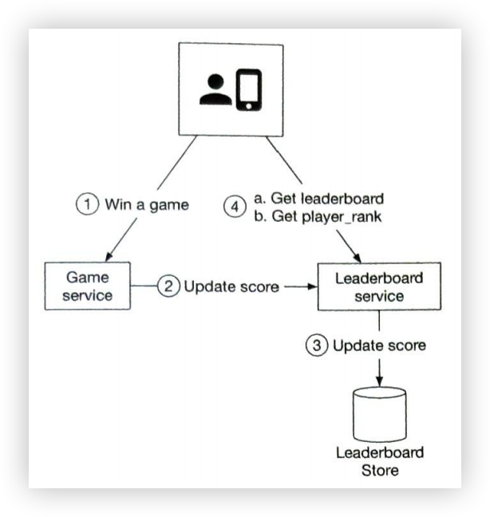
图 10.2: 高层设计图

1. 玩家赢得游戏，客户端向游戏服务发送一个请求。
2. 游戏服务确保胜利有效后，调用排行榜服务更新分数。
3. 排行榜服务更新用户数据库中的分数。
5. 玩家直接调用排行榜服务来获取排行榜数据，包括：

    (a) 前10排行榜。

    (b) 该玩家在排行榜的名次。

在确定这个设计方案之前，我们考虑了一些替代方案，但最终决定放弃。回顾并比较不同的方案，可能会有所帮助。

#### 客户端是否直接和排行榜服务通信？

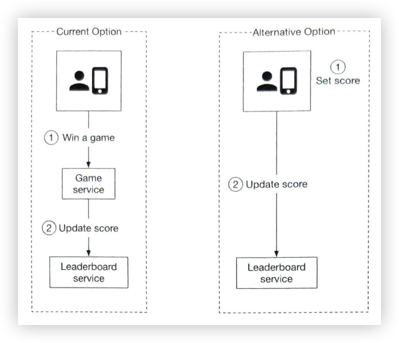
图 10.3: 由谁设置排行榜分数

在另一种设计中，分数由客户端设定。这种方案并不安全，因为它会受到中间人攻击[1]，玩家可以通过代理随意更改分数。因此，我们需要在服务器端设置分数。

请注意，对于服务器授权的游戏（如在线扑克），客户端可能不需要明确调用游戏服务器来设置分数。游戏服务器会处理所有的游戏逻辑，它知道游戏何时结束，可以在没有客户端干预的情况下设置分数。

#### 我们是否需要在游戏服务和排行榜服务之间建立消息队列？
这个问题的答案在很大程度上取决于游戏分数的使用方式。如果数据被用于其他地方或支持多种功能，那么如图 10.4 所示，将数据放在 Kafka 中可能会更有意义。这样，排行榜服务、分析服务、推送通知服务等多个消费者就可以使用相同的数据。当游戏是一款回合制或多人游戏时，我们需要通知其他玩家分数的更新情况，消息队列尤其重要。根据与面试官的对话，这并不是一个明确的需求，因此我们在设计中没有使用消息队列。

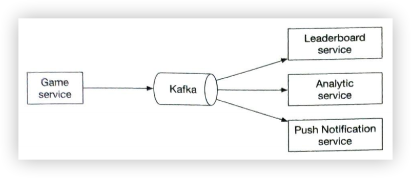
图 10.4: 游戏分数被多种服务使用

### 数据模型
系统的关键组件之一是排行榜存储。我们将讨论三种可能的解决方案：关系数据库、Redis 和 NoSQL（NoSQL解决方案将在本文的深入设计部分进行解释）。

#### 关系数据库解决方案
> 译者注：关系数据库，英语原文 Realational database solution，也可以翻译为关系型数据库。

首先，让我们退一步，从最简单的解决方案开始。如果规模并不重要，我们只有几个用户，应该如何设计？

我们很可能会选择使用关系型数据库系统 (RDS) 来提供一个简单的排行榜解决方案。每个月的排行榜都可以用一个包含用户 ID 和分数列的数据库表来表示。当用户赢得一场比赛时，如果是新用户，则奖励 1 分，如果是老用户，则增加 1 分。为了确定用户在排行榜上的排名，我们将对表中的得分，从高到低进行排序。详情如下。

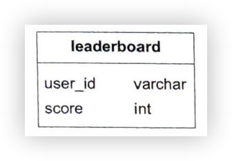
图 10.5: 排行榜表

实际上，排行榜表还包含其他信息，如 game_id、时间戳等。不过，如何查询和更新排行榜的基本逻辑是一样的。为简单起见，我们假设排行榜表中只存储了当前月份的排行榜数据。

**用户赢得积分**


图 10.6: 用户赢得积分

假设每次分数更新都以 1 为增量。如果用户在当月的排行榜中还没有条目，则第一次插入的内容：

```sql
INSERT INTO leaderboard (user_id, score) VALUES (‘mary1934’, 1);
```

对用户分数的更新：

```sql
UPDATE leaderboard set score=score + 1 where user_id='mary1934'；
```

**查询用户在排行榜上的排名**


图 10.7: 查询用户在排行榜上的排名

要获取用户排名，我们将通过分数对排行榜表排序：
```sql
SELECT (@rownum := @rownum + 1) AS rank, user_id, score
FROM leaderboard
ORDER BY score DESC;
```

SQL查询的结果如下：

| rank | user_id | score |
|------|------|------|
| 1 | happy_tomato | 987 |
| 2 | mallow | 902 |
| 3 | smith | 870 |
| 4 | mary1934 | 850 |

表 10.4: 按分数排序的结果

当数据集较小时，这种解决方案还能奏效，但当数据行数达到数百万行时，查询速度就会变得非常慢。让我们来看看原因何在。

要确定用户的排名，我们需要将每个玩家，排序到排行榜上的正确位置，这样我们才能确定正确的排名。请记住，也可能有重复的分数，因此排名不仅仅是用户在列表中的位置。

当我们需要处理大量持续变化的信息时，SQL 数据库的性能并不理想。尝试对数百万行进行排序操作将需要 10 秒钟的时间，这对于所需的实时方法来说是不可接受的。由于数据是不断变化的，因此考虑使用缓存也是不可行的。

关系数据库在设计上，无法处理这种实时的高负载查询。如果以批量操作的方式进行，则可以使用 RDS，但这不符合为用户返回实时排名的需求。

我们可以做的一项优化是添加索引，并使用 LIMIT 语句限制要扫描的页面数。如下：
```sql
SELECT (@rownum := @rownum + 1) AS rank, user_id, score
FROM leaderboard
ORDER BY score DESC
LIMIT 10
```

然而，这种方法并不能很好地扩展。首先，查找用户排名的性能不高，因为它基本上需要通过表扫描来确定排名。其次，这种方法没有提供直接的解决方案，来确定不在排行榜顶端的用户的排名。

#### Redis 解决方案

我们希望找到一种解决方案，即使在数百万用户的情况下也能提供可预测的性能，并允许我们轻松访问常用的排行榜操作，而无需依赖复杂的数据库查询。

Redis 为我们的问题提供了一个潜在的解决方案。Redis 是一种支持键值对的内存数据存储。由于它在内存中工作，因此可以实现快速读写。Redis 有一种称为 **sorted sets** 的数据类型，非常适合解决排行榜系统设计问题。

**什么是 sorted sets？**

sorted sets 是一种类似于集合的数据类型。它的每个成员都与一个分数相关联。集合的成员必须是唯一的，但分数可以重复。分数用于按升序排列 sorted sets。

我们的排行榜用例完美地映射了 sorted sets。在底层，sorted sets 由两种数据结构实现：hashtab 哈希表和 skip list 跳表 [2]。哈希表将用户映射到分数，跳过列表将分数映射到用户。在 sorted sets 中，用户按分数排序。如图 10.8 所示，理解 sorted sets 的一个好方法是把它想象成一个带有分数和成员列的表格。该表按分数降序排序。

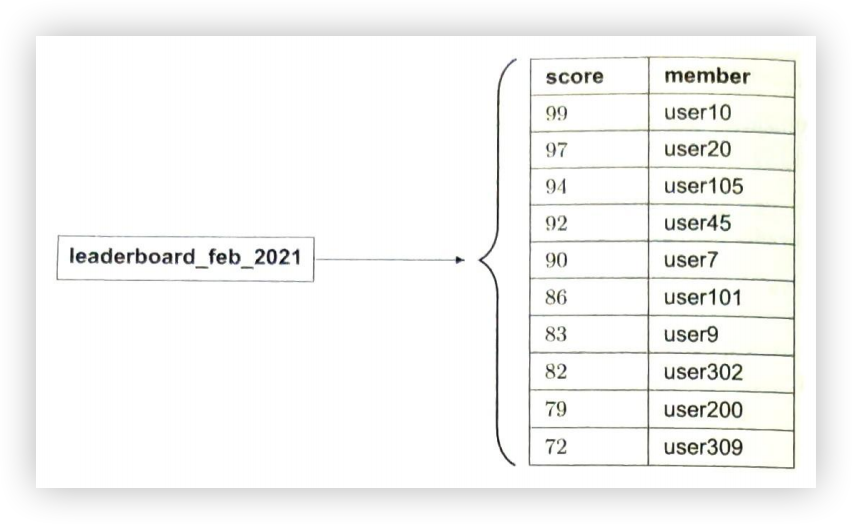
图 10.8: 二月份的排行榜通过 sorted sets 表示

在本章中，我们不会详述 sorted sets 的全部实现细节，但会介绍一些高层设计思路。

skip list 调表是一种可实现快速搜索的列表结构。它由基本排序链表和多级索引组成。让我们来看一个例子。在图 10.9 中，列表是一个已排序的单链表。插入、移除和查询操作的时间复杂度为 $O(n)$。

怎样才能让这些操作变得更快？其中一个办法就是像二分查找算法那样，快速找到中间节点。为了达到这个目的，我们增加了一个跳过其他节点的一级索引，然后又增加了一个跳过一级索引的其他节点的二级索引。我们会不断引入更多级索引，每一级索引都会跳过上一级索引中的每一个节点。当节点间的距离为 $({n \over 2}-1)$（其中为 n 为节点总数）时，我们将停止这种添加。如图 10.9 所示，当我们使用多级索引时，搜索数字 45 的速度会快很多。

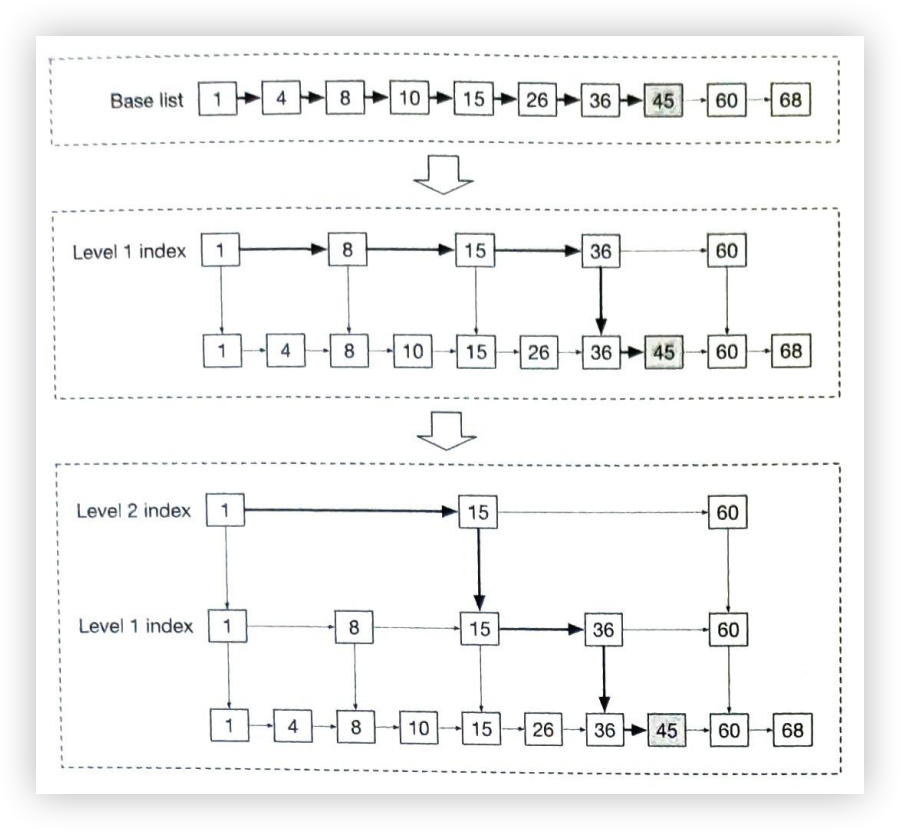
图 10.9: 跳表

当数据集较小时，使用跳表对速度的提升并不明显。图 10.10 显示了一个有 5 层索引的表示例。在基本链表中，需要遍历 62 个节点才能到达正确的节点。而在跳表中，只需遍历 11 个节点 [3]。


图 10.10: 带有 5 级索引的跳表

与关系数据库相比，sorted sets 的性能更高，因为在插入或更新时，每个元素都会自动按照正确的顺序定位，而且在 sorted sets 中进行添加或查找操作的复杂度是 $O\big(log(n)\big)$。

相比之下，要计算关系数据库中特定用户的排名，我们需要运行嵌套查询：
```sql
SELECT *,(SELECT COUNT(*) FROM leaderboard lb2
WHERE lb2.score >= lb1.score) RANK
FROM leaderboard lb1
WHERE lb1.user_id = {:user_id};
```

**Redis sorted sets 实现**

既然我们已经知道 sorted sets 的速度很快，那加下来，我们来看看通过 Redis 建立排行榜的具体操作 [4] [5] [6] [7]：

- ZADD：如果用户尚不存在，则将其插入数据集。否则，更新该用户的分数。执行需要 $O\big(log(n)\big)$。

- ZINCRBY：按指定的增量，递增用户的分数。如果用户不存在于集合中，则假定分数从 0 开始。执行需要 $O\big(log(n)\big)$ 的时间。

- ZRANGE/ZREVRANGE：获取按分数排序的用户范围。我们可以指定顺序（range 与 revrange）、条目数和起始位置。这需要 $O\big(log(n)+m\big)$ 来执行，其中 m 是要获取的条目的数量（在我们的情况下通常较少），n 是 sorted sets 中条目的数量。

- ZRANK/ZREVRANK：以对数的时间复杂度按升序/降序获取任何用户的位置。

**sorted set 的工作流**

1. 用户得分


图 10.11: 用户得分

我们每个月都会创建一个新的排行榜 sorted sets ，之前的 sorted sets 会被移至历史数据存储区。当用户赢得一场比赛时，他们会得到 1 分；因此我们会调用 ZINCRBY 将该用户在当月排行榜中的得分增加 1，或者将该用户添加到排行榜中（如果他们还没有在排行榜中的话）。ZINCRBY 的语法是：

```shell
ZINCRBY <key> <increment> <user>
```

下面的命令会在用户 mary1934 赢得比赛后为其增加一个积分。

```shell
ZINCRBY leaderboard_feb_2021 1 ‘mary1934’
```

2. 用户获取全球排行榜前 10 名

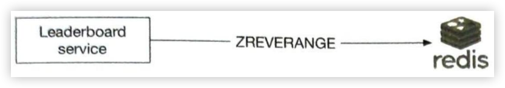
图 10.12: 用户获取全球排行榜前 10 名

我们将调用 ZREVRANGE 以从高到低的顺序获取成员，因为我们想要最高分，并通过 WITHSCORES 属性确保同时返回每个用户的总分以及得分最高的用户集合。下面的命令将获取 2021 年 2 月排行榜上的前 10 名玩家。

```shell
ZREVRANGE leaderboard_feb_2021 0 9 WITHSCORES
```

返回的列表如下：

```shell
[(user2, score2),(user1, score1),(user5, score5)...]
```

3. 用户希望获取自己在排行榜上的位置

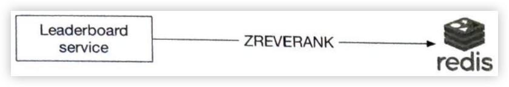
图 10.13: 获取用户在排行榜上的位置

要获取用户在排行榜中的位置，我们将调用 ZREVRANK 来获取用户在排行榜中的排名。我们再次调用 rev 版本的命令，因为我们想把分数从高到低排序。

```shell
ZREVRANK leaderboard_feb_2021 'mary1934'
```

4. 获取用户在排行榜中的相对位置，示例如图 10.14 所示。

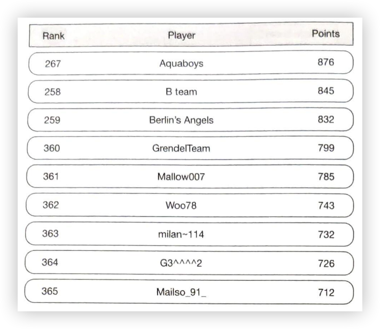
图 10.14: 获取排名前后的 4 个用户

虽然这不是一个明确的要求，但我们可以利用 ZREVRANGE 和所需上下用户的人数，轻松获取用户的相对位置。例如，如果用户 Mallow007 的排名是 361，而我们想获取在其上下的 4 名用户，我们可以运行以下命令。

```shell
ZREVRANGE leaderboard_feb_2821 357 365
```

**存储要求**

我们至少需要存储用户 ID 和得分。最坏的情况是，所有 2500 万月活跃用户都至少赢过一场游戏，而且他们都在当月的排行榜上有记录。假设用户 ID 是 24 个字符的字符串，得分是 16 位整数（或 2 个字节），则每个排行榜条目需要 26 个字节的存储空间。假设最坏的情况是每个 MAU 有一个排行榜条目，那么我们将需要 26 个字节 x 25 百万字节 = 650 百万字节或约 650 MB 用于 Redis 缓存中的排行榜存储。即使我们将内存使用量增加一倍，以考虑到跳表和 sorted sets 的开销，一台现代 Redis 服务器也足以存储这些数据。

另一个需要考虑的相关因素是 CPU 和 I/O 使用率。我们通过回溯估算得出的峰值 QPS 为 2500 次更新。这完全在单个 Redis 服务器的性能范围之内。

Redis 缓存的一个问题是持久性，因为 Redis 节点可能会出现故障。幸运的是，Redis 确实支持持久性，但从磁盘重启大型 Redis 实例的速度很慢。通常情况下，Redis 会配置一个读取副本，当主实例发生故障时，读取副本会被升级，并附加一个新的读取副本。

此外，我们还需要在 MySQL 等关系数据库中建立两个支持表（用户表和点表）。用户表将存储用户 ID 和用户显示名（在实际应用中，这将包含更多数据）。积分表将包含用户 ID、得分和赢得比赛的时间戳。这可用于其他游戏功能，如游戏历史，也可用于在基础设施发生故障时重新创建 Redis 排行榜。

作为一个小的性能优化，为用户详细信息创建一个额外的缓存可能是有意义的，因为前 10 名玩家的检索频率最高。这并不会产生大量数据。

### 深入设计

既然我们已经讨论了高层设计，下面就让我们深入探讨一下：

- 是否使用云提供商
    - 服务管理
    - 使用 AWS 等云服务
- Redis 扩展
- 备选方案：NoSQL
- 其他考虑因素

#### 是否使用云服务

根据现有的基础设施，我们通常有两种部署解决方案的选择。让我们分别来看一看。

**服务管理**

在这种方法中，我们将每月创建一个排行榜 sorted sets ，以存储该期间的排行榜数据。sorted sets 存储用户和分数信息。用户的其他详细信息（如姓名和个人资料图片）则存储在 MySQL 数据库中。在获取排行榜时，除了排行榜数据外，API 服务器还会查询数据库，以获取相应的用户名和个人资料图像，并显示在排行榜上。如果长期这样做效率太低，我们可以缓存前 10 名玩家的用户详细信息。设计如图 10.15 所示。

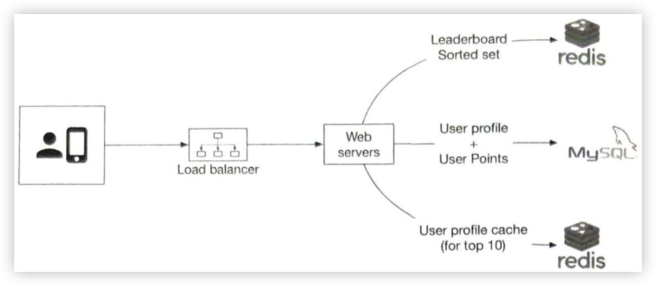
图 10.15: 服务管理

**使用云服务**

第二种方法是利用云基础设施。在本节中，我们假定我们现有的基础设施是建立在 AWS 上的，因此在云上建立排行榜是自然而然的事情。我们将在本设计中使用两项主要的 AWS 技术：亚马逊 API 网关和 AWS Lambda 函数 [8]。亚马逊 API 网关提供了一种定义 RESTful API 的 HTTP 端点并将其连接到任何后端服务的方法。我们用它来连接 AWS lambda 函数。表 10.5 显示了有源 API 和 Lambda 函数之间的映射。

| APIs | Lambda 函数 |
|------|------|
| GET /v1/scores | LeaderboardFetchTop10 |
| GET /v1/scores/{:user_id} | LeaderboardFetchPlayerRank |
| POST /v1/scores | LeaderboardUpdateScore |

表 10.5: Lambda 函数

AWS Lambda 是最流行的无服务器计算平台之一。它允许我们运行代码，而无需自己配置或管理服务器。它只在需要时运行，并会根据流量自动扩展。无服务器是云服务领域最热门的话题之一，所有主要的云服务提供商都支持它。例如，Google Cloud 拥有 Google Cloud Functions [9]，Microsoft 将其产品命名为 Microsoft Azure Functions [10]。

从高层来看，我们的游戏会调用亚马逊 API 网关，然后再调用相应的 lambda 函数。我们将使用 AWS Lambda 函数在存储层（Redis 和 MySQL）上调用相应的命令，将结果返回给 API Gateway，然后再返回给应用程序。

我们可以利用 Lambda 函数来执行所需的查询，而无需启动服务器实例。AWS 支持可从 Lambda 函数调用的 Redis 客户端。这还允许根据 DAU 增长的需要进行自动扩展。用户得分和检索排行榜的设计图如下所示：

**示例1：得分**

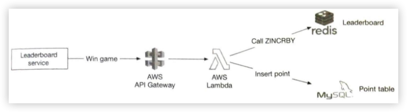
图 10.16: 得分

**示例2：检索排行榜**

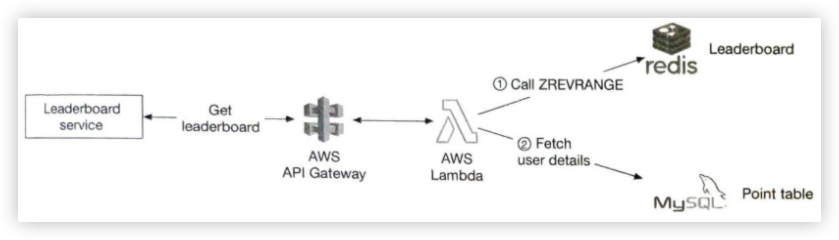
图 10.17: 检索排行榜

Lambdas 非常出色，因为它是一种无服务器方法，基础设施会根据需要自动扩展功能。这意味着我们无需管理扩展、环境设置和维护。因此，如果我们从头开始构建游戏，我们建议使用无服务器方法。

#### Redis 扩展

在 DAU 为 500 万的情况下，从存储和 QPS 的角度来看，我们只需使用一个 Redis 缓存即可。但是，假设我们有 5 亿 DAU，这是我们原始规模的 100 倍。现在，在最坏的情况下，我们的排行榜规模会增加到 65 GB（650MB x 100），而 QPS 则会增加到每秒 250,00（2,500 x 100）次查询。这就需要采用分片解决方案。

> 译者注：这种计算方法，只是从存储的角度，实际业务中，我们还需要考虑 Redis 的热 Key 和 大 Key 问题喔。

**数据分片**

我们考虑用以下两种方式之一进行分片：固定分片或散列分片。

**固定分片**
了解固定分区的一种方法是查看排行榜上积分的总体范围。假设一个月内赢得的分数从 1 到 1000 不等，我们按范围对数据进行分割。例如，我们可以有 10 个分区，每个分区有 100 个分数范围（例如，1 ~ 100，101 ~ 200，201 ~ 300，...），如图 10.18 所示。

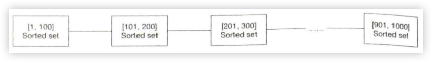
图 10.18: 固定分片

为此，我们要确保排行榜上的分数分布均匀。否则，我们就需要调整每个分区的分数范围，以确保分数分布相对均匀。在这种方法中，我们自己在应用程序代码中对数据进行分片。

在插入或更新用户分数时，我们需要知道用户所在的分区。我们可以从 MySQL 数据库中计算出用户当前的得分。这种方法可行，但性能更好的方法是创建二级缓存来存储用户 ID 到分数的映射。当用户提高分数并在分片之间移动时，我们需要小心。在这种情况下，我们需要将用户从当前分片移除，并将其转移到新的分片。

要获取排行榜中的前 10 名选手，我们需要从得分最高的分片（sorted sets）中获取前 10 名选手。在图 10.18 中，得分[901, 1000]的最后一个分片包含了前 10 名选手。

要获取用户的排名，我们需要计算用户在当前分片内的排名（本地排名），以及所有分配内分数较高的玩家总数。请注意，可以通过运行 info keyspace 命令 $O(1)$ 的获取分区内玩家的总数 [11]。

**哈希分片**

第二种方法是使用 Redis 集群，如果分数非常集中或成块，这种方法就比较理想。Redis 集群提供了一种在多个 Redis 节点间自动分片的方法。它使用的不是一致散列，而是另一种形式的分片，即每个键都是散列槽的一部分。哈希槽有 16384 个 [12]，我们可以通过 CRC16(key) %16384 [13] 来计算给定密钥的哈希槽。这样我们就可以用图 10.19 的方法，我们有 3 个节点，其中：

- 第一个节点包含哈希槽 [0,5500]。
- 第二个节点包含哈希槽 [5501, 11000]。
- 第三个节点包含哈希槽 [11001, 16383]。

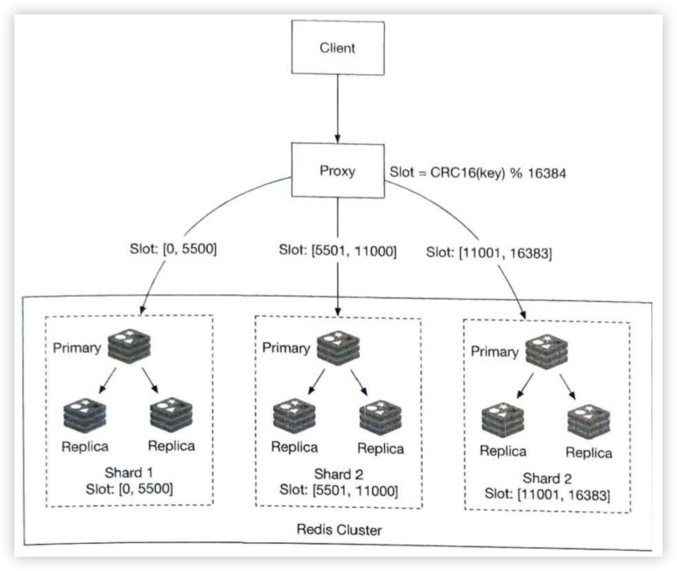
图 10.19: 哈希分片

更新只需改变用户在相应分块中的得分（由 CRC16(key) %16384 决定）。检索排行榜上的前 10 名玩家则更为复杂。我们需要收集每个分区的前 10 名玩家，并让应用程序对数据进行排序。具体示例如图 10.20 所示。这些查询可以并行处理，以减少延迟。

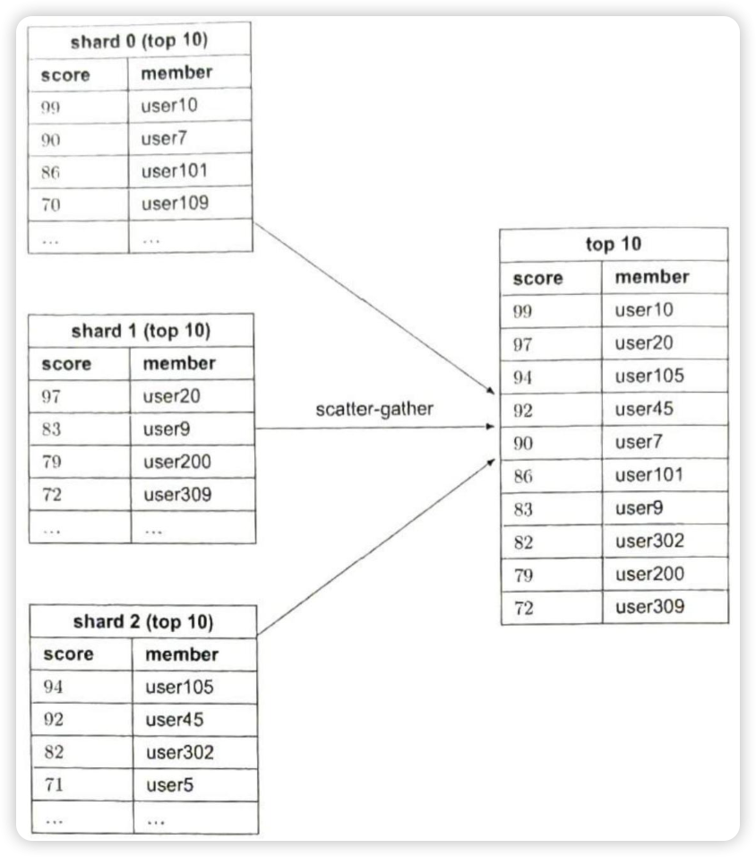
图 10.20: 分散收集

这种方法有一些局限性：

- 当我们需要在排行榜上返回顶部 k 个结果（其中 k 是一个非常大的数字）时，延迟会很高，因为每个分片都会返回大量条目并需要进行排序。
- 如果有很多分片，延迟就会很高，因为查询必须等待最慢的分片。
- 这种方法的另一个问题是，它没有为确定特定用户的排名提供直接的解决方案。

因此，我们倾向于第一种方案：固定分片。

**确定 Redis 节点的大小**

在确定 Redis 节点的大小时，需要考虑多个方面 [14]。写入量大的应用程序需要更多可用内存，因为我们需要能够容纳所有写入，以便在发生故障时创建快照。为安全起见，应为写入量大的应用程序分配两倍的内存。

#### 备选方案：NoSQL

一种替代解决方案是考虑使用 NoSQL 数据库。我们应该选择什么样的 NoSQL 数据库呢？理想情况下，我们希望选择具备以下特性的 NoSQL 数据库：

- 为写操作进行了优化。
- 能够在分区内根据得分高效地排序项目。

NoSQL 数据库，如 Amazon 的 DynamoDB [16]、Cassandra 或 MongoDB 都是不错的选择。在本章中，我们以 DynamoDB 为例。DynamoDB 是一种完全托管的 NoSQL 数据库，提供可靠的性能和卓越的可扩展性。为了高效地访问除主键以外的其他属性，我们可以在 DynamoDB 中使用全局二级索引 [17]。全局二级索引包含从父表选择的属性，但它们以不同的主键方式组织起来。我们来看一个例子。

更新后的系统架构如图 10.21 所示。Redis 和 MySQL 被 DynamoDB 替代。

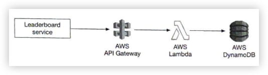
图 10.21: DynamoDB 解决方案

假设我们为国际象棋游戏设计排行榜，我们的初始表如图 10.22 所示。这是排行榜视图和用户表的非规范化视图，包含渲染排行榜所需的所有数据。

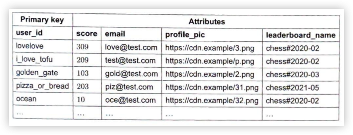
图 10.22: 排行榜和用户表的非规范化视图

此表结构可用，但无法很好地扩展。随着添加更多行，我们必须扫描整个表以找到最高分项。

> 译者注：原文 PDF 为扫描版，有部分内容不全，我联系了文章上下文进行补全。

为了避免线性扫描，我们需要添加索引。我们的第一种尝试是使用 year-month 作为分区键，并使用 score 作为排序键，如图 10.23 所示。

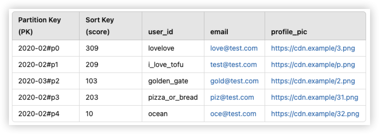
图 10.23: 分区键和排序键

在高负载下，这种设计会遇到问题。DynamoDB 使用一致性哈希（consistent hashing）将数据分布到多个节点中。每个数据项基于其分区键被映射到对应的节点。

在上述表设计（图 10.23）中，所有最近月份的数据都会集中在同一个分区，从而形成“热点分区”（hot partition）。我们该如何解决这个问题？

一种方法是将数据拆分为多个分区，并在分区键后附加一个分区编号（例如 user_id % n，其中 n 为分区数）。这种模式被称为写分片（write sharding）。它会增加读写操作的复杂性，因此需要慎重考虑。

需要回答的关键问题是，我们应该使用多少个分区？这取决于写入量或 DAU（每日活跃用户数量）。重要的是要确保负载可以均匀分布在多个分区上，从而减少读操作的复杂度。

由于同一月份的数据会分布在多个分区中，要读取给定月份的数据，必须查询所有分区的结果，这增加了读操作的复杂性。

更新后的分区键设计像这样：`game_name#{year-month}#p{partition_number}`。这代表了更新后的表结构。

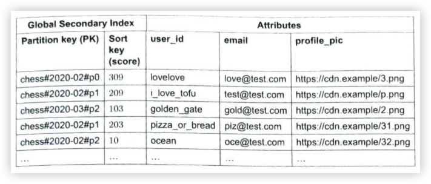
图 10.24: 更新分区键

全局二级索引使用 `game_name#{year-month}#p{partition_number}` 作为分区键，使用 score 作为排序键。最终我们得到的是 n 个分区，每个分区内部都是排序好的（局部排序）。假设我们有 3 个分区，那么为了获取前 10 名排行榜，我们会使用之前提到的"scatter-gather"方法。我们会在每个分区中获取前 10 个结果（这是"scatter"部分），然后让应用程序对所有分区的结果进行排序（这是"gather"部分）。如图 10.25 所示。

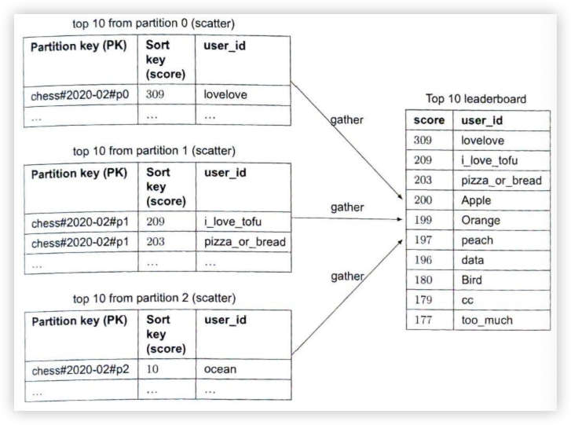
图 10.25: Scatter-gather

我们如何决定分区数量？这需要仔细的基准测试。更多的分区会减少每个分区的负载，但也增加了复杂性，因为我们需要跨更多分区进行 scatter 操作来构建最终的排行榜。通过基准测试，我们可以更清楚地看到这种权衡。

然而，类似于之前提到的 Redis 分区方案，这种方法并不能直接得到用户的准确排名。但是，我们可以获得用户位置的百分位数，这在实际应用中可能已经足够好了。在现实中，告诉玩家他们在前 10-20% 可能比显示具体排名（如1,200,001）更好。因此，如果规模大到需要分片，我们可以假设所有分片的分数分布大致相同。如果这个假设成立，我们可以用一个定时任务来分析每个分片的分数分布，并缓存结果。

结果会是这样的：
第 10 百分位 = 分数 < 100
第 20 百分位 = 分数 < 500
...
第 90 百分位 = 分数 < 6500

然后我们可以快速返回用户的相对排名（比如第 90 百分位）。

## 第4步 - 总结

在本章中，我们创建了一个支持百万 DAU 的实时游戏排行榜解决方案。我们探讨了使用 MySQL 数据库的直接方案，但因为它无法扩展到百万用户而放弃了这种方法。然后我们使用 Redis 有序集合设计了排行榜。我们还通过在不同 Redis 缓存之间使用分片来将解决方案扩展到 5 亿 DAU。我们还提出了一个替代的 NoSQL 解决方案。

如果在面试最后还有额外时间，你可以讨论以下几个话题：

**更快的检索和打破相同排名**

Redis 哈希表提供了字符串字段和值之间的映射。我们可以利用哈希实现两个用例：
1. 存储用户 ID 到用户对象的映射，以便在排行榜上显示。这比从数据库获取用户对象更快。
2. 在两个玩家分数相同的情况下，我们可以基于谁先获得该分数来对用户进行排名。当我们增加用户分数时，我们还可以存储用户ID 到最近获胜游戏时间戳的映射。在平局情况下，较早的时间戳排名更高。

**系统故障恢复**

Redis 集群可能会遇到大规模故障。基于上述设计，我们可以创建一个脚本，利用 MySQL 数据库中记录的每次用户获胜时的时间戳。我们可以遍历每个用户的所有记录，并为每个用户的每条记录调用一次 ZINCRBY 命令。这样，在发生大规模故障时，我们可以在离线状态下重建排行榜。

恭喜你能坚持到这里！给自己一个赞，干得漂亮！

### 章节总结

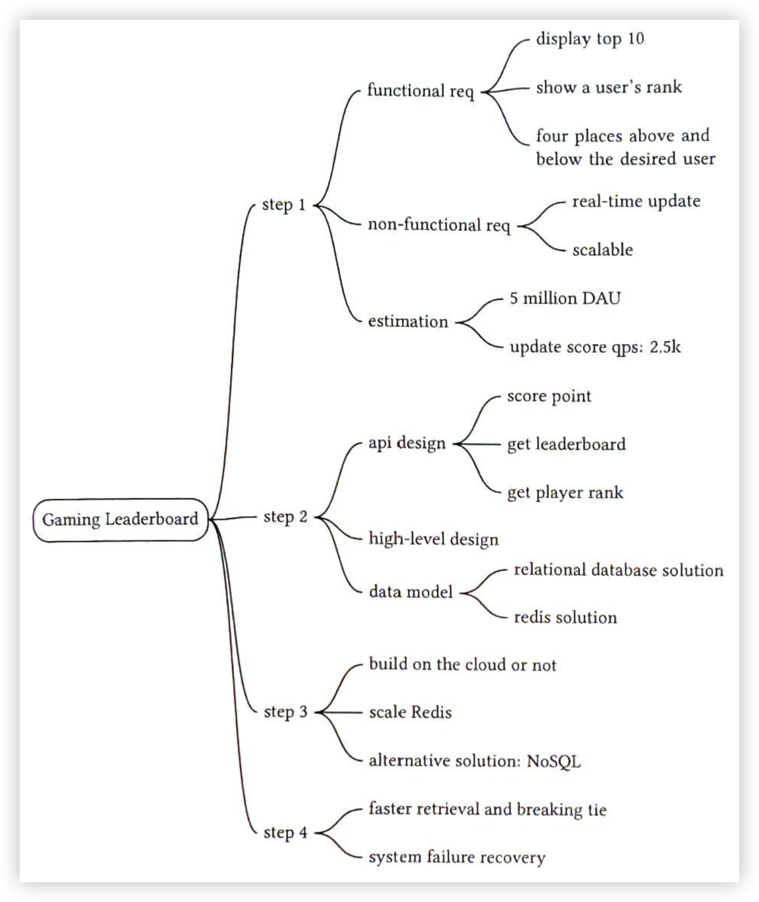

## 参考资料

[1] Man-in-the-middle attack. https://en.wikipedia.org/wiki/Man-in-the-middle_attack.

[2] Redis Sorted Set source code. https://github.com/redis/redis/blob/unstable/src/t_zset.c.

[3] Geekbang. https://static001.geekbang.org/resource/image/46/a9/46d283cd82c987153b3fe0c76dfba8a9.jpg.

[4] Building real-time Leaderboard with Redis. https://medium.com/@sandeep4.verma/building-real-time-leaderboard-with-redis-82c98aa47b9f.

[5] Build a real-time gaming leaderboard with Amazon ElastiCache for Redis. https://aws.amazon.com/blogs/database/building-a-real-time-gaming-leaderboard-with-amazon-elasticache-for-redis.

[6] How we created a real-time Leaderboard for a million Users. https://levelup.gitconnected.com/how-we-created-a-real-time-leaderboard-for-a-million-users-555aaa3cef7b.

[7] Leaderboards. https://redislabs.com/solutions/use-cases/leaderboards/.

[8] Lambda. https://aws.amazon.com/lambda/.

[9] Google Cloud Functions. https://cloud.google.com/functions.

[10] Azure Functions. https://azure.microsoft.com/en-us/services/functions/.

[11] Info command. https://redis.io/commands/INFO.

[12] Why redis cluster only have 16384 slots. https://stackoverflow.com/questions/3620532/why-redis-cluster-only-have-16384-slots.

[13] Cyclic redundancy check. https://en.wikipedia.org/wiki/Cyclic_redundancy_check.

[14] Choosing your node size. https://docs.aws.amazon.com/AmazonElastiCache/latest/red-ug/nodes-select-size.html.

[15] How fast is Redis? https://redis.io/topics/benchmarks.

[16] Using Global Secondary Indexes in DynamoDB. https://docs.aws.amazon.com/amazondynamodb/latest/developerguide/GSI.html.

[17] Leaderboard & Write Sharding. https://www.dynamodbguide.com/leaderboard-write-sharding/.