# 数字钱包

支付平台通常为客户提供数字钱包服务，这样他们可以将钱存入钱包并在以后使用。例如，你可以从银行卡向数字钱包充值，当你在线购买产品时，可以选择使用钱包中的钱进行支付。


花钱并不是数字钱包提供的唯一功能。对于像 PayPal 这样的支付平台，我们可以直接将钱转移到同一支付平台上其他人的钱包中。与银行间转账相比，数字钱包之间的直接转账速度更快，最重要的是，通常不会收取额外费用。

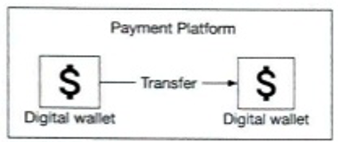

假设我们被要求设计一个支持跨钱包余额转账操作的数字钱包应用程序的后端。在面试开始时，我们会通过澄清问题来确定需求。

## 第一步 - 理解问题并确定设计范围

**候选人：** 我们是否只需要关注两个数字钱包之间的余额转账操作？是否需要考虑其他功能？

**面试官：** 我们只关注余额转账操作。

**候选人：** 系统需要支持每秒多少笔交易（TPS）？

**面试官：** 假设需要支持 1,000,000 TPS。

**候选人：** 数字钱包对正确性有严格要求。我们可以假设事务性保证 [1] 足够吗？

**面试官：** 听起来不错。

**候选人：** 我们需要证明正确性吗？

**面试官：** 这是个好问题。正确性通常只能在交易完成后验证。一种验证方法是将我们的内部记录与银行的对账单进行比较。对账的局限性在于它只能显示差异，无法说明差异是如何产生的。因此，我们希望设计一个具有可重现性的系统，这意味着我们始终可以通过从最开始重放数据来重建历史余额。

**候选人：** 我们可以假设可用性要求为 99.99% 吗？

**面试官：** 听起来不错。

**候选人：** 是否需要考虑外汇？

**面试官：** 不需要，这超出了范围。

### 总结

总结一下，我们的数字钱包需要支持以下内容：

- 支持两个数字钱包之间的余额转账操作。
- 支持 1,000,000 TPS。
- 可靠性至少为 99.99%。
- 支持事务。
- 支持可重现性。

### 粗略估算

当我们谈论 TPS 时，意味着将使用事务性数据库。如今，运行在典型数据中心节点上的关系型数据库可以支持每秒几千笔事务。例如，参考文献 [2] 包含一些流行的事务性数据库服务器的性能基准。假设一个数据库节点可以支持 1,000 TPS。为了达到 100 万 TPS，我们需要 1,000 个数据库节点。

然而，这个计算略有偏差。每笔转账命令需要两个操作：从一个账户扣款和向另一个账户存款。为了支持每秒 100 万笔转账，系统实际上需要处理高达 200 万 TPS，这意味着我们需要 2,000 个节点。

| 单节点 TPS | 节点数量 |
| ---------- | -------- |
| 100        | 20,000   |
| 1,000      | 2,000    |
| 10,000     | 200      |

**表 12.1: 单节点 TPS 与节点数量的映射**

## 第二步 - 提出高层设计并获得认可

在本节中，我们将讨论以下内容：

- API 设计
- 三种高层设计
  1. 简单的内存解决方案
  2. 基于数据库的分布式事务解决方案
  3. 具有可重现性的事件溯源解决方案

### API 设计

我们将使用 RESTful API 规范。对于这次面试，我们只需要支持一个 API：

| API                              | 详情                             |
| -------------------------------- | -------------------------------- |
| POST /v1/wallet/balance_transfer | 将余额从一个钱包转移到另一个钱包 |

**请求参数如下：**

| 字段           | 描述          | 类型                 |
| -------------- | ------------- | -------------------- |
| from_account   | 扣款账户      | string               |
| to_account     | 收款账户      | string               |
| amount         | 金额          | string               |
| currency       | 货币类型      | string (ISO 4217[3]) |
| transaction_id | 用于去重的 ID | uuid                 |

**示例响应体：**

```json
{
  "Status": "success",
  "Transaction_id": "81589980-2664-11ec-9621-0242ac130002"
}
```

值得一提的是，“amount”字段的数据类型是“string”，而不是“double”。我们在第 11 章支付系统中解释了原因（第 320 页）。  
在实践中，许多人仍然选择浮点数或双精度数表示，因为它几乎被所有编程语言和数据库支持。只要我们了解精度丢失的潜在风险，这是一个合适的选择。

**内存分片解决方案**  
钱包应用程序为每个用户账户维护一个账户余额。表示这种 <用户, 余额> 关系的一个良好数据结构是映射（map），也称为哈希表（hash table）或键值存储（key-value store）。  
对于内存存储，一个流行的选择是 Redis。一个 Redis 节点不足以处理 100 万 TPS。我们需要建立一个 Redis 节点集群，并将用户账户均匀分布在其中。这个过程称为分区或分片。  
为了将键值数据分布在 n 个分区中，我们可以计算键的哈希值并将其除以 n。余数就是分区的目标。以下伪代码展示了分片过程：  

```java
String accountID = "A";  
Int partitionNumber = 7;  
Int myPartition = accountID.hashCode() % partitionNumber;
```

分区数量和所有 Redis 节点的地址可以存储在一个集中的地方。我们可以使用 ZooKeeper [4] 作为高可用性配置存储解决方案。  
该解决方案的最后一个组件是处理转账命令的服务。我们称之为钱包服务，它有几个关键职责。  

1. 接收转账命令  
2. 验证转账命令  
3. 如果命令有效，它会更新参与转账的两个用户的账户余额。在集群中，账户余额可能位于不同的 Redis 节点中  

钱包服务是无状态的。它很容易水平扩展。图 12.3 展示了内存解决方案。  

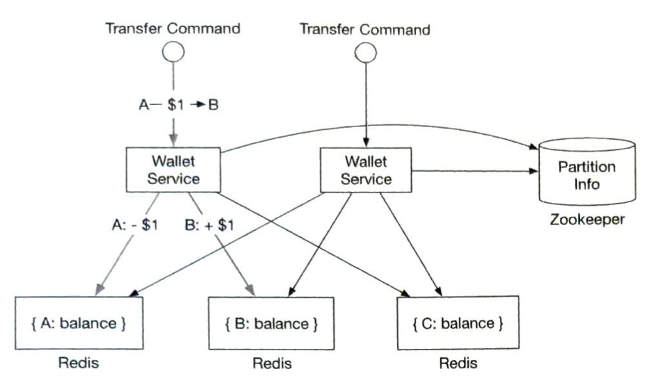  

在这个例子中，我们有 3 个 Redis 节点。有三个客户端 A、B 和 C。他们的账户余额均匀分布在这三个 Redis 节点中。这个例子中有两个钱包服务节点处理余额转账请求。当其中一个钱包服务节点收到将 1 美元从客户端 A 转移到客户端 B 的转账命令时，它会向两个 Redis 节点发出两个命令。对于包含客户端 A 账户的 Redis 节点，钱包服务从账户中扣除 1 美元。对于客户端 B，钱包服务向账户中添加 1 美元。

**候选人：** 在这个设计中，账户余额分布在多个 Redis 节点中。ZooKeeper 用于维护分片信息。无状态的钱包服务使用分片信息定位客户端的 Redis 节点并相应地更新账户余额。  

**面试官：** 这个设计可行，但它不符合我们的正确性要求。钱包服务为每笔转账更新两个 Redis 节点。无法保证两个更新都会成功。例如，如果钱包服务节点在第一次更新完成后但在第二次更新完成之前崩溃，将导致转账不完整。这两个更新需要在一个原子事务中完成。


### 分布式事务

#### 数据库分片
我们如何使对两个不同存储节点的更新具有原子性？第一步是将每个 Redis 节点替换为事务性关系数据库节点。图 12.4 展示了这种架构。这次，客户端 A、B 和 C 被分区到 3 个关系数据库中，而不是 3 个 Redis 节点中。

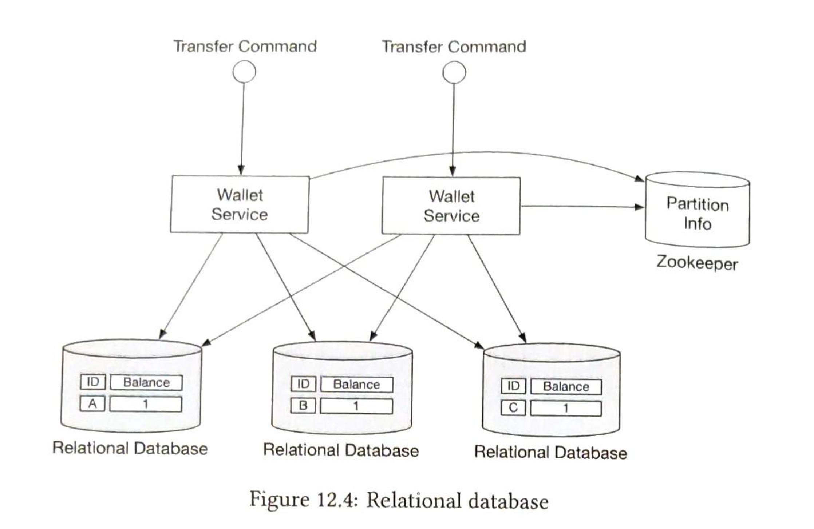

使用事务性数据库只能解决部分问题。正如上一节提到的，一个转账命令很可能需要更新两个不同数据库中的两个账户。无法保证两个更新操作会同时处理。如果钱包服务在更新第一个账户余额后立即重启，我们如何确保第二个账户也会被更新？

### 分布式事务：两阶段提交
在分布式系统中，一个事务可能涉及多个节点上的多个进程。为了使事务具有原子性，分布式事务可能是答案。有两种实现分布式事务的方式：低级别解决方案和高级别解决方案。我们将分别探讨它们。

低级别解决方案依赖于数据库本身。最常用的算法称为两阶段提交（2PC）。顾名思义，它有两个阶段，如图 12.5 所示。

![Figure 12.5: 两阶段提交（来源 [5]）](../images/v2/chapter12/Figure_12.5.png)

1. 协调者（在我们的例子中是钱包服务）像往常一样在多个数据库上执行读写操作。如图 12.5 所示，数据库 A 和 C 都被锁定。
2. 当应用程序准备提交事务时，协调者会要求所有数据库准备事务。
3. 在第二阶段，协调者收集所有数据库的回复并执行以下操作：
   (a) 如果所有数据库都回复“是”，协调者会要求所有数据库提交它们收到的事务。
   (b) 如果有任何一个数据库回复“否”，协调者会要求所有数据库中止事务。

这是一个低级别解决方案，因为准备步骤需要对数据库事务进行特殊修改。例如，有一个 X/Open XA [6] 标准，用于协调异构数据库以实现 2PC。2PC 的最大问题是性能不佳，因为在等待其他节点的消息时，锁可能会被长时间持有。2PC 的另一个问题是协调者可能成为单点故障，如图 12.6 所示。

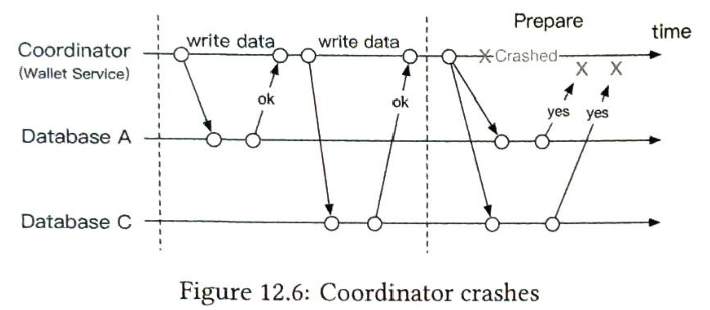

### 分布式事务：尝试-确认/取消（TC/C）
TC/C 是一种补偿性事务 [7]，分为两个步骤：
1. 在第一阶段，协调者要求所有数据库为事务预留资源。
2. 在第二阶段，协调者收集所有数据库的回复：
   (a) 如果所有数据库都回复“是”，协调者要求所有数据库确认操作，即尝试-确认过程。
   (b) 如果有任何一个数据库回复“否”，协调者要求所有数据库取消操作，即尝试-取消过程。

需要注意的是，2PC 的两个阶段被包装在同一个事务中，而在 TC/C 中，每个阶段都是一个独立的事务。

#### TC/C 示例
通过一个实际例子更容易解释 TC/C 的工作原理。假设我们想从账户 A 转账 1 美元到账户 C。表 12.2 总结了 TC/C 在每个阶段的执行情况。

| 阶段 | 操作 | 账户 A 的余额变化 | 账户 C 的余额变化 |
| ---- | ---- | ----------------- | ----------------- |
| 1    | 尝试 | -$1               | 无操作            |
| 2    | 确认 | 无操作            | +$1               |
|      | 取消 | +$1               | 无操作            |

**表 12.2: TC/C 示例**

假设钱包服务是 TC/C 的协调者。在分布式事务开始时，账户 A 的余额为 1 美元，账户 C 的余额为 0 美元。

##### 第一阶段：尝试
在尝试阶段，钱包服务（作为协调者）向两个数据库发送两个事务命令：
1. 对于包含账户 A 的数据库，协调者启动一个本地事务，将账户 A 的余额减少 1 美元。
2. 对于包含账户 C 的数据库，协调者发送一个无操作（NOP）命令。数据库对 NOP 命令不执行任何操作，并始终向协调者回复成功消息。

尝试阶段如图 12.7 所示。粗线表示事务持有的锁。

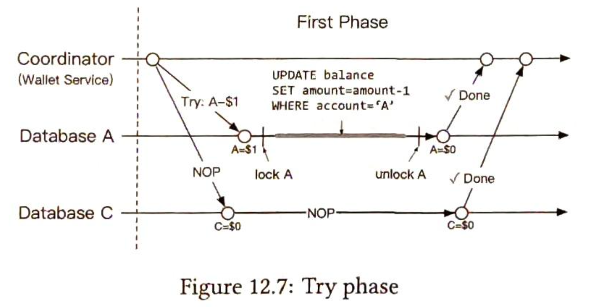

##### 第二阶段：确认
如果两个数据库都回复“是”，钱包服务进入确认阶段。
账户 A 的余额已在第一阶段更新，钱包服务无需在此阶段更改其余额。然而，账户 C 在第一阶段尚未收到来自账户 A 的 1 美元。在确认阶段，钱包服务需要将 1 美元添加到账户 C 的余额中。

确认过程如图 12.8 所示。

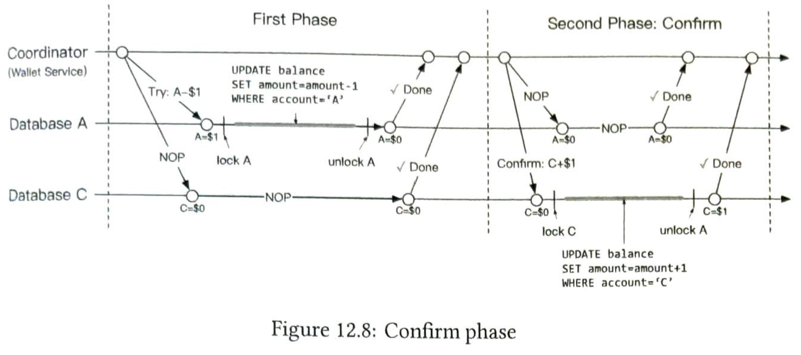

##### 第二阶段：取消
如果尝试阶段失败怎么办？在上面的例子中，我们假设账户 C 的 NOP 操作始终成功，但在实践中它可能会失败。例如，账户 C 可能是一个非法账户，监管机构禁止资金流入或流出该账户。在这种情况下，分布式事务必须取消，我们需要清理。

由于账户 A 的余额已在尝试阶段的事务中更新，钱包服务无法取消已完成的事务。它所能做的是启动另一个事务，以撤销尝试阶段事务的效果，即将 1 美元加回账户 A。

由于账户 C 在尝试阶段未被更新，钱包服务只需向账户 C 的数据库发送一个 NOP 操作。

取消过程如图 12.9 所示。

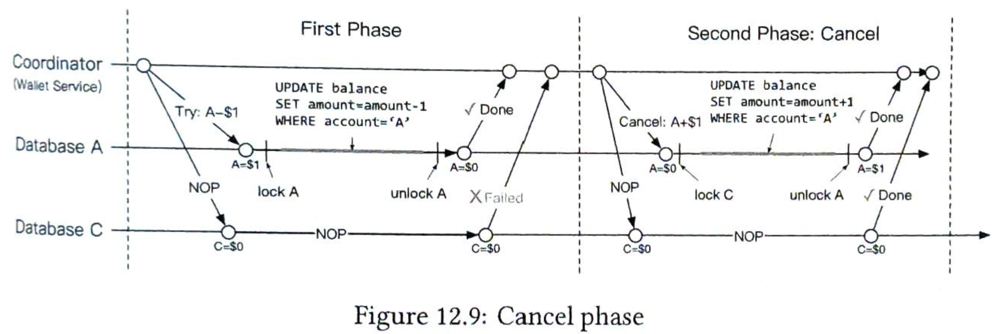

### 2PC 与 TC/C 的比较
表 12.3 显示 2PC 和 TC/C 有许多相似之处，但也存在差异。在 2PC 中，当第二阶段开始时，所有本地事务都未完成（仍被锁定），而在 TC/C 中，所有本地事务都已完成（解锁）。换句话说，2PC 的第二阶段是关于完成未完成的事务（如中止或提交），而在 TC/C 中，第二阶段是关于在发生错误时使用反向操作来抵消之前的事务结果。下表总结了它们的差异。

|      | 第一阶段           | 第二阶段：成功   | 第二阶段：失败         |
| ---- | ------------------ | ---------------- | ---------------------- |
| 2PC  | 本地事务未完成     | 提交所有本地事务 | 取消所有本地事务       |
| TC/C | 所有本地事务已完成 | 执行新的本地事务 | 撤销已提交事务的副作用 |

**表 12.3: 2PC 与 TC/C 的比较**

TC/C 也被称为补偿性分布式事务。它是一种高级解决方案，因为补偿（也称为“撤销”）是在业务逻辑中实现的。这种方法的优点是它与数据库无关。只要数据库支持事务，TC/C 就可以工作。缺点是必须在应用层的业务逻辑中管理分布式事务的细节并处理其复杂性。

#### 阶段状态表
我们还没有回答之前提出的问题：如果钱包服务在 TC/C 中间重启怎么办？当它重启时，所有之前的操作历史可能会丢失，系统可能不知道如何恢复。

解决方案很简单。我们可以将 TC/C 的进度作为阶段状态存储在事务性数据库中。阶段状态至少包括以下信息：
- 分布式事务的 ID 和内容。
- 每个数据库的尝试阶段状态。状态可能是“未发送”、“已发送”和“已收到回复”。
- 第二阶段名称。可能是“确认”或“取消”。可以使用尝试阶段的结果计算。
- 第二阶段的状态。
- 一个乱序标志（稍后在“乱序执行”部分解释）。

阶段状态表应该放在哪里？通常，我们将阶段状态存储在包含扣款钱包账户的数据库中。更新后的架构图如图 12.10 所示。

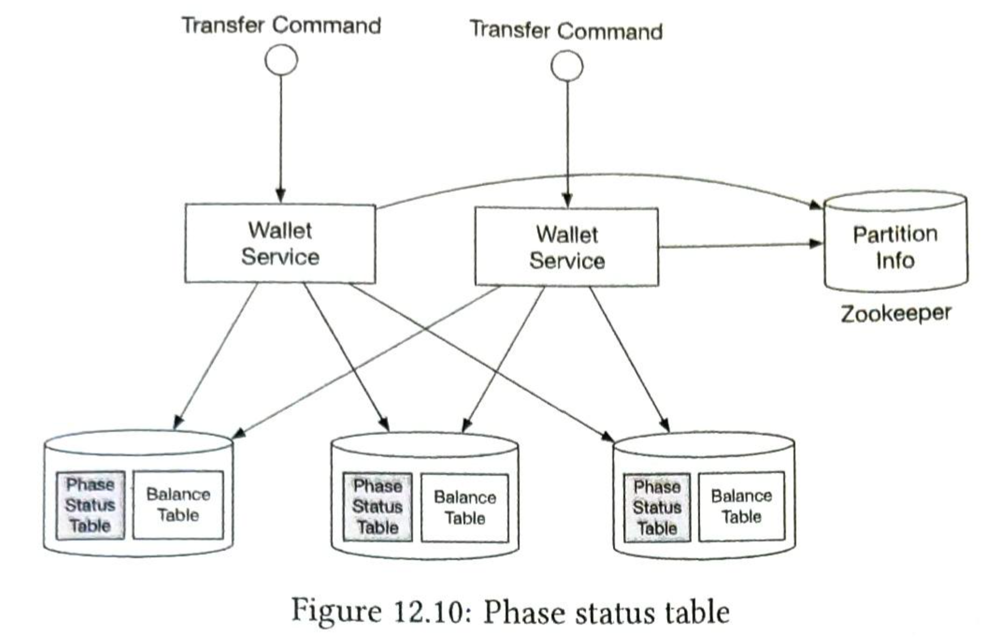

#### 不平衡状态
你是否注意到，在尝试阶段结束时，1 美元消失了（图 12.11）？
假设一切顺利，在尝试阶段结束时，1 美元从账户 A 中扣除，这比 TC/C 开始时少了。这违反了会计的基本原则，即交易后总和应保持不变。

好消息是，TC/C 仍然保持了事务性保证。TC/C 由多个独立的本地事务组成。由于 TC/C 是由应用程序驱动的，应用程序本身能够看到这些本地事务之间的中间结果。另一方面，数据库事务或 2PC 版本的分布式事务由数据库维护，对高级应用程序是不可见的。

在分布式事务执行期间，总会出现数据不一致的情况。这些不一致可能对我们来说是透明的，因为数据库等低级系统已经修复了这些不一致。如果没有，我们必须自己处理（例如 TC/C）。

不平衡状态如图 12.11 所示。

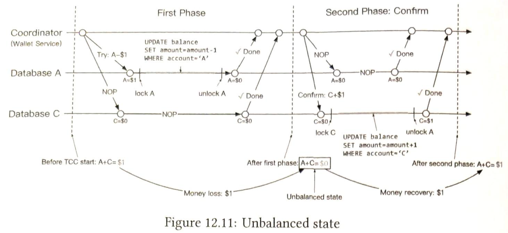

#### 有效操作顺序
尝试阶段有三种选择：

| 尝试阶段选择 | 账户 A | 账户 C |
| ------------ | ------ | ------ |
| 选择 1       | -$1    | 无操作 |
| 选择 2       | 无操作 | +$1    |
| 选择 3       | -$1    | +$1    |

**表 12.4: 尝试阶段选择**

所有三种选择看起来都合理，但有些是无效的。

对于选择 2，如果账户 C 的尝试阶段成功，但账户 A 的尝试阶段失败（NOP），钱包服务需要进入取消阶段。有可能其他人会介入并将 1 美元从账户 C 中移走。当钱包服务尝试从账户 C 中扣除 1 美元时，发现没有剩余资金，这违反了分布式事务的事务性保证。

对于选择 3，如果 1 美元从账户 A 中扣除并同时添加到账户 C 中，会引入很多复杂性。例如，1 美元被添加到账户 C，但未能从账户 A 中扣除。在这种情况下，我们该怎么办？

因此，选择 2 和选择 3 是有缺陷的选择，只有选择 1 是有效的。

#### 乱序执行
TC/C 的一个副作用是乱序执行。通过一个例子更容易解释。

我们重用上面的例子，从账户 A 转账 1 美元到账户 C。如图 12.12 所示，在尝试阶段，对账户 A 的操作失败，并向钱包服务返回失败，钱包服务随后进入取消阶段，并向账户 A 和账户 C 发送取消操作。

假设处理账户 C 的数据库有一些网络问题，它在收到尝试指令之前收到了取消指令。在这种情况下，没有需要取消的内容。

乱序执行如图 12.12 所示。

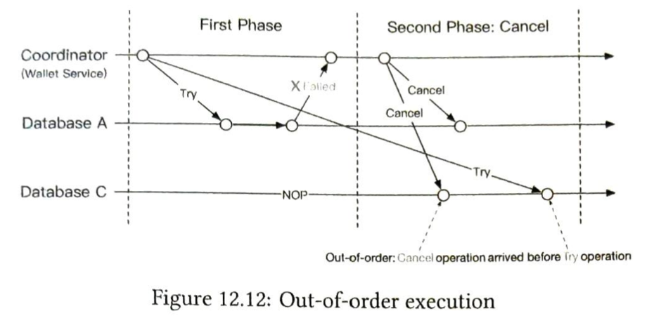

为了处理乱序操作，允许每个节点在没有收到尝试指令的情况下取消 TC/C，通过以下更新增强现有逻辑：
- 乱序取消操作在数据库中留下一个标志，表示它已经看到了取消操作，但尚未看到尝试操作。
- 尝试操作被增强，始终检查是否存在乱序标志，如果存在则返回失败。

这就是为什么我们在“阶段状态表”部分向阶段状态表添加了乱序标志。

### 分布式事务：Saga
#### 线性顺序执行
另一种流行的分布式事务解决方案称为 Saga [8]。Saga 是微服务架构中的事实标准。Saga 的理念很简单：
1. 所有操作按顺序排列。每个操作都是其自身数据库上的独立事务。
2. 操作从第一个到最后一个依次执行。当一个操作完成后，触发下一个操作。
3. 当某个操作失败时，整个过程从当前操作开始，按相反顺序回滚到第一个操作，使用补偿事务。因此，如果一个分布式事务有 n 个操作，我们需要准备 2n 个操作：n 个操作用于正常情况，另外 n 个操作用于回滚期间的补偿事务。

通过一个例子更容易理解这一点。图 12.13 展示了从账户 A 转账 1 美元到账户 C 的 Saga 工作流程。顶部水平线显示正常执行顺序。两条垂直线显示系统在遇到错误时应执行的操作。当遇到错误时，转账操作会回滚，客户端会收到错误消息。正如我们在第 352 页的“有效操作顺序”部分提到的，我们必须将扣款操作放在加款操作之前。

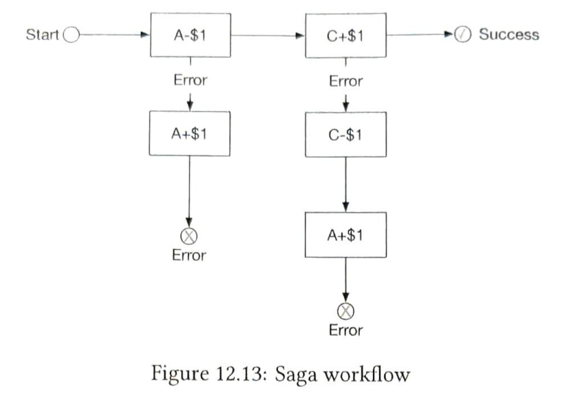

我们如何协调这些操作？有两种方法：
1. **编排（Choreography）**。在微服务架构中，所有参与 Saga 分布式事务的服务通过订阅其他服务的事件来完成自己的工作。因此，这是一种完全去中心化的协调方式。
2. **编排（Orchestration）**。一个单一的协调者指示所有服务按正确顺序完成工作。

选择哪种协调模型取决于业务需求和目标。编排解决方案的挑战在于服务以完全异步的方式通信，因此每个服务必须维护一个内部状态机，以便在其他服务发出事件时知道该做什么。当有许多服务时，管理起来可能会变得困难。编排解决方案很好地处理了复杂性，因此它通常是数字钱包系统中的首选解决方案。

#### TC/C 与 Saga 的比较
TC/C 和 Saga 都是应用级别的分布式事务。表 12.5 总结了它们的相似之处和差异。

|                        | TC/C       | Saga           |
| ---------------------- | ---------- | -------------- |
| 补偿操作               | 在取消阶段 | 在回滚阶段     |
| 中央协调               | 是         | 是（编排模式） |
| 操作执行顺序           | 任意       | 线性           |
| 并行执行可能性         | 是         | 否（线性执行） |
| 能否看到部分不一致状态 | 是         | 是             |
| 应用或数据库逻辑       | 应用       | 应用           |

**表 12.5: TC/C 与 Saga 的比较**

在实践中我们应该使用哪种？答案取决于延迟要求。如表 12.5 所示，Saga 中的操作必须按线性顺序执行，但在 TC/C 中可以并行执行。因此，决策取决于以下几个因素：
1. 如果没有延迟要求，或者服务非常少（例如我们的转账示例），我们可以选择其中任何一种。如果我们想顺应微服务架构的趋势，选择 Saga。
2. 如果系统对延迟敏感并且包含许多服务/操作，TC/C 可能是更好的选择。

**候选人：** 为了使余额转账具有事务性，我们用关系数据库替换 Redis，并使用 TC/C 或 Saga 来实现分布式事务。

**面试官：** 干得好！分布式事务解决方案有效，但在某些情况下可能效果不佳。例如，用户可能在应用级别输入错误的操作。在这种情况下，我们指定的金额可能是错误的。我们需要一种方法来追溯问题的根本原因并审计所有账户操作。我们如何做到这一点？

---

### 事件溯源（Event Sourcing）
#### 背景
在现实生活中，数字钱包提供商可能会被审计。这些外部审计员可能会提出一些具有挑战性的问题，例如：
1. 我们是否知道任何时间点的账户余额？
2. 我们如何知道历史和当前账户余额是正确的？
3. 我们如何证明在代码更改后系统逻辑是正确的？

一种系统回答这些问题的设计理念是事件溯源，这是一种在领域驱动设计（DDD）[9] 中开发的技术。

#### 定义
事件溯源中有四个重要术语：
1. **命令（Command）**
2. **事件（Event）**
3. **状态（State）**
4. **状态机（State Machine）**

##### 命令
命令是来自外部世界的预期操作。例如，如果我们想从客户端 A 转账 1 美元到客户端 C，这个转账请求就是一个命令。

在事件溯源中，一切都有顺序非常重要。因此，命令通常被放入一个 FIFO（先进先出）队列中。

##### 事件
命令是一种意图，而不是事实，因为某些命令可能无效且无法执行。例如，如果转账后账户余额变为负数，转账操作将失败。

在执行任何操作之前，必须验证命令。一旦命令通过验证，它就是有效的并且必须执行。执行的结果称为事件。

命令和事件之间有两个主要区别：
1. 事件必须被执行，因为它们代表已验证的事实。在实践中，我们通常使用过去时态来描述事件。如果命令是“从 A 转账 1 美元到 C”，则相应的事件是“从 A 转账 1 美元到 C”。
2. 命令可能包含随机性或 I/O，但事件必须是确定性的。事件代表历史事实。

事件生成过程有两个重要属性：
1. 一个命令可能生成任意数量的事件。它可能生成零个或多个事件。
2. 事件生成可能包含随机性，这意味着不能保证一个命令总是生成相同的事件。事件生成可能包含外部 I/O 或随机数。我们将在本章末尾更详细地重新讨论这一属性。

事件的顺序必须遵循命令的顺序。因此，事件也存储在 FIFO 队列中。

##### 状态
状态是在应用事件时将更改的内容。在钱包系统中，状态是账户名称或 ID，值是账户余额。状态可以看作是一个键值存储，其中键是主键，值是表行。

##### 状态机
状态机驱动事件溯源过程。它有两个主要功能：
1. 验证命令并生成事件。
2. 应用事件以更新状态。

事件溯源要求状态机的行为是确定性的。因此，状态机本身不应包含任何随机性。例如，它不应使用 I/O 从外部读取任何随机内容，或使用任何随机数。当它将事件应用于状态时，它应始终生成相同的结果。

图 12.14 展示了事件溯源架构的静态视图。状态机负责将命令转换为事件并应用事件。由于状态机有两个主要功能，我们通常绘制两个状态机，一个用于验证命令，另一个用于应用事件。

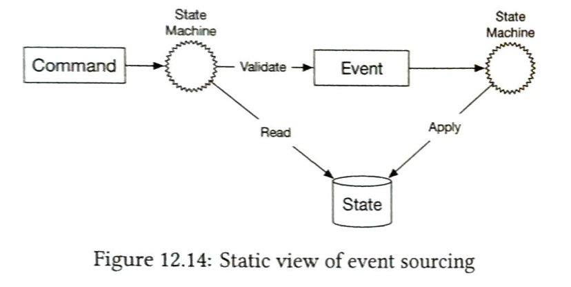

如果我们添加时间维度，图 12.15 展示了事件溯源的动态视图。系统不断接收命令并逐个处理它们。

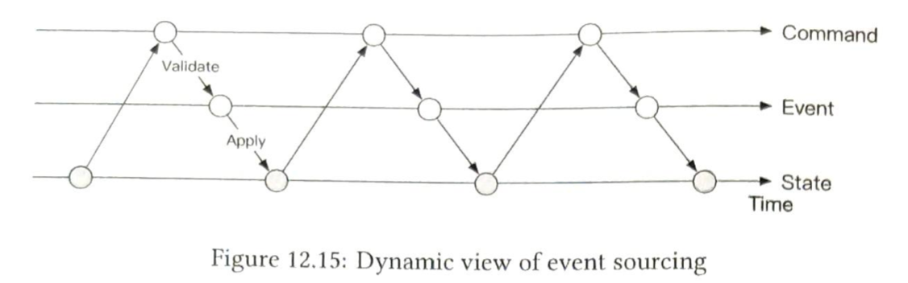

#### 钱包服务示例
对于钱包服务，命令是余额转账请求。这些命令被放入 FIFO 队列中。命令队列的一个流行选择是 Kafka [10]。命令队列如图 12.16 所示。

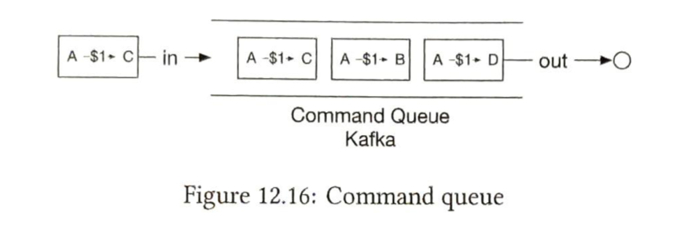

假设状态（账户余额）存储在关系数据库中。状态机按 FIFO 顺序逐个检查每个命令。对于每个命令，它检查账户是否有足够的余额。如果有，状态机为每个账户生成一个事件。例如，如果命令是“A→$1→C”，状态机生成两个事件：“A:-$1”和“C:+$1”。

图 12.17 展示了状态机如何工作的 5 个步骤：
1. 从命令队列中读取命令。
2. 从数据库中读取余额状态。
3. 验证命令。如果有效，为每个账户生成两个事件。
4. 读取下一个事件。
5. 通过更新数据库中的余额来应用事件。

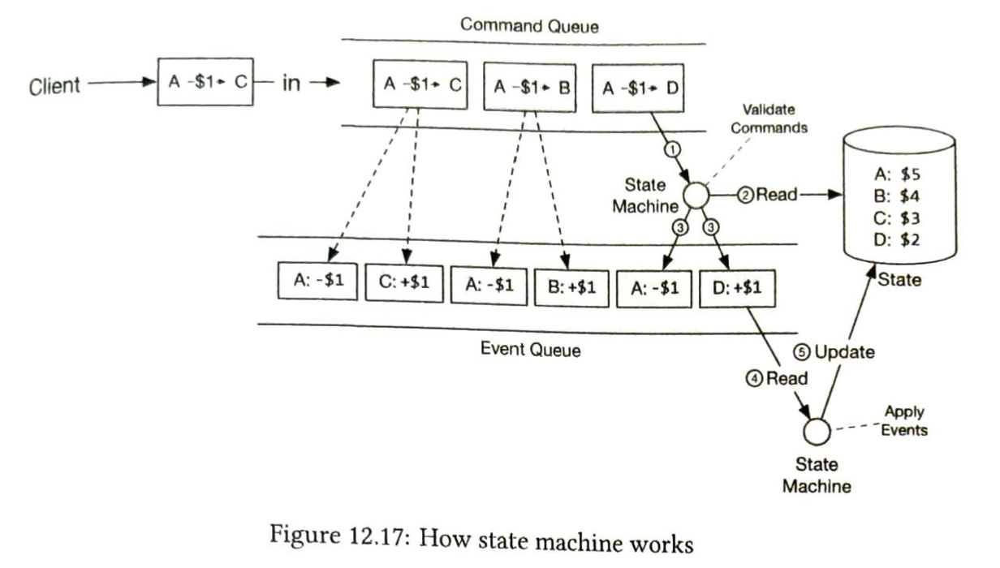

#### 可重现性
事件溯源相对于其他架构的最大优势是可重现性。

在前面提到的分布式事务解决方案中，钱包服务将更新后的账户余额（状态）保存到数据库中。很难知道账户余额为何发生变化。同时，历史余额信息在更新操作期间丢失。在事件溯源设计中，所有更改首先作为不可变的历史记录保存。数据库仅用作任何给定时间点余额的更新视图。

我们始终可以通过从最开始重放事件来重建历史余额状态。由于事件列表是不可变的，并且状态机逻辑是确定性的，因此可以保证每次重放生成的历史状态是相同的。

图 12.18 展示了如何通过重放事件来重现钱包服务的状态。

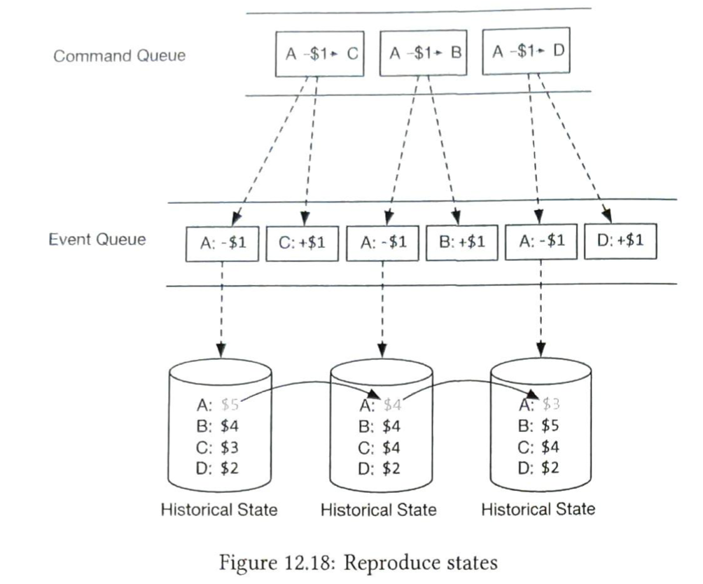

可重现性帮助我们回答本节开头审计员提出的难题。我们在此重复这些问题：
1. 我们是否知道任何时间点的账户余额？
2. 我们如何知道历史和当前账户余额是正确的？
3. 我们如何证明在代码更改后系统逻辑是正确的？

对于第一个问题，我们可以通过从开始重放事件到我们想知道账户余额的时间点来回答。

对于第二个问题，我们可以通过从事件列表中重新计算账户余额来验证其正确性。

对于第三个问题，我们可以针对事件运行不同版本的代码，并验证它们的结果是否相同。

由于审计能力，事件溯源通常被选为钱包服务的事实解决方案。

---

### 命令查询责任分离（CQRS）
到目前为止，我们已经设计了钱包服务以高效地将资金从一个账户转移到另一个账户。然而，客户端仍然不知道账户余额是多少。需要有一种方法来发布状态（余额信息），以便事件溯源框架外部的客户端可以知道状态是什么。

直观地说，我们可以创建数据库（历史状态）的只读副本并与外部世界共享。事件溯源以一种略有不同的方式回答这个问题：与其发布状态（余额信息），不如发布所有事件。这种理念称为 CQRS [11]。

在 CQRS 中，有一个状态机负责状态的写入部分，但有多个只读状态机负责生成状态的视图。这些视图可用于查询。

这些只读状态机可以从事件队列中派生出不同的状态表示。例如，客户端可能想知道他们的余额，一个只读状态机可以将状态保存在数据库中以服务余额查询。另一个状态机可以为特定时间段构建状态，以帮助调查可能的重复扣款等问题。状态信息是一个审计跟踪，可以帮助对账财务记录。

只读状态机在一定程度上滞后，但最终会赶上。架构设计是最终一致的。

图 12.19 展示了一个经典的 CQRS 架构。

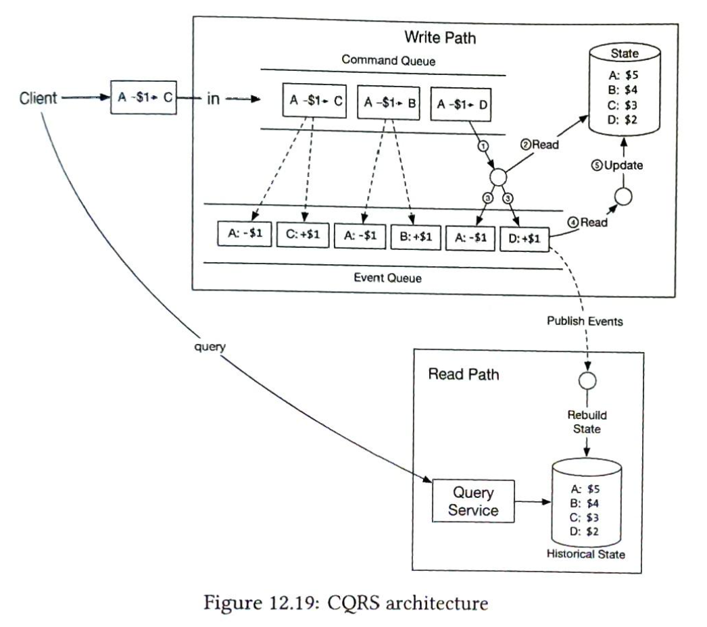

**候选人：** 在这个设计中，我们使用事件溯源架构使整个系统可重现。所有有效的业务记录都保存在不可变的事件队列中，可用于正确性验证。

**面试官：** 这很棒。但你提出的事件溯源架构一次只处理一个事件，并且需要与多个外部系统通信。我们能让它更快吗？
